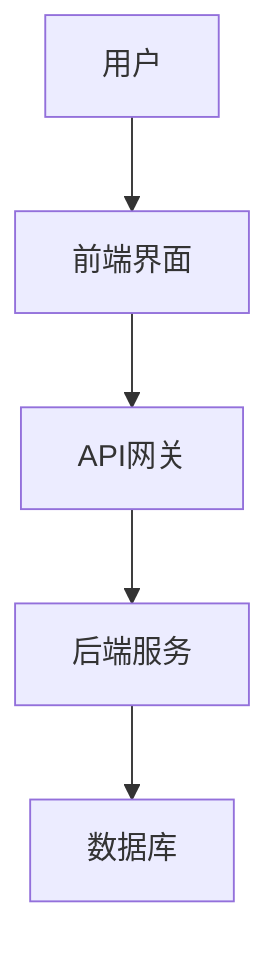
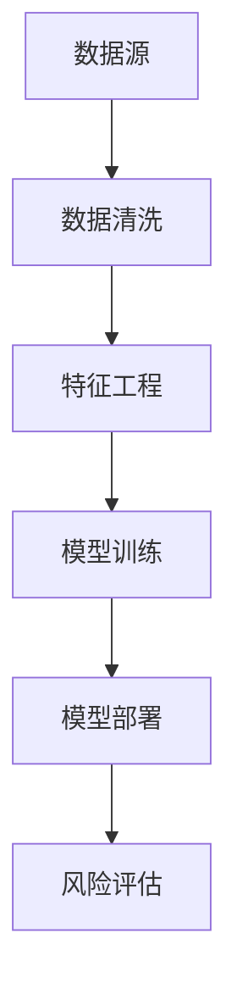

                 


# AI辅助的企业信用风险评估

> 关键词：信用风险评估，人工智能，机器学习，风险管理，企业信用评分，风险预测模型

> 摘要：本文深入探讨了人工智能技术在企业信用风险评估中的应用，分析了传统信用评估方法的局限性，并详细介绍了基于AI的信用评估模型，包括逻辑回归、随机森林和神经网络等算法的原理与优缺点。同时，本文还通过Mermaid图展示了系统架构设计和数据流设计，结合实战案例详细讲解了如何使用Python构建AI辅助的信用风险评估系统，并对系统的部署与应用进行了深入分析。

---

# 第1章: 信用风险评估概述

## 1.1 信用风险的基本概念

### 1.1.1 信用风险的定义
信用风险是指企业或个人在借贷活动中，由于债务人无法履行还款义务而导致债权人遭受损失的可能性。它是金融风险管理中的核心问题之一。

### 1.1.2 信用风险的分类
信用风险可以分为以下几类：
1. **企业信用风险**：企业因经营状况不佳或恶意违约导致的债务风险。
2. **个人信用风险**：个人因经济困难或欺诈行为导致的债务风险。
3. **系统性信用风险**：由于经济周期波动或其他系统性因素引发的广泛信用风险。

### 1.1.3 信用风险的影响因素
影响信用风险的主要因素包括：
- **企业基本面**：收入、利润、资产负债情况等。
- **行业风险**：行业景气度和竞争状况。
- **宏观经济环境**：GDP增长率、利率水平、通货膨胀率等。
- **政策风险**：法律法规和监管政策的变化。

---

## 1.2 传统信用风险评估方法

### 1.2.1 信用评分模型
信用评分模型是一种基于企业或个人的财务数据和行为数据，通过统计方法计算出一个信用评分，从而判断其信用风险的方法。常见的信用评分模型包括FICO评分和CIBIL评分。

### 1.2.2 信用评级方法
信用评级方法是通过对企业或个人的综合评估，将其信用等级划分为不同类别（如AAA、AA、A等），从而反映其信用风险水平。

### 1.2.3 传统方法的优缺点
- **优点**：方法简单，易于理解和实施。
- **缺点**：依赖于历史数据，难以捕捉非结构化数据（如文本信息）；模型的泛化能力有限，容易受到数据偏差的影响。

---

## 1.3 信用风险评估的挑战

### 1.3.1 数据获取难度
信用风险评估需要大量高质量的数据，但数据获取渠道有限，且数据可能存在缺失或不完整的情况。

### 1.3.2 模型的局限性
传统模型难以处理非结构化数据，且容易受到数据偏差的影响，导致模型的预测精度有限。

### 1.3.3 信用风险的动态变化
企业的经营状况和外部环境不断变化，信用风险也随之动态变化，传统的静态模型难以实时捕捉这些变化。

---

## 1.4 本章小结
本章介绍了信用风险的基本概念、传统评估方法及其局限性，为后续讨论AI技术在信用风险评估中的应用奠定了基础。

---

# 第2章: AI技术在信用风险评估中的作用

## 2.1 人工智能的基本原理

### 2.1.1 机器学习的定义
机器学习是一种通过数据训练模型，使其能够从数据中学习规律并进行预测的技术。其核心在于数据和算法的结合。

### 2.1.2 深度学习的定义
深度学习是一种基于人工神经网络的机器学习技术，通过多层非线性变换提取数据的高层次特征，从而实现复杂的模式识别。

### 2.1.3 AI在信用评估中的优势
AI技术能够处理非结构化数据（如文本、图像），并实时更新模型，从而提高信用风险评估的准确性和实时性。

---

## 2.2 信用风险评估中的关键AI技术

### 2.2.1 机器学习算法
常用的机器学习算法包括逻辑回归、随机森林和梯度提升树（如XGBoost）等。

### 2.2.2 自然语言处理
自然语言处理（NLP）技术可以提取企业新闻、公告等文本信息中的关键词，从而辅助信用风险评估。

### 2.2.3 图神经网络
图神经网络能够处理企业之间的关联关系（如供应链关系），从而更好地捕捉系统性信用风险。

---

## 2.3 AI在信用风险评估中的应用场景

### 2.3.1 风险预测
通过AI模型预测企业的违约概率（PD）和违约损失率（LGD），从而评估企业的信用风险。

### 2.3.2 风险监控
实时监控企业的财务状况和外部环境变化，及时发现潜在风险。

### 2.3.3 风险管理
基于AI模型的信用评分和评级，制定动态的风险管理策略。

---

## 2.4 本章小结
本章介绍了AI技术在信用风险评估中的基本原理和关键应用，为后续的算法和系统设计奠定了基础。

---

# 第3章: 信用风险评估的数学模型

## 3.1 逻辑回归模型

### 3.1.1 模型原理
逻辑回归是一种用于分类的统计方法，适用于二分类问题。其核心思想是通过线性回归模型对数据进行拟合，并使用对数几率函数（Logit）将线性输出转换为概率。

### 3.1.2 模型公式
$$ P(y=1|x) = \frac{e^{\beta_0 + \beta_1x_1 + ... + \beta_kx_k}}{1 + e^{\beta_0 + \beta_1x_1 + ... + \beta_kx_k}} $$

### 3.1.3 优缺点分析
- **优点**：模型简单，解释性强。
- **缺点**：对非线性关系的捕捉能力有限。

---

## 3.2 随机森林模型

### 3.2.1 模型原理
随机森林是一种基于决策树的集成学习算法，通过随机选取特征和样本进行多次训练，最终通过投票或加权的方式得到最终预测结果。

### 3.2.2 模型公式
$$ y = \sum_{i=1}^{n} \left( \theta_i x_i + \theta_0 \right) $$

### 3.2.3 优缺点分析
- **优点**：能够处理高维数据，对噪声数据具有较强的鲁棒性。
- **缺点**：模型的解释性较差。

---

## 3.3 神经网络模型

### 3.3.1 模型原理
神经网络是一种模拟人脑神经网络结构的深度学习模型，能够通过多层非线性变换提取数据的高层次特征。

### 3.3.2 模型公式
$$ y = f(Wx + b) $$

其中，$W$ 是权重矩阵，$x$ 是输入向量，$b$ 是偏置项，$f$ 是激活函数。

### 3.3.3 优缺点分析
- **优点**：能够处理复杂的非线性关系，模型表达能力强。
- **缺点**：训练时间长，对硬件要求高。

---

## 3.4 模型选择与评估

### 3.4.1 模型选择的依据
- 数据类型和特征
- 模型的解释性和可解释性
- 计算资源和时间限制

### 3.4.2 模型评估指标
- **准确率**：正确预测的比例。
- **精确率**：预测为正类且实际为正类的比例。
- **召回率**：实际为正类且被预测为正类的比例。
- **F1分数**：精确率和召回率的调和平均数。

---

## 3.5 本章小结
本章详细介绍了几种常用的信用风险评估模型，分析了它们的原理、公式和优缺点，为后续的系统设计和项目实战奠定了基础。

---

# 第4章: 系统架构与数据流设计

## 4.1 系统架构设计

### 4.1.1 系统架构图


### 4.1.2 系统功能模块
- 用户模块：用户登录、注册和信息管理。
- 数据采集模块：采集企业财务数据、新闻公告等。
- 模型训练模块：训练信用风险评估模型。
- 风险评估模块：基于模型预测信用风险。

---

## 4.2 数据流设计

### 4.2.1 数据流图


---

## 4.3 系统接口设计

### 4.3.1 API接口
- 数据接口：获取企业数据。
- 模型接口：调用AI模型进行信用评分。

---

## 4.4 系统交互设计

### 4.4.1 序列图
```mermaid
sequenceDiagram
    user ->+> api: 调用信用评分接口
    api ->+> model: 请求模型预测
    model ->+> database: 获取历史数据
    model --> api: 返回预测结果
    api --> user: 返回信用评分
```

---

## 4.5 本章小结
本章通过Mermaid图展示了系统的架构设计和数据流设计，为后续的项目实战提供了清晰的指导。

---

# 第5章: 项目实战

## 5.1 环境安装

### 5.1.1 安装Python和依赖库
```bash
pip install numpy pandas scikit-learn tensorflow
```

---

## 5.2 数据预处理

### 5.2.1 数据清洗
```python
import pandas as pd

# 读取数据
data = pd.read_csv('credit.csv')

# 删除缺失值
data.dropna(inplace=True)

# 标准化处理
from sklearn.preprocessing import StandardScaler
scaler = StandardScaler()
data_scaled = scaler.fit_transform(data)
```

---

## 5.3 特征工程

### 5.3.1 特征选择
```python
from sklearn.feature_selection import SelectKBest

selector = SelectKBest(k=5)
selected_features = selector.fit_transform(data_scaled, target)
```

---

## 5.4 模型训练与部署

### 5.4.1 训练逻辑回归模型
```python
from sklearn.linear_model import LogisticRegression

model = LogisticRegression()
model.fit(X_train, y_train)
```

### 5.4.2 模型部署
```python
import joblib

joblib.dump(model, 'credit_risk_model.pkl')
```

---

## 5.5 项目小结
本章通过实战案例详细讲解了如何使用Python构建AI辅助的信用风险评估系统，包括环境安装、数据预处理、特征工程和模型训练与部署。

---

# 第6章: 总结与展望

## 6.1 总结
本文深入探讨了AI技术在企业信用风险评估中的应用，分析了传统方法的局限性和AI技术的优势，详细介绍了几种常用的信用风险评估模型，并通过Mermaid图展示了系统架构设计和数据流设计。最后，通过实战案例详细讲解了如何使用Python构建AI辅助的信用风险评估系统。

---

## 6.2 当前的挑战与未来趋势
- **挑战**：数据隐私问题、模型解释性问题、系统实时性要求高等。
- **未来趋势**：基于深度学习的信用风险预测、联邦学习技术的应用、实时信用风险监控等。

---

## 6.3 最佳实践 Tips
- 数据预处理是关键，尤其是缺失值和异常值的处理。
- 模型选择要结合实际业务需求，不能一味追求高精度。
- 系统设计要注重可扩展性和可维护性。

---

## 6.4 本章小结
本文总结了AI技术在信用风险评估中的应用，并展望了未来的发展趋势和最佳实践。

---

# 作者：AI天才研究院 & 禅与计算机程序设计艺术

---

以上是《AI辅助的企业信用风险评估》的技术博客文章的完整目录大纲和详细内容，希望对您有所帮助！

