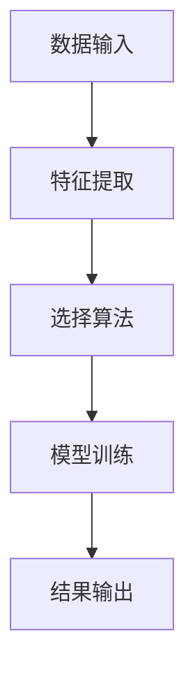
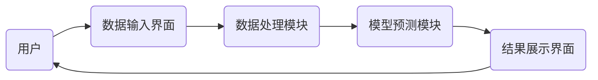

                 

# 第一部分: AI辅助的企业并购目标筛选概述

# 第1章: 企业并购与AI辅助筛选概述

## 1.1 企业并购的基本概念
### 1.1.1 企业并购的定义
企业并购（Mergers and Acquisitions, M&A）是指一家企业与其他企业合并或收购其资产、股权等行为。这种行为通常是为了扩大市场份额、获取新技术、降低成本或进入新市场。

### 1.1.2 并购的主要类型
企业并购主要有以下几种类型：
- **横向并购**：同一行业内的企业并购，旨在扩大市场份额。
- **纵向并购**：供应链上下游的企业并购，以增强控制力。
- **混合并购**：与企业现有业务不相关的新领域的并购，通常是为了 diversification。

### 1.1.3 并购的目标筛选关键性
在企业并购中，目标筛选是决定并购成功与否的关键步骤。筛选合适的标的公司需要考虑财务状况、市场地位、技术优势、管理团队等多个因素。

## 1.2 AI技术在企业并购中的应用背景
### 1.2.1 数据驱动的并购决策趋势
随着大数据技术的发展，企业并购越来越依赖数据驱动的决策。通过分析大量的历史数据，可以识别潜在的并购目标，评估其价值和风险。

### 1.2.2 AI技术对企业并购的潜在价值
AI技术可以通过数据分析、模式识别和预测模型，帮助企业在并购过程中更高效地筛选目标、评估价值和预测风险。

### 1.2.3 当前企业并购中的主要挑战
尽管AI技术在企业并购中具有巨大潜力，但在实际应用中仍面临一些挑战，如数据质量、模型准确性、法律合规等问题。

## 1.3 AI辅助目标筛选的核心优势
### 1.3.1 提高筛选效率
通过AI技术，可以快速筛选出符合条件的潜在目标，减少人工筛选的时间和成本。

### 1.3.2 数据分析的深度挖掘
AI技术可以分析海量数据，发现潜在的模式和关系，帮助识别那些通过传统方法难以发现的有价值的目标。

### 1.3.3 风险预测的准确性
通过AI模型，可以对目标公司的财务状况、市场风险、管理风险等进行更准确的预测，从而降低并购后的风险。

## 1.4 本章小结
本章介绍了企业并购的基本概念、AI技术在并购中的应用背景以及AI辅助目标筛选的核心优势。通过这些内容，我们可以看到AI技术在企业并购中的重要性及其潜在价值。

# 第2章: AI辅助目标筛选的流程与方法

## 2.1 数据收集与预处理
### 2.1.1 数据来源的多样性
在企业并购目标筛选中，数据来源可以包括公开的财务报表、行业报告、新闻资讯、社交媒体等多种渠道。

### 2.1.2 数据清洗与标准化
由于数据来源多样，数据可能存在缺失、重复或格式不统一等问题。因此，数据清洗和标准化是确保数据质量的重要步骤。

### 2.1.3 数据特征的提取
通过特征提取，可以从原始数据中提取出对目标筛选有重要影响的特征，如财务指标、市场表现、管理团队稳定性等。

## 2.2 并购目标筛选的模型构建
### 2.2.1 选择合适的AI模型
根据具体需求和数据特点，可以选择不同的AI模型。例如，可以使用分类模型来预测目标公司的并购可行性，或者使用回归模型来预测目标公司的价值。

### 2.2.2 模型训练与优化
通过训练数据对模型进行训练，并通过交叉验证等方法进行模型优化，以提高模型的准确性和稳定性。

### 2.2.3 模型评估与验证
通过测试数据对模型进行评估，验证模型的预测能力和稳定性。常用的评估指标包括准确率、召回率、F1分数等。

## 2.3 筛选结果的可视化与解读
### 2.3.1 数据可视化方法
通过图表、热力图等可视化方法，将模型的预测结果和数据特征进行可视化展示，帮助用户更好地理解和分析结果。

### 2.3.2 结果解读的关键指标
需要关注的关键指标包括模型的准确率、召回率、F1分数等，以及目标公司的财务状况、市场表现等具体指标。

### 2.3.3 可视化工具的选择
常用的可视化工具包括Matplotlib、Seaborn、Tableau等。选择合适的工具可以帮助用户更高效地进行数据可视化和结果解读。

## 2.4 本章小结
本章详细介绍了AI辅助目标筛选的流程与方法，包括数据收集与预处理、模型构建与优化以及结果的可视化与解读。这些步骤是确保目标筛选准确性和高效性的关键。

# 第3章: 基于机器学习的目标筛选算法

## 3.1 机器学习在并购目标筛选中的应用
### 3.1.1 监督学习的应用场景
监督学习可以通过标签数据训练模型，预测目标公司的并购可行性。例如，使用决策树、随机森林等算法进行分类。

### 3.1.2 非监督学习的潜在价值
非监督学习可以用于数据聚类，发现潜在的市场趋势或公司群组，为并购目标筛选提供新的视角。

### 3.1.3 强化学习的创新应用
强化学习可以通过模拟和策略优化，帮助企业在复杂的市场环境中做出更优的并购决策。

## 3.2 常见算法的选择与比较
### 3.2.1 线性回归与逻辑回归
- **线性回归**：适用于回归问题，预测目标公司的价值。
- **逻辑回归**：适用于分类问题，预测目标公司是否适合并购。

### 3.2.2 支持向量机与随机森林
- **支持向量机（SVM）**：适用于小样本数据的分类和回归。
- **随机森林**：适用于高维数据的分类和回归，具有较强的抗过拟合能力。

### 3.2.3 神经网络与深度学习模型
- **神经网络**：适用于复杂非线性关系的建模，如LSTM用于时间序列分析。
- **深度学习模型**：如CNN、RNN等，适用于图像识别、自然语言处理等任务。

## 3.3 算法实现的数学模型
### 3.3.1 线性回归的数学公式
$$ y = \beta_0 + \beta_1x_1 + \beta_2x_2 + ... + \beta_nx_n $$

### 3.3.2 逻辑回归的损失函数
$$ L = -\sum_{i=1}^{n} [y_i \ln(p_i) + (1-y_i)\ln(1-p_i)] $$

### 3.3.3 神经网络的激活函数
$$ \sigma(x) = \frac{1}{1 + e^{-x}} $$

## 3.4 算法流程图

## 3.5 本章小结
本章详细介绍了机器学习在并购目标筛选中的应用，包括监督学习、非监督学习和强化学习的主要算法及其适用场景。通过数学公式和流程图，帮助读者理解算法实现的细节。

# 第4章: 系统架构设计与实现

## 4.1 系统功能设计
### 4.1.1 数据收集模块
负责从多种数据源收集企业数据，包括财务数据、市场数据等。

### 4.1.2 数据处理模块
对收集到的数据进行清洗、标准化和特征提取。

### 4.1.3 模型构建模块
根据处理后的数据，选择合适的算法进行模型训练和优化。

### 4.1.4 结果展示模块
将模型的预测结果进行可视化展示，帮助用户进行决策。

## 4.2 系统架构设计

## 4.3 系统接口设计
### 4.3.1 数据接口
定义数据输入和输出的接口，确保数据能够顺利传递。

### 4.3.2 模型接口
定义模型训练和预测的接口，确保模型能够被调用和部署。

## 4.4 系统交互流程图

## 4.5 本章小结
本章从系统架构的角度，详细设计了AI辅助并购目标筛选系统的功能模块和交互流程，为系统的实现提供了清晰的指导。

# 第5章: 项目实战与案例分析

## 5.1 项目背景与目标
### 5.1.1 项目背景
介绍项目实施的背景，如当前企业并购中的痛点和需求。

### 5.1.2 项目目标
明确项目的具体目标，如提高目标筛选效率、降低并购风险等。

## 5.2 环境搭建与数据准备
### 5.2.1 环境搭建
安装必要的开发工具和库，如Python、Pandas、Scikit-learn等。

### 5.2.2 数据准备
收集和整理目标企业的相关数据，进行清洗和预处理。

## 5.3 模型实现与优化
### 5.3.1 模型实现
根据数据特点选择合适的算法，进行模型训练和优化。

### 5.3.2 模型评估
通过测试数据评估模型的性能，调整参数以提高准确率。

## 5.4 实际案例分析
### 5.4.1 案例背景
介绍一个实际的企业并购案例，分析其目标筛选过程。

### 5.4.2 数据分析
通过AI模型对目标公司进行分析，评估其并购可行性。

### 5.4.3 结果解读
根据模型预测结果，解读目标公司的优势和风险。

## 5.5 项目小结
总结项目实施过程中的经验教训，提出改进建议。

## 5.6 本章小结
本章通过一个实际案例，详细展示了AI辅助企业并购目标筛选的全过程，包括项目背景、环境搭建、模型实现和案例分析。

# 第6章: 总结与展望

## 6.1 本章总结
回顾全文，总结AI辅助企业并购目标筛选的核心内容和主要结论。

## 6.2 未来展望
展望AI技术在企业并购中的未来发展，如更智能的模型、更广泛的应用场景等。

## 6.3 最佳实践 Tips
### 6.3.1 数据质量的重要性
强调数据质量对模型性能的影响，建议在数据收集和处理阶段投入足够的时间和资源。

### 6.3.2 模型选择的灵活性
建议根据具体需求和数据特点选择合适的模型，避免盲目使用热门算法。

### 6.3.3 结果解读的全面性
在结果解读时，不仅要关注模型的预测结果，还要结合具体业务背景进行综合分析。

## 6.4 本章小结
本章总结了全文的主要内容，展望了AI技术在企业并购中的未来发展方向，并提出了几点实践建议。

# 作者：AI天才研究院/AI Genius Institute & 禅与计算机程序设计艺术 /Zen And The Art of Computer Programming

---

**摘要**：随着企业并购的复杂性和数据量的不断增加，传统的目标筛选方法已经难以满足需求。本文系统地介绍了AI技术在企业并购目标筛选中的应用，包括数据收集与预处理、模型构建与优化、系统架构设计以及实际案例分析。通过详细讲解各种算法和系统架构，本文为读者提供了一套高效、准确的AI辅助企业并购目标筛选的方法论。

