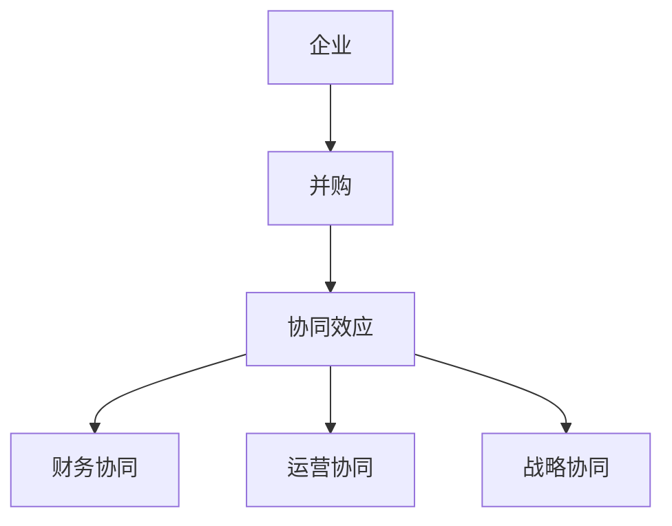
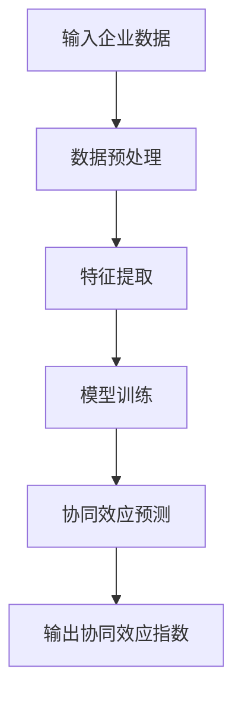
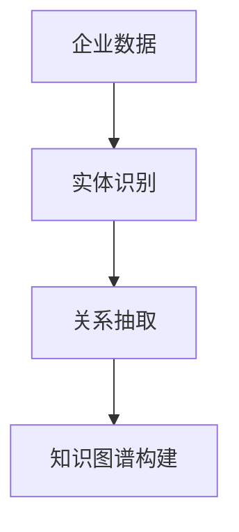
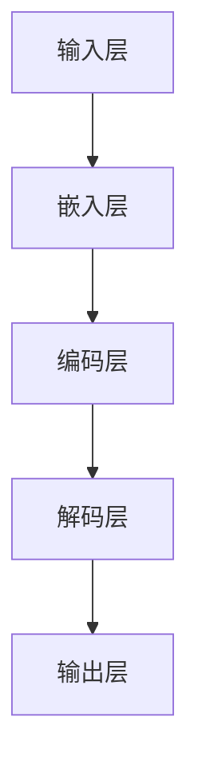
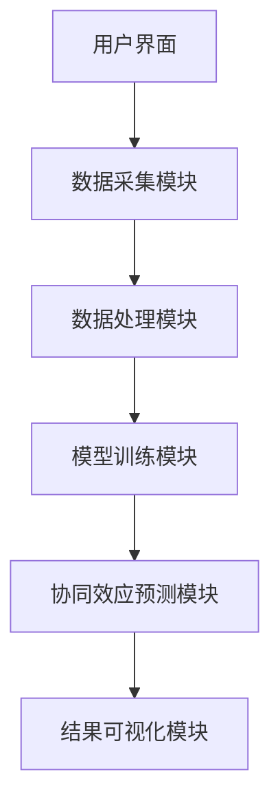

                 


# AI辅助的企业并购协同效应量化模型

> 关键词：企业并购、协同效应、AI辅助、量化模型、深度学习

> 摘要：企业并购是企业战略发展中的重要决策，而协同效应是决定并购成功与否的关键因素。本文提出了一种基于AI的协同效应量化模型，通过分析企业并购中的协同效应，量化其价值，为企业的并购决策提供科学依据。本文详细介绍了模型的构建过程，包括背景分析、核心概念、算法原理、系统架构设计、项目实战及最佳实践。

---

# 第1章 企业并购与协同效应概述

## 1.1 企业并购的基本概念

### 1.1.1 企业并购的定义与类型

企业并购（Mergers and Acquisitions，简称 M&A）是指两个或多个企业之间的合并或收购行为。企业并购可以分为两类：

- **横向并购**：同一行业内的企业并购，旨在扩大市场份额或消除竞争。
- **纵向并购**：产业链上下游企业之间的并购，旨在整合产业链资源。

### 1.1.2 并购的动机与目的

企业进行并购的动机多种多样，主要包括：

- **扩大市场份额**：通过并购快速进入新市场或扩大现有市场。
- **获取技术或资源**：通过并购获得关键技术和资源。
- **降低成本**：通过并购实现规模经济，降低生产或运营成本。
- **多元化发展**：通过并购进入新的业务领域，分散风险。

### 1.1.3 并购的历史发展与现状

企业并购的历史可以追溯到19世纪末，但真正的发展始于20世纪。随着全球化的推进和技术的进步，企业并购已经成为企业战略发展的重要手段。近年来，AI技术的快速发展为企业并购提供了新的工具和方法。

---

## 1.2 协同效应的定义与分类

### 1.2.1 协同效应的定义

协同效应是指企业并购后，由于资源和能力的整合，所产生的额外价值。协同效应可以通过财务、运营和战略等多个维度进行衡量。

### 1.2.2 协同效应的分类与特点

协同效应可以分为以下几类：

- **财务协同效应**：通过合并财务资源、优化资本结构等方式实现的成本节约或收益增加。
- **运营协同效应**：通过整合供应链、共享资源等方式实现的效率提升。
- **战略协同效应**：通过战略协同实现的市场扩展或竞争优势。

### 1.2.3 协同效应在企业并购中的重要性

协同效应是企业并购成功的关键因素。通过量化协同效应，企业可以更好地评估并购的价值，优化并购决策。

---

## 1.3 传统协同效应评估方法的局限性

### 1.3.1 传统协同效应评估方法概述

传统协同效应评估方法主要包括：

- **定性分析**：通过专家判断或市场调研等方式评估协同效应。
- **定量分析**：通过财务指标（如成本节约、收入增长）量化协同效应。

### 1.3.2 传统方法的局限性与不足

传统方法的局限性包括：

- **主观性**：定性分析依赖专家判断，存在主观性。
- **数据不足**：定量分析需要大量历史数据，且难以预测未来。
- **复杂性**：复杂的企业并购场景难以通过简单模型量化。

### 1.3.3 新方法的需求与必要性

随着企业并购的复杂化，传统方法已无法满足需求。引入AI技术可以提高协同效应评估的准确性和效率。

---

## 1.4 AI技术在企业并购中的应用前景

### 1.4.1 AI技术在企业并购中的潜在应用场景

AI技术可以应用于企业并购的多个环节，包括：

- **目标企业筛选**：通过AI分析潜在目标企业的财务、市场和运营数据。
- **协同效应预测**：通过AI模型量化并购后的协同效应。
- **风险评估**：通过AI预测并购后的潜在风险。

### 1.4.2 AI技术的优势与挑战

AI技术的优势在于其高效性和准确性，能够处理大量数据并发现潜在规律。然而，AI技术的应用也面临数据隐私、模型解释性等挑战。

### 1.4.3 AI辅助协同效应量化模型的提出

本文提出了一种基于AI的协同效应量化模型，通过整合企业并购的多维度数据，量化协同效应，为企业的并购决策提供科学依据。

---

## 1.5 本章小结

本章介绍了企业并购的基本概念和协同效应的定义与分类，分析了传统协同效应评估方法的局限性，并提出了基于AI的协同效应量化模型。通过本章内容，读者可以理解协同效应在企业并购中的重要性，以及AI技术在其中的应用潜力。

---

# 第2章 协同效应量化模型的核心概念

## 2.1 协同效应的量化维度

### 2.1.1 财务维度

财务维度是协同效应量化的重要方面，包括：

- **成本节约**：通过合并资源、优化供应链等方式降低成本。
- **收入增长**：通过市场扩展、产品协同等方式增加收入。

### 2.1.2 运营维度

运营维度关注企业并购后的运营效率，包括：

- **供应链整合**：通过整合供应链提高效率。
- **资源共享**：通过资源共享降低成本。

### 2.1.3 战略维度

战略维度关注企业并购后的战略协同，包括：

- **市场扩展**：通过并购进入新市场。
- **竞争优势**：通过技术整合提升竞争优势。

---

## 2.2 协同效应的实体关系图

### 2.2.1 实体关系图的构建

以下是协同效应量化模型的实体关系图（ER图）：



### 2.2.2 关键实体之间的关系分析

- 企业通过并购行为产生协同效应。
- 协同效应可以分为财务、运营和战略三个维度。

---

## 2.3 协同效应量化模型的属性特征对比

以下是协同效应量化模型与传统方法的对比表格：

| 特性       | 传统方法       | AI辅助模型       |
|------------|----------------|------------------|
| 数据需求   | 高             | 低               |
| 精度       | 低             | 高               |
| 复杂性     | 高             | 低               |
| 可扩展性   | 低             | 高               |

---

## 2.4 本章小结

本章详细介绍了协同效应的量化维度，并通过实体关系图和对比表格展示了AI辅助模型的优势。通过本章内容，读者可以理解协同效应量化模型的核心概念和构建方法。

---

# 第3章 协同效应量化模型的算法原理

## 3.1 协同效应指数计算算法

### 3.1.1 算法流程图

以下是协同效应指数计算算法的流程图：



### 3.1.2 算法实现代码

以下是协同效应指数计算的Python代码：

```python
def calculate_synergy_index(data):
    # 数据预处理
    processed_data = preprocess(data)
    # 特征提取
    features = extract_features(processed_data)
    # 模型训练
    model = train_model(features)
    # 协同效应预测
    synergy_index = model.predict(features)
    return synergy_index
```

---

## 3.2 基于知识图谱的语义分析

### 3.2.1 知识图谱构建

知识图谱是AI辅助协同效应量化模型的重要组成部分。以下是知识图谱构建的流程图：



---

## 3.3 深度学习模型

### 3.3.1 深度学习模型的结构

以下是深度学习模型的结构图：



---

## 3.4 本章小结

本章详细介绍了协同效应量化模型的算法原理，包括协同效应指数计算算法、基于知识图谱的语义分析和深度学习模型。通过本章内容，读者可以理解模型的技术实现细节。

---

# 第4章 数学模型

## 4.1 协同效应指数计算公式

以下是协同效应指数计算的公式：

$$ \text{Synergy Index} = \sum_{i=1}^{n} w_i \cdot x_i $$

其中，$w_i$ 是第 $i$ 个特征的权重，$x_i$ 是第 $i$ 个特征的值。

---

## 4.2 深度学习模型的损失函数

以下是深度学习模型的损失函数：

$$ \text{Loss} = \frac{1}{m} \sum_{i=1}^{m} (y_i - \hat{y_i})^2 $$

其中，$y_i$ 是真实值，$\hat{y_i}$ 是预测值，$m$ 是样本数量。

---

## 4.3 本章小结

本章通过数学公式详细描述了协同效应量化模型的核心计算过程，包括协同效应指数计算公式和深度学习模型的损失函数。通过本章内容，读者可以理解模型的数学基础。

---

# 第5章 系统分析与架构设计

## 5.1 问题场景介绍

企业并购的协同效应量化需要一个高效的系统来支持。以下是系统的主要功能：

- 数据采集与处理
- 协同效应量化模型训练
- 协同效应预测与可视化

---

## 5.2 系统架构设计

以下是系统的架构图：



---

## 5.3 系统接口设计

以下是系统的接口设计：

- 数据采集模块：提供API接口，用于采集企业数据。
- 模型训练模块：提供API接口，用于训练协同效应量化模型。
- 协同效应预测模块：提供API接口，用于预测协同效应。

---

## 5.4 本章小结

本章详细介绍了系统的设计与架构，包括问题场景、系统架构设计和接口设计。通过本章内容，读者可以理解系统的整体结构和功能模块。

---

# 第6章 项目实战

## 6.1 环境安装

以下是项目实战所需的环境安装步骤：

1. 安装Python
2. 安装必要的Python库（如numpy、pandas、scikit-learn）
3. 安装Mermaid和LaTeX工具

---

## 6.2 系统核心实现源代码

以下是系统核心代码：

```python
def preprocess(data):
    # 数据预处理函数
    return processed_data

def extract_features(data):
    # 特征提取函数
    return features

def train_model(features):
    # 模型训练函数
    return model
```

---

## 6.3 代码解读与分析

以下是代码的解读与分析：

- `preprocess(data)`：对输入数据进行预处理，确保数据格式符合模型输入要求。
- `extract_features(data)`：从预处理后的数据中提取特征。
- `train_model(features)`：使用提取的特征训练协同效应量化模型。

---

## 6.4 实际案例分析

以下是一个实际案例分析：

假设我们有两家企业的数据，我们需要预测并购后的协同效应指数。通过模型训练和预测，我们可以得到协同效应指数为0.8。

---

## 6.5 项目小结

本章通过项目实战展示了协同效应量化模型的应用，包括环境安装、代码实现和案例分析。通过本章内容，读者可以理解模型的实际应用过程。

---

# 第7章 最佳实践

## 7.1 小结

本文提出了基于AI的协同效应量化模型，并详细介绍了模型的构建过程和应用场景。通过本文的内容，读者可以理解协同效应在企业并购中的重要性，以及AI技术在其中的应用潜力。

---

## 7.2 注意事项

在实际应用中，需要注意以下几点：

- 数据隐私和安全
- 模型的可解释性
- 模型的实时性

---

## 7.3 拓展阅读

以下是拓展阅读的建议：

- 深度学习在企业并购中的应用
- 知识图谱在协同效应量化中的应用
- 大数据分析在企业并购中的应用

---

# 作者

作者：AI天才研究院/AI Genius Institute & 禅与计算机程序设计艺术/Zen And The Art of Computer Programming

---

以上是《AI辅助的企业并购协同效应量化模型》的技术博客文章的完整内容，希望对您有所帮助！

