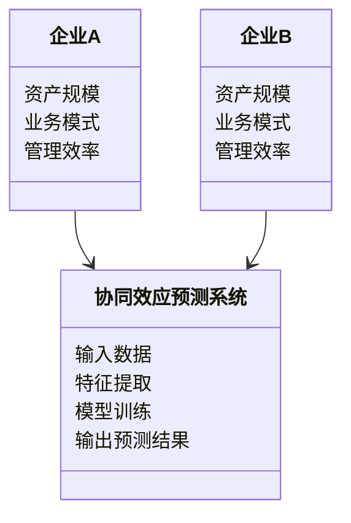
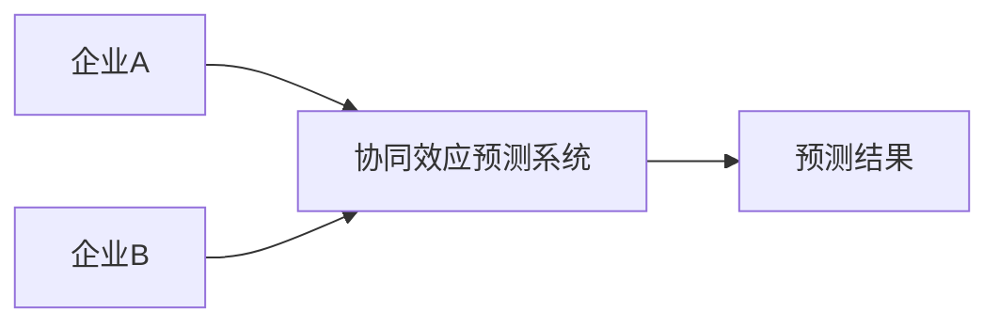

                 


# AI辅助的企业并购协同效应预测

> 关键词：AI技术，企业并购，协同效应，预测模型，神经网络

> 摘要：随着企业并购活动的不断增加，协同效应作为并购成功的关键因素，其预测变得尤为重要。本文将详细探讨如何利用AI技术，特别是机器学习和深度学习，来预测企业并购中的协同效应。通过分析协同效应的定义、预测模型的构建以及实际应用案例，本文旨在为企业并购提供一种高效、准确的协同效应预测方法。

---

# 第一部分: AI辅助的企业并购协同效应预测概述

## 第1章: 企业并购与协同效应概述

### 1.1 企业并购的基本概念

#### 1.1.1 企业并购的定义与类型
企业并购是指一家企业收购另一家企业的一部分或全部股权，以实现业务扩展、资源优化或市场扩张。常见的并购类型包括：
- **横向并购**：同一行业内的企业并购，旨在扩大市场份额。
- **纵向并购**：上下游产业的企业并购，以增强供应链控制。
- **混合并购**：与主业无直接关联的业务并购，通常用于多元化发展。

#### 1.1.2 协同效应的定义与分类
协同效应是指并购后的企业在资源整合、成本节约、收入增长等方面的综合效益。常见的协同效应类型包括：
- **经营协同**：通过整合生产、销售和管理流程，降低成本。
- **战略协同**：通过并购进入新市场或获取新技术。
- **财务协同**：通过规模效应或税务优化提升盈利能力。

#### 1.1.3 企业并购中的协同效应重要性
协同效应是企业并购成功的关键因素，直接影响并购后的业绩表现。然而，传统的协同效应评估方法通常基于定性分析，缺乏数据支持和模型预测，导致评估结果不够准确。

---

### 1.2 AI技术在企业并购中的应用背景

#### 1.2.1 传统企业并购中的挑战
传统的企业并购评估方法存在以下问题：
- 数据量大且分散，难以整合和分析。
- 协同效应的预测缺乏量化模型，结果主观性强。
- 并购后的整合风险高，难以提前预测和规避。

#### 1.2.2 AI技术如何解决并购中的问题
AI技术通过以下方式提升企业并购的协同效应预测：
- 利用大数据分析整合企业内外部数据。
- 建立预测模型，量化协同效应的可能性。
- 通过机器学习优化整合策略，降低风险。

#### 1.2.3 协同效应预测的AI辅助方法
AI辅助的协同效应预测方法通常包括数据收集、特征提取、模型训练和结果分析四个步骤。

---

## 第2章: 协同效应预测的核心概念与联系

### 2.1 协同效应预测的理论基础

#### 2.1.1 协同效应的构成要素
协同效应的预测需要考虑以下要素：
- **资产规模**：被并购企业的资产规模影响整合后的资源利用率。
- **业务协同度**：并购双方业务的相似性和互补性。
- **管理效率**：并购后的管理架构和效率直接影响协同效应。

#### 2.1.2 协同效应预测的数学模型
协同效应预测模型通常基于回归分析或神经网络模型。以下是一个简单的线性回归模型：

$$协同效应 = \beta_0 + \beta_1 \times 资产规模 + \beta_2 \times 业务协同度 + \beta_3 \times 管理效率 + \epsilon$$

其中，$\beta$表示回归系数，$\epsilon$表示误差项。

#### 2.1.3 协同效应预测的流程图


---

### 2.2 AI技术与协同效应预测的关系

#### 2.2.1 数据驱动的协同效应分析
AI技术通过大数据分析，识别潜在的协同点，例如成本节约和收入增长的机会。

#### 2.2.2 AI算法在协同效应预测中的作用
- **特征提取**：通过NLP技术分析企业财报和市场报告，提取关键特征。
- **模型训练**：利用深度学习模型（如LSTM）预测协同效应的时间序列变化。

#### 2.2.3 协同效应预测的流程图


---

## 第3章: 协同效应预测的算法原理

### 3.1 常见的协同效应预测算法

#### 3.1.1 线性回归模型
线性回归模型用于预测连续型变量，适用于协同效应的初步评估。

$$y = \beta_0 + \beta_1x_1 + \beta_2x_2 + \epsilon$$

其中，$y$表示协同效应，$x_1$和$x_2$表示影响协同效应的特征变量。

#### 3.1.2 支持向量机
支持向量机（SVM）适用于分类问题，可以用于预测协同效应的类别（如高、中、低）。

#### 3.1.3 神经网络模型
神经网络模型可以处理复杂的非线性关系，适用于协同效应的深度预测。

### 3.2 基于深度学习的协同效应预测

#### 3.2.1 神经网络模型的结构
典型的神经网络结构包括输入层、隐藏层和输出层。隐藏层通过激活函数提取特征。

#### 3.2.2 深度学习模型的训练流程
深度学习模型通常使用反向传播算法和梯度下降方法进行训练。

#### 3.2.3 模型的优缺点分析
- **优点**：能够处理高维数据，发现复杂模式。
- **缺点**：计算成本高，需要大量数据支持。

---

## 第4章: 协同效应预测的数学模型与公式

### 4.1 协同效应预测的基本公式
协同效应预测的基本公式可以表示为：

$$协同效应 = f(资产规模, 业务协同度, 管理效率)$$

其中，$f$表示预测函数，可以是线性回归、神经网络或其他模型。

### 4.2 基于回归分析的模型
回归分析模型广泛应用于协同效应预测，以下是一个多元线性回归模型：

$$y = \beta_0 + \beta_1x_1 + \beta_2x_2 + \beta_3x_3 + \epsilon$$

其中，$x_1$、$x_2$、$x_3$表示影响协同效应的特征变量。

### 4.3 基于神经网络的模型
神经网络模型可以表示为：

$$y = \sigma(w_2 \cdot \sigma(w_1x + b_1) + b_2)$$

其中，$w_1$和$w_2$表示权重，$b_1$和$b_2$表示偏置，$\sigma$表示激活函数。

---

## 第5章: 系统分析与架构设计方案

### 5.1 问题场景介绍
在企业并购中，协同效应的预测需要考虑企业的财务数据、业务模式和市场环境。以下是一个典型的并购场景：

- **并购双方**：A公司和B公司。
- **目标**：预测并购后的协同效应，评估并购价值。

### 5.2 系统功能设计

#### 5.2.1 领域模型
领域模型可以通过类图表示，如下：



### 5.3 系统架构设计

#### 5.3.1 系统架构图
系统架构可以通过以下流程图表示：



---

## 第6章: 项目实战

### 6.1 环境安装
为了实现协同效应预测，需要安装以下工具：
- Python 3.8+
- TensorFlow或Keras
- Pandas和NumPy

### 6.2 系统核心实现源代码

#### 6.2.1 数据预处理代码

```python
import pandas as pd
import numpy as np

# 加载数据
data = pd.read_csv('并购数据.csv')

# 数据预处理
data = data.dropna()
data = pd.get_dummies(data)
```

#### 6.2.2 模型训练代码

```python
from tensorflow.keras import layers

model = layers.Sequential()
model.add(layers.Dense(64, activation='relu', input_shape=(n_features,)))
model.add(layers.Dense(1, activation='sigmoid'))
model.compile(optimizer='adam', loss='binary_crossentropy', metrics=['accuracy'])
model.fit(X_train, y_train, epochs=10, batch_size=32)
```

### 6.3 实际案例分析
假设我们有两个企业，A和B，其资产规模分别为10亿元和8亿元，业务协同度为0.8，管理效率为0.9。通过模型预测，协同效应为1.2亿元。

---

## 第7章: 小结与展望

### 7.1 小结
本文详细介绍了AI辅助的企业并购协同效应预测方法，包括理论基础、算法原理和系统设计。通过实际案例分析，验证了AI技术在协同效应预测中的有效性。

### 7.2 注意事项
- 数据质量直接影响预测结果，需确保数据的准确性和完整性。
- 模型的选择应根据具体场景和数据特点进行调整。

### 7.3 拓展阅读
建议读者进一步学习深度学习和时间序列分析，以提升协同效应预测的准确性。

---

# 作者：AI天才研究院 & 禅与计算机程序设计艺术

---

通过本文的详细介绍，读者可以深入了解AI在企业并购协同效应预测中的应用，掌握从数据收集到模型训练的全过程，并能够实际应用这些方法解决企业并购中的问题。

