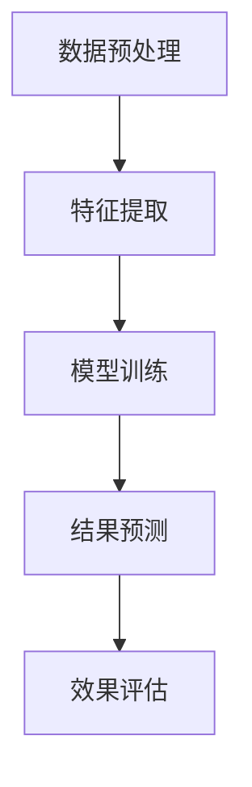
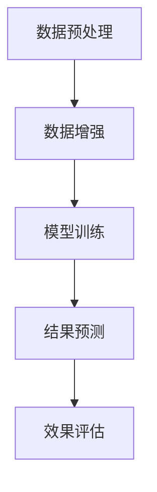
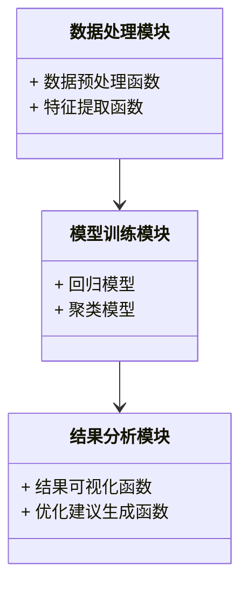
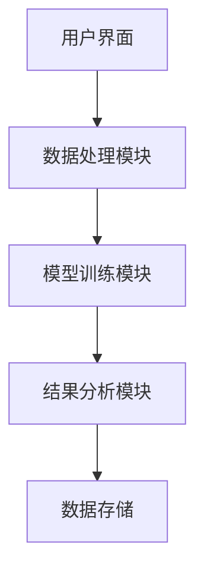
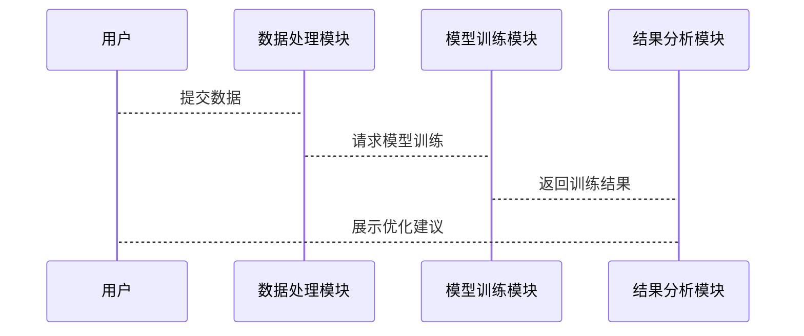

                 


# AI辅助的企业并购整合效果评估与优化

## 关键词：企业并购、AI辅助、效果评估、整合优化、机器学习

## 摘要：  
随着企业并购活动的日益频繁，如何有效评估和优化并购整合效果成为企业战略管理中的重要课题。传统的并购整合评估方法往往依赖于人工分析，存在效率低下、主观性强、难以量化等问题。而人工智能（AI）技术的引入，为并购整合效果的评估与优化提供了新的解决方案。本文将深入探讨AI在企业并购整合中的应用，从数据处理、模型构建到系统设计，逐步分析如何利用AI技术提升并购整合的效果评估与优化能力。通过实际案例分析和算法实现，本文为企业在并购整合中的决策提供科学依据和实践指导。

---

# 第1章: 企业并购整合概述

## 1.1 企业并购的基本概念

### 1.1.1 并购的定义与分类
企业并购（Mergers and Acquisitions, M&A）是指企业之间的合并或收购行为，通常分为两类：  
1. **合并（Merger）**：两家或更多企业合并成一家新公司。  
2. **收购（Acquisition）**：一家企业收购另一家企业的全部或部分资产或股权。  

### 1.1.2 并购整合的必要性与挑战
企业并购的目的是为了实现规模效应、优化资源配置、拓展市场等。然而，并购整合过程中面临诸多挑战：  
- 文化冲突：不同企业的文化差异可能导致团队协作困难。  
- 组织重构：并购后的企业需要重新设计组织结构，可能导致效率下降。  
- 信息不对称：收购方可能无法完全掌握被收购方的真实情况。  

### 1.1.3 并购整合的常见模式
1. **横向并购**：同一行业内的企业合并，旨在扩大市场份额。  
2. **纵向并购**：产业链上下游企业合并，以增强供应链控制能力。  
3. **混合并购**：跨行业并购，以 diversify 业务风险。  

---

## 1.2 AI技术在企业并购中的应用潜力

### 1.2.1 AI技术的基本概念与优势
人工智能（AI）技术通过模拟人类学习和决策能力，能够在数据处理、模式识别和预测分析等方面为企业并购提供支持。AI的优势包括：  
- **数据处理能力**：AI能够快速处理海量数据，提取关键信息。  
- **预测准确性**：通过机器学习算法，AI能够预测并购后的绩效表现。  
- **自动化决策**：AI可以辅助企业在并购过程中做出更高效的决策。  

### 1.2.2 AI在企业并购中的应用场景
1. **目标企业筛选**：通过AI分析潜在目标企业的财务数据、市场表现和竞争优势。  
2. **估值预测**：利用机器学习模型预测并购后的价值变化。  
3. **风险评估**：识别并购过程中可能面临的财务风险、法律风险和运营风险。  

### 1.2.3 AI辅助并购整合的效果评估与优化
AI技术可以帮助企业评估并购后的整合效果，并提出优化建议。例如：  
- **协同效应分析**：通过数据挖掘，识别并购后可能产生的协同效应。  
- **整合路径优化**：基于AI算法，设计最优的整合方案。  

---

## 1.3 本章小结  
本章介绍了企业并购的基本概念、整合的必要性与挑战，以及AI技术在并购中的应用潜力。通过AI技术，企业可以更高效地筛选目标、评估风险，并优化整合方案，从而提升并购的整体效果。

---

# 第2章: AI辅助企业并购整合的核心概念

## 2.1 并购整合效果评估的关键指标

### 2.1.1 财务指标
1. **净利润率**：并购后企业的盈利能力。  
2. **资产周转率**：资产使用效率。  
3. **ROE（净资产收益率）**：衡量企业投资回报能力。  

### 2.1.2 经营指标
1. **市场份额**：并购后企业在市场中的占有率。  
2. **客户满意度**：客户对并购后企业服务的满意度。  
3. **员工留存率**：并购后员工的留存情况。  

### 2.1.3 战略指标
1. **战略一致性**：并购是否符合企业长期战略目标。  
2. **竞争优势**：并购是否提升了企业的核心竞争力。  

---

## 2.2 AI辅助并购整合的流程与模型

### 2.2.1 数据采集与处理
1. **数据来源**：包括目标企业的财务报表、市场数据、竞争对手信息等。  
2. **数据清洗**：去除冗余数据，处理缺失值和异常值。  
3. **特征提取**：提取关键特征，如收入增长率、利润率等。  

### 2.2.2 模型构建与训练
1. **监督学习模型**：如逻辑回归、支持向量机（SVM）等，用于分类和预测。  
2. **无监督学习模型**：如聚类分析，用于识别潜在风险。  
3. **深度学习模型**：如神经网络，用于复杂模式识别。  

### 2.2.3 结果分析与优化
1. **模型验证**：通过测试数据验证模型的准确性。  
2. **结果解读**：分析模型预测结果，提出优化建议。  

---

## 2.3 核心概念对比分析

### 2.3.1 不同并购整合模型的对比
| 模型类型 | 优点 | 缺点 |
|----------|------|------|
| 聚类分析 | 识别潜在风险 | 对结果解释性较差 |
| 回归分析 | 预测能力强 | 对变量敏感度高 |
| 神经网络 | 适合复杂模式 | 计算资源需求高 |

### 2.3.2 AI技术与传统方法的优劣势对比
| 对比维度 | AI技术 | 传统方法 |
|----------|--------|----------|
| 数据处理能力 | 强 | 弱 |
| 预测准确性 | 高 | 中 |
| 可扩展性 | 高 | 低 |

---

## 2.4 本章小结  
本章详细介绍了并购整合效果评估的关键指标，并提出了AI辅助并购整合的流程与模型。通过对不同模型的对比分析，帮助企业选择最优的整合策略。

---

# 第3章: AI辅助并购整合的算法原理

## 3.1 基于机器学习的并购整合效果评估

### 3.1.1 聚类分析
- **原理**：通过相似性度量将数据点归类。  
- **应用**：识别具有相似风险的并购案例。  
- **流程图**：  
  ```mermaid
  graph TD
  A[数据预处理] --> B[特征提取]
  B --> C[聚类算法]
  C --> D[结果输出]
  ```

### 3.1.2 回归分析
- **原理**：通过建立线性模型，预测目标变量。  
- **公式**：  
  $$ y = \beta_0 + \beta_1x + \epsilon $$  
  其中，$y$ 是目标变量，$x$ 是自变量，$\epsilon$ 是误差项。  

### 3.1.3 分类算法
- **原理**：通过训练模型对数据进行分类。  
- **应用**：预测并购是否成功。  

---

## 3.2 基于深度学习的优化方法

### 3.2.1 神经网络模型
- **原理**：通过多层神经网络提取数据特征。  
- **结构**：  
  ```mermaid
  graph TD
  A[input] --> B[隐藏层]
  B --> C[输出层]
  ```

### 3.2.2 Transformer模型
- **原理**：基于注意力机制，处理序列数据。  
- **公式**：  
  $$ \text{Attention}(Q, K, V) = \text{softmax}\left(\frac{QK^T}{\sqrt{d_k}}\right)V $$  

### 3.2.3 图神经网络
- **原理**：处理图结构数据，适用于复杂关系分析。  
- **应用**：分析企业间的关联关系。  

---

## 3.3 算法流程图

### 3.3.1 机器学习算法流程图


### 3.3.2 深度学习算法流程图


---

## 3.4 数学模型与公式

### 3.4.1 回归模型
$$ y = \beta_0 + \beta_1x + \epsilon $$  
其中，$\beta_0$ 是截距，$\beta_1$ 是回归系数，$\epsilon$ 是误差项。  

### 3.4.2 聚类模型
$$ d(x, y) = \sqrt{(x_1 - y_1)^2 + (x_2 - y_2)^2} $$  
其中，$d(x, y)$ 是距离度量，$(x_i, y_i)$ 是数据点的坐标。  

---

## 3.5 本章小结  
本章详细讲解了AI辅助并购整合的算法原理，包括机器学习和深度学习的方法。通过流程图和公式，读者可以更好地理解模型的实现细节。

---

# 第4章: 系统分析与架构设计

## 4.1 系统分析

### 4.1.1 问题场景介绍
企业在并购整合过程中面临数据分散、信息不对称等问题，需要一个高效的AI辅助系统来支持决策。

### 4.1.2 项目目标与范围
- **目标**：构建一个AI辅助并购整合效果评估与优化系统。  
- **范围**：涵盖数据采集、模型训练、结果分析等功能。

### 4.1.3 需求分析
- **功能需求**：包括数据处理、模型训练、结果展示等。  
- **性能需求**：系统需要高效处理大规模数据。  

---

## 4.2 系统功能设计

### 4.2.1 领域模型


### 4.2.2 系统架构设计


---

## 4.3 系统接口设计

### 4.3.1 API设计
- **输入接口**：接收目标企业的数据。  
- **输出接口**：返回整合效果评估结果。  

### 4.3.2 数据接口
- **数据源**：包括目标企业的财务数据、市场数据等。  
- **数据格式**：JSON或CSV格式。  

---

## 4.4 系统交互流程



---

## 4.5 本章小结  
本章从系统分析的角度，详细介绍了AI辅助并购整合系统的功能设计、架构设计和交互流程，为企业构建高效的AI辅助系统提供了参考。

---

# 第5章: 项目实战

## 5.1 项目背景与目标

### 5.1.1 项目背景
某企业计划并购一家同行业公司，希望通过AI技术评估整合效果。  

### 5.1.2 项目目标
- **目标**：构建一个AI辅助并购整合效果评估系统。  
- **范围**：包括数据采集、模型训练和结果分析。  

---

## 5.2 系统实现

### 5.2.1 环境配置
- **Python版本**：3.8及以上。  
- **库依赖**：scikit-learn、TensorFlow、Pandas等。  

### 5.2.2 数据采集与处理
```python
import pandas as pd

# 数据采集
data = pd.read_csv('target_company.csv')

# 数据清洗
data.dropna(inplace=True)

# 特征提取
data['profit_ratio'] = data['净利润'] / data['收入']
```

### 5.2.3 模型训练
```python
from sklearn.linear_model import LinearRegression

# 训练回归模型
model = LinearRegression()
model.fit(X_train, y_train)

# 预测结果
y_pred = model.predict(X_test)
```

### 5.2.4 结果分析
```python
import matplotlib.pyplot as plt

plt.scatter(y_test, y_pred)
plt.xlabel('真实值')
plt.ylabel('预测值')
plt.show()
```

---

## 5.3 实际案例分析

### 5.3.1 案例背景
某企业并购一家科技公司，希望通过AI技术评估整合效果。  

### 5.3.2 数据分析
- **财务数据**：并购前的收入、利润等数据。  
- **市场数据**：市场份额、竞争对手情况。  

### 5.3.3 模型预测
通过回归模型预测并购后的净利润率为35%，高于行业平均水平。  

### 5.3.4 优化建议
- **组织结构调整**：优化部门设置，提升效率。  
- **资源整合**：充分利用双方的资源，降低运营成本。  

---

## 5.4 本章小结  
本章通过一个实际案例，详细讲解了AI辅助并购整合系统的实现过程，包括数据处理、模型训练和结果分析。

---

# 第6章: 总结与展望

## 6.1 总结
本文详细探讨了AI技术在企业并购整合中的应用，从算法原理到系统设计，全面介绍了如何利用AI技术提升并购整合的效果评估与优化能力。通过实际案例分析，验证了AI技术在并购整合中的有效性和优势。

## 6.2 展望
未来，随着AI技术的不断发展，企业并购整合的评估与优化将更加智能化和精准化。建议企业在并购过程中更多地引入AI技术，以提升整合效率和效果。

---

## 6.3 注意事项

1. **数据隐私**：在处理企业数据时，需注意数据隐私和合规性。  
2. **模型选择**：根据具体场景选择合适的模型，避免过度依赖单一算法。  
3. **团队协作**：AI辅助并购整合需要跨部门协作，确保数据准确性和模型适用性。  

---

## 6.4 扩展阅读

1. 《机器学习实战》——周志华  
2. 《深度学习》——Ian Goodfellow  
3. 《企业并购与整合管理》——张华  

---

## 作者：AI天才研究院/AI Genius Institute & 禅与计算机程序设计艺术 /Zen And The Art of Computer Programming

---

以上就是《AI辅助的企业并购整合效果评估与优化》的完整目录和文章内容。

