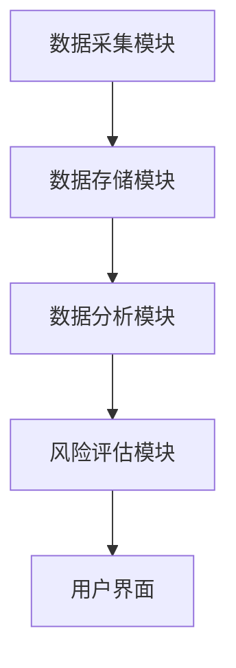
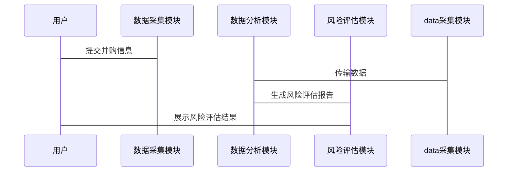

                 


# AI辅助的企业并购整合风险评估

**关键词**：企业并购、整合风险、AI技术、风险管理、数据分析

**摘要**：企业并购是企业战略发展的重要手段，但并购后的整合过程面临诸多风险，如文化冲突、管理不善、市场变化等。传统的整合风险评估方法存在效率低下、数据分散、难以量化等问题。随着人工智能技术的快速发展，利用AI辅助企业并购整合风险评估，能够显著提高评估的准确性和效率。本文系统介绍了AI在企业并购整合风险评估中的应用，从背景、核心概念、算法原理、系统架构到项目实战，全面阐述了AI技术如何助力企业降低整合风险，实现并购后的高效整合与协同发展。

---

# 第一部分: AI辅助的企业并购整合风险评估概述

## 第1章: 企业并购整合风险评估的背景与意义

### 1.1 企业并购的背景与现状

#### 1.1.1 企业并购的基本概念
企业并购是指一家企业通过购买其他企业的股权或资产，以实现战略扩张或资源整合的过程。并购整合则是指在并购完成后，对双方的组织结构、业务流程、文化理念等进行融合的过程。整合的成功与否直接关系到并购的最终效果。

#### 1.1.2 并购整合的核心目标
并购整合的核心目标是实现双方资源的最优配置，最大化协同效应，降低运营成本，提升市场竞争力。然而，整合过程中常常面临文化冲突、管理混乱、资源浪费等问题，导致并购失败。

#### 1.1.3 并购整合中的主要风险类型
- **战略风险**：并购战略与企业整体发展目标不符。
- **运营风险**：整合过程中出现管理混乱、流程不畅等问题。
- **财务风险**：整合成本超支或资产价值评估不准确。
- **文化风险**：企业文化的冲突导致员工士气低落。
- **法律风险**：并购涉及的法律问题未能妥善处理。

### 1.2 传统企业并购整合风险评估的局限性

#### 1.2.1 传统评估方法的不足
传统的风险评估方法通常依赖于人工分析，存在以下问题：
- 数据来源分散，难以整合。
- 评估过程耗时长，效率低。
- 数据分析缺乏深度，难以量化风险。

#### 1.2.2 数据分析的局限性
传统的数据分析方法难以应对以下挑战：
- 数据维度单一，难以全面反映整合风险。
- 数据更新不及时，无法捕捉市场变化。
- 数据分析结果缺乏可操作性。

#### 1.2.3 人工评估的效率问题
人工评估依赖大量的人力资源，且容易受到主观因素的影响，导致评估结果的准确性和一致性难以保证。

### 1.3 AI技术在企业并购整合中的应用潜力

#### 1.3.1 AI技术的核心优势
AI技术具有以下优势：
- **数据处理能力强**：能够快速处理海量数据，提取有价值的信息。
- **自动化分析**：能够自动识别数据中的潜在风险。
- **预测能力强**：通过机器学习算法，可以预测整合过程中可能出现的问题。

#### 1.3.2 AI在风险评估中的独特价值
- **提高评估效率**：AI能够快速处理数据，缩短评估周期。
- **增强风险识别能力**：通过机器学习模型，可以发现传统方法难以识别的隐性风险。
- **提供决策支持**：AI能够为整合决策提供数据支持，降低决策风险。

#### 1.3.3 未来发展趋势与应用前景
随着AI技术的不断发展，企业并购整合风险评估将更加智能化、精准化。未来，AI技术将帮助企业更好地识别和应对整合风险，提高并购的成功率。

---

## 第2章: AI辅助企业并购整合风险评估的核心概念

### 2.1 数据驱动的并购整合风险评估

#### 2.1.1 数据来源与特征
AI辅助的风险评估依赖于多源异构数据，包括：
- **企业内部数据**：财务数据、组织架构、员工信息等。
- **外部数据**：行业数据、市场数据、竞争对手信息等。
- **文本数据**：企业年报、新闻报道、内部文档等。

数据特征包括：
- **完整性**：数据是否完整，是否存在缺失值。
- **一致性**：数据是否一致，是否存在矛盾。
- **时效性**：数据是否及时更新，能否反映最新情况。

#### 2.1.2 数据预处理与清洗
数据预处理是确保数据质量的关键步骤，包括：
- **去重**：去除重复数据。
- **填补缺失值**：使用均值、中位数或插值方法填补缺失值。
- **标准化**：将数据标准化，消除量纲影响。
- **去噪**：去除异常值或噪声数据。

#### 2.1.3 数据分析与建模
数据分析与建模是风险评估的核心步骤，包括：
- **特征选择**：选择对风险影响较大的特征。
- **模型训练**：使用机器学习算法训练风险评估模型。
- **模型验证**：通过交叉验证评估模型性能。

### 2.2 AI算法在风险评估中的应用

#### 2.2.1 机器学习算法
常用机器学习算法包括：
- **线性回归**：用于预测连续型变量。
- **支持向量机（SVM）**：用于分类问题。
- **随机森林与梯度提升树**：用于分类和回归问题。

#### 2.2.2 自然语言处理技术
NLP技术在风险评估中的应用包括：
- **文本分类**：识别文本中的风险类型。
- **情感分析**：分析文本中的情感倾向，判断风险程度。
- **实体识别**：提取文本中的关键实体信息。

#### 2.2.3 图神经网络
图神经网络适用于复杂关系网络的分析，能够识别隐性关联风险。

### 2.3 风险评估模型的构建与验证

#### 2.3.1 模型构建的步骤
- **数据收集**：收集相关数据。
- **数据预处理**：清洗和标准化数据。
- **特征选择**：选择关键特征。
- **模型训练**：训练风险评估模型。
- **模型验证**：评估模型性能。

#### 2.3.2 模型验证与优化
- **交叉验证**：评估模型的泛化能力。
- **超参数优化**：通过网格搜索优化模型性能。
- **模型调优**：根据验证结果调整模型参数。

#### 2.3.3 模型的可解释性
模型的可解释性是企业并购决策的重要因素，需要通过特征重要性分析等方式，解释模型的决策过程。

---

## 第3章: AI辅助企业并购整合风险评估的核心算法原理

### 3.1 机器学习算法原理

#### 3.1.1 线性回归模型
线性回归是一种用于预测连续型变量的回归模型，其数学表达式为：
$$ y = \beta_0 + \beta_1x_1 + \beta_2x_2 + \dots + \beta_nx_n + \epsilon $$
其中，$\beta_0$是截距，$\beta_i$是回归系数，$x_i$是自变量，$\epsilon$是误差项。

#### 3.1.2 支持向量机（SVM）
SVM是一种监督学习算法，主要用于分类和回归问题。其核心思想是通过构建超平面将数据点分为两类，公式为：
$$ y = \text{sign}(w \cdot x + b) $$
其中，$w$是权重向量，$x$是输入向量，$b$是偏置项。

#### 3.1.3 随机森林与梯度提升树
随机森林是一种基于树的集成学习算法，通过构建多棵决策树并进行投票或平均，提高模型的准确性和稳定性。梯度提升树是一种通过迭代优化模型的算法，能够有效处理复杂数据。

### 3.2 自然语言处理（NLP）算法原理

#### 3.2.1 词嵌入（Word Embedding）
词嵌入是一种将词语映射到低维向量空间的技术，常用模型包括Word2Vec、GloVe和FastText。

#### 3.2.2 文本分类与情感分析
文本分类是将文本划分为不同类别的过程，情感分析是识别文本中情感倾向的技术。

#### 3.2.3 基于BERT的文本表示
BERT（Bidirectional Encoder Representations from Transformers）是一种预训练语言模型，能够生成高质量的文本表示。

### 3.3 图神经网络算法原理

#### 3.3.1 图结构数据的表示
图结构数据由节点和边组成，节点表示为：
$$ N = \{n_1, n_2, \dots, n_k\} $$
边表示为：
$$ E = \{e_1, e_2, \dots, e_m\} $$

#### 3.3.2 图卷积网络（GCN）
GCN是一种适用于图结构数据的卷积神经网络，其核心思想是通过聚合节点及其邻居的信息，生成节点表示。

#### 3.3.3 

---

# 第四部分: 系统架构与项目实战

## 第4章: 系统架构设计与实现

### 4.1 问题场景介绍
企业并购整合过程中，需要对双方的组织结构、业务流程、文化理念等进行分析，识别潜在风险。

### 4.2 项目介绍
本项目旨在开发一个基于AI的企业并购整合风险评估系统，帮助企业在并购过程中降低整合风险。

### 4.3 系统功能设计
- **数据采集模块**：收集企业并购相关数据。
- **数据分析模块**：对数据进行预处理和建模。
- **风险评估模块**：生成风险评估报告。

### 4.4 系统架构设计
使用Mermaid绘制系统架构图：



### 4.5 系统接口设计
系统接口设计包括数据接口和用户接口，数据接口负责与外部数据源交互，用户接口负责展示风险评估结果。

### 4.6 系统交互设计
使用Mermaid绘制系统交互序列图：



## 第5章: 项目实战与应用

### 5.1 环境安装与配置
- **安装Python**：建议使用Python 3.8及以上版本。
- **安装相关库**：如Pandas、Scikit-learn、TensorFlow、PyTorch等。

### 5.2 核心实现源代码

#### 5.2.1 数据预处理代码
```python
import pandas as pd
from sklearn.impute import SimpleImputer
from sklearn.preprocessing import StandardScaler

# 读取数据
data = pd.read_csv('并购数据.csv')

# 去除缺失值
imp = SimpleImputer(missing_values=np.nan, strategy='mean')
imp.fit(data)
data_imputed = imp.transform(data)

# 标准化处理
scaler = StandardScaler()
data_scaled = scaler.fit_transform(data_imputed)
```

#### 5.2.2 模型训练代码
```python
from sklearn.ensemble import RandomForestClassifier
from sklearn.metrics import accuracy_score

# 构建随机森林模型
model = RandomForestClassifier(n_estimators=100, max_depth=2, random_state=42)
model.fit(X_train, y_train)

# 模型预测
y_pred = model.predict(X_test)
print('准确率:', accuracy_score(y_test, y_pred))
```

### 5.3 代码应用解读与分析
通过对代码的解读，可以看出数据预处理和模型训练是风险评估的关键步骤。数据预处理确保了数据质量，模型训练为风险评估提供了基础。

### 5.4 实际案例分析与详细讲解
以某企业并购案例为例，详细分析数据预处理、模型训练和风险评估的全过程，展示AI技术在实际应用中的效果。

### 5.5 项目小结
通过项目实战，可以验证AI技术在企业并购整合风险评估中的有效性，同时积累宝贵的实践经验。

---

## 第6章: 总结与展望

### 6.1 最佳实践 Tips
- 数据质量是风险评估的基础，需高度重视数据清洗和预处理。
- 模型选择应结合实际业务需求，避免过度复杂化。
- 模型的可解释性是企业决策的关键，需注重模型的解释能力。

### 6.2 小结
本文系统介绍了AI辅助企业并购整合风险评估的核心概念、算法原理和系统架构，并通过项目实战展示了AI技术在实际应用中的价值。

### 6.3 注意事项
- 数据隐私和安全问题需严格把控。
- 模型的泛化能力需通过交叉验证进行评估。
- 模型的实时性需根据业务需求进行优化。

### 6.4 拓展阅读
- 推荐阅读《机器学习实战》、《深度学习》等书籍，深入理解AI算法原理。
- 关注最新的AI技术动态，探索更多应用场景。

---

**作者：AI天才研究院/AI Genius Institute & 禅与计算机程序设计艺术 /Zen And The Art of Computer Programming**

