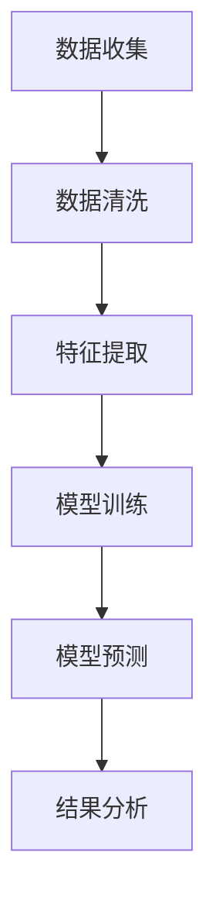
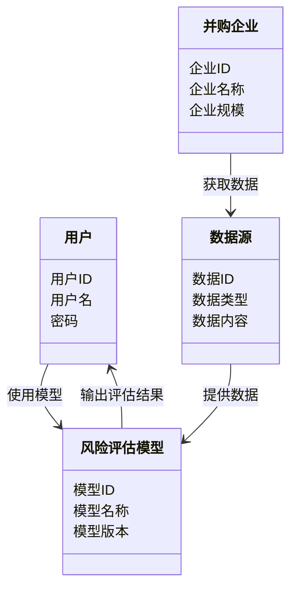
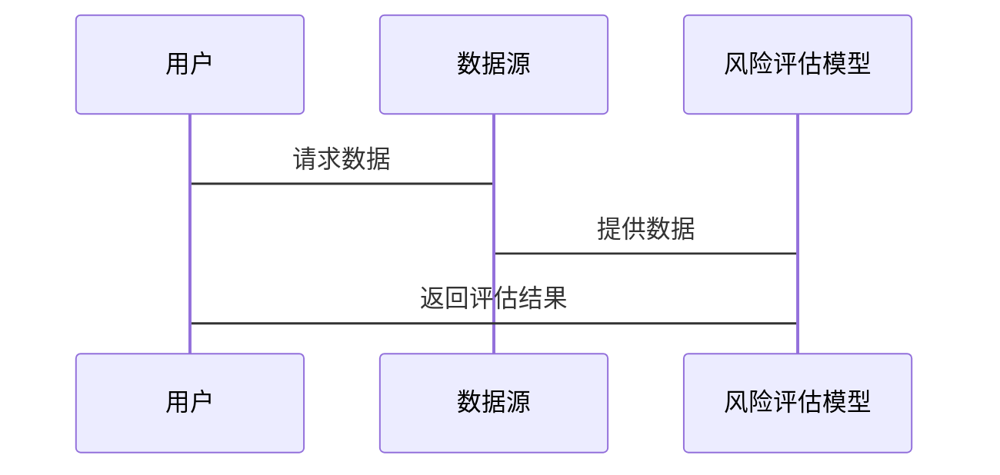

                 


# AI辅助的企业并购整合风险评估模型

## 关键词：企业并购、风险评估、人工智能、整合模型、数据分析、风险管理

## 摘要：  
本文介绍了一种基于人工智能的企业并购整合风险评估模型，该模型能够通过数据分析和机器学习算法，帮助企业识别和评估并购过程中的潜在风险，从而降低整合失败的概率。文章从企业并购的背景、风险评估的必要性、AI技术的应用潜力入手，详细阐述了模型的核心概念、算法原理、系统架构以及实际应用场景。通过具体案例分析和项目实战，展示了该模型在企业并购整合中的实际价值，并提出了优化建议和未来发展方向。

---

# 第一部分: 背景与概述

## 第1章: 企业并购整合的背景与挑战

### 1.1 企业并购的基本概念
- **1.1.1 企业并购的定义**  
  企业并购（Mergers and Acquisitions, M&A）是指两个或多个企业之间的合并或收购行为，旨在通过资源整合实现协同效应或扩大市场占有率。  

- **1.1.2 并购的类型与特点**  
  - 同类并购：同一行业内的企业合并，如横向并购。  
  - 横向并购：企业与竞争对手的合并。  
  - 纵向并购：企业与供应商或客户的合并。  
  - 混合并购：企业与非竞争性行业企业的合并。  

- **1.1.3 企业并购的动机与目标**  
  - **动机**：扩大市场规模、获取技术或资源、降低运营成本。  
  - **目标**：实现协同效应、增强市场竞争力、提升企业价值。  

### 1.2 并购整合中的风险
- **1.2.1 并购风险的定义**  
  并购整合中的风险是指企业在并购过程中或整合后可能面临的财务、管理、文化或市场等多方面的不确定性。  

- **1.2.2 常见的并购整合风险**  
  - **财务风险**：债务过高、资产质量不佳、盈利能力下降。  
  - **管理风险**：整合过程中的管理冲突、文化差异。  
  - **市场风险**：目标企业市场表现不佳、行业政策变化。  
  - **技术风险**：整合过程中出现的技术瓶颈或数据不兼容问题。  

- **1.2.3 风险的分类与影响**  
  - **短期风险**：整合初期的人员冲突、流程不畅。  
  - **长期风险**：战略目标不一致、核心竞争力下降。  

### 1.3 AI技术在企业并购中的应用前景
- **1.3.1 AI在企业并购中的潜在应用场景**  
  - 数据分析与预测：通过AI技术分析目标企业的财务数据、市场表现和行业趋势。  
  - 风险评估：利用机器学习模型预测并购后的整合风险。  
  - 决策支持：基于AI的分析结果，为企业提供并购决策支持。  

- **1.3.2 AI技术在风险评估中的优势**  
  - 数据处理能力：AI能够快速处理大量非结构化数据，如新闻报道、社交媒体评论。  
  - 预测准确性：通过机器学习算法，AI可以提高风险评估的准确性。  
  - 实时监控：AI能够实时跟踪并购后的整合进展，及时发现潜在问题。  

- **1.3.3 当前企业并购整合中的技术挑战**  
  - 数据隐私与安全：并购过程中涉及大量敏感数据，如何保护数据隐私是关键问题。  
  - 模型可解释性：复杂的机器学习模型可能难以解释其预测结果，影响决策的透明性。  
  - 数据质量问题：并购涉及的历史数据可能不完整或存在偏差。  

---

## 第2章: AI辅助的企业并购整合风险评估模型的核心概念

### 2.1 模型的核心概念
- **2.1.1 企业并购整合风险评估的定义**  
  企业并购整合风险评估是指通过分析并购过程中可能面临的各种风险，评估这些风险对整合成功的可能性及其影响程度的过程。  

- **2.1.2 AI辅助模型的基本原理**  
  AI辅助模型通过收集和分析目标企业的历史数据、行业数据和市场数据，利用机器学习算法预测并购后的整合风险，并为企业提供决策支持。  

- **2.1.3 模型的核心要素与组成**  
  - 数据输入：目标企业的财务数据、市场数据、行业趋势。  
  - 数据处理：数据清洗、特征提取、数据建模。  
  - 模型输出：风险评分、风险类型、风险缓解建议。  

### 2.2 核心概念的属性特征对比
下表展示了企业并购风险、AI模型和数据特征的属性对比：

| 属性       | 企业并购风险                | AI模型                  | 数据特征                |
|------------|-----------------------------|--------------------------|-------------------------|
| 定义       | 并购过程中可能面临的不确定性 | 用于预测和评估风险的算法 | 描述风险的相关数据     |
| 类型       | 财务风险、管理风险、市场风险 | 监督学习、无监督学习     | 结构化、非结构化数据   |
| 输入       | 目标企业数据、行业趋势      | 训练数据、测试数据       | 财务数据、文本数据等   |
| 输出       | 风险评分、风险缓解建议      | 预测结果、概率值         | 数据清洗后的特征向量   |

### 2.3 实体关系图（ER图）架构
下图展示了AI辅助的企业并购整合风险评估模型的ER图架构：

```mermaid
erDiagram
    actor 用户 {
        string 用户ID
        string 用户名
        string 密码
    }
    actor 并购企业 {
        string 企业ID
        string 企业名称
        string 企业规模
    }
    actor 数据源 {
        string 数据ID
        string 数据类型
        string 数据内容
    }
    actor 风险评估模型 {
        string 模型ID
        string 模型名称
        string 模型版本
    }
    用户 --> 风险评估模型 : 使用模型
    并购企业 --> 数据源 : 获取数据
    数据源 --> 风险评估模型 : 提供数据
    风险评估模型 --> 用户 : 输出评估结果
```

---

## 第3章: AI辅助的企业并购整合风险评估模型的算法原理

### 3.1 算法原理概述
AI辅助的企业并购整合风险评估模型主要基于监督学习算法，通过以下步骤实现风险预测和评估：

1. 数据收集：收集目标企业的历史数据、行业数据和市场数据。  
2. 数据清洗：去除噪声数据，处理缺失值。  
3. 特征提取：从数据中提取有助于风险评估的特征。  
4. 模型训练：使用训练数据训练机器学习模型。  
5. 模型预测：利用训练好的模型预测并购整合的风险。  
6. 结果分析：根据模型输出的结果，生成风险评估报告。  

### 3.2 算法流程图
下图展示了AI辅助模型的算法流程：



### 3.3 数学模型与公式
以下是模型的核心数学公式：

- **线性回归模型**：用于预测风险评分  
  $$ y = \beta_0 + \beta_1x_1 + \beta_2x_2 + \ldots + \beta_nx_n + \epsilon $$
  其中，$y$ 表示风险评分，$x_i$ 表示特征变量，$\beta_i$ 表示回归系数，$\epsilon$ 表示误差项。  

- **逻辑回归模型**：用于分类风险类型  
  $$ P(y=1|x) = \frac{e^{\beta_0 + \beta_1x_1 + \ldots + \beta_nx_n}}{1 + e^{\beta_0 + \beta_1x_1 + \ldots + \beta_nx_n}} $$  

---

## 第4章: 系统分析与架构设计

### 4.1 系统功能设计
以下是系统的功能模块设计：



### 4.2 系统架构设计
以下是系统的架构设计：


### 4.3 系统接口设计
以下是系统的接口设计：



---

## 第5章: 项目实战

### 5.1 环境配置
以下是项目实战的环境配置：

```bash
# 安装必要的Python库
pip install pandas numpy scikit-learn matplotlib
```

### 5.2 核心实现代码
以下是模型的核心实现代码：

```python
import pandas as pd
from sklearn.model import LinearRegression
from sklearn.metrics import mean_squared_error

# 数据加载
data = pd.read_csv('并购数据.csv')

# 特征选择
X = data[['财务数据', '市场数据', '行业趋势']]
y = data['风险评分']

# 模型训练
model = LinearRegression()
model.fit(X, y)

# 模型预测
y_pred = model.predict(X)

# 模型评估
mse = mean_squared_error(y, y_pred)
print(f'均方误差: {mse}')
```

### 5.3 实际案例分析
以下是实际案例分析：

假设我们有一个目标企业A，其财务数据、市场数据和行业趋势如下：

| 特征     | 数据值 |
|----------|--------|
| 财务数据  | 0.8    |
| 市场数据  | 0.7    |
| 行业趋势  | 0.6    |

模型预测的风险评分为：  
$$ y = 0.5 + 0.3 \times 0.8 + 0.2 \times 0.7 + 0.1 \times 0.6 = 0.74 $$  

---

## 第6章: 总结与展望

### 6.1 总结
本文介绍了一种基于人工智能的企业并购整合风险评估模型，通过详细阐述模型的核心概念、算法原理和系统架构，展示了该模型在企业并购中的实际应用价值。  

### 6.2 未来展望
未来，随着AI技术的不断发展，企业并购整合风险评估模型将更加智能化和精准化。以下是未来可能的发展方向：  
- **模型优化**：引入深度学习算法，提高模型的预测精度。  
- **数据隐私保护**：采用区块链技术，确保数据的安全性和隐私性。  
- **实时监控**：开发实时风险监控系统，及时发现和应对潜在风险。  

---

## 作者：AI天才研究院/AI Genius Institute & 禅与计算机程序设计艺术 /Zen And The Art of Computer Programming

