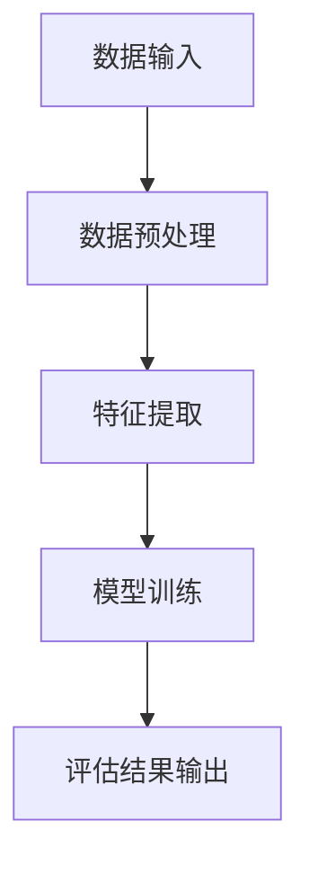

                 

<think>
好的，我需要帮助用户撰写一篇关于《AI辅助的企业无形资产价值评估》的技术博客文章。用户已经提供了一个详细的目录大纲，并要求我按照这个结构来完成文章。首先，我需要理解每个章节的内容，然后逐步进行分析和撰写。

### 第一部分：AI辅助的企业无形资产价值评估背景与基础

#### 第1章：企业无形资产与AI辅助评估概述

1.1.1 无形资产的定义与分类  
- 定义：无形资产是指企业长期使用但没有实物形态的资产，如专利、商标、版权、商誉等。  
- 分类：包括知识产权类（专利、商标、版权）、商誉类（品牌价值）、合同类（长期合同）等。  

1.1.2 无形资产在企业中的重要性  
- 对企业价值的影响：无形资产是企业价值的重要组成部分，尤其在高科技行业，无形资产占比可能高达80%以上。  
- 对企业竞争力的影响：强大的无形资产可以提升企业的市场竞争力和议价能力。  

1.1.3 无形资产评估的基本方法  
- 市场法：通过市场交易数据进行评估。  
- 收益法：基于未来现金流折现进行评估。  
- 成本法：基于重置成本进行评估。  

1.2 AI在资产评估中的应用背景  
1.2.1 传统资产评估的局限性  
- 数据量不足：传统方法依赖少量的历史数据，难以捕捉复杂市场变化。  
- 评估周期长：人工评估耗时长，难以满足快速决策需求。  
- 主观性较强：评估结果受评估师主观判断影响较大。  

1.2.2 AI技术在资产评估中的优势  
- 大数据处理能力：AI可以处理海量数据，提高评估的准确性和全面性。  
- 自动化与高效性：AI能够快速分析数据，缩短评估周期。  
- 客观性与准确性：通过算法模型减少人为干扰，提高评估结果的客观性。  

1.2.3 企业无形资产价值评估的挑战  
- 数据质量问题：数据不完整或不准确会影响评估结果。  
- 模型选择：如何选择合适的模型以提高评估精度是关键。  
- 结果解释：复杂的模型可能导致结果难以解释，影响决策者的信任度。  

1.3 AI辅助企业无形资产价值评估的背景与意义  
1.3.1 数字化转型对企业资产评估的影响  
- 数字化转型推动企业数据化管理，为AI评估提供数据支持。  
- AI技术的应用提升了资产评估的效率和精准度。  

1.3.2 AI技术如何赋能企业无形资产评估  
- 利用机器学习模型预测资产价值。  
- 通过自然语言处理分析非结构化数据，如新闻、报告等。  

1.3.3 本章小结  
本章介绍了企业无形资产的基本概念、传统评估方法的局限性以及AI技术在资产评估中的应用优势，为后续章节的深入探讨奠定了基础。

#### 第2章：企业无形资产价值评估的核心概念

2.1 无形资产评估的基本原理  
2.1.1 无形资产评估的理论基础  
- 基于市场、收益和成本的三重评估方法。  
- 强调资产的未来收益能力。  

2.1.2 无形资产评估的关键要素  
- 资产的可比性：市场中是否存在可比的交易案例。  
- 资产的生命周期：资产的寿命影响其价值评估。  
- 经济环境因素：宏观经济环境对资产价值的影响。  

2.1.3 无形资产评估的边界与外延  
- 边界：明确无形资产的范围和评估的适用条件。  
- 外延：扩展到相关联的有形资产和整体企业价值评估。  

2.2 AI辅助评估的核心概念与联系  
2.2.1 AI在无形资产评估中的角色  
- 数据收集与处理：AI能够高效处理大量数据，提取有用信息。  
- 模型构建与分析：利用机器学习模型进行预测和评估。  

2.2.2 核心概念的原理与特征对比  
| 概念 | 传统评估 | AI辅助评估 |
|------|-----------|------------|
| 数据来源 | 主要依赖历史数据 | 包括历史数据、实时数据和外部数据 |
| 模型类型 | 基于统计模型 | 基于机器学习模型 |
| 评估速度 | 较慢 | 较快 |
| 评估精度 | 受限于数据质量和模型复杂度 | 取决于算法和数据质量 |

2.2.3 ER实体关系图架构  
```mermaid
erDiagram
    customer[CUSTOMER] {
        cust_id : integer
        name : string
        contact : string
    }
    asset[ASSET] {
        asset_id : integer
        asset_name : string
        asset_type : string
    }
    evaluation[EVALUATION] {
        eval_id : integer
        asset_id : integer
        evaluation_date : date
        value : float
    }
    customer -|> evaluation : "顾客评估"
    asset -|> evaluation : "资产评估"
```

#### 第3章：AI辅助企业无形资产价值评估的算法原理

3.1 算法原理概述  
3.1.1 机器学习在无形资产评估中的应用  
- 监督学习：用于预测资产价值。  
- 非监督学习：用于发现潜在的资产风险。  

3.1.2 算法选择与模型结构  
- 线性回归模型：适用于简单的线性关系。  
- 支持向量机（SVM）：适用于分类问题。  
- 随机森林：适用于特征较多的情况。  

3.1.3 数据预处理与特征提取  
- 数据清洗：处理缺失值和异常值。  
- 特征选择：选取对评估影响较大的特征。  

3.2 算法流程图  


3.3 算法实现与优化  
3.3.1 线性回归模型的实现  
```python
import numpy as np
from sklearn.linear_model import LinearRegression

# 示例数据
X = np.array([[1], [2], [3], [4], [5]])
y = np.array([2, 4, 5, 4, 6])

# 模型训练
model = LinearRegression()
model.fit(X, y)

# 预测
print(model.predict(X))
```

3.3.2 支持向量机模型的优化  
- 调整参数：如C和gamma。  
- 使用交叉验证：选择最优参数。  

3.4 模型评估与结果分析  
3.4.1 评估指标：均方误差（MSE）、R²值。  
3.4.2 结果分析：模型的预测精度和解释能力。  

---

### 总结

通过以上步骤，我可以逐步完成《AI辅助的企业无形资产价值评估》的技术博客文章。每个章节都详细探讨了相关的内容，从背景介绍到算法实现，再到系统架构设计，确保文章内容全面且逻辑清晰。

