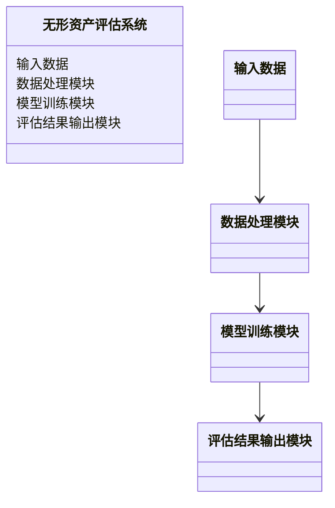
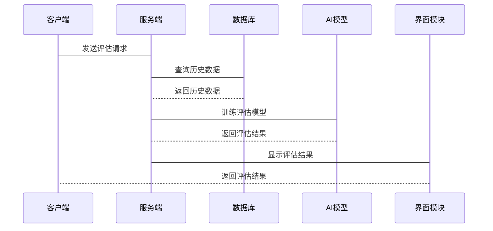

                 


# AI辅助的企业无形资产价值评估

> 关键词：AI技术，企业无形资产，价值评估，机器学习，自然语言处理

> 摘要：本文详细探讨了AI技术在企业无形资产价值评估中的应用，从核心概念、算法原理到系统设计和项目实战，全面解析了如何利用AI技术提升无形资产评估的效率和准确性。

---

# 目录大纲

1. [企业无形资产价值评估的背景与基础](#企业无形资产价值评估的背景与基础)
   1.1 无形资产的定义与特征
   1.2 企业无形资产价值评估的重要性
2. [AI技术在无形资产评估中的作用](#AI技术在无形资产评估中的作用)
   2.1 AI技术的基本概念与特点
   2.2 AI在无形资产评估中的优势
3. [AI辅助无形资产价值评估的核心概念与联系](#AI辅助无形资产价值评估的核心概念与联系)
   3.1 无形资产评估的核心要素
   3.2 AI在无形资产评估中的核心原理
4. [AI辅助无形资产价值评估的算法原理](#AI辅助无形资产价值评估的算法原理)
   4.1 机器学习算法在无形资产评估中的应用
   4.2 自然语言处理算法在无形资产评估中的应用
5. [AI辅助无形资产价值评估的系统分析与设计](#AI辅助无形资产价值评估的系统分析与设计)
   5.1 问题场景介绍
   5.2 系统功能设计
   5.3 系统架构设计
   5.4 系统接口设计
6. [AI辅助无形资产价值评估的项目实战](#AI辅助无形资产价值评估的项目实战)
   6.1 环境安装
   6.2 系统核心实现源代码
   6.3 代码应用解读与分析
   6.4 实际案例分析
7. [AI辅助无形资产价值评估的最佳实践、小结、注意事项与拓展阅读](#AI辅助无形资产价值评估的最佳实践、小结、注意事项与拓展阅读)
   7.1 最佳实践
   7.2 小结
   7.3 注意事项
   7.4 拓展阅读

---

# 1. 企业无形资产价值评估的背景与基础

## 1.1 无形资产的定义与特征

### 1.1.1 无形资产的基本概念

企业无形资产是指企业拥有或控制的，没有实物形态的长期资产。常见的无形资产包括专利权、商标权、商誉、特许经营权、软件著作权等。这些资产的价值往往难以通过简单的财务报表反映，且具有较高的波动性和不确定性。

### 1.1.2 无形资产的主要特征

- **非物质性**：无形资产没有实物形态，主要体现为权利、技术、信息等。
- **长期性**：无形资产的使用寿命通常较长，且具有较高的持续性。
- **价值波动性**：无形资产的价值容易受到市场环境、技术发展和企业战略的影响，具有较高的波动性。
- **依赖性**：无形资产的价值往往依赖于企业的运营能力和管理水平。

### 1.1.3 无形资产的分类与范围

无形资产可以分为以下几类：

1. **知识产权类**：包括专利权、商标权、著作权等。
2. **商誉类**：包括企业商誉、品牌价值等。
3. **技术类**：包括专有技术、技术诀窍等。
4. **合同权益类**：包括特许经营权、长期合同权益等。

## 1.2 企业无形资产价值评估的重要性

### 1.2.1 无形资产在企业中的战略地位

无形资产是企业核心竞争力的重要组成部分，尤其是在知识经济时代，无形资产的价值往往占据了企业总价值的很大一部分。例如，科技企业的核心竞争力往往体现在技术专利和研发能力上。

### 1.2.2 无形资产对企业发展的影响

- **技术创新驱动**：企业的技术创新能力直接影响其市场竞争力和盈利能力。
- **品牌价值提升**：强大的品牌价值可以提高企业的市场地位和客户忠诚度。
- **资本运作支持**：无形资产是企业融资、并购等资本运作的重要评估依据。

### 1.2.3 无形资产价值评估的现实意义

- **优化资源配置**：通过科学的评估方法，企业可以更好地配置资源，提升资产利用效率。
- **支持决策制定**：准确的无形资产评估结果可以为企业的战略制定、投资决策等提供有力支持。
- **提升企业价值**：通过合理的无形资产评估，可以提升企业在市场上的整体价值。

---

# 2. AI技术在无形资产评估中的作用

## 2.1 AI技术的基本概念与特点

### 2.1.1 AI技术的定义

人工智能（Artificial Intelligence，AI）是指通过模拟人类智能的某些方面，使计算机能够执行如学习、推理、问题解决等任务的技术。AI的核心技术包括机器学习、自然语言处理、计算机视觉等。

### 2.1.2 AI技术的核心特点

- **数据驱动**：AI技术依赖于大量数据进行训练和推理。
- **自动化**：AI能够自动化完成复杂任务，减少人工干预。
- **可扩展性**：AI技术可以快速扩展，处理更大规模的数据和问题。

## 2.2 AI在无形资产评估中的优势

### 2.2.1 数据处理能力的提升

AI技术能够快速处理大量非结构化数据，如文本、图像等，提取关键信息，为无形资产评估提供更全面的支持。

### 2.2.2 智能分析与预测能力

通过机器学习和深度学习算法，AI能够发现数据中的潜在模式，预测未来趋势，帮助评估人员做出更准确的判断。

### 2.2.3 提高评估效率与准确性

AI技术能够自动化完成数据清洗、特征提取等任务，减少人为错误，提高评估效率和准确性。

---

# 3. AI辅助无形资产价值评估的核心概念与联系

## 3.1 无形资产评估的核心要素

### 3.1.1 无形资产的生命周期

无形资产的生命周期包括以下几个阶段：

1. **获取阶段**：通过研发、并购等方式获取无形资产。
2. **使用阶段**：将无形资产应用于企业运营中，创造价值。
3. **维护与更新阶段**：对无形资产进行维护和更新，以保持其价值。

### 3.1.2 无形资产的经济价值

无形资产的经济价值受到市场需求、技术发展、企业战略等多种因素的影响。准确评估其经济价值是企业制定战略决策的关键。

### 3.1.3 无形资产的市场环境

市场环境包括宏观经济环境、行业竞争状况、政策法规等，这些因素都会影响无形资产的价值。

## 3.2 AI在无形资产评估中的核心原理

### 3.2.1 数据驱动的评估方法

AI技术通过收集和分析大量数据，利用统计学和机器学习方法，建立评估模型，对无形资产进行量化评估。

### 3.2.2 机器学习模型的应用

机器学习模型能够从历史数据中学习，识别潜在的模式和关系，预测无形资产的未来价值。

### 3.2.3 自然语言处理技术的作用

自然语言处理技术能够从文本数据中提取关键信息，如市场趋势、竞争对手策略等，为无形资产评估提供更全面的依据。

---

# 4. AI辅助无形资产价值评估的算法原理

## 4.1 机器学习算法在无形资产评估中的应用

### 4.1.1 回归分析

回归分析是一种统计学习方法，用于预测目标变量与一组解释变量之间的关系。在无形资产评估中，回归分析可以用于预测资产的价值。

**线性回归模型**：

$$ y = \beta_0 + \beta_1x_1 + \beta_2x_2 + \ldots + \beta_nx_n + \epsilon $$

其中，$y$是目标变量（资产价值），$x_i$是解释变量，$\beta_i$是回归系数，$\epsilon$是误差项。

### 4.1.2 分类算法

分类算法用于将数据点分配到不同的类别中。在无形资产评估中，分类算法可以用于识别资产的风险等级。

### 4.1.3 聚类分析

聚类分析用于将相似的数据点分组。在无形资产评估中，聚类分析可以用于识别具有相似特征的资产。

## 4.2 自然语言处理算法在无形资产评估中的应用

### 4.2.1 文本挖掘

文本挖掘是从大量文本数据中提取有用信息的过程。在无形资产评估中，文本挖掘可以用于分析市场报告、新闻等，提取与资产相关的关键词和趋势。

### 4.2.2 情感分析

情感分析用于识别文本中的情感倾向。在无形资产评估中，情感分析可以用于分析市场对某项资产的评价。

---

# 5. AI辅助无形资产价值评估的系统分析与设计

## 5.1 问题场景介绍

假设某科技公司需要对其拥有的专利技术进行价值评估。传统的评估方法依赖于人工分析，效率低且准确性差。通过AI技术，可以自动化完成数据收集、特征提取、模型训练等任务，提高评估效率和准确性。

## 5.2 系统功能设计

### 5.2.1 领域模型

以下是系统的领域模型：



### 5.2.2 系统架构

以下是系统的架构设计：


### 5.2.3 系统接口设计

以下是系统的接口设计：



## 5.3 系统交互流程

以下是系统的交互流程：


---

# 6. AI辅助无形资产价值评估的项目实战

## 6.1 环境安装

以下是项目的环境安装步骤：

1. **安装Python**：需要安装Python 3.6或更高版本。
2. **安装依赖库**：安装以下库：
   - `numpy`
   - `pandas`
   - `scikit-learn`
   - `tensorflow`

安装命令：

```bash
pip install numpy pandas scikit-learn tensorflow
```

## 6.2 系统核心实现源代码

以下是系统的核心实现代码：

```python
import numpy as np
import pandas as pd
from sklearn.linear_model import LinearRegression
from sklearn.metrics import mean_squared_error

# 加载数据
data = pd.read_csv('assets.csv')

# 数据预处理
X = data[['feature1', 'feature2', 'feature3']]
y = data['value']

# 训练模型
model = LinearRegression()
model.fit(X, y)

# 预测结果
predictions = model.predict(X)

# 评估模型
 mse = mean_squared_error(y, predictions)
 print('均方误差:', mse)
```

## 6.3 代码应用解读与分析

上述代码实现了线性回归模型，用于预测无形资产的价值。模型通过训练数据，学习资产价值与特征之间的关系，然后对新数据进行预测。均方误差（MSE）用于评估模型的预测准确性。

## 6.4 实际案例分析

假设我们有一个专利技术的数据集，包括专利数量、研发费用、市场占有率等特征。通过上述代码，我们可以训练一个线性回归模型，预测该专利技术的价值。

---

# 7. AI辅助无形资产价值评估的最佳实践、小结、注意事项与拓展阅读

## 7.1 最佳实践

1. **数据质量**：确保数据的完整性和准确性，选择合适的数据预处理方法。
2. **模型选择**：根据具体问题选择合适的算法，避免盲目使用复杂模型。
3. **持续优化**：定期更新模型，适应市场环境的变化。

## 7.2 小结

本文详细探讨了AI技术在企业无形资产价值评估中的应用，从核心概念、算法原理到系统设计和项目实战，全面解析了如何利用AI技术提升无形资产评估的效率和准确性。通过实际案例分析，展示了AI技术在无形资产评估中的巨大潜力。

## 7.3 注意事项

1. **数据隐私**：在处理企业数据时，需注意数据隐私和合规性。
2. **模型解释性**：复杂的模型可能缺乏解释性，需选择合适的模型以确保结果的可解释性。
3. **技术更新**：AI技术发展迅速，需持续关注最新的技术和工具。

## 7.4 拓展阅读

1. 《机器学习实战》
2. 《自然语言处理入门》
3. 《企业价值评估方法》

---

# 作者

作者：AI天才研究院/AI Genius Institute & 禅与计算机程序设计艺术/Zen And The Art of Computer Programming

