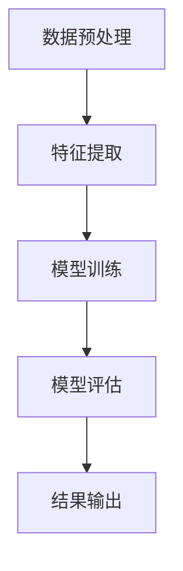
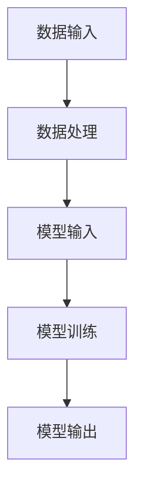
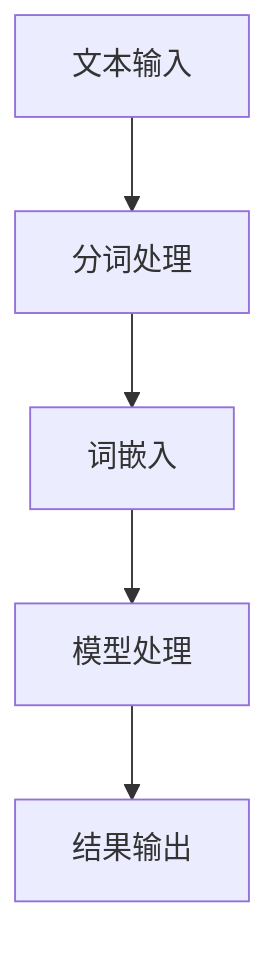

                 


# AI辅助的企业无形资产估值与管理

> 关键词：AI技术、企业无形资产、估值模型、管理系统、算法实现

> 摘要：本文探讨了人工智能技术在企业无形资产估值与管理中的应用，通过详细分析核心概念、算法原理、系统架构和项目实战，为读者提供全面的理论与实践指导，帮助企业在数字化转型中提升无形资产管理效率和准确性。

---

# 第1章: 企业无形资产与AI辅助管理概述

## 1.1 企业无形资产的基本概念

### 1.1.1 无形资产的定义与分类
企业无形资产是指企业拥有或控制的没有实物形态的长期资产，主要包括品牌价值、客户关系、知识产权、商誉等。这些资产难以被直接观察和衡量，但对企业的长期价值和竞争力至关重要。

### 1.1.2 无形资产在企业中的重要性
无形资产是企业核心竞争力的体现。例如，品牌价值决定了企业在市场中的地位，知识产权保护了企业的创新成果，客户关系影响着企业的收入来源。因此，对无形资产的科学管理和准确估值对企业的发展至关重要。

### 1.1.3 无形资产的评估与管理挑战
无形资产的评估和管理面临诸多挑战：  
1. **复杂性**：无形资产的价值受多种因素影响，如市场环境、企业战略等。  
2. **动态性**：无形资产的价值会随着市场变化而波动，难以稳定估值。  
3. **主观性**：无形资产的评估需要依赖专业判断，存在一定的主观性。  
4. **数据获取难**：缺乏足够的历史数据和实时信息支持评估。  

---

## 1.2 AI技术在无形资产估值中的作用

### 1.2.1 AI技术的基本概念
人工智能（AI）是指模拟人类智能的计算机系统，能够通过数据学习、模式识别和决策优化来完成复杂的任务。AI技术在企业中的应用广泛，包括数据分析、自动化处理和智能决策等。

### 1.2.2 AI在无形资产估值中的优势
AI技术可以通过以下方式提升无形资产的估值和管理效率：  
1. **数据驱动**：利用大数据分析技术，提取和处理大量相关信息，提供更准确的估值依据。  
2. **自动化**：AI可以自动完成数据清洗、特征提取和模型训练，减少人工干预。  
3. **实时性**：通过实时数据监控和分析，动态调整估值模型，提高评估的及时性。  
4. **可扩展性**：AI技术可以处理海量数据，适用于大规模企业的无形资产管理需求。  

### 1.2.3 企业级应用的前景与潜力
随着AI技术的不断进步，其在企业无形资产领域的应用潜力巨大。未来，企业可以通过AI辅助系统实现无形资产的智能化管理，提升资产价值评估的精准性和管理效率。

---

## 1.3 本章小结
本章介绍了企业无形资产的基本概念、重要性及其评估与管理的挑战，并详细阐述了AI技术在无形资产估值中的作用和优势。AI技术的引入为企业的无形资产管理提供了新的可能性，为后续章节的深入分析奠定了基础。

---

# 第2章: 企业无形资产与AI技术的核心概念

## 2.1 核心概念的定义与属性

### 2.1.1 无形资产的属性分析
无形资产具有以下属性：  
- **不可见性**：缺乏实物形态。  
- **依附性**：依附于企业或品牌的存在。  
- **价值波动性**：受市场环境和企业战略的影响较大。  

### 2.1.2 AI技术的核心特征
AI技术的核心特征包括：  
- **数据驱动**：依赖大量数据进行学习和推理。  
- **自主性**：能够自主完成任务，无需人工干预。  
- **适应性**：能够根据环境变化调整模型和策略。  

### 2.1.3 无形资产与AI技术的联系与区别
无形资产与AI技术的联系在于AI可以通过数据挖掘和分析帮助评估无形资产的价值。区别在于，无形资产是企业的资产，而AI技术是一种工具，用于辅助管理和评估。

---

## 2.2 核心概念的对比分析

### 2.2.1 无形资产与有形资产的对比
| 属性 | 无形资产 | 有形资产 |
|------|----------|----------|
| 实物形态 | 无 | 有 |
| 评估难度 | 高 | 较低 |
| 变现能力 | 低 | 高 |
| 价值稳定性 | 动态 | 较为稳定 |

### 2.2.2 AI技术与其他技术的对比
| 技术类型 | AI技术 | 其他技术（如传统数据分析） |
|----------|---------|----------------------------|
| 数据依赖性 | 高 | 较低 |
| 自主性 | 高 | 较低 |
| 适应性 | 高 | 较低 |

### 2.2.3 企业级应用中的核心概念关系
在企业级应用中，AI技术与无形资产的关系是密切的。AI技术通过数据驱动的方式，帮助企业管理者更好地理解无形资产的价值和动态变化。

---

## 2.3 实体关系图（ER图）分析

### 2.3.1 无形资产的实体关系
```mermaid
er
actor: 管理者
actor: 数据源
actor: 评估结果
```

### 2.3.2 AI技术的实体关系
```mermaid
er
actor: AI系统
actor: 数据输入
actor: 数据输出
```

### 2.3.3 企业级应用中的实体关系
```mermaid
er
actor: 企业
actor: 无形资产
actor: AI评估系统
```

---

## 2.4 本章小结
本章通过对比分析和ER图，详细阐述了无形资产与AI技术的核心概念及其关系。通过对比，读者可以更好地理解AI技术在企业无形资产管理中的独特优势和应用场景。

---

# 第3章: AI辅助无形资产估值的算法原理

## 3.1 常见AI算法及其原理

### 3.1.1 机器学习算法
- **线性回归**：用于预测连续型变量。  
- **支持向量机（SVM）**：用于分类和回归问题。  
- **随机森林**：通过集成学习提升模型的准确性和鲁棒性。  

### 3.1.2 深度学习算法
- **神经网络**：通过多层神经元模拟人类大脑的处理方式。  
- **卷积神经网络（CNN）**：适用于图像识别和文本分析。  
- **循环神经网络（RNN）**：适用于序列数据的处理。  

### 3.1.3 自然语言处理算法
- **词嵌入（Word Embedding）**：将词语转换为低维向量。  
- **情感分析**：通过文本数据判断情感倾向。  

---

## 3.2 算法流程图分析

### 3.2.1 机器学习算法流程图


### 3.2.2 深度学习算法流程图


### 3.2.3 自然语言处理算法流程图


---

## 3.3 算法实现的数学模型

### 3.3.1 机器学习模型的数学公式
线性回归的数学公式：  
$$ y = \beta_0 + \beta_1x + \epsilon $$  

### 3.3.2 深度学习模型的数学公式
神经网络的激活函数：  
$$ a = \sigma(wx + b) $$  

### 3.3.3 自然语言处理模型的数学公式
词嵌入的计算：  
$$ E(w) = \text{one-hot}(w) \times W $$  

---

## 3.4 本章小结
本章详细介绍了常见的AI算法及其在无形资产估值中的应用，并通过流程图和数学公式展示了算法的实现过程。这些算法为企业无形资产的科学评估提供了有力的技术支持。

---

（以下章节内容将按照类似结构继续展开，涵盖系统分析与架构设计、项目实战、最佳实践等内容。）

