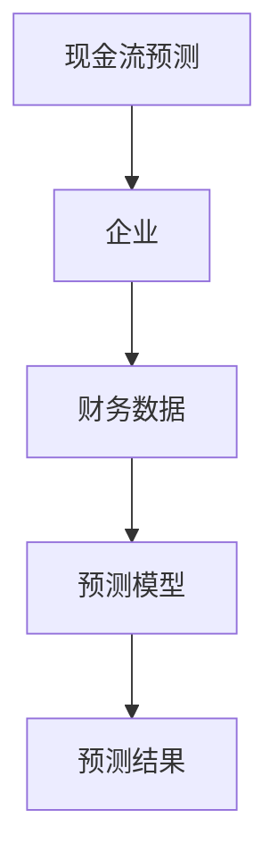
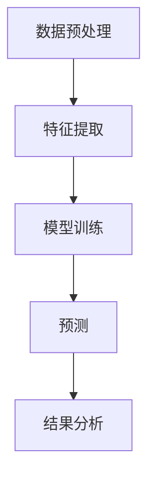
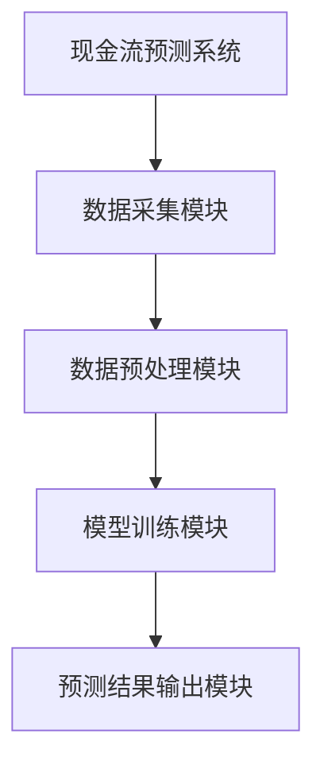
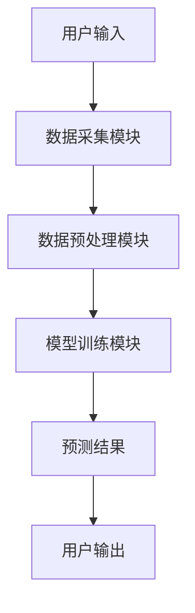

                 


# AI辅助的企业现金流预测

## 关键词：AI，现金流预测，机器学习，深度学习，时间序列分析，企业财务管理

## 摘要：  
随着人工智能技术的飞速发展，企业现金流预测已成为财务管理中的重要工具。本文深入探讨了AI在现金流预测中的应用，从核心概念、算法原理到系统架构，再到项目实战，全面解析了AI如何助力企业优化现金流管理。通过详细的技术分析和案例解读，本文为读者提供了从理论到实践的完整指南，帮助企业更好地应对现金流预测的挑战。

---

# 第一部分：企业现金流预测的背景与挑战

## 第1章：企业现金流预测的背景与挑战

### 1.1 企业现金流预测的重要性

#### 1.1.1 现金流预测的定义与作用
现金流预测是指通过分析历史财务数据和外部因素，预测企业未来一定时期内的现金流入和流出情况。它是企业财务管理的核心内容之一，直接关系到企业的生存与发展。

#### 1.1.2 现金流预测在企业财务管理中的地位
现金流预测是企业制定预算、评估投资项目、优化资金配置的重要依据。准确的现金流预测能够帮助企业规避财务风险，提升资金使用效率。

#### 1.1.3 现金流预测的常见应用场景
- **短期资金规划**：帮助企业合理安排日常运营资金。
- **长期投资决策**：为企业重大项目投资提供资金支持。
- **风险预警**：通过预测现金流波动，提前识别潜在的财务危机。

### 1.2 AI在企业现金流预测中的应用背景

#### 1.2.1 传统现金流预测方法的局限性
传统的现金流预测方法通常依赖于财务人员的经验和简单的统计模型，存在以下问题：
- 数据处理能力有限，难以应对海量数据。
- 预测结果的准确性较低，容易受主观因素影响。
- 对复杂市场变化的适应性较差。

#### 1.2.2 AI技术在预测领域的优势
人工智能技术，尤其是机器学习和深度学习，具有以下显著优势：
- **数据处理能力**：能够处理海量非结构化数据，提取更多有价值的信息。
- **预测准确性**：通过复杂算法捕捉数据中的隐含规律，提升预测精度。
- **自适应性**：能够根据市场变化动态调整预测模型。

#### 1.2.3 企业现金流预测面临的挑战
- 数据质量参差不齐，影响预测结果的准确性。
- 市场环境复杂多变，增加预测难度。
- 数据隐私与安全问题，限制了数据的使用范围。

### 1.3 本章小结  
本章通过分析现金流预测的重要性及其在企业财务管理中的地位，揭示了传统预测方法的局限性，并介绍了AI技术在预测领域的独特优势。同时，总结了企业在现金流预测过程中面临的三大挑战，为后续内容的展开奠定了基础。

---

# 第二部分：现金流预测的核心概念

## 第2章：现金流预测的核心概念

### 2.1 现金流预测的核心要素

#### 2.1.1 现金流的类型与计算方法
企业现金流主要分为三类：
1. **经营活动现金流**：来自企业日常运营的现金流。
2. **投资活动现金流**：来自投资活动的现金流，如购买或出售资产。
3. **筹资活动现金流**：来自企业融资活动的现金流。

#### 2.1.2 影响现金流的主要因素
- **市场环境**：如经济周期、行业趋势等。
- **企业内部管理**：如成本控制、应收账款管理等。
- **外部因素**：如政策变化、市场需求波动等。

#### 2.1.3 现金流预测的边界与外延
现金流预测的边界包括企业的历史财务数据和外部市场数据，外延则涉及预测结果的应用场景。

### 2.2 AI在现金流预测中的关键作用

#### 2.2.1 数据驱动的预测优势
AI技术能够从海量数据中提取特征，发现传统方法难以察觉的规律。

#### 2.2.2 AI算法在时间序列预测中的应用
AI算法，如LSTM（长短期记忆网络）和ARIMA（自回归积分滑动平均模型），在时间序列预测中表现出色。

#### 2.2.3 现金流预测的模型选择与优化
模型选择需要结合企业的具体需求和数据特征，优化过程则需要通过交叉验证等方法进行调整。

### 2.3 核心概念与联系

#### 2.3.1 现金流预测的核心概念原理
现金流预测需要结合企业的历史数据和外部市场信息，利用AI算法进行建模和预测。

#### 2.3.2 现金流预测与企业财务健康度的关系
现金流预测是评估企业财务健康状况的重要指标之一，能够帮助企业识别潜在风险。

#### 2.3.3 现金流预测的ER实体关系图


### 2.4 本章小结  
本章详细介绍了现金流预测的核心要素和AI在其中的作用，通过ER实体关系图展示了现金流预测与企业财务健康度的关系，为后续算法分析奠定了基础。

---

# 第三部分：现金流预测的算法原理

## 第3章：现金流预测的算法原理

### 3.1 时间序列预测算法

#### 3.1.1 ARIMA模型
ARIMA（自回归积分滑动平均模型）是一种广泛应用于时间序列预测的经典算法，适用于具有趋势和季节性特征的数据。

#### 3.1.2 LSTM网络
LSTM（长短期记忆网络）是一种基于循环神经网络的深度学习算法，能够有效捕捉时间序列中的长期依赖关系。

#### 3.1.3 其他时间序列预测方法
包括 Prophet模型和GARCH模型等。

### 3.2 算法原理与流程图

#### 3.2.1 算法流程图


### 3.3 算法实现与代码示例

#### 3.3.1 算法原理的数学模型
- ARIMA模型的数学表达式：
  $$ ARIMA(p, d, q) $$
- LSTM网络的数学模型：
  $$ LSTM(t) = \sigma(W_{f} \cdot [h(t-1), x(t)] + b_f) $$

#### 3.3.2 算法实现的Python代码示例
```python
import numpy as np
import pandas as pd
from sklearn.metrics import mean_absolute_error
from keras.models import Sequential
from keras.layers import LSTM, Dense

# 数据预处理
data = pd.read_csv('cash_flow.csv')
train_data = data.iloc[:100]
test_data = data.iloc[100:]

# 模型训练
model = Sequential()
model.add(LSTM(50, input_shape=(1, 1)))
model.add(Dense(1))
model.compile(optimizer='adam', loss='mse')
model.fit(train_data.values.reshape((100, 1, 1)), train_data.values, epochs=50, batch_size=1)

# 模型预测
predicted = model.predict(test_data.values.reshape((len(test_data), 1, 1)))
```

### 3.4 本章小结  
本章通过分析ARIMA和LSTM两种时间序列预测算法，展示了AI在现金流预测中的技术优势，并通过Python代码示例说明了算法实现的步骤。

---

# 第四部分：现金流预测系统的架构设计

## 第4章：现金流预测系统的架构设计

### 4.1 系统功能设计

#### 4.1.1 数据采集模块
负责收集企业的历史财务数据和外部市场数据。

#### 4.1.2 数据预处理模块
对采集到的数据进行清洗、归一化等处理，确保数据质量。

#### 4.1.3 模型训练模块
基于预处理后的数据，训练AI预测模型。

#### 4.1.4 预测结果输出模块
将模型预测结果以可视化形式呈现，供企业决策者参考。

### 4.2 系统架构设计

#### 4.2.1 系统功能模块的ER实体关系图


#### 4.2.2 系统架构的流程图


### 4.3 本章小结  
本章通过系统功能设计和架构设计，展示了AI辅助现金流预测的整体流程，为后续的项目实战提供了理论支持。

---

# 第五部分：现金流预测的项目实战

## 第5章：现金流预测的项目实战

### 5.1 环境配置与数据准备

#### 5.1.1 环境配置
安装必要的Python库，如TensorFlow、Keras、Pandas等。

#### 5.1.2 数据准备
收集企业的历史财务数据和外部市场数据，存储为CSV格式。

### 5.2 系统核心实现

#### 5.2.1 数据预处理
对数据进行清洗、归一化等处理，确保数据质量。

#### 5.2.2 模型训练
基于预处理后的数据，训练AI预测模型。

#### 5.2.3 模型评估
通过均绝对误差（MAE）等指标评估模型的预测精度。

### 5.3 项目实战的代码实现

#### 5.3.1 数据预处理代码
```python
import pandas as pd
import numpy as np

data = pd.read_csv('cash_flow.csv')
data = data.dropna()
data = (data - data.mean()) / data.std()
```

#### 5.3.2 模型训练代码
```python
from keras.models import Sequential
from keras.layers import LSTM, Dense

model = Sequential()
model.add(LSTM(50, input_shape=(1, 1)))
model.add(Dense(1))
model.compile(optimizer='adam', loss='mse')
model.fit(data.values.reshape((len(data), 1, 1)), data.values, epochs=50, batch_size=1)
```

#### 5.3.3 模型预测与结果分析
```python
predicted = model.predict(test_data.values.reshape((len(test_data), 1, 1)))
print("预测结果:", predicted)
print("实际结果:", test_data.values)
print("预测误差:", mean_absolute_error(predicted, test_data.values))
```

### 5.4 本章小结  
本章通过具体的项目实战，详细讲解了AI辅助现金流预测的实现过程，包括环境配置、数据准备、模型训练和结果分析。

---

# 第六部分：总结与展望

## 第6章：总结与展望

### 6.1 本章小结
本文从企业现金流预测的背景与挑战出发，详细探讨了AI在其中的应用，介绍了现金流预测的核心概念和算法原理，并通过项目实战展示了AI辅助现金流预测的实现过程。

### 6.2 未来展望
随着AI技术的不断进步，现金流预测将更加智能化和精准化。未来的研究方向包括：
- **多模型融合**：结合多种AI算法提升预测精度。
- **实时预测**：实现现金流的实时预测，提升企业的应变能力。
- **可解释性增强**：提高预测模型的可解释性，便于企业理解和应用。

### 6.3 最佳实践Tips
- 数据质量是预测结果准确性的关键，必须重视数据清洗和预处理。
- 在选择算法时，需要结合企业的具体需求和数据特征。
- 定期更新模型，确保预测结果的有效性。

### 6.4 本章小结  
本章总结了全文的主要内容，并展望了未来的研究方向，同时给出了最佳实践的建议，为读者提供了进一步学习和实践的方向。

---

# 作者：AI天才研究院 & 禅与计算机程序设计艺术

