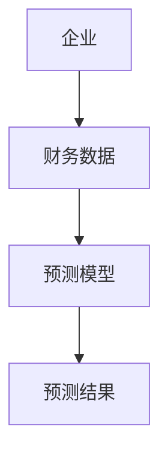
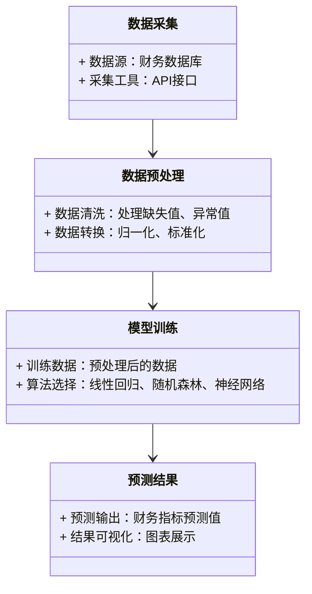

                 


# AI辅助的企业财务预测模型

> **关键词**：AI、财务预测、机器学习、企业财务、数据建模

> **摘要**：本文探讨了如何利用人工智能技术构建企业财务预测模型，涵盖背景介绍、核心概念、算法原理、系统架构、项目实战及最佳实践。通过详细分析财务数据特征、模型选择及应用场景，结合线性回归、随机森林、神经网络等算法，提供从理论到实践的全面指导，帮助企业实现高效准确的财务预测。

---

# 第一部分: AI辅助的企业财务预测模型概述

## 第1章: 问题背景与目标

### 1.1 问题背景

#### 1.1.1 企业财务预测的重要性
企业财务预测是现代管理决策的核心工具之一，它帮助企业预测未来财务状况，优化资源配置，规避风险。然而，传统财务预测方法依赖人工分析，存在效率低、精度差的问题。

#### 1.1.2 传统财务预测的局限性
传统方法通常基于历史数据和经验判断，难以捕捉复杂市场环境中的细微变化，预测结果可能受主观因素影响较大。

#### 1.1.3 AI技术在财务预测中的应用潜力
人工智能技术，尤其是机器学习算法，能够处理海量数据，发现复杂模式，显著提升预测精度和效率。

### 1.2 问题描述

#### 1.2.1 财务预测的核心问题
财务预测涉及对企业未来收入、成本、利润等关键指标的预测，这些指标往往受到多种因素的影响。

#### 1.2.2 数据特征与挑战
财务数据通常具有时间序列特性，可能存在缺失值、异常值等问题，需要进行数据清洗和预处理。

#### 1.2.3 解决思路与边界
利用AI技术构建预测模型，基于历史数据，通过训练模型预测未来财务状况，边界包括模型的输入输出范围、适用场景等。

## 第2章: 核心概念与联系

### 2.1 核心概念

#### 2.1.1 数据特征
财务数据包括收入、支出、利润等，时间序列数据需要考虑趋势、周期性等因素。

#### 2.1.2 模型类型
常用模型包括线性回归、随机森林、神经网络等，不同模型适用于不同场景。

#### 2.1.3 应用场景
企业财务预测可应用于财务报表预测、现金流预测、信用评分等领域。

### 2.2 概念对比表
| 概念 | 描述 | 示例 |
|------|------|------|
| 数据特征 | 影响财务预测的关键变量 | 收入、成本、利润 |
| 模型类型 | 不同AI算法在财务预测中的应用 | 线性回归、随机森林、神经网络 |
| 应用场景 | 财务预测的具体业务场景 | 财务报表预测、现金流预测、信用评分 |

### 2.3 实体关系图


---

# 第二部分: 算法原理与数学模型

## 第3章: 常见算法原理

### 3.1 线性回归

#### 3.1.1 算法原理
线性回归假设目标变量与特征变量之间存在线性关系，通过最小化预测值与实际值的平方差之和来确定模型参数。

#### 3.1.2 数学模型
$$ y = \beta_0 + \beta_1 x_1 + \beta_2 x_2 + \dots + \beta_n x_n $$

#### 3.1.3 示例代码
```python
import numpy as np
from sklearn.linear_model import LinearRegression

# 示例数据
X = np.array([[1], [2], [3], [4]])
y = np.array([2, 4, 6, 8])

# 训练模型
model = LinearRegression()
model.fit(X, y)

# 预测
print(model.predict([[5]]))  # 输出：[10]
```

---

## 第4章: 系统分析与架构设计

### 4.1 系统功能设计

#### 4.1.1 领域模型


---

## 第5章: 项目实战

### 5.1 环境安装

#### 5.1.1 安装Python环境
建议使用Anaconda，包含常用机器学习库。

#### 5.1.2 安装依赖库
```bash
pip install numpy pandas scikit-learn matplotlib
```

### 5.2 核心代码实现

#### 5.2.1 数据采集与预处理
```python
import pandas as pd
from sklearn.model_selection import train_test_split
from sklearn.preprocessing import StandardScaler

# 加载数据
data = pd.read_csv('financial_data.csv')

# 数据清洗
data = data.dropna()
data = data.drop_duplicates()

# 特征选择
features = ['revenue', 'expenses', 'assets']
target = 'profit'

X = data[features]
y = data[target]

# 数据标准化
scaler = StandardScaler()
X_scaled = scaler.fit_transform(X)

# 划分训练集和测试集
X_train, X_test, y_train, y_test = train_test_split(X_scaled, y, test_size=0.2, random_state=42)
```

#### 5.2.2 模型训练与评估
```python
from sklearn.linear_model import LinearRegression
from sklearn.metrics import mean_squared_error, r2_score

# 训练模型
model = LinearRegression()
model.fit(X_train, y_train)

# 预测
y_pred = model.predict(X_test)

# 评估
 mse = mean_squared_error(y_test, y_pred)
 r2 = r2_score(y_test, y_pred)
 print(f'MSE: {mse}, R²: {r2}')
```

### 5.3 案例分析

#### 5.3.1 数据分析
使用历史财务数据，分析收入与利润之间的关系，确定最佳预测模型。

#### 5.3.2 模型优化
通过交叉验证选择最佳模型参数，提升预测精度。

#### 5.3.3 结果解读
解读模型预测结果，为企业决策提供支持。

---

## 第6章: 最佳实践与小结

### 6.1 最佳实践

- **数据处理**：确保数据质量，进行清洗和预处理。
- **模型选择**：根据数据特征选择合适的算法。
- **性能优化**：通过超参数调优提升模型表现。

### 6.2 小结

本文详细介绍了AI辅助的企业财务预测模型的构建过程，从理论到实践，帮助读者掌握关键技术和应用方法。

### 6.3 注意事项

- 数据隐私与安全需严格控制。
- 模型部署需考虑计算资源和运行环境。

---

# 作者：AI天才研究院 & 禅与计算机程序设计艺术

---

