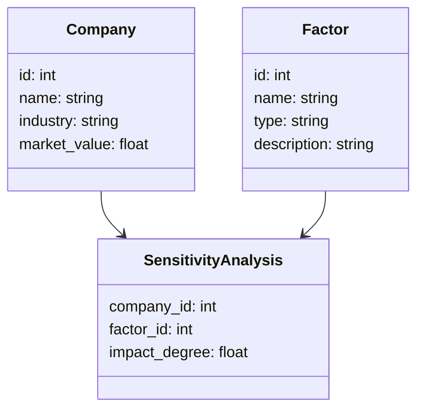
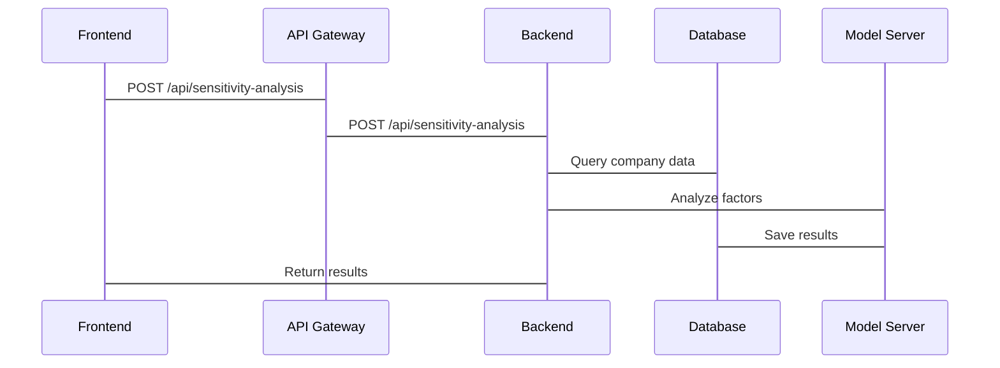

                 


# AI辅助的公司估值敏感性分析

> 关键词：AI辅助，公司估值，敏感性分析，机器学习，金融分析

> 摘要：本文探讨如何利用人工智能技术提升公司估值的敏感性分析效率与准确性。通过分析敏感性分析的数学模型、AI算法的优化方法，以及系统架构设计，展示AI在金融领域的强大应用潜力。文章结合实际案例，详细讲解实现步骤与应用效果，为金融从业者提供实用的参考。

---

## 第一部分：AI辅助的公司估值敏感性分析背景介绍

### 第1章：问题背景与描述

#### 1.1 问题背景
##### 1.1.1 传统公司估值方法的局限性
传统的公司估值方法依赖于财务报表分析、DCF模型等，但存在以下问题：
- 数据依赖性强，手动计算耗时且易出错。
- 对多变量的敏感性分析耗时，难以快速迭代。
- 无法有效处理非结构化数据，如市场情绪、新闻影响等。

##### 1.1.2 AI技术在金融领域的应用趋势
AI技术在金融领域的应用日益广泛，特别是在数据处理、模式识别和预测分析方面展现出巨大潜力。AI能够处理海量数据，发现传统方法难以察觉的模式，提高分析效率和准确性。

##### 1.1.3 敏感性分析的重要性
敏感性分析用于评估多个变量变化对公司估值的影响。通过分析，投资者可以识别关键驱动因素，优化投资决策，降低风险。

#### 1.2 问题描述
##### 1.2.1 公司估值的基本概念
公司估值是估算公司价值的过程，常用方法包括DCF模型、市盈率法等。敏感性分析评估各个变量变化对估值的影响。

##### 1.2.2 敏感性分析的定义
敏感性分析是研究多个变量变化对公司估值影响的方法，帮助识别关键变量和风险。

##### 1.2.3 AI辅助敏感性分析的必要性
AI能够快速处理大量数据，优化模型参数，提高敏感性分析的效率和准确性。

#### 1.3 问题解决
##### 1.3.1 AI如何提升敏感性分析效率
AI通过自动化数据处理和模型优化，缩短分析时间，提高结果准确性。

##### 1.3.2 数据驱动的决策优势
AI利用大数据分析，提供更全面的视角，帮助投资者做出更明智的决策。

##### 1.3.3 结合AI的多因素分析方法
AI驱动的多因素模型能够同时考虑多个变量，生成更精确的敏感性分析结果。

#### 1.4 边界与外延
##### 1.4.1 适用场景与限制
AI辅助敏感性分析适用于数据充足、变量较多的场景，但需注意模型的局限性和数据质量。

##### 1.4.2 相关概念的区分
区分敏感性分析、情景分析和蒙特卡洛模拟，明确各自的应用范围和方法。

##### 1.4.3 技术边界与未来发展
AI技术在金融领域的应用仍有提升空间，未来将更加智能化和自动化。

#### 1.5 核心要素组成
##### 1.5.1 数据来源与处理
数据来源包括财务报表、市场数据、新闻等，需清洗、整合和特征提取。

##### 1.5.2 模型构建与优化
构建数学模型，利用AI算法优化参数，提高分析精度。

##### 1.5.3 结果分析与可视化
通过可视化工具展示分析结果，帮助用户直观理解变量影响。

---

## 第二部分：核心概念与联系

### 第2章：敏感性分析与公司估值的核心概念

#### 2.1 敏感性分析的原理
##### 2.1.1 变量变化对结果的影响
敏感性分析研究变量变化如何影响结果，通常通过改变变量值，观察结果变化。

##### 2.1.2 单因素与多因素分析
单因素分析逐一改变变量，多因素分析同时改变多个变量，评估整体影响。

##### 2.1.3 线性与非线性模型
线性模型假设变量与结果呈线性关系，非线性模型关系更复杂，AI适合处理非线性情况。

#### 2.2 公司估值的基本方法
##### 2.2.1 市盈率法
通过市盈率倍数评估公司价值，公式为：目标股价 = 市盈率 × 净利润。

##### 2.2.2 现金流折现法
DCF模型将未来现金流折现，计算公司价值，公式为：企业价值 = ∑(CF_t / (1 + r)^t)。

##### 2.2.3 股权自由现金流法
计算股权自由现金流，折现至现值，评估公司价值。

#### 2.3 AI在敏感性分析中的应用
##### 2.3.1 机器学习模型的引入
使用回归、随机森林等机器学习模型，预测变量变化对估值的影响。

##### 2.3.2 数据挖掘与特征选择
通过数据挖掘识别重要变量，优化分析效率。

##### 2.3.3 自动化分析与优化
AI自动化处理分析流程，优化模型参数，提高效率。

### 第3章：核心概念的属性特征对比

#### 3.1 敏感性分析与公司估值的对比
| 属性       | 敏感性分析           | 公司估值             |
|------------|--------------------|--------------------|
| 目标       | 识别变量影响         | 估算公司价值         |
| 方法       | 变量变化分析         | 财务模型计算         |
| 数据需求   | 需要变量数据         | 需要财务数据         |

#### 3.2 AI辅助与传统方法的对比
| 属性       | 传统方法            | AI辅助方法          |
|------------|---------------------|---------------------|
| 效率       | 较低，依赖手动计算    | 高，自动化处理       |
| 准确性     | 受人为因素影响较大   | 更高，模型优化       |
| 可扩展性   | 较差，变量有限       | 更好，支持多变量分析 |

#### 3.3 ER实体关系图
```mermaid
er
  Company: id, name, industry, market_value
  Factor: id, name, type, description
  SensitivityAnalysis: company_id, factor_id, impact_degree
```

---

## 第三部分：算法原理讲解

### 第4章：敏感性分析的数学模型

#### 4.1 线性回归模型
$$ y = \beta_0 + \beta_1x_1 + \beta_2x_2 + \ldots + \beta_nx_n + \epsilon $$
其中，y为目标变量，x_i为自变量，β系数表示变量影响程度。

#### 4.2 机器学习模型
随机森林和神经网络等模型可用于处理非线性关系，提升预测精度。

#### 4.3 算法实现步骤
1. 数据预处理：清洗、标准化。
2. 模型训练：选择模型并训练。
3. 敏感性分析：计算变量影响程度。

#### 4.4 代码示例
```python
import pandas as pd
from sklearn.ensemble import RandomForestRegressor
from sklearn.metrics import mean_absolute_error

# 数据加载与预处理
data = pd.read_csv('company_data.csv')
X = data.drop('valuation', axis=1)
y = data['valuation']

# 模型训练
model = RandomForestRegressor(n_estimators=100)
model.fit(X, y)

# 计算重要性
importances = model.feature_importances_
print(importances)
```

---

## 第四部分：系统分析与架构设计

### 第5章：系统架构设计

#### 5.1 问题场景介绍
构建一个AI辅助的公司估值系统，帮助用户快速进行敏感性分析。

#### 5.2 领域模型设计


#### 5.3 系统架构图


#### 5.4 系统接口设计
接口定义：
- POST /api/sensitivity-analysis: 接收公司数据，返回分析结果。
- GET /api/results: 获取分析结果。

#### 5.5 系统交互流程


---

## 第五部分：项目实战

### 第6章：AI辅助的公司估值敏感性分析实战

#### 6.1 环境安装
安装Python、Pandas、Scikit-learn等库：
```bash
pip install numpy pandas scikit-learn
```

#### 6.2 核心代码实现
```python
import pandas as pd
from sklearn.ensemble import RandomForestRegressor
from sklearn.metrics import mean_absolute_error

def load_data():
    return pd.read_csv('company_data.csv')

def train_model(X, y):
    model = RandomForestRegressor(n_estimators=100)
    model.fit(X, y)
    return model

def analyze_sensitivity(model, X, y):
    importances = model.feature_importances_
    print(importances)

data = load_data()
X = data.drop('valuation', axis=1)
y = data['valuation']
model = train_model(X, y)
analyze_sensitivity(model, X, y)
```

#### 6.3 案例分析
使用某科技公司数据，分析各因素对估值的影响，识别关键驱动因素。

#### 6.4 项目小结
总结项目成果，分析遇到的问题，提出改进建议。

---

## 第六部分：最佳实践与总结

### 第7章：最佳实践与小结

#### 7.1 最佳实践
- 数据清洗与特征工程至关重要。
- 选择合适的模型，避免过拟合。
- 结果可视化，便于理解和决策。

#### 7.2 小结
AI辅助的公司估值敏感性分析显著提高了分析效率和准确性，为投资决策提供了有力支持。

#### 7.3 注意事项
- 数据质量和完整性影响结果。
- 模型选择需根据具体场景。
- 结果需结合实际情况，避免过度依赖模型。

#### 7.4 拓展阅读
推荐相关书籍和资源，鼓励深入学习。

---

## 作者信息

作者：AI天才研究院/AI Genius Institute & 禅与计算机程序设计艺术/Zen And The Art of Computer Programming

---

这篇文章详细介绍了AI辅助公司估值敏感性分析的背景、核心概念、算法原理、系统设计、项目实战和最佳实践，为读者提供了全面而深入的指导。

