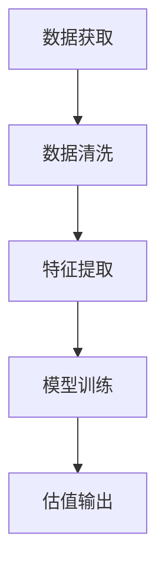
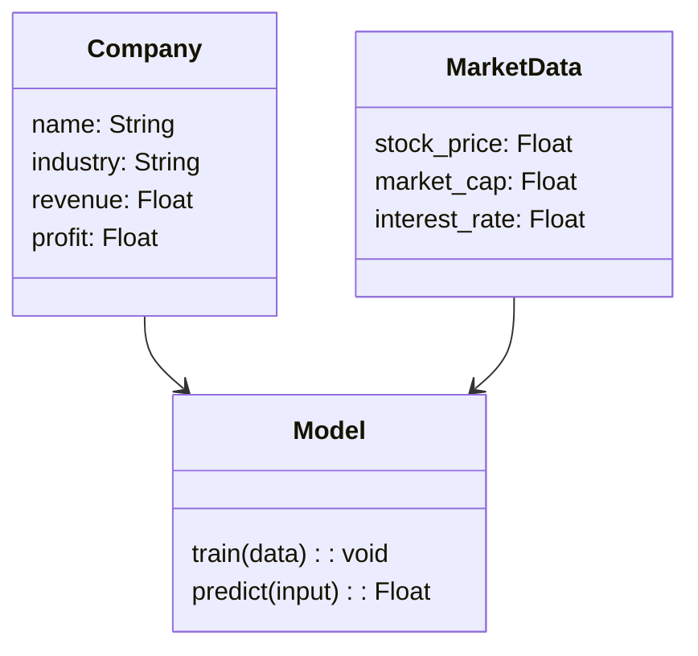
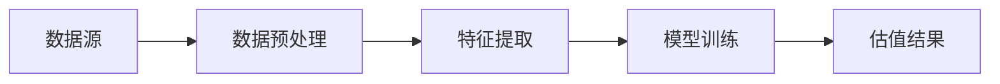
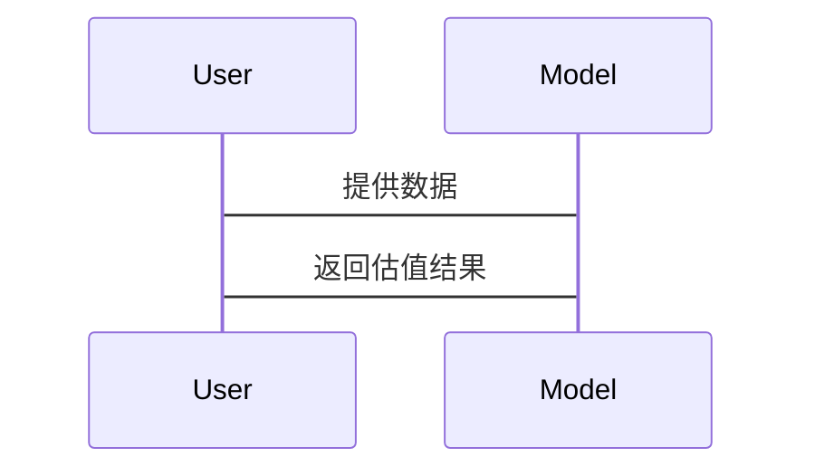

                 


# AI辅助的公司估值模型

## 关键词：公司估值，AI辅助，机器学习，金融分析，大数据

## 摘要：  
公司估值是企业管理和投资决策中的核心问题之一。传统估值方法依赖于财务指标和市场分析，但随着人工智能技术的发展，AI辅助的公司估值模型正逐渐成为一种更高效、更准确的解决方案。本文将详细探讨AI技术在公司估值中的应用，包括核心概念、算法原理、系统架构设计以及实际案例分析，帮助读者理解如何利用AI技术提升公司估值的准确性和效率。

---

# 第1章: 公司估值模型概述

## 1.1 公司估值的基本概念  
### 1.1.1 什么是公司估值  
公司估值是指通过对公司财务数据、市场环境、行业竞争状况等因素的分析，估算公司价值的过程。公司估值的结果通常用于企业并购、投资决策、股权定价等场景。  

### 1.1.2 公司估值的主要方法  
传统公司估值方法主要包括以下几种：  
1. **相对估值法**：基于可比公司或行业的平均指标（如市盈率、市净率）进行估值。  
2. **绝对估值法**：通过DCF（Discounted Cash Flow，折现现金流）模型估算公司未来现金流的现值。  
3. **资产重置法**：基于公司资产的重置成本进行估值。  

### 1.1.3 公司估值的常见应用场景  
- 企业并购与出售  
- 投资决策（如PE投资、风险投资）  
- 股权激励计划  
- 上市公司市值管理  

## 1.2 传统公司估值方法的局限性  
### 1.2.1 市盈率法的局限性  
市盈率法依赖于市场平均值，但忽略了公司自身的财务状况和行业特点。  

### 1.2.2 市净率法的局限性  
市净率法适用于重资产行业，但在轻资产行业（如互联网公司）表现不佳。  

### 1.2.3 股权自由现金流折现法的局限性  
该方法需要对未来现金流进行精准预测，但在实际操作中存在较大的不确定性。  

## 1.3 AI技术在公司估值中的作用  
### 1.3.1 AI技术如何提升公司估值的准确性  
AI技术可以通过分析海量数据（如财务数据、市场数据、新闻数据）发现传统方法难以捕捉的模式和关联性，从而提高估值的准确性。  

### 1.3.2 AI技术如何提高估值效率  
AI模型可以自动化处理数据、训练模型并输出结果，显著提高了估值的效率。  

### 1.3.3 AI技术在复杂场景中的优势  
在行业竞争激烈、数据复杂的情况下，AI技术能够通过深度学习模型捕捉非线性关系，提供更精准的估值结果。  

---

# 第2章: AI辅助公司估值的核心概念与联系  

## 2.1 AI辅助公司估值的核心原理  
### 2.1.1 数据驱动的估值模型  
AI辅助的公司估值模型基于大数据分析，利用机器学习算法对数据进行建模和预测。  

### 2.1.2 机器学习在估值中的应用  
机器学习算法（如随机森林、神经网络）可以自动提取特征并进行分类或回归预测。  

### 2.1.3 自然语言处理在公司信息分析中的应用  
NLP技术可以分析公司财报、新闻等非结构化数据，提取关键信息用于估值。  

## 2.2 核心概念对比表格  
下表对比了传统估值方法与AI辅助估值方法的核心差异：  

| 对比维度         | 传统估值方法          | AI辅助估值方法          |  
|------------------|-----------------------|-------------------------|  
| 数据来源         | 财务数据为主           | 财务数据+新闻数据+市场数据 |  
| 模型复杂度       | 简单，线性关系         | 复杂，非线性关系         |  
| 预测精度         | 较低                  | 较高                    |  
| 处理效率         | 人工主导，效率低       | 自动化处理，效率高       |  

## 2.3 ER实体关系图与Mermaid流程图  
### 2.3.1 公司估值模型的实体关系图  
```mermaid
erd
    左右方向
    左侧
        公司(Company)
            name
            industry
            revenue
            profit
    右侧
        市场数据(Market Data)
            stock_price
            market_cap
            interest_rate
    关系
        Company --> Market Data: 关联
```

### 2.3.2 AI辅助估值流程的Mermaid图  


---

# 第3章: AI辅助公司估值的算法原理  

## 3.1 回归分析在估值中的应用  
### 3.1.1 线性回归模型  
线性回归模型通过最小二乘法拟合数据，适用于简单的线性关系。  
$$ y = \beta_0 + \beta_1x + \epsilon $$  

### 3.1.2 逻辑回归模型  
逻辑回归模型用于二分类问题，适用于判断公司是否被高估或低估。  
$$ P(y=1|x) = \frac{1}{1 + e^{-\beta x}} $$  

### 3.1.3 回归模型的优缺点  
- 优点：简单易懂，计算速度快。  
- 缺点：无法捕捉非线性关系，对异常值敏感。  

## 3.2 时间序列分析在估值中的应用  
### 3.2.1 ARIMA模型  
ARIMA模型适用于时间序列数据的预测。  
$$ ARIMA(p, d, q) $$  

### 3.2.2 LSTM模型  
LSTM模型通过长短期记忆网络捕捉时间序列中的长期依赖关系。  

### 3.2.3 时间序列分析的数学公式  
$$ \hat{y}_t = \alpha y_{t-1} + (1-\alpha) \hat{y}_{t-1} $$  

## 3.3 机器学习模型在估值中的应用  
### 3.3.1 随机森林模型  
随机森林模型通过集成学习提高模型的准确性和鲁棒性。  

### 3.3.2 支持向量机模型  
支持向量机模型适用于高维数据的分类和回归问题。  

### 3.3.3 神经网络模型  
神经网络模型通过多层感知机捕捉复杂的非线性关系。  

---

# 第4章: 数学模型与公式详解  

## 4.1 传统估值模型的数学公式  
### 4.1.1 市盈率模型  
$$ P/E = \frac{P}{E} $$  
其中，P为股价，E为每股收益。  

### 4.1.2 市净率模型  
$$ P/B = \frac{P}{B} $$  
其中，P为股价，B为每股净资产。  

### 4.1.3 股权自由现金流模型  
$$ FV = \sum_{t=1}^{n} \frac{CF_t}{(1+r)^t} + \frac{TV}{(1+r)^n} $$  
其中，CF_t为第t年的自由现金流，r为折现率，TV为终值。  

## 4.2 AI辅助估值模型的数学公式  
### 4.2.1 线性回归模型公式  
$$ y = \beta_0 + \beta_1x + \epsilon $$  

### 4.2.2 神经网络模型公式  
$$ y = f(Wx + b) $$  
其中，W为权重矩阵，x为输入向量，b为偏置，f为激活函数。  

### 4.2.3 时间序列  
$$ ARIMA(p, d, q) $$  

---

# 第5章: 系统分析与架构设计  

## 5.1 问题场景介绍  
本文将设计一个基于AI的公司估值系统，用于分析科技公司的估值问题。  

## 5.2 系统功能设计  
### 5.2.1 领域模型Mermaid类图  


### 5.2.2 系统架构设计Mermaid架构图  


### 5.2.3 系统接口设计  
- 输入接口：公司财务数据、市场数据  
- 输出接口：估值结果、模型预测值  

### 5.2.4 系统交互Mermaid序列图  


---

# 第6章: 项目实战  

## 6.1 环境安装  
- Python 3.8+  
- NumPy、Pandas、Scikit-learn、XGBoost  

## 6.2 系统核心实现源代码  
```python
import pandas as pd
from sklearn.ensemble import RandomForestRegressor
from sklearn.metrics import mean_squared_error

# 数据加载
data = pd.read_csv('company_valuation.csv')

# 特征选择
features = ['revenue', 'profit', 'market_cap']
target = 'valuation'

X = data[features]
y = data[target]

# 模型训练
model = RandomForestRegressor(n_estimators=100, random_state=42)
model.fit(X, y)

# 模型预测
predictions = model.predict(X)
print(mean_squared_error(y, predictions))
```

## 6.3 代码应用解读与分析  
- 数据加载：从CSV文件中读取公司估值数据。  
- 特征选择：选择营收、利润、市值作为特征。  
- 模型训练：使用随机森林回归模型进行训练。  
- 模型预测：对测试数据进行预测并计算均方误差。  

## 6.4 实际案例分析  
以某科技公司为例，使用上述代码进行估值预测，并与实际估值进行对比，分析模型的准确性和鲁棒性。  

---

# 第7章: 总结与展望  

## 7.1 总结  
本文详细探讨了AI辅助公司估值模型的核心概念、算法原理和系统架构设计，并通过实际案例展示了模型的应用。AI技术的引入显著提高了公司估值的准确性和效率。  

## 7.2 注意事项  
- 数据质量对模型性能影响重大，需确保数据清洗和特征工程的准确性。  
- 模型的可解释性是实际应用中的重要考量，需关注模型的透明性和易用性。  

## 7.3 拓展阅读  
- 《机器学习实战》  
- 《深度学习入门：基于Python的实现》  

---

# 作者：AI天才研究院 & 禅与计算机程序设计艺术

