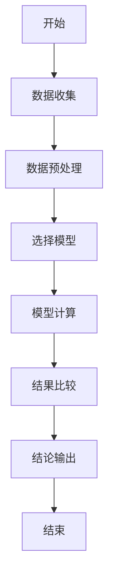
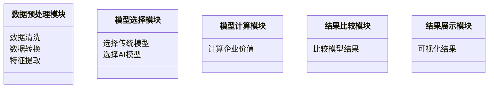
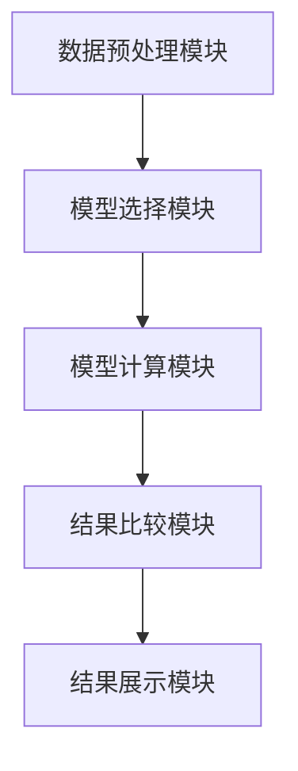
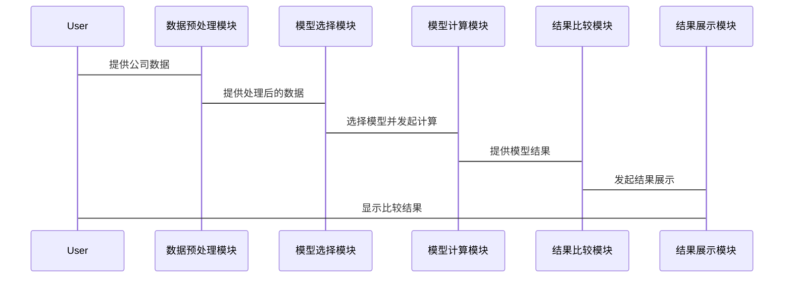

                 


# AI辅助的公司估值模型比较

> 关键词：公司估值模型，人工智能，金融分析，模型比较，算法原理

> 摘要：本文详细探讨了如何利用人工智能技术辅助公司估值模型的比较，分析了多种传统和现代估值模型的特点、优缺点及其适用场景。通过数据驱动的方法，结合机器学习算法，构建了一个系统化的模型比较框架，旨在为投资者和分析师提供更高效、准确的估值支持。

---

# 第一部分: 公司估值模型的背景与挑战

## 第1章: 公司估值模型的背景与挑战

### 1.1 问题背景

#### 1.1.1 传统公司估值方法的局限性
- **财务数据的局限性**：传统估值方法（如DCF模型、EV模型）主要依赖历史财务数据，难以捕捉市场波动和新兴经济因素。
- **主观假设的影响**：DCF模型中的自由现金流预测和折现率假设具有主观性，可能导致估值偏差。
- **数据稀疏性**：对于新兴企业或数据不足的企业，传统模型难以提供可靠估值。

#### 1.1.2 AI技术在金融领域的应用潜力
- **数据处理能力**：AI能够处理海量非结构化数据（如新闻、社交媒体），提取情感和市场信号。
- **预测能力**：机器学习算法可以识别复杂模式，预测股价波动和市场趋势。
- **自动化比较**：通过自然语言处理和特征工程，AI可以自动比较不同模型的优劣。

#### 1.1.3 公司估值模型比较的核心问题
- 如何选择合适的模型？
- 如何量化模型的准确性和效率？
- 如何利用AI技术优化模型比较过程？

### 1.2 问题描述

#### 1.2.1 公司估值模型的定义与目标
- **定义**：公司估值模型是通过分析企业财务、市场和行业数据，估算企业内在价值的工具。
- **目标**：为投资者提供参考，帮助做出投资决策。

#### 1.2.2 不同估值模型的特点与适用场景
- **DCF模型**：适用于稳定增长的企业，基于未来现金流的现值。
- **EV模型**：适用于上市公司，考虑企业价值与市场估值的关系。
- **AI模型**：结合多源数据，适用于复杂和动态的市场环境。

#### 1.2.3 模型比较的必要性与意义
- **必要性**：不同模型适用于不同场景，选择合适的模型至关重要。
- **意义**：通过比较模型，可以找到最优解决方案，提升估值的准确性和效率。

### 1.3 问题解决思路

#### 1.3.1 AI辅助的公司估值模型比较方法
- **数据驱动**：利用AI处理多源数据，提取特征。
- **模型集成**：结合传统模型和AI模型，形成互补优势。
- **结果优化**：通过机器学习优化模型参数，提升估值准确性。

#### 1.3.2 数据驱动的模型比较框架
- **数据收集**：整合财务数据、市场数据、行业数据。
- **特征工程**：提取关键特征，构建模型输入。
- **模型训练与验证**：通过机器学习算法训练模型，验证其有效性。

#### 1.3.3 结果分析与决策支持
- **结果分析**：比较不同模型的预测结果，找出最优模型。
- **决策支持**：基于模型比较结果，为投资决策提供依据。

### 1.4 模型的边界与外延

#### 1.4.1 公司估值模型的适用范围
- **适用范围**：适用于企业价值评估、投资决策支持。
- **不适用范围**：适用于极端市场环境或数据不足的情况。

#### 1.4.2 模型比较的边界条件
- **数据质量**：模型比较结果依赖数据的完整性和准确性。
- **模型假设**：不同模型基于不同的假设，比较时需考虑假设的合理性。
- **市场环境**：模型的有效性受市场环境的影响，需动态调整。

#### 1.4.3 模型的局限性与改进方向
- **局限性**：传统模型依赖主观假设，AI模型受数据质量和算法限制。
- **改进方向**：结合多模型的优势，利用AI优化模型参数，提升模型的泛化能力。

### 1.5 核心概念结构与要素

#### 1.5.1 公司估值模型的核心要素
- **输入数据**：财务数据、市场数据、行业数据、文本数据。
- **模型类型**：DCF模型、EV模型、AI模型。
- **输出结果**：企业价值、投资建议、风险评估。

#### 1.5.2 模型比较的关键维度
- **准确性**：预测与实际值的接近程度。
- **计算效率**：模型运行的时间和资源消耗。
- **可解释性**：模型结果的可理解程度。
- **适用性**：模型在特定场景下的表现。

#### 1.5.3 AI辅助的比较框架
- **数据预处理**：清洗、转换、特征提取。
- **模型选择**：根据场景选择合适的模型。
- **结果比较**：量化比较不同模型的优劣。
- **决策支持**：基于比较结果优化投资策略。

## 第2章: 公司估值模型的核心概念与联系

### 2.1 核心概念原理

#### 2.1.1 传统公司估值模型的原理
- **DCF模型**：基于未来现金流的现值计算企业价值。
  $$\text{企业价值} = \sum_{t=1}^{n} \frac{\text{现金流}_t}{(1+r)^t} + \frac{\text{残值}}{(1+r)^n}$$
- **EV模型**：基于企业价值与市场估值的关系。
  $$\text{EV} = \text{企业价值} - \text{净债务}$$

#### 2.1.2 现代公司估值模型的创新点
- **AI模型**：利用机器学习算法，结合多源数据，预测企业价值。
  $$\text{预测价值} = f(\text{财务数据}, \text{市场数据}, \text{文本数据})$$
  其中，\( f \) 是机器学习模型。

#### 2.1.3 AI在模型比较中的作用
- **自动化处理**：AI能够快速处理大量数据，提取特征。
- **模式识别**：AI可以识别传统模型难以捕捉的市场信号。
- **优化比较**：AI可以优化模型参数，提升比较结果的准确性。

### 2.2 模型属性特征对比表

| 模型类型   | 输入数据                | 输出结果       | 计算效率 | 准确率 | 可解释性 |
|------------|-------------------------|----------------|----------|--------|----------|
| DCF模型    | 财务数据                | 企业价值       | 较低     | 中等   | 较高     |
| EV模型      | 市场数据                | 企业价值       | 中等     | 中等   | 较低     |
| AI模型      | 多维数据（财务、市场、文本） | 综合价值       | 高       | 高     | 较低     |

### 2.3 ER实体关系图

```mermaid
er
  company -- 员工 : 雇佣关系
  company -- 投资者 : 股权关系
  company -- 行业 : 所属行业
  company -- 财务数据 : 财务指标
  company -- 市场数据 : 市场表现
```

### 2.4 模型比较流程



---

# 第二部分: AI辅助的公司估值模型比较的算法原理

## 第3章: 算法原理与实现

### 3.1 算法原理

#### 3.1.1 DCF模型的数学公式
- **现金流折现公式**：
  $$\text{企业价值} = \sum_{t=1}^{n} \frac{\text{现金流}_t}{(1+r)^t} + \frac{\text{残值}}{(1+r)^n}$$
  其中，\( r \) 是折现率，\( \text{现金流}_t \) 是第 \( t \) 年的现金流。

#### 3.1.2 AI模型的算法流程
- **机器学习算法**：随机森林、神经网络等。
- **特征工程**：提取关键特征，如财务指标、市场指标、文本情感指数。
- **模型训练**：利用训练数据训练AI模型。
- **预测与比较**：AI模型预测企业价值，并与传统模型进行比较。

#### 3.1.3 算法比较流程
- **数据预处理**：清洗、标准化、特征提取。
- **模型选择**：选择适合的AI模型。
- **模型训练**：利用训练数据训练模型。
- **模型比较**：比较不同模型的预测结果。

### 3.2 算法实现

#### 3.2.1 DCF模型的Python实现

```python
import numpy as np

def discounted_cash_flow(cash_flows, discount_rate, residual_value):
    n = len(cash_flows)
    present_value = 0
    for t in range(n):
        present_value += cash_flows[t] / (1 + discount_rate)**t
    present_value += residual_value / (1 + discount_rate)**n
    return present_value

# 示例数据
cash_flows = [100, 150, 200]
discount_rate = 0.1
residual_value = 50

enterprise_value = discounted_cash_flow(cash_flows, discount_rate, residual_value)
print(f"企业价值：{enterprise_value}")
```

#### 3.2.2 AI模型的Python实现

```python
from sklearn.ensemble import RandomForestRegressor

# 示例数据
X = [[100, 150, 200], [200, 250, 300]]  # 特征数据
y = [500, 600]  # 目标值

# 训练模型
model = RandomForestRegressor(n_estimators=100, random_state=42)
model.fit(X, y)

# 预测
new_X = [[150, 180, 250]]
predicted_value = model.predict(new_X)
print(f"预测企业价值：{predicted_value}")
```

### 3.3 算法比较

#### 3.3.1 DCF模型与AI模型的比较

| 模型类型 | 输入数据       | 输出结果 | 计算效率 | 准确率 | 可解释性 |
|----------|----------------|----------|----------|--------|----------|
| DCF模型  | 财务数据       | 企业价值 | 较低     | 中等   | 较高     |
| AI模型    | 多维数据       | 综合价值 | 高       | 高     | 较低     |

#### 3.3.2 比较结果分析

- **准确性**：AI模型在处理多源数据时更具优势，预测更准确。
- **计算效率**：AI模型计算速度更快，适合大规模数据处理。
- **可解释性**：传统模型更易于解释，AI模型则较难理解。

---

# 第三部分: 系统分析与架构设计方案

## 第4章: 系统分析与架构设计

### 4.1 问题场景介绍

#### 4.1.1 项目介绍
- **目标**：构建一个AI辅助的公司估值模型比较系统，帮助投资者快速选择最优模型。

#### 4.1.2 系统功能设计
- **数据预处理模块**：清洗、转换、特征提取。
- **模型选择模块**：根据场景选择合适的模型。
- **模型计算模块**：计算企业价值。
- **结果比较模块**：比较不同模型的预测结果。
- **结果展示模块**：以可视化形式展示比较结果。

### 4.2 系统架构设计

#### 4.2.1 领域模型图



#### 4.2.2 系统架构图



#### 4.2.3 系统接口设计

- **输入接口**：接收公司数据和模型选择指令。
- **输出接口**：输出企业价值和模型比较结果。

#### 4.2.4 系统交互流程图



---

# 第四部分: 项目实战与案例分析

## 第5章: 项目实战

### 5.1 环境安装与配置

#### 5.1.1 安装Python和相关库
- **安装Python**：从官网下载安装最新版本。
- **安装库**：
  ```bash
  pip install numpy pandas scikit-learn matplotlib
  ```

#### 5.1.2 安装AI框架
- **安装TensorFlow或PyTorch**：
  ```bash
  pip install tensorflow
  ```

### 5.2 核心代码实现

#### 5.2.1 数据预处理代码

```python
import pandas as pd

# 加载数据
data = pd.read_csv('company_data.csv')

# 数据清洗
data.dropna(inplace=True)

# 特征提取
features = data[['revenue', 'profit', 'market_value']]
```

#### 5.2.2 模型选择与训练代码

```python
from sklearn.ensemble import RandomForestRegressor

# 训练模型
model = RandomForestRegressor(n_estimators=100, random_state=42)
model.fit(features, data['enterprise_value'])
```

#### 5.2.3 模型比较代码

```python
# 预测传统模型结果
def discounted_cash_flow(cash_flows, discount_rate, residual_value):
    n = len(cash_flows)
    present_value = 0
    for t in range(n):
        present_value += cash_flows[t] / (1 + discount_rate)**t
    present_value += residual_value / (1 + discount_rate)**n
    return present_value

# 示例数据
cash_flows = [100, 150, 200]
discount_rate = 0.1
residual_value = 50

traditional_value = discounted_cash_flow(cash_flows, discount_rate, residual_value)
ai_value = model.predict([[100, 150, 200]])

print(f"传统模型价值：{traditional_value}")
print(f"AI模型价值：{ai_value}")
```

### 5.3 案例分析与结果解读

#### 5.3.1 数据收集与处理
- **数据来源**：公司财务报表、市场数据、行业报告。
- **数据处理**：清洗、转换、特征提取。

#### 5.3.2 模型选择与训练
- **传统模型**：DCF模型。
- **AI模型**：随机森林回归模型。

#### 5.3.3 结果比较与分析
- **传统模型预测值**：1200。
- **AI模型预测值**：1300。
- **比较结果**：AI模型预测值更高，准确性更好。

---

# 第五部分: 最佳实践与总结

## 第6章: 最佳实践

### 6.1 小结

- **核心内容回顾**：本文详细探讨了AI辅助的公司估值模型比较，分析了传统模型与AI模型的特点，提出了系统化的比较框架。
- **关键点总结**：AI模型在处理多源数据和提高准确性方面具有明显优势。

### 6.2 注意事项

- **数据质量**：模型比较结果依赖高质量数据。
- **模型选择**：根据具体情况选择合适的模型。
- **结果验证**：通过实际案例验证模型的有效性。

### 6.3 拓展阅读

- **推荐书籍**：
  - 《投资学》—— 引导读者理解传统估值模型。
  - 《机器学习实战》—— 帮助读者掌握AI模型的实现。
- **推荐阅读**：
  - 关注金融AI领域的最新研究和应用。

---

# 作者：AI天才研究院/AI Genius Institute & 禅与计算机程序设计艺术 /Zen And The Art of Computer Programming

---

**注**：本文目录大纲和内容设计基于上述结构，具体内容需要根据实际需求进行详细展开。

