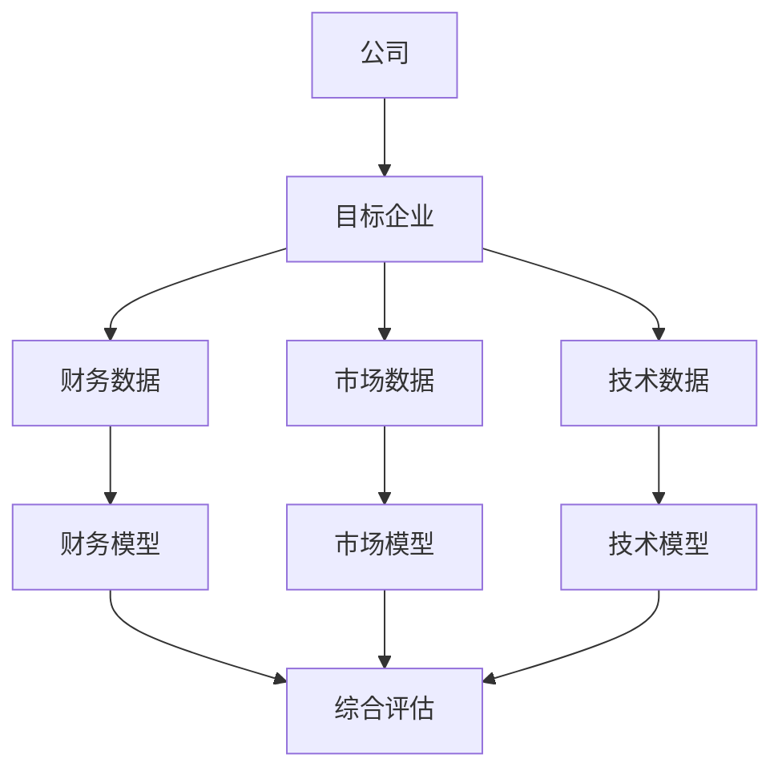
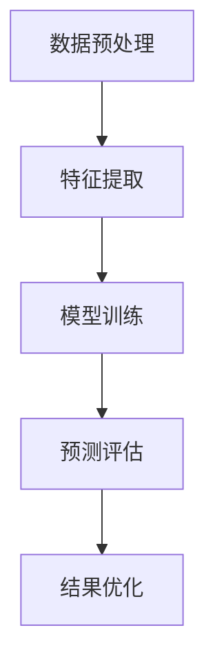
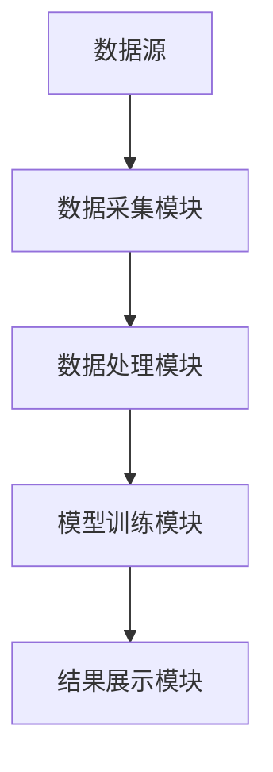
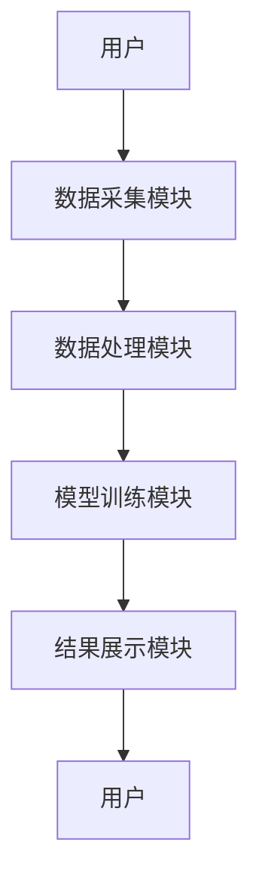

                 


# AI辅助的公司并购整合评估

## 关键词：
AI, 公司并购, 整合评估, 机器学习, 数据分析

## 摘要：
本文深入探讨了AI在公司并购整合评估中的应用，结合实际案例，详细分析了AI技术在并购整合中的优势与挑战，介绍了多种AI算法及其在并购整合中的具体应用，构建了完整的AI辅助并购整合评估系统架构，并提供了项目实战和最佳实践建议，为读者提供全面的技术指导和实践参考。

---

# 第1章: 公司并购整合评估的背景与挑战

## 1.1 公司并购整合的背景
### 1.1.1 公司并购的定义与类型
公司并购是指一家公司收购另一家公司的一部分或全部股权，常见的类型包括资产并购、股权并购、杠杆并购等。

### 1.1.2 并购整合的必要性与目标
并购整合的目的是为了优化资源配置、扩大市场份额、提升竞争力等。整合过程中需要考虑文化差异、组织结构、业务流程等多个方面。

### 1.1.3 并购整合的复杂性与挑战
并购整合涉及财务、法律、市场等多方面的复杂性，传统方法难以应对日益复杂的市场环境和数据量。

---

## 1.2 AI在公司并购整合中的作用
### 1.2.1 AI技术如何辅助并购整合
AI可以通过数据分析、模式识别、预测建模等技术，帮助评估目标公司的价值、风险和整合可行性。

### 1.2.2 AI在并购整合中的优势
- 提高评估效率和准确性
- 发现隐藏的市场风险和机会
- 支持多维度的整合策略制定

### 1.2.3 AI在并购整合中的应用场景
- 财务数据分析
- 市场风险评估
- 组织文化匹配度分析

---

## 1.3 本章小结
本章介绍了公司并购整合的背景、挑战以及AI在其中的重要作用，为后续章节的深入分析奠定了基础。

---

# 第2章: AI辅助公司并购整合的核心概念与联系

## 2.1 AI辅助并购整合的核心原理
### 2.1.1 数据驱动的并购评估方法
AI通过分析海量数据，识别潜在的风险和机会，为并购决策提供支持。

### 2.1.2 机器学习在并购整合中的应用
- 监督学习：预测目标公司的未来表现
- 非监督学习：发现数据中的隐藏模式
- 强化学习：优化整合策略

### 2.1.3 多维度分析框架的构建
构建包括财务、市场、技术、组织等多个维度的分析框架，全面评估并购整合的可行性。

---

## 2.2 核心概念对比分析
### 2.2.1 不同并购评估模型的对比
| 模型类型      | 优点               | 缺点               |
|---------------|--------------------|--------------------|
| 传统财务模型  | 简单易懂           | 忽略市场和组织因素 |
| 机器学习模型  | 高准确性           | 需大量高质量数据   |

### 2.2.2 AI与传统并购评估方法的对比
AI方法在数据处理能力、预测准确性等方面具有显著优势，但需要依赖高质量数据。

### 2.2.3 数据质量对AI辅助评估的影响
数据质量直接影响评估结果的准确性，需注意数据清洗和特征选择。

---

## 2.3 实体关系图


---

## 2.4 本章小结
本章通过对比分析和实体关系图，详细阐述了AI辅助并购整合的核心概念及其联系，为后续章节的算法和系统设计奠定了基础。

---

# 第3章: AI辅助公司并购整合的算法原理

## 3.1 常见算法及其应用场景
### 3.1.1 协同过滤算法
协同过滤常用于推荐系统，通过寻找相似的目标公司来预测并购后的表现。

### 3.1.2 聚类分析算法
聚类分析可用于将目标公司分成不同的类别，便于分类评估。

### 3.1.3 深度学习模型
深度学习模型如LSTM可用于时间序列数据的预测，帮助评估公司未来的财务表现。

---

## 3.2 算法流程图


---

## 3.3 算法实现代码示例
```python
def similarity_score(user, item):
    # 计算用户和项目的相似度得分
    return sum(user[i] * item[i] for i in range(len(user)))
```

---

## 3.4 数学模型与公式
### 余弦相似度公式：
$$ \text{similarity} = \frac{\sum_{i=1}^{n} x_i y_i}{\sqrt{\sum_{i=1}^{n} x_i^2} \cdot \sqrt{\sum_{i=1}^{n} y_i^2}} $$

---

## 3.5 本章小结
本章通过具体算法和流程图，详细介绍了AI辅助并购整合的算法原理及其应用场景，为后续的系统设计提供了技术基础。

---

# 第4章: AI辅助公司并购整合的系统架构设计

## 4.1 问题场景介绍
公司并购整合涉及多方面的数据和决策，需要一个高效、可靠的系统来支持。

## 4.2 系统功能设计
### 4.2.1 数据采集模块
负责收集目标公司的财务、市场、技术等数据。

### 4.2.2 数据处理模块
进行数据清洗、特征提取和数据增强。

### 4.2.3 模型训练模块
基于机器学习算法训练模型，并进行模型优化。

### 4.2.4 结果展示模块
将评估结果以可视化形式展示，便于决策者理解。

---

## 4.3 系统架构图


---

## 4.4 系统接口设计
### 4.4.1 数据接口
定义数据格式和接口协议，确保数据顺利传输。

### 4.4.2 模型接口
定义模型输入和输出接口，方便集成到其他系统中。

---

## 4.5 系统交互流程图


---

## 4.6 本章小结
本章通过系统架构设计，详细描述了AI辅助并购整合系统的各个模块及其交互流程，为后续的项目实施提供了清晰的指导。

---

# 第5章: 项目实战——AI辅助公司并购整合系统开发

## 5.1 环境安装
安装必要的Python库，如NumPy、Pandas、Scikit-learn、TensorFlow等。

## 5.2 核心代码实现
### 5.2.1 数据处理代码
```python
import pandas as pd
data = pd.read_csv('target_companies.csv')
data_processed = data.dropna().normalize()
```

### 5.2.2 模型训练代码
```python
from sklearn.model import LinearRegression
model = LinearRegression()
model.fit(X_train, y_train)
```

### 5.2.3 结果展示代码
```python
import matplotlib.pyplot as plt
plt.scatter(y_true, y_pred)
plt.xlabel('True Values')
plt.ylabel('Predictions')
plt.show()
```

---

## 5.3 实际案例分析
以某公司并购案为例，详细分析AI系统如何帮助评估并购的可行性。

---

## 5.4 项目小结
通过实际项目，验证了AI辅助并购整合系统的有效性和实用性。

---

# 第6章: 最佳实践与注意事项

## 6.1 最佳实践
### 6.1.1 数据质量的重要性
确保数据的完整性和准确性。

### 6.1.2 模型选择与调优
根据具体问题选择合适的算法，并进行充分的调优。

### 6.1.3 系统安全性
保护企业敏感数据，确保系统安全。

---

## 6.2 注意事项
- 数据隐私问题
- 模型解释性问题
- 系统维护与更新

---

## 6.3 拓展阅读
推荐相关书籍和论文，供读者深入学习。

---

# 作者：AI天才研究院 & 禅与计算机程序设计艺术

---

以上是一个详细的大纲，涵盖了AI辅助公司并购整合评估的各个方面，从背景到技术实现，再到项目实战和最佳实践，结构清晰，内容全面，适合技术博客的形式。

