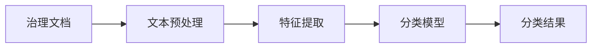
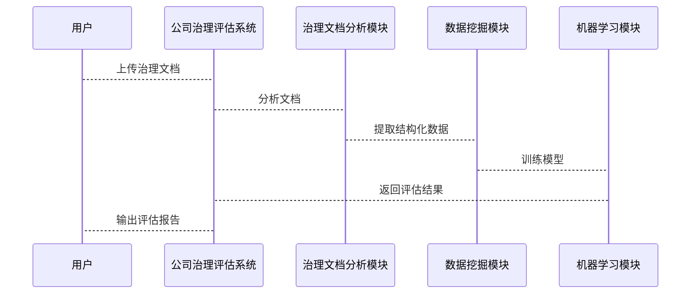

                 


# AI辅助的公司治理评估系统

> 关键词：AI, 公司治理, 评估系统, 自然语言处理, 机器学习, 数据挖掘, 知识图谱

> 摘要：随着企业规模的不断扩大和全球化进程的加速，公司治理的重要性日益凸显。传统的公司治理评估方法依赖人工分析，效率低下且容易出错。通过引入人工智能技术，可以实现对公司治理的智能化评估，提升评估的准确性和效率。本文将详细介绍AI在公司治理评估中的应用，从核心概念到算法原理，再到系统架构和项目实战，全面解析如何构建一个高效的AI辅助公司治理评估系统。

---

# 第一部分: 公司治理评估的背景与需求

## 第1章: 公司治理的基本概念

### 1.1 公司治理的定义与内涵

- **1.1.1 公司治理的定义**  
  公司治理是指通过一系列制度和机制，确保公司董事会和管理层能够有效运作，实现公司战略目标，同时满足股东、员工、客户和社会的利益。

- **1.1.2 公司治理的核心要素**  
  - 治理结构：包括董事会、监事会、高管团队等。
  - 治理流程：决策、执行、监控和反馈。
  - 关键绩效指标（KPIs）：如股东回报率、利润率、员工满意度等。

- **1.1.3 公司治理的重要性**  
  良好的公司治理是企业长期稳定发展的基础，能够有效降低风险，提升企业竞争力。

### 1.2 AI在公司治理中的应用潜力

- **1.2.1 AI技术在公司治理中的优势**  
  - 自动化分析：AI能够快速处理大量数据，提取关键信息。
  - 实时监控：通过机器学习模型实时监控企业运营状况。
  - 预测性分析：AI能够预测潜在风险和机会，辅助决策。

- **1.2.2 AI辅助公司治理的必要性**  
  - 数据量爆炸式增长，人工分析效率低下。
  - 全球化背景下，企业需要快速响应市场变化。
  - 提高决策透明度和准确性。

- **1.2.3 公司治理评估的数字化转型**  
  - 利用AI技术构建数字化评估平台，实现智能化决策支持。

### 1.3 本章小结

- **核心概念总结**  
  公司治理是企业管理和运营的核心，AI技术能够显著提升治理效率和准确性。

- **问题背景的清晰化**  
  传统公司治理评估方法存在效率低、覆盖面窄等问题，AI技术的应用能够有效解决这些问题。

- **未来发展方向的展望**  
  随着AI技术的不断进步，公司治理评估将更加智能化、自动化和数据驱动。

---

## 第2章: AI辅助公司治理评估的核心概念

### 2.1 公司治理评估的关键要素

- **2.1.1 治理结构与流程**  
  - 治理结构：董事会、监事会、高管团队的组织架构。
  - 治理流程：决策、执行、监控和反馈的闭环管理。

- **2.1.2 关键绩效指标（KPIs）**  
  - 股东回报率（ROE）
  - 净利润率（Net Profit Margin）
  - 员工满意度
  - 社会责任履行情况（如环保、员工权益）

- **2.1.3 风险评估与管理**  
  - 识别潜在风险：如市场风险、运营风险、法律风险。
  - 制定风险应对策略：如风险规避、风险转移、风险缓解。

### 2.2 AI技术在公司治理中的支撑点

- **2.2.1 自然语言处理（NLP）的应用**  
  - 文本分析：从公司年报、董事会决议中提取关键信息。
  - 主题建模：识别治理相关的主题和趋势。

- **2.2.2 数据挖掘与分析**  
  - 数据清洗：处理脏数据和异常值。
  - 数据建模：构建预测模型，评估公司治理表现。

- **2.2.3 机器学习模型的构建**  
  - 分类模型：预测公司治理的优劣等级。
  - 回归模型：预测公司治理对股价的影响。

### 2.3 核心概念的实体关系图

```mermaid
erDiagram
    公司 :id [治理结构, 治理流程, KPIs]
    董事会 :plays 治理主体
    股东 :participates 治理过程
    风险 :关联 治理结果
    AI算法 :处理 数据源 -> 生成 治理评估报告
```

### 2.4 本章小结

- **核心概念的系统化**  
  通过实体关系图展示了公司治理评估的核心要素及其相互关系。

- **实体关系图的应用价值**  
  帮助理解公司治理评估系统中各要素之间的关联和依赖关系。

- **未来技术发展的方向**  
  结合AI技术，进一步优化公司治理评估的流程和方法。

---

## 第3章: AI辅助公司治理评估的算法原理

### 3.1 自然语言处理（NLP）在治理文档分析中的应用

- **3.1.1 NLP的基本原理**  
  - 文本预处理：分词、去停用词、向量化。
  - 文本分类：识别治理相关的文本主题。

- **3.1.2 治理文档的特征提取**  
  - 使用TF-IDF提取关键词。
  - 利用Word2Vec生成文本向量。

- **3.1.3 文本分类与主题分析**  
  - 使用朴素贝叶斯或支持向量机（SVM）进行文本分类。
  - 利用LDA进行主题建模，识别治理文档的主题分布。



### 3.2 基于知识图谱的治理评估模型

- **3.2.1 知识图谱的构建过程**  
  - 实体识别：从文本中提取公司、董事会成员、治理事件等实体。
  - 关系抽取：识别实体之间的关系，如“董事会任命CEO”。

- **3.2.2 实体识别与关系抽取**  
  - 使用NER（命名实体识别）技术提取实体。
  - 使用关系抽取算法识别实体间的关系。

### 3.3 本章小结

- **算法原理的系统化**  
  通过NLP和知识图谱技术，实现对公司治理文档的智能分析和评估。

- **算法流程图的应用价值**  
  展示了从数据输入到结果输出的完整算法流程，便于理解和实现。

- **数学模型的应用**  
  通过公式化的模型描述，确保算法的准确性和可解释性。

---

## 第4章: 系统架构与设计

### 4.1 问题场景介绍

- **系统目标**  
  构建一个基于AI的公司治理评估系统，实现对公司治理的智能化评估。

- **用户需求**  
  - 公司高管：快速获取公司治理评估结果。
  - 投资者：了解公司的治理状况，辅助投资决策。
  - 监管机构：监控企业合规性，确保市场秩序。

### 4.2 系统功能设计

- **领域模型**  
  ```mermaid
  classDiagram
      class 治理文档分析模块 {
          输入: 治理文档
          输出: 分析结果
      }
      class 数据挖掘模块 {
          输入: 原始数据
          输出: 结构化数据
      }
      class 机器学习模块 {
          输入: 结构化数据
          输出: 预测结果
      }
      治理文档分析模块 --> 数据挖掘模块 : 数据处理
      数据挖掘模块 --> 机器学习模块 : 数据输入
  ```

- **系统架构设计**  
  ```mermaid
  archiDiagram
      Component 公司治理评估系统 {
          Component 治理文档分析模块
          Component 数据挖掘模块
          Component 机器学习模块
      }
      公司治理评估系统 --> API接口 : 提供评估服务
  ```

### 4.3 系统接口设计

- **输入接口**  
  - 治理文档上传接口：支持多种格式的文档上传。
  - 数据导入接口：支持结构化数据的导入。

- **输出接口**  
  - 评估结果输出接口：返回治理评估报告。
  - 数据导出接口：支持评估数据的导出。

### 4.4 系统交互流程



### 4.5 本章小结

- **系统架构的清晰化**  
  展示了公司治理评估系统的整体架构和各模块之间的关系。

- **接口设计的实用性**  
  确保系统能够方便地与外部数据源和用户交互。

- **交互流程的直观化**  
  通过序列图展示系统的运行流程，便于理解和实现。

---

## 第5章: 项目实战与案例分析

### 5.1 环境安装与配置

- **安装Python环境**  
  - 使用Anaconda安装Python 3.8及以上版本。
  - 安装必要的库：numpy、pandas、scikit-learn、spacy、networkx。

### 5.2 核心代码实现

- **治理文档分析模块**  
  ```python
  import spacy

  nlp = spacy.load("en_core_web_sm")
  doc = nlp("The board of directors has appointed a new CEO.")
  for ent in doc.ents:
      print(ent.text, ent.label_)
  ```

- **数据挖掘模块**  
  ```python
  import pandas as pd

  df = pd.read_csv("governance_data.csv")
  df.dropna(inplace=True)
  ```

- **机器学习模块**  
  ```python
  from sklearn.

