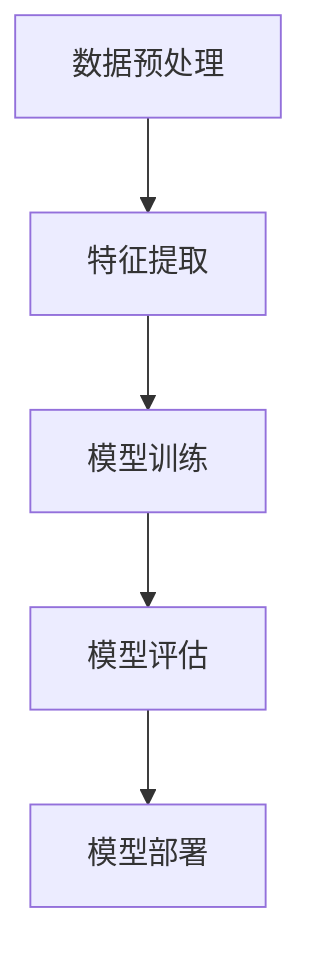
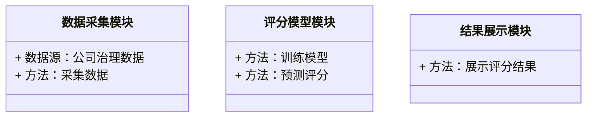
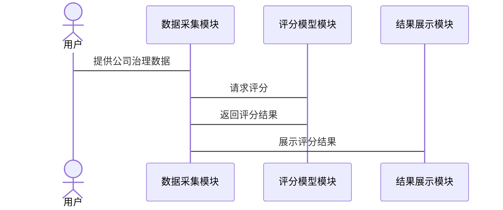

                 


# AI辅助的公司治理评分系统

## 关键词：
- AI辅助
- 公司治理
- 评分系统
- 企业分析
- 数据分析
- 评分模型
- 系统设计

## 摘要：
本文将详细介绍如何利用人工智能技术构建公司治理评分系统。通过分析公司治理的核心问题，结合AI算法和系统架构设计，提出了一套完整的解决方案。从数据预处理、模型训练到系统部署，详细阐述了每一步的实现方法，并通过实际案例分析展示了系统的应用效果。

---

# 第1章 公司治理评分系统背景介绍

## 1.1 问题背景与描述
### 1.1.1 公司治理的核心问题
公司治理是企业管理中的核心环节，涉及股东、董事会、高管和利益相关者的权利与责任分配。传统治理模式依赖人工评估，存在主观性强、效率低、覆盖面窄等问题。

### 1.1.2 传统公司治理的局限性
- 评估标准不统一，缺乏客观性。
- 数据量有限，难以覆盖多维度指标。
- 人工分析耗时长，成本高。

### 1.1.3 AI辅助的必要性与优势
- 提高评估效率，降低人工成本。
- 利用大数据分析，实现多维度评分。
- 通过机器学习优化评分模型，提升准确性。

## 1.2 问题解决与边界
### 1.2.1 AI在公司治理中的应用场景
- 股东权益评估
- 董事会结构分析
- 高管行为监督

### 1.2.2 系统的边界与外延
- 输入：公司治理相关数据（如股权结构、董事会成员信息、财务数据）。
- 输出：多维度评分结果（如治理评分、风险评分）。

### 1.2.3 核心要素与组成结构
- 数据采集模块
- 评分模型模块
- 结果展示模块

## 1.3 本章小结
- 公司治理评分系统的必要性与优势。
- 系统的边界与核心要素。
- 下文将深入探讨核心概念与AI算法实现。

---

# 第2章 核心概念与联系

## 2.1 核心概念原理
### 2.1.1 AI辅助评分的原理
通过机器学习模型对多维度数据进行分析，生成评分结果。

### 2.1.2 公司治理评分模型
基于特征工程构建评分模型，利用回归或分类算法进行预测。

### 2.1.3 多维度评分指标
包括股东权益、董事会效率、高管行为、企业透明度等。

## 2.2 概念属性特征对比
| 概念 | 特征1 | 特征2 | 特征3 |
|------|------|------|------|
| 数据特征 | 数量化 | 标准化 | 关联性 |
| 模型特征 | 适用性 | 简洁性 | 可解释性 |
| 评分结果 | 客观性 | 可比性 | 可操作性 |

## 2.3 ER实体关系图
```mermaid
er
actor: 用户
model: 评分模型
data: 数据源
result: 评分结果
actor --> data
actor --> model
model --> result
```

## 2.4 本章小结
- 核心概念的系统性分析。
- 概念间的关系与依赖。
- 下文算法实现的铺垫。

---

# 第3章 算法原理讲解

## 3.1 算法原理概述
### 3.1.1 评分模型的选择
- 线性回归：适用于简单线性关系。
- 支持向量机：适用于高维数据分类。
- 随机森林：适用于多维度特征的分类与回归。

### 3.1.2 AI算法的核心流程
1. 数据预处理：清洗、标准化、特征提取。
2. 模型训练：选择算法，调整超参数。
3. 模型评估：验证集测试，计算准确率、召回率。
4. 模型部署：API接口开发，实时评分。

### 3.1.3 算法的优缺点分析
- 优点：高效、准确。
- 缺点：需要大量数据，模型可解释性差。

## 3.2 算法实现流程
### 3.2.1 数据预处理
```python
import pandas as pd
data = pd.read_csv('governance.csv')
data.dropna(inplace=True)
```

### 3.2.2 模型训练
```python
from sklearn.ensemble import RandomForestClassifier
model = RandomForestClassifier(n_estimators=100)
model.fit(X_train, y_train)
```

### 3.2.3 模型调优
```python
from sklearn.model_selection import GridSearchCV
param_grid = {'n_estimators': [100, 200], 'max_depth': [None, 10]}
grid_search = GridSearchCV(model, param_grid)
grid_search.fit(X_train, y_train)
best_model = grid_search.best_estimator_
```

### 3.2.4 模型部署
```python
import flask
app = flask.Flask(__name__)
@app.route('/score', methods=['POST'])
def predict():
    data = request.json
    prediction = model.predict(data)
    return jsonify({'score': prediction[0]})
```

## 3.3 算法流程图


## 3.4 本章小结
- 算法实现的详细步骤。
- 数据预处理、模型训练、调优和部署的具体方法。
- 下文将结合系统架构设计进一步展开。

---

# 第4章 系统分析与架构设计

## 4.1 问题场景介绍
- 用户需求：实时获取公司治理评分。
- 系统目标：构建高效、准确的评分系统。

## 4.2 项目介绍
- 项目名称：AI辅助公司治理评分系统。
- 项目目标：利用AI技术优化公司治理评估。

## 4.3 系统功能设计
### 4.3.1 领域模型类图


### 4.3.2 系统架构图


### 4.3.3 系统接口设计
- 输入接口：接收公司治理数据。
- 输出接口：返回评分结果。

## 4.4 系统交互序列图


## 4.5 本章小结
- 系统架构设计的详细步骤。
- 各模块之间的关系与交互。
- 下文将结合项目实战进一步展开。

---

# 第5章 项目实战

## 5.1 环境安装
```bash
pip install pandas scikit-learn flask
```

## 5.2 系统核心实现
### 5.2.1 数据采集模块
```python
import requests
def fetch_data(api_key):
    response = requests.get(f'https://api.example.com/governance?api_key={api_key}')
    return response.json()
```

### 5.2.2 评分模型模块
```python
from sklearn.ensemble import RandomForestClassifier
def train_model(X, y):
    model = RandomForestClassifier()
    model.fit(X, y)
    return model
```

### 5.2.3 结果展示模块
```python
from flask import Flask, jsonify, request
app = Flask(__name__)
model = train_model(X_train, y_train)
@app.route('/score', methods=['POST'])
def predict():
    data = request.json
    prediction = model.predict(data)
    return jsonify({'score': prediction[0]})
```

## 5.3 代码应用解读与分析
- 数据采集模块：从API获取数据。
- 评分模型模块：训练随机森林模型。
- 结果展示模块：开发RESTful API。

## 5.4 实际案例分析
- 数据准备：加载公司治理数据。
- 模型训练：训练评分模型。
- 结果展示：调用API获取评分结果。

## 5.5 本章小结
- 项目实战的具体步骤。
- 代码实现的详细解读。
- 系统的实际应用效果。

---

# 第6章 最佳实践

## 6.1 小结
- AI辅助公司治理评分系统的实现步骤。
- 关键技术点的总结。

## 6.2 注意事项
- 数据隐私保护。
- 模型可解释性问题。
- 系统的实时性和稳定性。

## 6.3 拓展阅读
- 《机器学习实战》
- 《企业治理与数据分析》
- 《AI在企业管理中的应用》

---

# 作者：AI天才研究院/AI Genius Institute & 禅与计算机程序设计艺术 /Zen And The Art of Computer Programming

