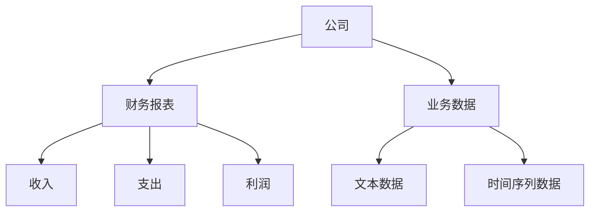
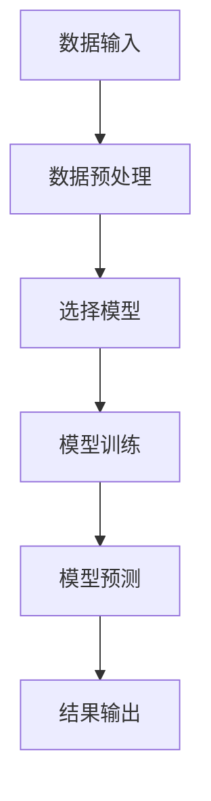
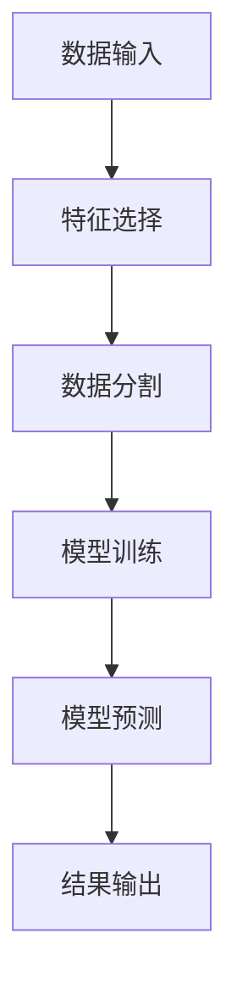
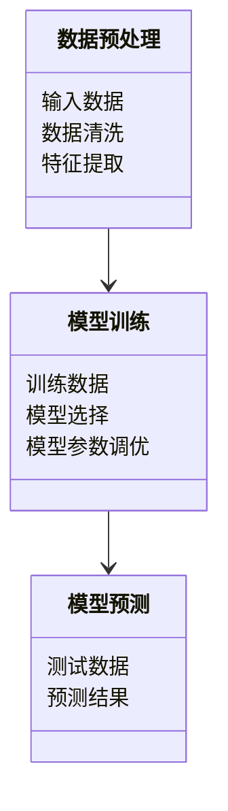
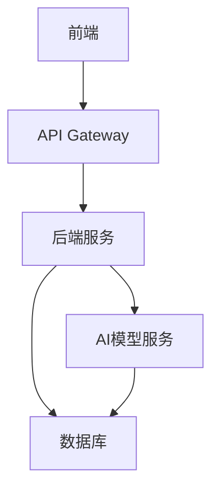
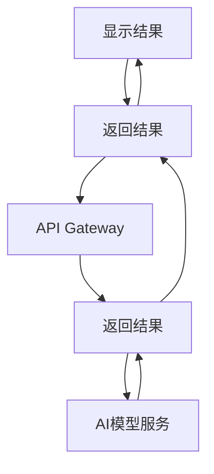

                 


# AI辅助的公司财务报表预测

## 关键词：AI, 财务报表, 预测, 机器学习, 时间序列, 自然语言处理

## 摘要：  
本文详细探讨了如何利用人工智能技术辅助公司财务报表预测。通过分析财务数据、结合机器学习和深度学习算法，构建高效准确的预测模型，帮助企业在不确定的经济环境中做出更明智的决策。文章从背景、核心概念、算法原理、系统架构到项目实战，全面解析AI在财务预测中的应用。

---

## 第一部分: AI辅助的公司财务报表预测概述

### 第1章: 背景介绍

#### 1.1 问题背景  
财务报表预测是企业财务管理中的重要环节，通过预测收入、支出、利润等关键指标，帮助企业制定战略规划和优化资源配置。然而，传统方法依赖人工分析，耗时且易受主观因素影响，难以应对复杂多变的市场环境。AI技术的引入，为财务预测提供了新的解决方案。

#### 1.2 问题描述  
财务报表预测的核心问题是基于历史数据，准确预测未来的财务状况。然而，财务数据具有高度的不确定性和复杂性，传统统计方法往往难以捕捉数据中的深层规律。此外，企业内外部环境的动态变化也增加了预测的难度。

#### 1.3 问题解决  
AI技术，特别是机器学习和深度学习，能够通过分析大量历史数据，发现隐藏的模式和趋势，从而提高预测的准确性。同时，自然语言处理技术可以挖掘财务报告中的文本信息，进一步增强预测的深度和广度。

#### 1.4 边界与外延  
财务预测的边界在于企业的财务数据和业务数据，外延则包括宏观经济指标、行业趋势等外部因素。AI技术的应用不仅限于财务预测，还可以与其他领域如供应链管理、风险评估等相结合。

---

## 第二部分: 核心概念与联系

### 第2章: 核心概念原理

#### 2.1 财务报表预测的基本原理  
财务报表预测通常包括收入预测、支出预测和利润预测。这些预测需要结合企业的历史数据、市场趋势和内部运营情况。数据预处理和特征提取是预测的关键步骤，包括处理缺失值、标准化数据和提取有用的特征。

#### 2.2 AI预测的基本原理  
AI模型通过学习历史数据，建立数学模型来预测未来的结果。机器学习算法如线性回归、随机森林和神经网络等，能够捕捉数据中的非线性关系。深度学习模型如LSTM和Transformer则适用于时间序列数据的预测。

#### 2.3 财务数据与AI模型的结合  
财务数据包括结构化数据（如收入、支出）和非结构化数据（如财务报告文本）。AI模型需要将这些数据转化为可分析的形式，例如通过NLP技术将文本数据转化为向量表示。

#### 2.4 核心概念属性对比  
以下表格对比了传统回归模型和时间序列模型的关键属性：

| 属性          | 传统回归模型       | 时间序列模型       |
|---------------|--------------------|--------------------|
| 数据类型       | 结构化数据         | 时间序列数据       |
| 处理方式       | 线性关系           | 非线性关系         |
| 适用场景       | 单变量预测         | 多变量预测         |

#### 2.5 ER实体关系图  
以下是财务报表预测的实体关系图：



---

## 第三部分: 算法原理讲解

### 第3章: 算法原理

#### 3.1 时间序列预测模型  
时间序列预测是财务报表预测的核心任务之一。以下是几种常用模型的流程图：



##### 3.1.1 ARIMA模型  
ARIMA（自回归积分滑动平均模型）适用于线性时间序列数据。其数学公式为：

$$ ARIMA(p, d, q) $$

其中，$p$是自回归阶数，$d$是差分阶数，$q$是移动平均阶数。

##### 3.1.2 LSTM网络  
LSTM（长短期记忆网络）能够捕捉时间序列中的长期依赖关系。其核心结构包括输入门、遗忘门和输出门。

##### 3.1.3 Prophet模型  
Prophet模型由Facebook开源，适用于非 stationary 数据的预测。其模型结构包括趋势部分、周期部分和噪声部分。

#### 3.2 机器学习  
机器学习算法如随机森林和梯度提升树（如XGBoost）也可以用于财务预测。以下是随机森林的流程图：



---

## 第四部分: 系统分析与架构设计

### 第4章: 系统分析与架构设计

#### 4.1 问题场景介绍  
本项目旨在构建一个AI辅助的财务报表预测系统，帮助企业在复杂多变的市场环境中做出更准确的财务预测。

#### 4.2 系统功能设计  
以下是系统的领域模型类图：



#### 4.3 系统架构设计  
以下是系统的架构图：



#### 4.4 接口设计与交互  
以下是系统的交互流程图：



---

## 第五部分: 项目实战

### 第5章: 项目实战

#### 5.1 环境安装  
需要安装以下工具和库：

- Python 3.8+
- Jupyter Notebook
- Pandas、NumPy、Scikit-learn、TensorFlow、Keras

#### 5.2 核心实现  
以下是基于LSTM的时间序列预测代码示例：

```python
import numpy as np
import pandas as pd
from tensorflow.keras.models import Sequential
from tensorflow.keras.layers import LSTM, Dense, Dropout

# 数据加载与预处理
data = pd.read_csv('financial_data.csv')
train_data = data.iloc[:1000]
test_data = data.iloc[1000:]

# 数据转换
from sklearn.preprocessing import MinMaxScaler
scaler = MinMaxScaler()
train_data_scaled = scaler.fit_transform(train_data)
test_data_scaled = scaler.transform(test_data)

# 构建数据集
def create_dataset(data, look_back=1):
    X, Y = [], []
    for i in range(len(data) - look_back):
        X.append(data[i:i+look_back])
        Y.append(data[i+look_back])
    return np.array(X), np.array(Y)

X_train, y_train = create_dataset(train_data_scaled, look_back=5)
X_test, y_test = create_dataset(test_data_scaled, look_back=5)

# 模型构建
model = Sequential()
model.add(LSTM(50, return_sequences=True, input_shape=(5, 1)))
model.add(Dropout(0.2))
model.add(LSTM(50, return_sequences=False))
model.add(Dense(1))

model.compile(loss='mean_squared_error', optimizer='adam')

# 模型训练
model.fit(X_train, y_train, epochs=50, batch_size=32, verbose=1)

# 模型预测
train_predict = model.predict(X_train)
test_predict = model.predict(X_test)

# 反转缩放
train_predict = scaler.inverse_transform(train_predict)
test_predict = scaler.inverse_transform(test_predict)

# 可视化
import matplotlib.pyplot as plt
plt.plot(train_data, label='Train Data')
plt.plot(train_predict, label='Train Predict')
plt.plot(test_data, label='Test Data')
plt.plot(test_predict, label='Test Predict')
plt.legend()
plt.show()
```

---

## 第六部分: 最佳实践

### 第6章: 最佳实践

#### 6.1 小结  
本文详细介绍了AI辅助公司财务报表预测的核心概念、算法原理和系统设计，并通过项目实战展示了如何将理论应用于实际。

#### 6.2 注意事项  
- 数据质量是预测准确性的关键，需重视数据清洗和特征工程。
- 模型选择需结合实际业务需求，避免过拟合。
- 预测结果需结合业务知识进行验证和调整。

#### 6.3 扩展阅读  
- 《Deep Learning for Time Series Forecasting》
- 《Python机器学习实战》
- 《自然语言处理入门》

---

## 作者：AI天才研究院  
禅与计算机程序设计艺术

