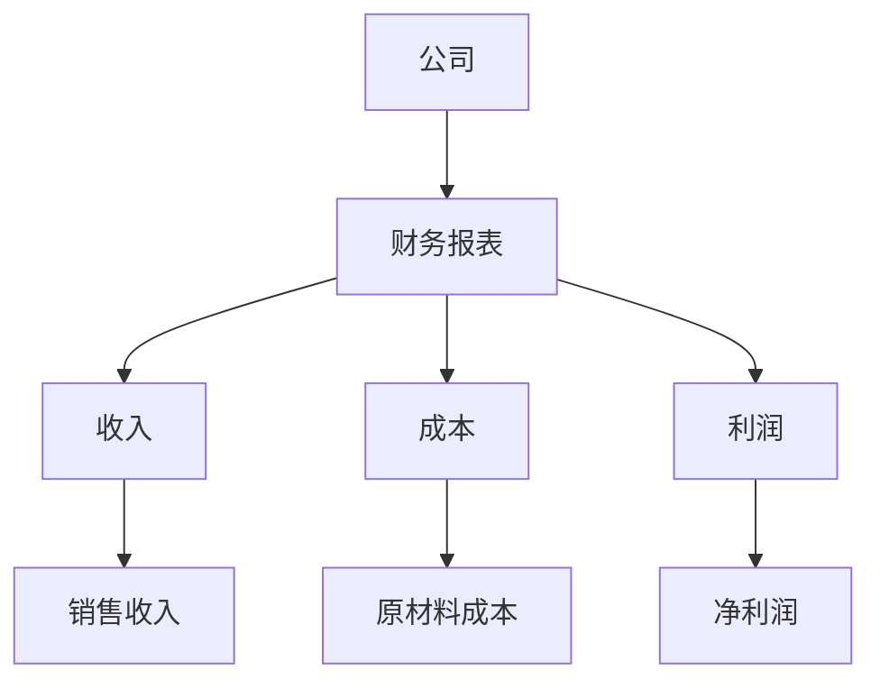
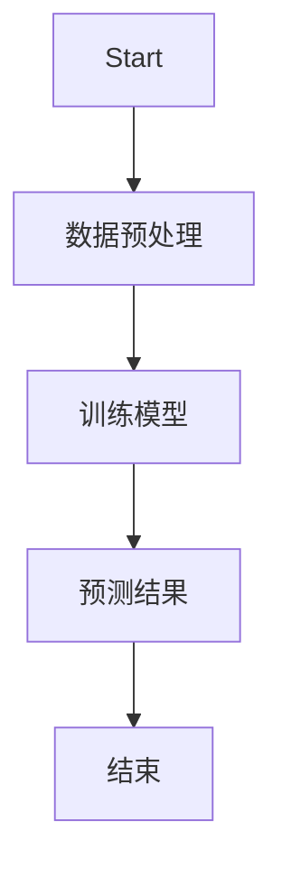
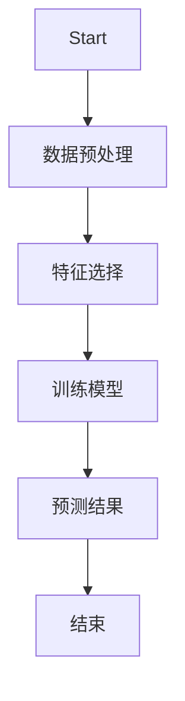
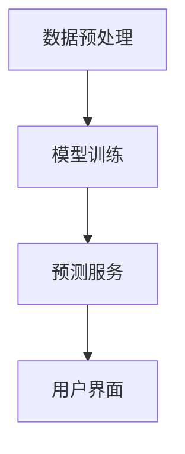
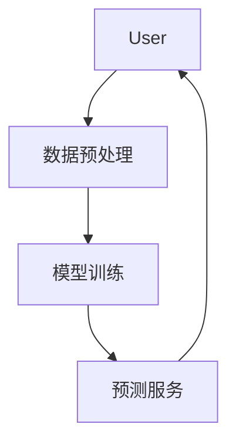

                 


# AI辅助的公司财务报表预测与分析

## 关键词：AI、财务报表、预测分析、机器学习、深度学习、自然语言处理

## 摘要：  
本文探讨了如何利用人工智能技术辅助公司财务报表的预测与分析。通过结合机器学习、深度学习和自然语言处理等技术，我们能够更高效地处理财务数据，发现潜在的财务风险，并提供精准的预测结果。本文详细介绍了AI在财务分析中的核心概念、算法原理、系统架构设计以及实际项目应用，帮助读者全面理解AI在财务报表预测与分析中的重要作用。

---

# 目录大纲

1. 背景介绍  
   - 1.1 问题背景与解决方法  
   - 1.2 问题描述  
   - 1.3 问题解决方法  
   - 1.4 边界与外延  
   - 1.5 核心要素组成  

2. 核心概念与联系  
   - 2.1 AI与财务分析的结合原理  
   - 2.2 核心概念对比表  
   - 2.3 ER实体关系图  

3. 算法原理讲解  
   - 3.1 算法选择与实现思路  
   - 3.2 算法实现步骤  
   - 3.3 数学模型与公式  

4. 系统分析与架构设计方案  
   - 4.1 问题场景介绍  
   - 4.2 系统功能设计  
   - 4.3 系统架构设计  
   - 4.4 系统接口设计  

5. 项目实战  
   - 5.1 环境安装与配置  
   - 5.2 核心代码实现  
   - 5.3 代码解读与分析  
   - 5.4 实际案例分析  
   - 5.5 项目小结  

6. 总结与展望  
   - 6.1 核心要点回顾  
   - 6.2 应用中的注意事项  
   - 6.3 未来研究方向  
   - 6.4 拓展阅读推荐  

---

## 第1章: 背景介绍

### 1.1 问题背景与解决方法

#### 1.1.1 传统财务报表分析的局限性  
传统的财务报表分析依赖于人工审查和经验判断，存在以下问题：  
- 数据量大且复杂，难以快速处理；  
- 易受主观因素影响，结果不够客观；  
- 分析效率低，难以实时响应；  
- 预测精度有限，难以应对复杂的市场变化。  

#### 1.1.2 AI技术在财务分析中的潜力  
AI技术通过以下方式解决了传统财务分析的痛点：  
- 高效处理海量数据，提升分析效率；  
- 通过机器学习模型自动发现数据中的规律和趋势；  
- 实现实时监控和预测，帮助企业在市场变化中快速决策；  
- 提高预测精度，降低财务风险。  

#### 1.1.3 企业财务预测与分析的重要性  
财务预测与分析是企业经营决策的核心支持，能够帮助企业：  
- 提前预知财务状况，优化资源配置；  
- 识别潜在风险，制定应对策略；  
- 通过历史数据分析，发现经营中的问题和改进方向。  

### 1.2 问题描述

#### 1.2.1 财务数据的复杂性  
财务数据通常包括收入、成本、利润、现金流等多个维度，且数据来源多样（如财务报表、市场数据、行业报告等）。  

#### 1.2.2 传统预测方法的不足  
传统预测方法（如线性回归、简单的时间序列分析）在处理复杂数据时表现有限，难以捕捉数据中的非线性关系和潜在模式。  

#### 1.2.3 数据量与实时性的挑战  
现代企业需要实时或近实时的财务预测，这对数据处理速度和模型响应提出了更高的要求。  

### 1.3 问题解决方法

#### 1.3.1 引入AI技术的核心思路  
通过机器学习算法（如随机森林、支持向量机、LSTM等）对财务数据进行建模，提取特征并预测未来趋势。  

#### 1.3.2 数据预处理与特征提取  
- 数据清洗：处理缺失值、异常值；  
- 数据标准化：统一数据格式；  
- 特征提取：选择对预测影响较大的特征（如收入增长率、净利润率等）。  

#### 1.3.3 模型训练与预测  
- 划分训练集和测试集；  
- 训练模型并优化参数；  
- 使用测试集验证模型性能，调整模型以提高预测精度。  

### 1.4 边界与外延

#### 1.4.1 数据范围的界定  
数据范围包括：  
- 公司内部的财务数据；  
- 市场数据（如行业指数、原材料价格）；  
- 宏观经济数据（如GDP增长率、利率变动）。  

#### 1.4.2 模型适用的行业限制  
AI财务预测模型在某些行业（如金融、科技）表现较好，但在数据 scarce 或行业特性明显的领域（如小企业、非盈利组织）可能效果有限。  

#### 1.4.3 预测结果的误差范围  
由于市场波动和企业内部因素的不确定性，模型预测结果可能存在一定误差。  

### 1.5 核心要素组成

#### 1.5.1 数据来源与类型  
- 内部数据：公司财务报表、销售数据；  
- 外部数据：市场指数、行业报告；  
- 文本数据：财务报告、新闻媒体。  

#### 1.5.2 模型选择与优化  
- 算法选择：根据数据特征选择合适的模型（如线性回归、随机森林、LSTM）；  
- 模型优化：通过交叉验证调整参数，提升预测精度。  

#### 1.5.3 预测结果的解释与应用  
- 预测结果需要结合行业知识进行解释；  
- 结果应用于企业决策（如投资、融资、成本控制）。  

---

## 第2章: 核心概念与联系

### 2.1 AI与财务分析的结合原理

#### 2.1.1 机器学习在财务预测中的应用  
- 使用监督学习对财务数据进行分类或回归分析；  
- 利用无监督学习发现数据中的隐藏模式。  

#### 2.1.2 自然语言处理在财务文本分析中的应用  
- 从财务报告、新闻中提取关键词和情感倾向；  
- 使用NLP技术进行舆情分析，辅助财务决策。  

#### 2.1.3 深度学习在复杂财务模型中的应用  
- 使用深度学习模型（如LSTM）捕捉时间序列中的复杂模式；  
- 在多维数据（如文本、图像）中发现潜在关联。  

### 2.2 核心概念对比表

| 概念                | 特征                | 描述                                                                 |
|---------------------|--------------------|----------------------------------------------------------------------|
| 数据来源            | 多样性              | 包括财务数据、市场数据、文本数据等                                      |
| 模型类型            | 多样性              | 包括线性回归、随机森林、LSTM等                                          |
| 预测目标            | 多样性              | 包括收入预测、成本预测、利润预测等                                      |

### 2.3 ER实体关系图



---

## 第3章: 算法原理讲解

### 3.1 算法选择与实现思路

#### 3.1.1 算法选择  
选择随机森林作为分类任务的模型，线性回归作为回归任务的模型。  

#### 3.1.2 实现思路  
- 数据预处理：清洗、标准化；  
- 特征选择：提取关键特征；  
- 模型训练：训练模型并保存；  
- 模型预测：使用新数据进行预测；  
- 结果评估：计算准确率、召回率等指标。  

### 3.2 算法实现步骤

#### 3.2.1 线性回归算法  



#### 3.2.2 随机森林算法  



### 3.3 数学模型与公式

#### 3.3.1 线性回归模型  
$$ y = a + b x $$  
其中，$y$ 是预测值，$a$ 是截距，$b$ 是斜率，$x$ 是输入特征。  

#### 3.3.2 随机森林模型  
随机森林通过集成多个决策树模型，提高预测精度和泛化能力。  

---

## 第4章: 系统分析与架构设计方案

### 4.1 问题场景介绍  
系统需要实现对公司财务报表的预测与分析，支持实时数据处理和高精度预测。  

### 4.2 系统功能设计

#### 4.2.1 领域模型类图  


### 4.3 系统架构设计  



### 4.4 系统接口设计  
- 数据接口：接收财务数据并进行预处理；  
- 模型接口：提供预测服务API；  
- 用户接口：展示预测结果和分析报告。  

### 4.5 系统交互流程图  



---

## 第5章: 项目实战

### 5.1 环境安装与配置  
- 安装Python、Pandas、Scikit-learn等库。  

### 5.2 核心代码实现

#### 5.2.1 数据预处理  

```python
import pandas as pd
data = pd.read_csv('financial_data.csv')
data.dropna(inplace=True)
data['收入'] = data['收入'].astype('float')
```

#### 5.2.2 模型训练与预测  

```python
from sklearn.ensemble import RandomForestRegressor
model = RandomForestRegressor(n_estimators=100)
model.fit(X_train, y_train)
y_pred = model.predict(X_test)
```

### 5.3 代码解读与分析  
- 数据预处理部分：清洗数据并标准化特征；  
- 模型训练部分：使用随机森林进行回归分析；  
- 预测结果部分：输出预测值并评估模型性能。  

### 5.4 实际案例分析  
以某公司为例，使用历史财务数据训练模型，预测未来季度的收入和利润。  

### 5.5 项目小结  
通过本项目，我们验证了AI技术在财务预测中的有效性，并总结了实践经验。  

---

## 第6章: 总结与展望

### 6.1 核心要点回顾  
- AI技术能够显著提升财务预测的效率和精度；  
- 数据质量和模型选择是影响预测结果的关键因素；  
- 需要结合行业知识和实际业务需求，优化模型性能。  

### 6.2 应用中的注意事项  
- 数据隐私和安全问题需要重视；  
- 模型的可解释性需要进一步提升；  
- 定期更新模型，以适应市场变化。  

### 6.3 未来研究方向  
- 探索更复杂的模型（如Transformer、GPT）在财务分析中的应用；  
- 结合多模态数据（如图像、语音）进行财务预测；  
- 研究如何将AI技术应用于实时财务监控和风险预警。  

### 6.4 拓展阅读推荐  
- 《机器学习实战》  
- 《深度学习》  
- 《自然语言处理入门》  

---

## 作者：AI天才研究院/AI Genius Institute & 禅与计算机程序设计艺术/Zen And The Art of Computer Programming

