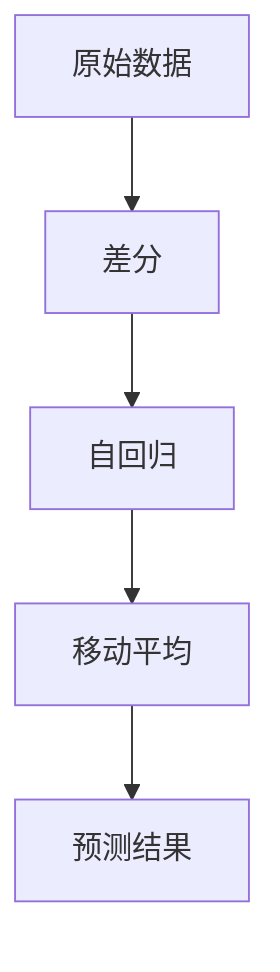
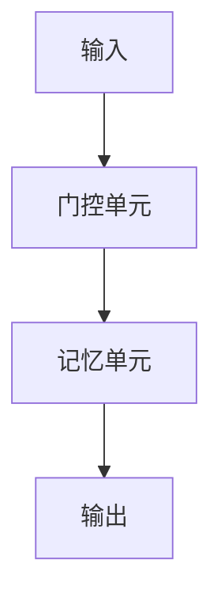
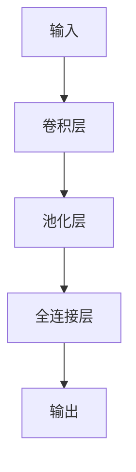
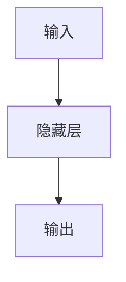
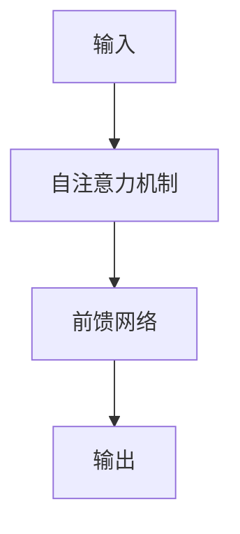
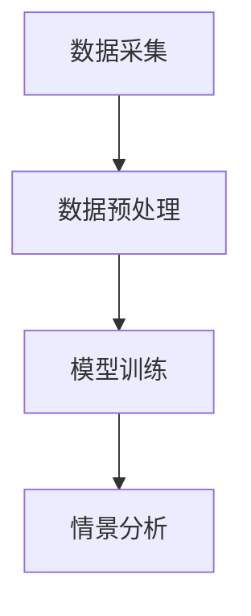
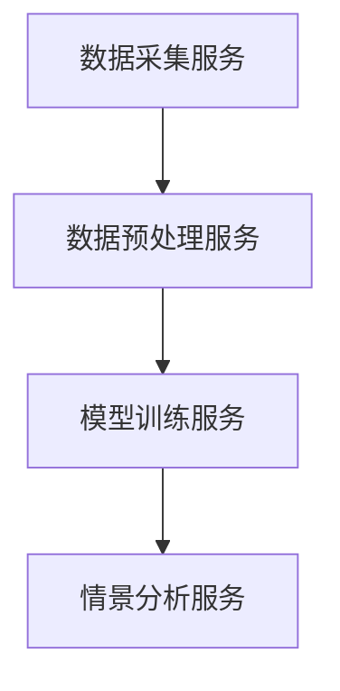
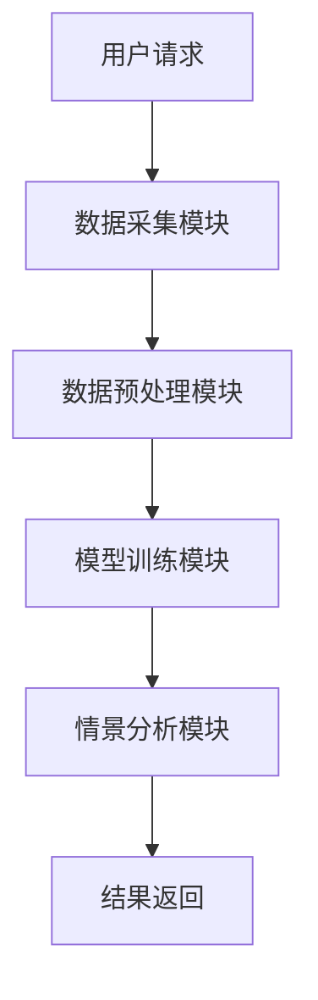

                 


# AI辅助的公司财务报表预测与情景分析

## 关键词：
人工智能、财务预测、情景分析、时间序列、机器学习

## 摘要：
本文探讨了人工智能在公司财务报表预测与情景分析中的应用，详细介绍了AI技术如何提升财务预测的准确性，并通过情景分析帮助企业在复杂多变的商业环境中做出更明智的决策。文章涵盖了从基础概念到高级算法，再到系统设计和项目实战的各个方面，为读者提供了全面的指导。

---

## 第1章：AI与财务报表预测的背景与应用

### 1.1 人工智能在财务领域的应用现状
#### 1.1.1 财务领域的数据特点
财务数据具有高度的结构化和周期性，通常包含大量历史数据，适合进行模式识别和预测分析。

#### 1.1.2 人工智能技术在财务领域的优势
- **自动化处理**：AI能够快速处理大量财务数据，减少人工错误。
- **高精度预测**：通过机器学习算法，AI可以实现比传统方法更准确的预测。
- **实时分析**：AI能够实时监控财务数据，提供及时的决策支持。

#### 1.1.3 财务预测与情景分析的重要性
财务预测帮助企业规划未来，而情景分析则帮助企业应对不确定性，制定多种可能的应对策略。

### 1.2 财务报表预测的核心问题
#### 1.2.1 财务预测的基本概念
财务预测是对未来财务状况的估计，通常基于历史数据和市场趋势。

#### 1.2.2 财务预测的主要方法
- **定性分析**：通过专家意见和市场趋势进行预测。
- **定量分析**：利用统计模型和数学方法进行预测。

#### 1.2.3 AI辅助财务预测的必要性
传统方法依赖于经验判断，而AI通过大数据分析和复杂模型，能够提供更准确和高效的预测。

### 1.3 情景分析在财务管理中的作用
#### 1.3.1 情景分析的基本概念
情景分析是通过设定不同的假设条件，模拟多种可能的财务结果。

#### 1.3.2 情景分析在财务规划中的应用
- **风险管理**：通过模拟不同市场条件下的财务表现，识别潜在风险。
- **战略规划**：帮助企业在不同情况下制定最优策略。

#### 1.3.3 AI如何增强情景分析能力
AI可以通过生成大量数据模拟，提供更全面的情景分析，并快速调整模型参数以适应不同假设。

### 1.4 本章小结
本章介绍了AI在财务领域的应用现状，探讨了财务预测和情景分析的重要性，并说明了AI如何提升这些过程的效率和准确性。

---

## 第2章：财务报表预测与情景分析的核心概念

### 2.1 财务报表的基本结构
#### 2.1.1 资产负债表
资产负债表反映企业在某一特定时期的财务状况，包括资产、负债和所有者权益。

#### 2.1.2 利润表
利润表展示企业在一定会计期间的经营成果，包括收入、费用和利润。

#### 2.1.3 现金流量表
现金流量表记录企业在一定会计期间内现金和现金等价物的流入和流出情况。

### 2.2 AI技术在财务预测中的应用
#### 2.2.1 机器学习在财务预测中的应用
- **监督学习**：利用历史数据训练模型，预测未来财务指标。
- **无监督学习**：通过聚类分析发现隐藏的财务模式。

#### 2.2.2 自然语言处理在财务文本分析中的应用
NLP技术用于分析财务报告和新闻，提取关键信息影响财务预测。

#### 2.2.3 图神经网络在财务关系分析中的应用
图神经网络用于分析企业之间的关联关系，评估供应链风险。

### 2.3 财务预测与情景分析的结合
#### 2.3.1 财务预测的多场景模拟
通过AI生成多种预测模型，模拟不同市场条件下的财务结果。

#### 2.3.2 情景分析对财务预测的优化作用
情景分析帮助企业在复杂环境中制定灵活的财务策略。

#### 2.3.3 AI如何实现情景分析的自动化
AI可以通过参数调整和数据模拟，自动生成多种情景分析结果。

### 2.4 本章小结
本章详细介绍了财务报表的基本结构，探讨了AI技术在财务预测中的应用，并说明了如何通过AI实现情景分析的自动化。

---

## 第3章：AI辅助财务预测的算法原理

### 3.1 时间序列预测算法
#### 3.1.1 ARIMA模型
ARIMA（自回归积分滑动平均）模型适用于线性时间序列数据的预测。

##### ARIMA模型流程图


#### 3.1.2 LSTM网络
长短时记忆网络（LSTM）适合处理长序列数据，能够捕捉时间依赖性。

##### LSTM网络结构图


#### 3.1.3 Prophet模型
Prophet模型由Facebook开源，适合业务预测，易于使用。

##### Prophet模型代码示例
```python
from fbprophet import Prophet
model = Prophet()
model.fit(train_data)
future = model.make_future_dataframe(periods=30)
forecast = model.predict(future)
```

### 3.2 机器学习模型在财务预测中的应用
#### 3.2.1 线性回归模型
线性回归用于简单线性关系的预测。

##### 线性回归公式
$$ y = \beta_0 + \beta_1 x + \epsilon $$

#### 3.2.2 支持向量机（SVM）
SVM适用于分类和回归问题，适合非线性数据。

##### SVM代码示例
```python
from sklearn.svm import SVR
model = SVR(kernel='rbf')
model.fit(X_train, y_train)
y_pred = model.predict(X_test)
```

#### 3.2.3 随机森林与梯度提升树
随机森林和梯度提升树是集成学习方法，适用于复杂数据。

##### 随机森林代码示例
```python
from sklearn.ensemble import RandomForestRegressor
model = RandomForestRegressor(n_estimators=100)
model.fit(X_train, y_train)
y_pred = model.predict(X_test)
```

### 3.3 深度学习模型的实现
#### 3.3.1 卷积神经网络（CNN）
CNN适用于图像和序列数据，可用于财务文本分析。

##### CNN结构图


#### 3.3.2 循环神经网络（RNN）
RNN适合处理序列数据，常用于时间序列预测。

##### RNN结构图


#### 3.3.3 Transformer架构在时间序列预测中的应用
Transformer架构通过自注意力机制，捕捉数据中的全局关系。

##### Transformer结构图


### 3.4 本章小结
本章详细介绍了多种AI算法在财务预测中的应用，包括时间序列预测、机器学习模型和深度学习模型，并提供了代码示例和数学公式。

---

## 第4章：AI辅助情景分析的系统架构设计

### 4.1 系统功能模块设计
#### 4.1.1 数据采集模块
负责收集财务数据和外部市场数据。

#### 4.1.2 数据预处理模块
对数据进行清洗、转换和标准化处理。

#### 4.1.3 模型训练与预测模块
利用训练好的模型进行财务预测和情景分析。

#### 4.1.4 情景分析模块
生成多种财务情景，并提供可视化结果。

### 4.2 系统架构设计
#### 4.2.1 分层架构设计


#### 4.2.2 微服务架构设计


#### 4.2.3 数据流与服务交互设计


### 4.3 本章小结
本章介绍了系统的功能模块和架构设计，展示了如何通过分层和微服务架构实现高效的AI辅助情景分析系统。

---

## 第5章：项目实战：AI辅助财务预测系统开发

### 5.1 环境安装
- **Python**：安装Python 3.x
- **库依赖**：安装pandas、numpy、scikit-learn、Keras、Prophet等库。

### 5.2 核心代码实现
#### 5.2.1 数据预处理代码
```python
import pandas as pd
import numpy as np

data = pd.read_csv('financial_data.csv')
data = data.dropna()
data = (data - data.mean()) / data.std()  # 标准化
```

#### 5.2.2 模型训练代码
```python
from sklearn.model_selection import train_test_split
from sklearn.ensemble import RandomForestRegressor

X = data.drop('target', axis=1)
y = data['target']

X_train, X_test, y_train, y_test = train_test_split(X, y, test_size=0.2)

model = RandomForestRegressor(n_estimators=100)
model.fit(X_train, y_train)
y_pred = model.predict(X_test)
```

#### 5.2.3 情景分析代码
```python
import numpy as np

# 生成多种情景
scenarios = np.random.dirichlet([1,1,1], size=100)
# 分析每种情景对财务结果的影响
results = model.predict(scenarios)
```

### 5.3 实际案例分析
以某公司为例，展示如何使用AI进行财务预测和情景分析，分析结果并制定应对策略。

### 5.4 项目小结
总结项目开发经验，指出改进方向，如优化模型性能和增加数据多样性。

---

## 第6章：AI辅助财务预测与情景分析的最佳实践

### 6.1 本章小结
总结全书内容，强调AI在财务预测和情景分析中的重要性。

### 6.2 使用AI工具的注意事项
- **数据质量**：确保数据的准确性和完整性。
- **模型选择**：根据具体问题选择合适的算法。
- **模型维护**：定期更新模型，适应数据变化。

### 6.3 拓展阅读
推荐相关书籍和论文，鼓励读者深入学习。

### 6.4 本章小结
本章提供了使用AI工具的注意事项和未来研究方向，帮助读者更好地应用AI技术。

---

## 结语
人工智能正在深刻改变财务管理的方式，通过本文的介绍，读者可以掌握如何利用AI技术进行财务预测和情景分析，提升企业的财务管理水平。

---

## 参考文献
- 《机器学习实战》
- 《深度学习》
- 《时间序列分析》
- 相关学术论文和研究报告

---

## 作者信息
作者：AI天才研究院/AI Genius Institute  
联系邮箱：contact@ai-genius.com  
简介：专注于人工智能技术研究与应用，致力于为企业提供智能化解决方案。

