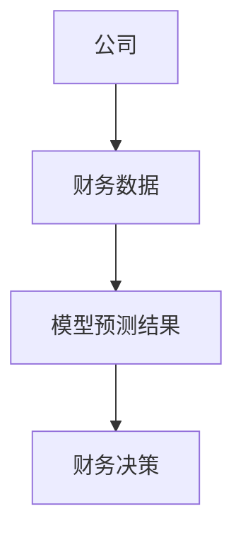
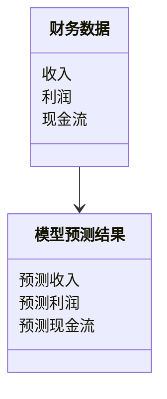
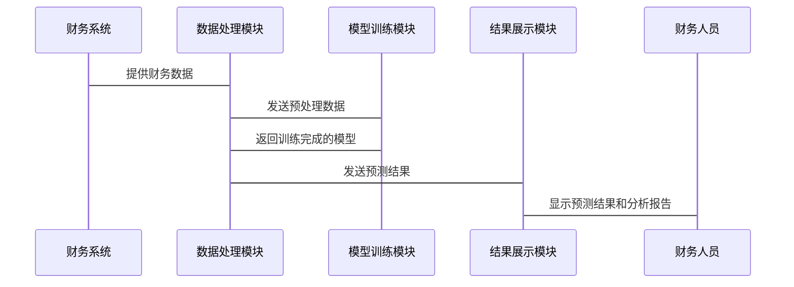

                 


# AI辅助的公司财务报表预测模型

## 关键词
AI, 财务预测, LSTM, 机器学习, 财务报表

## 摘要
随着人工智能技术的迅速发展，AI在财务预测中的应用越来越广泛。本文详细介绍了AI辅助的公司财务报表预测模型的构建过程，涵盖数据预处理、模型选择、算法实现、系统架构设计以及实际案例分析。通过对比传统方法与AI技术的优劣，展示了AI在提升财务预测准确性和效率方面的重要作用。文章还讨论了模型的实际应用场景、优化策略及未来发展方向。

---

## 第一部分: 背景介绍

### #1: 财务报表预测模型的背景与意义

#### 1.1 问题背景

- **1.1.1 财务报表预测模型的定义**
  财务报表预测模型是一种利用历史财务数据和相关业务信息，预测未来财务状况的工具。通过分析收入、利润、现金流等关键指标的变化趋势，帮助企业做出更精准的财务决策。

- **1.1.2 传统财务预测的局限性**
  - 数据依赖性强：传统预测方法通常依赖于线性回归等简单模型，难以捕捉复杂的数据关系。
  - 人工干预多：数据预处理和模型调优需要大量人工参与，效率低下。
  - 预测精度有限：传统方法在处理非线性关系和异常值时表现不佳，导致预测结果不够准确。

- **1.1.3 AI在财务预测中的作用**
  AI技术通过机器学习算法能够自动提取数据特征，发现复杂模式，并提高预测精度。AI的应用不仅提升了预测效率，还能够处理更大规模和复杂度的数据。

#### 1.2 问题描述

- **1.2.1 财务数据的特点**
  财务数据具有时间序列特性，通常表现出趋势、周期性等特征。此外，数据可能包含缺失值、异常值，需要进行预处理。

- **1.2.2 预测目标的确定**
  预测目标可能包括收入、利润、现金流等关键财务指标。选择合适的预测目标对于模型的设计和优化至关重要。

- **1.2.3 数据获取与处理的挑战**
  数据获取过程中可能存在数据不完整、格式不统一等问题。数据处理阶段需要进行清洗、特征提取和标准化等操作。

#### 1.3 问题解决

- **1.3.1 AI技术在财务预测中的应用**
  使用机器学习算法（如LSTM、随机森林）进行预测，能够捕捉数据中的非线性关系，提高预测精度。

- **1.3.2 常见的预测方法**
  - 时间序列分析：ARIMA、LSTM等。
  - 机器学习：随机森林、支持向量机（SVM）。
  - 深度学习：卷积神经网络（CNN）、Transformer模型。

- **1.3.3 模型选择与优化**
  根据数据特点选择合适的算法，通过交叉验证和网格搜索优化模型参数。

#### 1.4 边界与外延

- **1.4.1 模型的适用范围**
  适用于有足够历史数据支持的公司，特别适合预测具有时间序列特性的财务指标。

- **1.4.2 模型的局限性**
  - 数据质量影响预测结果。
  - 模型对异常值和缺失值敏感。
  - 需要定期更新模型以适应市场变化。

- **1.4.3 模型的可扩展性**
  可以通过集成学习、模型融合等方法进一步提升预测精度。

#### 1.5 概念结构与核心要素

- **1.5.1 数据特征**
  包括收入、利润、现金流、行业指数等。

- **1.5.2 模型参数**
  如学习率、层数、节点数等。

- **1.5.3 预测结果**
  如预测值、置信区间、误差分析等。

---

## 第二部分: 核心概念与联系

### #2: AI辅助的财务预测核心概念与联系

#### 2.1 核心概念原理

- **2.1.1 数据预处理**
  包括数据清洗、特征工程、数据标准化等步骤。

- **2.1.2 模型训练**
  使用训练数据拟合模型参数，优化模型性能。

- **2.1.3 模型评估**
  使用验证数据评估模型的预测能力，调整模型参数。

#### 2.2 概念属性特征对比表格

| 概念         | 输入数据 | 目标 | 算法类型 | 输出结果 |
|--------------|----------|------|----------|----------|
| 传统线性回归 | 数值型   | 预测值 | 线性模型  | 预测值    |
| LSTM         | 时间序列 | 预测值 | RNN      | 预测值    |
| 随机森林     | 混合型   | 预测值 | 树模型    | 预测值    |

#### 2.3 ER实体关系图架构的 Mermaid 流程图



---

## 第三部分: 算法原理讲解

### #3: 基于LSTM的时间序列预测模型

#### 3.1 算法原理

- **3.1.1 LSTM结构**
  LSTM（长短期记忆网络）由输入门、遗忘门和输出门组成，能够捕捉时间序列中的长距离依赖关系。

- **3.1.2 模型流程**
  ```mermaid
  graph TD
      A[输入数据] --> B[输入门]
      B --> C[遗忘门]
      C --> D[细胞状态]
      D --> E[输出门]
      E --> F[输出结果]
  ```

- **3.1.3 数学模型**
  $$ \text{输入门} = \sigma(W_{xi}x + W_{hi}h + b_i) $$
  $$ \text{遗忘门} = \sigma(W_{xf}x + W_{hf}h + b_f) $$
  $$ \text{细胞状态} = \text{遗忘门} \odot c + \text{输入门} \odot \tanh(W_{xc}x + W_{hc}h + b_c) $$
  $$ \text{输出门} = \sigma(W_{xo}x + W_{ho}h + b_o) $$
  $$ \text{输出结果} = \text{输出门} \odot \tanh(c) $$

#### 3.2 代码实现

```python
import numpy as np
import pandas as pd
from tensorflow.keras.models import Sequential
from tensorflow.keras.layers import LSTM, Dense, Dropout
from sklearn.preprocessing import MinMaxScaler

# 数据加载与预处理
data = pd.read_csv('financial_data.csv')
data = data['target'].values
data = data.reshape((len(data), 1))

# 数据标准化
scaler = MinMaxScaler()
data_normalized = scaler.fit_transform(data)

# 划分训练集和测试集
train_size = int(len(data_normalized) * 0.7)
train_data = data_normalized[:train_size]
test_data = data_normalized[train_size:]

# 创建训练样本
def create_dataset(data, window_size=5):
    X, y = [], []
    for i in range(len(data) - window_size):
        X.append(data[i:i+window_size])
        y.append(data[i+window_size])
    return np.array(X), np.array(y)

X_train, y_train = create_dataset(train_data, 5)
X_test, y_test = create_dataset(test_data, 5)

# 模型构建
model = Sequential()
model.add(LSTM(50, return_sequences=False, input_shape=(5, 1)))
model.add(Dense(1))
model.compile(optimizer='adam', loss='mean_squared_error')

# 模型训练
model.fit(X_train, y_train, epochs=100, batch_size=32, validation_split=0.2)

# 模型评估
loss = model.evaluate(X_test, y_test, verbose=0)
print(f"损失: {loss}")

# 预测结果
predicted = model.predict(X_test)
predicted_denormalized = scaler.inverse_transform(predicted.reshape(-1, 1))
actual_denormalized = scaler.inverse_transform(y_test.reshape(-1, 1))
```

#### 3.3 算法优化与调优

- **3.3.1 超参数调整**
  - 学习率：使用Adam优化器，学习率设置为0.001。
  - 隐藏层节点数：通过网格搜索确定最佳节点数。
  - 正则化：使用Dropout层防止过拟合。

- **3.3.2 模型评估指标**
  - �均方误差（MSE）
  - 平均绝对误差（MAE）
  - R²分数

---

## 第四部分: 系统分析与架构设计

### #4: 系统分析与架构设计

#### 4.1 问题场景介绍

- **4.1.1 数据收集**
  从财务系统中获取历史财务数据，包括收入、利润、现金流等。

- **4.1.2 数据预处理**
  清洗数据，处理缺失值和异常值，提取特征。

- **4.1.3 模型训练**
  使用预处理后的数据训练AI模型，优化模型参数。

- **4.1.4 结果展示**
  将预测结果可视化，帮助财务人员进行决策。

#### 4.2 系统功能设计

- **4.2.1 领域模型（Mermaid 类图）**


- **4.2.2 系统架构设计（Mermaid 架构图）**
```mermaid
container 数据处理模块 {
    数据清洗
    特征提取
}
container 模型训练模块 {
    LSTM 网络
    参数优化
}
container 结果展示模块 {
    可视化界面
    预测结果
}
数据处理模块 --> 模型训练模块
模型训练模块 --> 结果展示模块
```

- **4.2.3 系统接口设计**
  - 数据接口：从数据库获取数据。
  - 模型接口：接收输入数据，返回预测结果。
  - 展示接口：展示预测结果和误差分析。

- **4.2.4 系统交互流程（Mermaid 序列图）**


---

## 第五部分: 项目实战

### #5: 基于LSTM的财务预测模型实现

#### 5.1 环境安装

```bash
pip install numpy pandas tensorflow scikit-learn
```

#### 5.2 系统核心实现源代码

```python
import numpy as np
import pandas as pd
import matplotlib.pyplot as plt
from tensorflow.keras.models import Sequential
from tensorflow.keras.layers import LSTM, Dense, Dropout
from sklearn.preprocessing import MinMaxScaler

# 数据加载与预处理
data = pd.read_csv('financial_data.csv')
data = data['target'].values
data = data.reshape((len(data), 1))

# 数据标准化
scaler = MinMaxScaler()
data_normalized = scaler.fit_transform(data)

# 划分训练集和测试集
train_size = int(len(data_normalized) * 0.7)
train_data = data_normalized[:train_size]
test_data = data_normalized[train_size:]

# 创建训练样本
def create_dataset(data, window_size=5):
    X, y = [], []
    for i in range(len(data) - window_size):
        X.append(data[i:i+window_size])
        y.append(data[i+window_size])
    return np.array(X), np.array(y)

X_train, y_train = create_dataset(train_data, 5)
X_test, y_test = create_dataset(test_data, 5)

# 模型构建
model = Sequential()
model.add(LSTM(50, return_sequences=False, input_shape=(5, 1)))
model.add(Dense(1))
model.compile(optimizer='adam', loss='mean_squared_error')

# 模型训练
model.fit(X_train, y_train, epochs=100, batch_size=32, validation_split=0.2)

# 模型评估
loss = model.evaluate(X_test, y_test, verbose=0)
print(f"损失: {loss}")

# 预测结果
predicted = model.predict(X_test)
predicted_denormalized = scaler.inverse_transform(predicted.reshape(-1, 1))
actual_denormalized = scaler.inverse_transform(y_test.reshape(-1, 1))

# 可视化结果
plt.plot(predicted_denormalized, color='red', label='Predicted')
plt.plot(actual_denormalized, color='blue', label='Actual')
plt.title('Financial Data Prediction')
plt.xlabel('Time')
plt.ylabel('Value')
plt.legend()
plt.show()
```

#### 5.3 代码应用解读与分析

- **数据加载与预处理**
  使用Pandas加载CSV文件，并提取目标列进行预测。

- **模型构建与训练**
  使用LSTM网络进行训练，优化模型参数，提高预测精度。

- **结果可视化**
  将实际值和预测值进行对比，分析模型的预测能力。

#### 5.4 实际案例分析

- **案例选择**
  选择一家上市公司过去5年的财务数据，预测未来一年的收入。

- **数据准备**
  提取收入数据，进行标准化处理，划分训练集和测试集。

- **模型训练**
  使用LSTM网络进行训练，调整模型参数，优化预测结果。

- **结果分析**
  对比实际收入与预测收入，分析预测误差，评估模型性能。

#### 5.5 项目小结

通过本项目，读者可以掌握AI辅助财务预测的基本流程，包括数据预处理、模型选择、算法实现和结果分析。实际案例展示了LSTM模型在财务预测中的应用，帮助读者更好地理解理论知识。

---

## 第六部分: 最佳实践

### #6: 最佳实践与注意事项

#### 6.1 总结与回顾

- AI技术在财务预测中的应用前景广阔，能够显著提升预测效率和精度。
- 在实际应用中，需要结合业务需求选择合适的算法，优化模型参数。

#### 6.2 小结

- 本文详细介绍了AI辅助的公司财务报表预测模型的构建过程，从数据预处理到模型训练，再到结果分析，帮助读者全面理解AI在财务预测中的作用。

#### 6.3 注意事项

- 数据质量直接影响预测结果，需确保数据的完整性和准确性。
- 模型需要定期更新，以适应市场变化和数据变化。
- 在实际应用中，应结合财务专家的判断，避免过度依赖AI模型。

#### 6.4 未来的发展方向

- **模型优化**：引入更复杂的深度学习模型（如Transformer）提升预测精度。
- **多任务学习**：结合多种财务指标进行联合预测。
- **实时预测**：构建实时预测系统，快速响应市场变化。
- **集成学习**：通过集成多种模型进一步提升预测能力。

#### 6.5 拓展阅读

- 《Deep Learning》—— Ian Goodfellow
- 《Python机器学习》—— Aurélien Géron
- 《时间序列分析》—— 王振东

---

## 作者

作者：AI天才研究院/AI Genius Institute & 禅与计算机程序设计艺术 /Zen And The Art of Computer Programming

