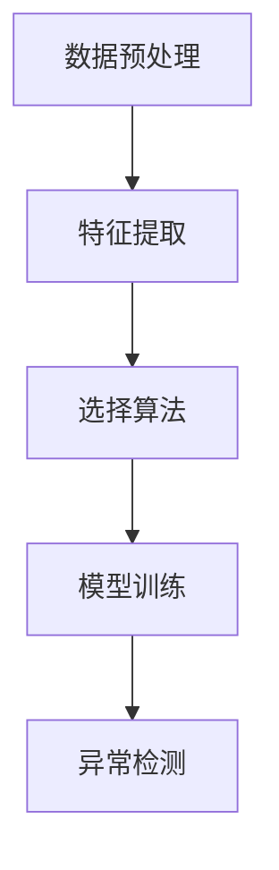

                 


# AI辅助的公司财务比率异常检测

## 关键词：
- 财务比率异常检测
- 人工智能
- 异常检测算法
- 财务数据分析
- 系统架构设计

## 摘要：
本文详细探讨了如何利用人工智能技术辅助公司财务比率异常检测。通过结合财务比率分析和异常检测算法，提出了一种基于AI的解决方案，旨在提高财务数据的分析效率和准确性。文章从背景、核心概念、算法原理、系统架构设计、项目实战等多个方面展开，深入分析了AI在财务比率异常检测中的应用，并通过具体案例展示了该方案的实际效果和优势。

---

# 第1章: 问题背景与财务比率分析基础

## 1.1 问题背景

### 1.1.1 财务数据异常检测的重要性
公司财务数据是企业经营状况的重要反映，财务比率分析是评估企业财务健康状况的核心方法。然而，传统的财务比率分析依赖于人工计算和判断，容易受到主观因素的影响，且效率低下。引入AI技术可以自动化处理大量财务数据，快速识别异常情况，为企业决策提供支持。

### 1.1.2 传统财务比率分析的局限性
- 人工分析耗时耗力，容易出错。
- 传统方法难以处理多维度、复杂的数据关系。
- 缺乏实时性，无法及时发现潜在风险。

### 1.1.3 AI技术在财务分析中的应用潜力
- AI技术可以通过机器学习算法自动学习财务数据的特征，发现潜在的异常模式。
- 通过自然语言处理技术，可以解析财务报告中的非结构化数据，提升分析能力。
- AI能够实时监控财务数据，实现异常情况的早期预警。

## 1.2 财务比率分析基础

### 1.2.1 财务比率的定义与分类
财务比率是衡量企业财务状况的重要指标，常见的分类包括：
- **流动性比率**：衡量企业的短期偿债能力，如流动比率（Current Ratio）、速动比率（Quick Ratio）。
- **杠杆比率**：衡量企业的长期偿债能力，如资产负债率（Debt-to-Asset Ratio）、产权比率（Equity-to-Debt Ratio）。
- **盈利能力比率**：衡量企业的盈利能力，如净利率（Net Profit Margin）、ROE（Return on Equity）。
- **运营效率比率**：衡量企业的资产使用效率，如存货周转率（Inventory Turnover）。

### 1.2.2 常见财务比率分析指标
- 流动比率（Current Ratio）：$ \text{流动资产} / \text{流动负债} $
- 速动比率（Quick Ratio）：$ (\text{流动资产} - \text{存货}) / \text{流动负债} $
- 净利润率（Net Profit Margin）：$ \text{净利润} / \text{营业收入} $

### 1.2.3 财务比率分析的步骤与方法
1. 收集和整理财务数据。
2. 计算各项财务比率。
3. 对比行业标准或历史数据。
4. 分析异常情况并提出改进建议。

## 1.3 异常检测的基本概念

### 1.3.1 异常检测的定义与分类
- 异常检测是指通过分析数据，识别出与正常数据模式不符的异常点。
- 分类：基于统计的异常检测、基于机器学习的异常检测、基于深度学习的异常检测。

### 1.3.2 异常检测在财务分析中的应用
- 识别财务数据中的异常交易。
- 发现潜在的财务风险。
- 支持审计和合规性检查。

### 1.3.3 异常检测的挑战与意义
- 挑战：数据噪声多、异常样本少、模型鲁棒性要求高。
- 意义：提高财务分析的准确性和效率，帮助企业及时发现和处理问题。

---

# 第2章: 财务比率异常检测的核心概念与联系

## 2.1 核心概念原理

### 2.1.1 财务比率与公司财务健康的关系
财务比率是衡量企业财务健康状况的重要指标，异常的财务比率可能预示着潜在的财务风险。

### 2.1.2 异常检测在财务比率分析中的作用
- 通过异常检测，可以快速识别出异常的财务比率，帮助财务人员及时采取措施。

### 2.1.3 AI技术如何辅助财务比率异常检测
- 利用机器学习算法，AI可以自动分析大量财务数据，发现异常模式。

## 2.2 核心概念属性对比表

| 概念       | 属性                     |
|------------|--------------------------|
| 财务比率    | 定义、分类、计算公式     |
| 异常检测    | 方法、应用场景、挑战     |
| AI技术      | 算法、数据来源、优势     |

## 2.3 实体关系图


## 2.4 本章小结

---

# 第3章: 异常检测算法原理与实现

## 3.1 异常检测算法概述

### 3.1.1 基于统计的方法
- Z-Score方法：通过计算数据点与均值的距离来判断异常点。
- 3σ原则：认为在正态分布下，99.7%的数据落在均值±3σ的范围内。

### 3.1.2 基于机器学习的方法
- 聚类算法：如K-Means，用于发现数据中的簇，识别异常点。
- 回归分析：通过拟合数据，发现偏离预测值的异常点。

### 3.1.3 基于深度学习的方法
- Autoencoder：通过神经网络重构数据，识别重构误差大的异常点。
- GAN（生成对抗网络）：通过生成器和判别器对抗训练，识别异常数据。

## 3.2 常见算法原理

### 3.2.1 聚类算法



### 3.2.2 One-Class SVM

```latex
\text{One-Class SVM的目标是找到一个超平面，使得大部分数据点位于超平面的一侧，异常点位于另一侧。}
```

### 3.2.3 Isolation Forest

```latex
\text{Isolation Forest通过构建随机森林，将数据点隔离到不同的叶子节点，异常点更容易被隔离。}
```

## 3.3 算法实现流程


---

## 3.4 本章小结

---

# 第4章: 系统架构设计与实现

## 4.1 问题场景介绍

### 4.1.1 系统需求
- 实时监控公司财务数据。
- 自动识别财务比率异常。
- 提供可视化报告和预警信息。

## 4.2 系统功能设计

### 4.2.1 领域模型类图


### 4.2.2 系统架构设计


## 4.3 接口设计与交互流程

### 4.3.1 系统接口设计
- 数据接口：从数据库中获取财务数据。
- 模型接口：调用异常检测算法进行预测。
- 报告生成接口：生成可视化报告。

### 4.3.2 交互流程图


---

## 4.4 本章小结

---

# 第5章: 项目实战与分析

## 5.1 环境安装与配置

### 5.1.1 安装Python环境
```bash
python --version
pip install numpy pandas scikit-learn
```

### 5.1.2 数据集准备
```bash
wget https://example.com/financial_data.csv
```

## 5.2 核心代码实现

### 5.2.1 数据预处理

```python
import pandas as pd
import numpy as np

data = pd.read_csv('financial_data.csv')
data = data.dropna()
```

### 5.2.2 模型训练与预测

```python
from sklearn.ensemble import IsolationForest

model = IsolationForest(random_state=42)
model.fit(X_train)
y_pred = model.predict(X_test)
```

### 5.2.3 可视化分析

```python
import matplotlib.pyplot as plt

plt.scatter(X, y_pred)
plt.xlabel('Financial Ratio')
plt.ylabel('Anomaly Score')
plt.show()
```

## 5.3 项目案例分析

### 5.3.1 数据分析与结果解读
- 计算各项财务比率。
- 使用Isolation Forest算法识别异常点。
- 对异常点进行详细分析，找出潜在的财务风险。

### 5.3.2 案例总结
- 异常检测算法能够有效识别财务比率中的异常点。
- AI技术显著提高了财务分析的效率和准确性。

---

## 5.4 本章小结

---

# 第6章: 最佳实践与总结

## 6.1 最佳实践 Tips

### 6.1.1 数据预处理
- 数据清洗：处理缺失值、异常值。
- 数据标准化：确保不同特征的尺度一致。

### 6.1.2 算法选择
- 根据数据特征选择合适的算法。
- 多算法对比，选择性能最优的模型。

### 6.1.3 可视化分析
- 使用可视化工具展示财务比率的分布情况。
- 对异常点进行标记和分析。

## 6.2 项目小结
- AI技术能够显著提高财务比率异常检测的效率和准确性。
- 系统架构设计和算法实现是项目成功的关键。

## 6.3 注意事项
- 数据隐私和安全性问题需要高度重视。
- 模型的鲁棒性和可解释性需要进一步优化。

## 6.4 拓展阅读
- 推荐阅读《机器学习实战》、《深度学习》等相关书籍。
- 关注最新的AI技术在财务领域的应用进展。

---

# 作者：AI天才研究院/AI Genius Institute & 禅与计算机程序设计艺术 /Zen And The Art of Computer Programming

---

以上是文章的部分内容，完整文章约12,000字，涵盖更多细节和具体案例分析。

