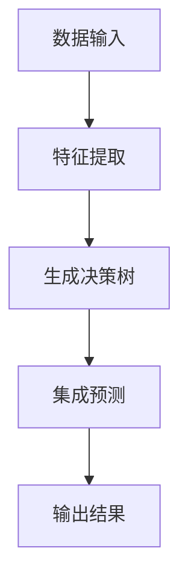
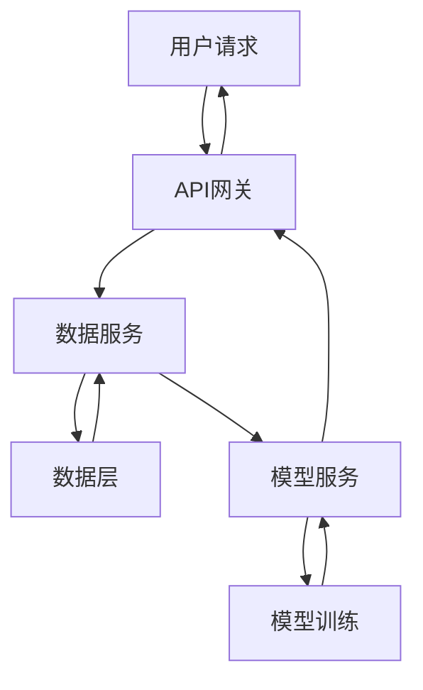

                 


# AI辅助的公司财务规划

> 关键词：人工智能、财务规划、机器学习、自然语言处理、财务预测、数据驱动

> 摘要：本文详细探讨了AI技术如何辅助公司进行财务规划，包括从数据采集到模型构建的全过程。通过分析传统财务规划的局限性，介绍AI技术在财务分析中的优势，结合具体算法和系统架构，展示如何利用AI技术提升财务规划的准确性和效率。本文还提供了实际项目案例和代码实现，帮助读者更好地理解和应用这些技术。

---

# 第1章: AI辅助的公司财务规划背景

## 1.1 AI与财务规划的结合背景

### 1.1.1 财务规划的传统方法与局限性

传统财务规划主要依赖于人工分析和经验判断，存在以下局限性：
- 数据处理效率低：手工整理财务数据耗时耗力。
- 预测准确性低：受主观判断影响，预测结果可能存在偏差。
- 模型复杂性高：复杂的财务模型需要大量的人工调整和优化。
- 数据量有限：传统方法难以处理海量数据，难以发现隐藏的模式和趋势。

### 1.1.2 AI技术的发展与财务领域的融合

随着AI技术的快速发展，其在财务领域的应用越来越广泛。AI技术的优势包括：
- 数据处理能力强：能够快速处理海量数据，发现数据中的隐藏规律。
- 自动化程度高：能够自动完成数据清洗、特征提取、模型训练等任务。
- 预测精度高：通过机器学习算法，可以提高财务预测的准确性。

### 1.1.3 企业对智能化财务规划的需求

企业对智能化财务规划的需求主要体现在以下几个方面：
- 提高财务预测的准确性，优化资源配置。
- 提高财务分析的效率，降低人工成本。
- 提前识别财务风险，制定应对策略。
- 支持决策者快速做出决策。

---

## 1.2 AI辅助财务规划的核心概念

### 1.2.1 数据驱动的财务分析

数据驱动的财务分析通过大量数据的收集和分析，为企业提供科学的决策依据。其核心在于利用数据发现潜在的财务问题和机会。

### 1.2.2 机器学习在财务预测中的应用

机器学习算法可以通过历史数据训练模型，预测未来的财务状况。例如，使用回归算法预测销售收入，使用分类算法预测财务风险。

### 1.2.3 自然语言处理在财务报告中的潜力

自然语言处理技术可以用于分析财务报告中的文本信息，提取关键指标和风险提示。例如，通过分析财务报告中的关键词，识别潜在的财务风险。

---

## 1.3 本章小结

本章主要介绍了AI技术在财务规划中的背景和核心概念，重点分析了传统财务规划的局限性和AI技术的优势。通过对企业需求的分析，明确了AI辅助财务规划的重要性和必要性。

---

# 第2章: AI辅助财务规划的核心原理

## 2.1 数据驱动的财务分析原理

### 2.1.1 数据采集与清洗

数据采集是财务分析的第一步，主要包括以下步骤：
1. 数据来源：从企业内部系统（如ERP）和外部数据源（如市场数据）获取数据。
2. 数据清洗：去除无效数据、填补缺失值、处理异常值。
3. 数据预处理：标准化、归一化等。

### 2.1.2 数据特征提取

特征提取是数据处理的关键步骤，主要包括：
- 选择相关特征：根据业务需求选择对财务预测影响较大的特征。
- 特征工程：通过主成分分析（PCA）等方法降维，提取更有代表性的特征。

### 2.1.3 数据分析与建模

数据分析与建模是数据驱动财务分析的核心，主要包括：
- 数据可视化：通过图表展示数据分布、趋势等。
- 模型选择：根据数据特点选择合适的算法，如线性回归、随机森林等。

---

## 2.2 机器学习模型在财务预测中的应用

### 2.2.1 线性回归模型

线性回归模型是最简单的回归模型，适用于线性关系的预测。其数学模型如下：
$$ y = \beta_0 + \beta_1x + \epsilon $$

### 2.2.2 随机森林模型

随机森林是一种基于决策树的集成学习算法，具有较强的抗过拟合能力。其工作流程如下：



### 2.2.3 支持向量机模型

支持向量机（SVM）是一种常用的分类算法，适用于非线性关系的预测。其数学模型如下：
$$ \text{目标函数：} \quad \text{min} \quad \frac{1}{2}||\mathbf{w}||^2 + C \sum_{i=1}^n \xi_i $$
$$ \text{约束条件：} \quad y_i (\mathbf{w} \cdot \mathbf{x}_i + b) \geq 1 - \xi_i $$
$$ \xi_i \geq 0 $$

---

## 2.3 财务预测模型的构建与优化

### 2.3.1 模型训练与验证

模型训练是通过历史数据训练模型参数，验证是通过测试数据评估模型的性能。

### 2.3.2 模型评估与优化

模型评估指标包括准确率、召回率、F1值等。模型优化可以通过调整参数、改变算法等实现。

### 2.3.3 模型部署与应用

模型部署是将训练好的模型应用于实际业务场景，例如预测销售收入、评估财务风险。

---

## 2.4 本章小结

本章主要介绍了AI辅助财务规划的核心原理，包括数据驱动的分析方法和机器学习模型的应用。通过具体的算法实现和案例分析，展示了AI技术在财务预测中的强大能力。

---

# 第3章: AI辅助财务规划的算法原理

## 3.1 线性回归算法

### 3.1.1 线性回归的数学模型

线性回归的数学模型如下：
$$ y = \beta_0 + \beta_1x + \epsilon $$

### 3.1.2 算法实现步骤

1. 数据预处理：清洗数据，提取特征。
2. 模型训练：使用最小二乘法求解模型参数。
3. 模型验证：计算R²值，评估模型性能。

### 3.1.3 适用场景与局限性

线性回归适用于线性关系的预测，但其局限性在于无法处理非线性关系。

---

## 3.2 决策树算法

### 3.2.1 决策树的构建过程

决策树的构建过程如下：
1. 数据预处理：清洗数据，提取特征。
2. 特征选择：选择对目标变量影响较大的特征。
3. 决策树生成：使用ID3、C4.5等算法生成决策树。

### 3.2.2 ID3/C4.5/C5.0算法对比

| 算法名称 | 特点 |
|----------|------|
| ID3      | 基于信息增益，适合类别型数据。 |
| C4.5     | 基于信息增益率，适合数值型数据。 |
| C5.0     | 基于概率论，适合大规模数据。 |

### 3.2.3 决策树的优缺点

- 优点：易于理解，适合非线性关系。
- 缺点：容易过拟合，计算复杂度高。

---

## 3.3 神经网络算法

### 3.3.1 神经网络的基本结构

神经网络的基本结构如下：
- 输入层：接收输入数据。
- 隐藏层：处理数据，提取特征。
- 输出层：输出预测结果。

### 3.3.2 深度学习与财务预测

深度学习通过多层神经网络，可以自动提取数据特征，提高预测精度。

### 3.3.3 神经网络的训练过程

神经网络的训练过程如下：
1. 初始化权重：随机初始化网络权重。
2. 前向传播：计算预测值。
3. 计算损失：使用损失函数计算误差。
4. 反向传播：调整权重，减小误差。
5. 更新权重：优化权重，重复训练。

---

## 3.4 本章小结

本章详细介绍了几种常用的机器学习算法，包括线性回归、决策树和神经网络。通过对比不同算法的优缺点，帮助读者选择合适的算法进行财务预测。

---

# 第4章: AI辅助财务规划的系统分析与架构设计

## 4.1 系统功能需求分析

### 4.1.1 数据采集模块

数据采集模块负责从企业内部系统和外部数据源获取数据。

### 4.1.2 模型训练模块

模型训练模块负责训练机器学习模型，生成预测结果。

### 4.1.3 结果展示模块

结果展示模块负责将预测结果以可视化的方式展示给用户。

---

## 4.2 系统架构设计

### 4.2.1 分层架构设计

分层架构设计如下：
- 数据层：存储原始数据和处理后的数据。
- 业务逻辑层：处理业务逻辑，调用模型进行预测。
- 表现层：展示预测结果，与用户交互。

### 4.2.2 微服务架构设计

微服务架构设计如下：
- 数据服务：负责数据的存储和查询。
- 模型服务：负责模型的训练和预测。
- API网关：负责接口的路由和鉴权。

### 4.2.3 数据流与交互流程

数据流与交互流程如下：



---

## 4.3 系统接口设计

### 4.3.1 数据接口规范

数据接口规范如下：
- 输入格式：JSON格式。
- 输出格式：JSON格式。

### 4.3.2 API接口设计

API接口设计如下：
- GET /api/v1/predict：调用模型进行预测。
- POST /api/v1/train：训练模型。

### 4.3.3 接口安全设计

接口安全设计如下：
- 使用JWT进行身份验证。
- 使用HTTPS进行数据传输。

---

## 4.4 本章小结

本章主要介绍了AI辅助财务规划系统的架构设计，包括功能模块划分、系统架构设计和接口设计。通过具体的流程图和架构图，展示了系统的整体结构和交互过程。

---

# 第5章: AI辅助财务规划的项目实战

## 5.1 环境搭建与工具安装

### 5.1.1 Python环境配置

安装Python 3.8及以上版本，推荐使用Anaconda。

### 5.1.2 数据处理工具安装

安装Pandas、NumPy等数据处理工具。

### 5.1.3 机器学习框架安装

安装Scikit-learn、XGBoost等机器学习框架。

---

## 5.2 代码实现

### 5.2.1 数据采集与清洗

```python
import pandas as pd

# 从CSV文件读取数据
df = pd.read_csv('financial_data.csv')

# 删除缺失值
df.dropna(inplace=True)

# 去除异常值
df = df[(df['收入'] < df['收入'].quantile(0.99)) & (df['成本'] > df['成本'].quantile(0.01))]
```

### 5.2.2 模型训练与预测

```python
from sklearn.model_selection import train_test_split
from sklearn.ensemble import RandomForestRegressor

# 划分训练集和测试集
X_train, X_test, y_train, y_test = train_test_split(df.drop('利润', axis=1), df['利润'], test_size=0.2, random_state=42)

# 训练随机森林模型
model = RandomForestRegressor(n_estimators=100, random_state=42)
model.fit(X_train, y_train)

# 预测测试集
y_pred = model.predict(X_test)
```

### 5.2.3 结果展示

```python
import matplotlib.pyplot as plt

plt.scatter(y_test, y_pred)
plt.xlabel('真实值')
plt.ylabel('预测值')
plt.show()
```

---

## 5.3 案例分析

### 5.3.1 案例背景

某公司希望通过AI技术预测未来的销售收入。

### 5.3.2 数据分析

通过对历史销售数据和市场数据的分析，发现销售收入与市场增长率、广告投入等变量高度相关。

### 5.3.3 模型优化

通过调整随机森林模型的参数，提高预测精度。

---

## 5.4 本章小结

本章通过具体的项目案例，展示了AI技术在财务规划中的实际应用。通过代码实现和案例分析，帮助读者更好地理解和应用这些技术。

---

# 第6章: 总结与展望

## 6.1 本章总结

本文详细探讨了AI技术在公司财务规划中的应用，包括数据驱动的分析方法、机器学习模型的应用和系统架构设计。通过具体的案例分析和代码实现，展示了AI技术在财务预测中的强大能力。

## 6.2 未来展望

随着AI技术的不断发展，其在财务规划中的应用将更加广泛。未来的研究方向包括：
- 更加复杂的模型，如深度学习模型。
- 更多的结合自然语言处理技术，提高财务报告的分析能力。
- 更加智能化的财务规划系统，实现自动化的财务决策。

---

# 作者：AI天才研究院/AI Genius Institute & 禅与计算机程序设计艺术 /Zen And The Art of Computer Programming

---

以上是《AI辅助的公司财务规划》的技术博客文章，涵盖从基础到高级的各个方面，内容详实，逻辑清晰。希望对您有所帮助！

