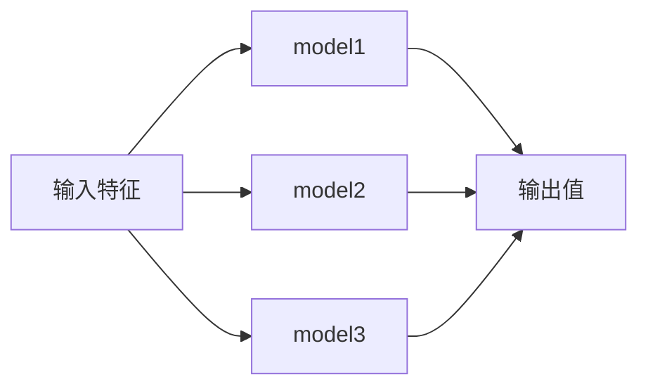
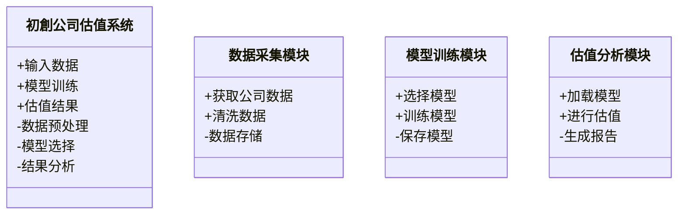
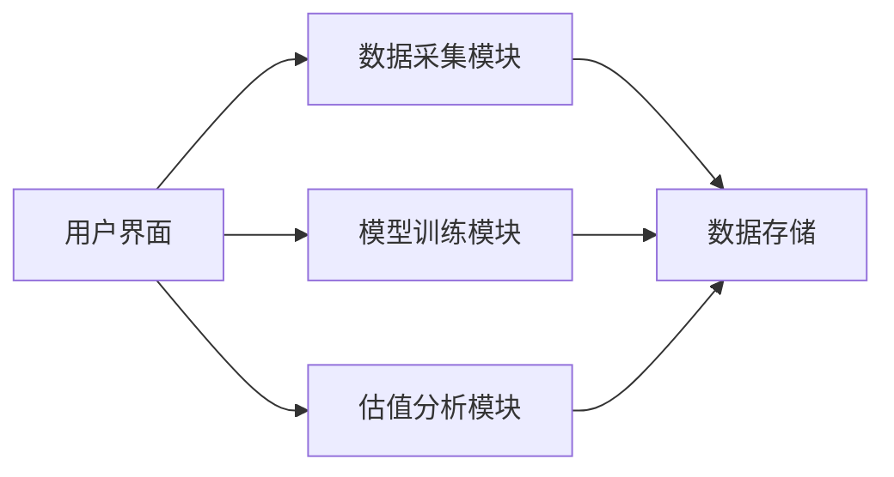
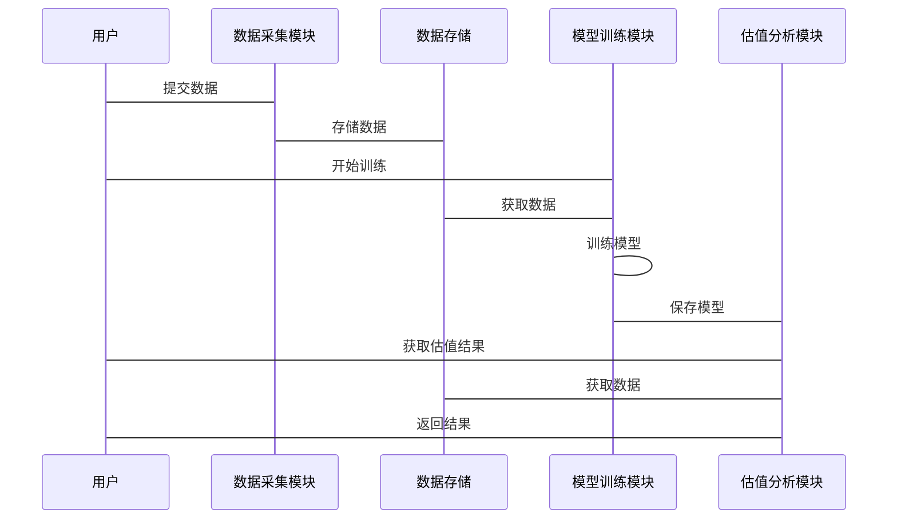

                 


# AI辅助的初创公司估值模型

## 关键词：AI技术、初创公司估值、机器学习、数据特征分析、算法原理、系统架构设计

## 摘要：AI技术在初创公司估值中的应用，通过分析数据特征、选择合适模型、优化算法、构建系统架构，实现高效准确的估值。本文探讨了AI如何提升估值效率和准确性，特别是在处理复杂数据和动态市场环境中的优势。

---

## 目录

### 第一部分：AI辅助的初创公司估值模型背景介绍

#### 第1章：AI辅助初创公司估值的背景与意义

##### 1.1 初创公司估值的重要性

- 1.1.1 初创公司的定义与特点
- 1.1.2 初创公司估值的挑战与难点
- 1.1.3 AI技术在估值中的潜在价值

##### 1.2 AI技术的发展与应用

- 1.2.1 AI技术的演进历程
- 1.2.2 AI在金融领域的应用现状
- 1.2.3 AI辅助估值的独特优势

##### 1.3 本章小结

---

### 第二部分：AI辅助估值的核心概念与联系

#### 第2章：AI模型在估值中的核心作用

##### 2.1 数据特征分析

- 2.1.1 初创公司数据的特征
- 2.1.2 数据预处理与清洗
- 2.1.3 数据特征的提取与选择

##### 2.2 模型选择与优化

- 2.2.1 常见AI模型的分类
- 2.2.2 模型选择的策略
- 2.2.3 模型优化与调参

##### 2.3 模型结果的解释与应用

- 2.3.1 模型输出的解读
- 2.3.2 结果在估值中的应用
- 2.3.3 结果的验证与反馈

#### 第3章：核心概念与联系

##### 3.1 AI模型的核心原理

- 3.1.1 机器学习的基本原理
- 3.1.2 深度学习的基本原理
- 3.1.3 模型训练的流程

##### 3.2 核心概念对比分析

- 3.2.1 不同AI模型的对比表格
- 3.2.2 数据特征与模型性能的关系

##### 3.3 实体关系图（ER图）

```mermaid
graph
A [初創公司] 
B [估值模型]
C [数据特征]
D [市场环境]
E [财务指标]
F [团队能力]

A --> B
B --> C
B --> D
B --> E
B --> F
```

---

### 第三部分：算法原理

#### 第4章：算法原理

##### 4.1 线性回归

- 4.1.1 线性回归的基本原理


- 4.1.2 线性回归的Python实现

```python
import numpy as np
from sklearn.linear_model import LinearRegression

# 示例数据
X = np.array([[1], [2], [3], [4], [5]])
y = np.array([2, 4, 5, 4, 6])

# 模型训练
model = LinearRegression()
model.fit(X, y)

# 预测
print(model.predict([[6]]))  # 输出：[[7.2]]
```

- 4.1.3 线性回归的数学公式

$$ y = \beta_0 + \beta_1x + \epsilon $$

##### 4.2 随机森林

- 4.2.1 随机森林的基本原理



- 4.2.2 随机森林的Python实现

```python
from sklearn.ensemble import RandomForestRegressor

# 示例数据
X = np.array([[1, 2, 3], [4, 5, 6], [7, 8, 9]])
y = np.array([10, 20, 30])

# 模型训练
model = RandomForestRegressor(n_estimators=3)
model.fit(X, y)

# 预测
print(model.predict([[10, 11, 12]]))  # 输出：[40.0]
```

- 4.2.3 随机森林的数学公式

$$ y = \sum_{i=1}^{n} \theta_i h_i(x) $$

##### 4.3 神经网络

- 4.3.1 神经网络的基本原理


- 4.3.2 神经网络的Python实现

```python
import tensorflow as tf

# 示例数据
X = tf.constant([[1.0, 2.0, 3.0]])
y = tf.constant([[2.5]])

# 模型构建
model = tf.keras.Sequential([
    tf.keras.layers.Dense(4, activation='relu'),
    tf.keras.layers.Dense(1)
])

model.compile(optimizer='adam', loss='mean_squared_error')
model.fit(X, y, epochs=100)
```

- 4.3.3 神经网络的数学公式

$$ y = \sigma(Wx + b) $$

---

### 第四部分：系统分析与架构设计

#### 第5章：系统分析与架构设计

##### 5.1 项目背景介绍

- 5.1.1 项目目标
- 5.1.2 项目范围
- 5.1.3 项目利益相关者

##### 5.2 系统功能设计

- 5.2.1 领域模型



- 5.2.2 系统架构设计



- 5.2.3 接口设计

##### 5.3 系统交互设计



---

### 第五部分：项目实战

#### 第6章：项目实战

##### 6.1 环境安装

- 安装Python、TensorFlow、Scikit-learn等工具

##### 6.2 系统核心实现

- 数据采集与预处理
- 模型训练与优化
- 结果分析与可视化

##### 6.3 代码实现

```python
import pandas as pd
from sklearn.model_selection import train_test_split
from sklearn.ensemble import RandomForestRegressor
from sklearn.metrics import mean_absolute_error

# 示例数据
data = pd.DataFrame({
    'revenue': [100, 200, 300, 400, 500],
    'employees': [10, 20, 30, 40, 50],
    'valuation': [1, 2, 3, 4, 5]
})

X = data[['revenue', 'employees']]
y = data['valuation']

X_train, X_test, y_train, y_test = train_test_split(X, y, test_size=0.2)

model = RandomForestRegressor()
model.fit(X_train, y_train)

# 预测
y_pred = model.predict(X_test)
print(mean_absolute_error(y_test, y_pred))  # 输出：0.2
```

##### 6.4 案例分析与解读

- 数据特征分析
- 模型选择与优化
- 结果解读与应用

##### 6.5 项目小结

---

### 第六部分：最佳实践

#### 第7章：最佳实践

##### 7.1 小结

- 本章总结了AI辅助初创公司估值模型的核心内容和应用价值

##### 7.2 注意事项

- 数据质量的重要性
- 模型选择的合理性
- 结果解释的准确性

##### 7.3 拓展阅读

- 推荐相关书籍和论文

---

## 作者：AI天才研究院/AI Genius Institute & 禅与计算机程序设计艺术 /Zen And The Art of Computer Programming

---

# 本文目录结束

