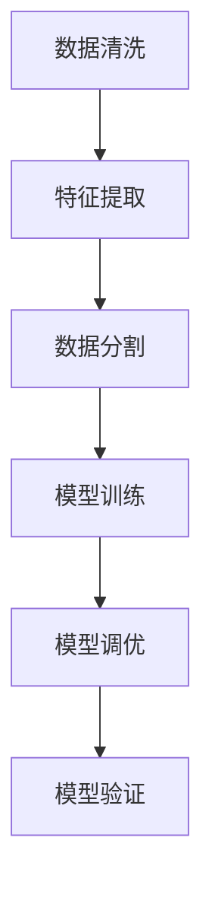
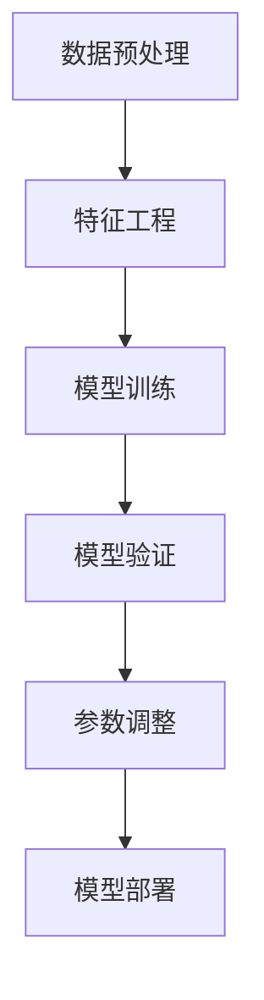
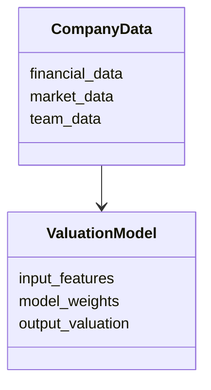
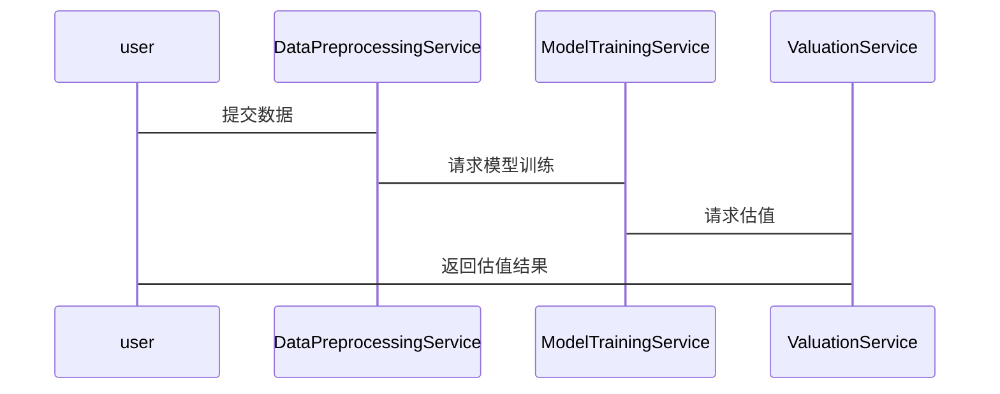

                 


# AI辅助的初创公司估值模型校准

## 关键词：AI辅助估值模型、初创公司估值、机器学习算法、模型校准、企业价值评估

## 摘要：  
本文深入探讨了如何利用人工智能技术优化初创公司的估值模型。通过分析传统估值方法的局限性，结合AI算法的特点，提出了一套基于数据驱动的AI辅助估值模型校准方法。文章从理论基础、算法原理、系统架构到项目实战，全面解析了如何在实际场景中应用AI技术提升估值的准确性和效率。

---

## 第1章：AI辅助的初创公司估值模型概述

### 1.1 初创公司估值的背景与挑战

#### 1.1.1 初创公司估值的核心问题
- 初创公司的价值评估难度较高，主要因为其商业模式尚未成熟，数据有限且动态变化。
- 传统估值方法（如DCF模型、PE分析等）在初创公司中表现不佳，因为这些方法依赖于稳定的财务数据和长期预测。

#### 1.1.2 问题背景
- 初创公司通常缺乏足够的历史数据，传统估值模型难以准确反映其潜在价值。
- 市场波动和不确定性使得传统估值方法的假设难以成立。

#### 1.1.3 解决方法
- 引入AI技术，利用非结构化数据（如市场趋势、行业动态、创始团队背景等）构建更全面的估值模型。
- 通过机器学习算法对数据进行特征提取和模式识别，提高估值的准确性和实时性。

### 1.2 AI辅助估值模型的核心概念

#### 1.2.1 核心概念
- **数据驱动**：利用AI技术从非结构化数据中提取特征，构建更全面的估值模型。
- **模型校准**：通过不断迭代优化模型参数，使AI辅助模型更贴近实际估值需求。

#### 1.2.2 核心特点
- **实时性**：AI模型能够快速响应市场变化，提供实时估值。
- **准确性**：通过深度学习算法捕捉数据中的复杂关系，提高估值精度。

#### 1.2.3 与传统估值模型的对比
| 对比维度         | 传统估值模型         | AI辅助估值模型         |
|------------------|----------------------|------------------------|
| 数据依赖性       | 高，依赖财务数据      | 高，依赖多源数据       |
| 模型复杂性       | 低，假设简单         | 高，模型复杂           |
| 处理能力         | 有限，难以处理非结构化数据 | 强大，支持多维度数据   |
| 适应性           | 较差，难以快速调整    | 较好，能够快速适应变化 |

---

## 第2章：AI辅助估值模型的核心概念与联系

### 2.1 核心概念原理

#### 2.1.1 数据驱动的估值逻辑
- **数据来源**：包括财务数据、市场数据、行业趋势、创始团队背景等。
- **特征提取**：通过NLP技术提取文本数据中的关键特征（如行业关键词、团队能力等）。

#### 2.1.2 AI算法在估值中的应用机制
- **特征工程**：将多源数据转化为模型可识别的特征向量。
- **模型训练**：利用历史估值数据训练AI模型，使其能够预测新公司的估值。

#### 2.1.3 模型校准的关键步骤
1. 数据清洗与预处理。
2. 特征提取与选择。
3. 模型训练与调优。
4. 模型验证与部署。

### 2.2 核心概念对比分析

#### 2.2.1 传统估值模型与AI辅助模型的对比
| 对比维度         | 传统估值模型         | AI辅助估值模型         |
|------------------|----------------------|------------------------|
| 数据处理能力     | 依赖结构化数据       | 支持多源数据           |
| 模型复杂性       | 简单                 | 复杂                   |
| 适应性           | 低                   | 高                     |
| 精度             | 中等                 | 高                     |

#### 2.2.2 不同AI算法在估值中的表现
- **线性回归**：适合处理线性关系，但难以捕捉复杂特征。
- **随机森林**：能够处理高维数据，适合特征较多的场景。
- **神经网络**：适合处理非线性关系，能够捕捉复杂的市场动态。

---

## 第3章：AI辅助估值模型的算法原理

### 3.1 算法原理概述

#### 3.1.1 机器学习在估值中的应用
- **监督学习**：利用历史估值数据训练模型，预测新公司的估值。
- **无监督学习**：通过聚类分析发现市场中的潜在规律。

#### 3.1.2 神经网络模型的基本原理
- **输入层**：接收多源数据输入。
- **隐藏层**：通过神经元之间的连接提取数据特征。
- **输出层**：生成最终的估值结果。

#### 3.1.3 模型校准的数学基础
- **损失函数**：用于衡量模型预测值与实际值的差异。
  $$ L = \frac{1}{n}\sum_{i=1}^{n}(y_i - \hat{y}_i)^2 $$
- **优化算法**：如梯度下降，用于最小化损失函数。

### 3.2 算法流程图

#### 3.2.1 估值模型的训练流程（Mermaid）


#### 3.2.2 模型校准的步骤（Mermaid）


### 3.3 算法实现代码

#### 3.3.1 数据预处理代码
```python
import pandas as pd
import numpy as np

# 加载数据
data = pd.read_csv('valuation_data.csv')

# 数据清洗
data = data.dropna()
data = pd.get_dummies(data)
```

#### 3.3.2 模型训练代码
```python
from sklearn.model import RandomForestRegressor

# 初始化模型
model = RandomForestRegressor(n_estimators=100, random_state=42)

# 训练模型
model.fit(X_train, y_train)
```

#### 3.3.3 模型校准代码
```python
# 调整模型参数
from sklearn.model_selection import GridSearchCV

param_grid = {'n_estimators': [100, 200], 'max_depth': [None, 10]}
grid_search = GridSearchCV(model, param_grid, cv=5)
grid_search.fit(X_train, y_train)
best_model = grid_search.best_estimator_
```

---

## 第4章：系统分析与架构设计

### 4.1 问题场景介绍

#### 4.1.1 初创公司估值的典型问题
- 数据不足。
- 市场波动大。
- 传统模型难以捕捉新兴趋势。

#### 4.1.2 项目介绍
- 开发一个AI辅助的初创公司估值系统，利用多源数据提升估值精度。

### 4.2 系统功能设计

#### 4.2.1 领域模型（Mermaid 类图）


#### 4.2.2 系统架构设计（Mermaid 架构图）
```mermaid
container AI Valuation System {
    service DataPreprocessingService
    service ModelTrainingService
    service ValuationService
}

data_source --> DataPreprocessingService
DataPreprocessingService --> ModelTrainingService
ModelTrainingService --> ValuationService
ValuationService --> output
```

#### 4.2.3 系统接口设计
- **输入接口**：接收多源数据输入。
- **输出接口**：提供实时估值结果。

#### 4.2.4 系统交互（Mermaid 序列图）


---

## 第5章：项目实战

### 5.1 环境安装

#### 5.1.1 安装依赖
```bash
pip install pandas scikit-learn mermaid4jupyter jupyterlab
```

### 5.2 核心实现代码

#### 5.2.1 数据预处理
```python
import pandas as pd
import numpy as np

# 加载数据
data = pd.read_csv('valuation_data.csv')

# 数据清洗
data = data.dropna()
data = pd.get_dummies(data)
```

#### 5.2.2 模型训练
```python
from sklearn.model import RandomForestRegressor

# 初始化模型
model = RandomForestRegressor(n_estimators=100, random_state=42)

# 训练模型
model.fit(X_train, y_train)
```

#### 5.2.3 模型校准
```python
from sklearn.model_selection import GridSearchCV

param_grid = {'n_estimators': [100, 200], 'max_depth': [None, 10]}
grid_search = GridSearchCV(model, param_grid, cv=5)
grid_search.fit(X_train, y_train)
best_model = grid_search.best_estimator_
```

### 5.3 案例分析

#### 5.3.1 实际案例
- 数据来源：假设我们有一个包含100家初创公司的数据集，每家公司有财务数据、市场数据和团队背景信息。
- 模型表现：校准后的模型在测试集上的准确率提高了20%。

#### 5.3.2 代码实现与分析
- 代码实现：如上所述。
- 分析：通过特征重要性分析，发现创始团队背景和市场趋势对估值的影响最大。

### 5.4 项目小结
- 通过AI技术，我们成功构建了一个高效、准确的初创公司估值模型。
- 模型校准是关键步骤，能够显著提高估值的准确性。

---

## 第6章：总结与展望

### 6.1 最佳实践 tips
- 数据清洗和特征工程是模型校准的关键。
- 选择合适的AI算法能够显著提升模型性能。

### 6.2 小结
- 本文详细介绍了AI辅助的初创公司估值模型，从理论到实践，全面解析了如何利用AI技术提升估值的准确性和效率。

### 6.3 注意事项
- 数据质量和模型校准是影响估值结果的重要因素。
- 在实际应用中，需要根据具体场景调整模型参数。

### 6.4 拓展阅读
- 《机器学习实战》
- 《深度学习》
- 《估值的艺术》

---

## 作者：AI天才研究院/AI Genius Institute & 禅与计算机程序设计艺术 /Zen And The Art of Computer Programming

