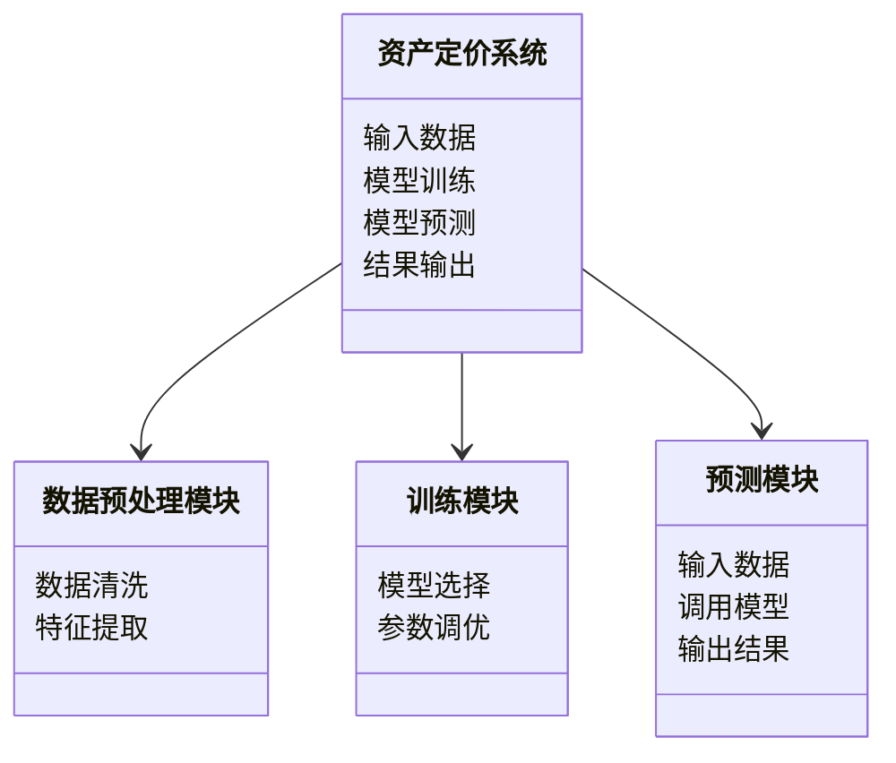
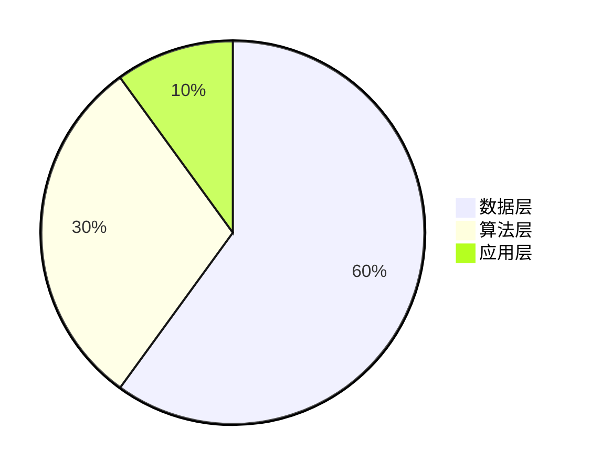
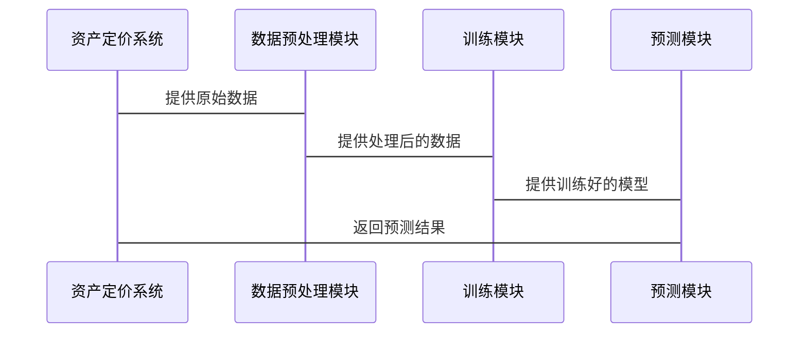

                 


# AI辅助的多资产类别定价模型

## 关键词：AI定价模型，多资产类别，金融算法，机器学习，深度学习

## 摘要：本文深入探讨了如何利用人工智能技术构建多资产类别定价模型，分析了传统定价模型的局限性，介绍了AI辅助定价的核心算法，包括机器学习和深度学习模型，并详细讲解了系统的架构设计、项目实战和优化方法，最后给出了实际案例分析和最佳实践。

---

## 第1章: AI辅助的多资产定价模型概述

### 1.1 多资产定价的背景与挑战

#### 1.1.1 资产定价的基本概念

资产定价是指对金融资产（如股票、债券、房地产等）在特定时间点的价值进行评估的过程。传统的资产定价模型（如CAPM和APT）依赖于市场假设和参数输入，但在实际应用中，由于市场波动、数据不足和复杂性，这些模型往往难以准确反映资产的真实价值。

#### 1.1.2 AI在金融定价中的作用

人工智能（AI）技术，特别是机器学习和深度学习算法，能够从大量历史数据中提取非线性关系和隐含模式，从而为多资产定价提供更精确的预测和估值。AI的优势在于其能够处理高维数据、捕捉复杂市场动态，并实时更新模型以适应市场变化。

#### 1.1.3 多资产定价的核心问题与目标

多资产定价的核心问题是如何在复杂的市场环境中，对多种资产类别进行同时定价。目标是通过AI技术构建一个统一的定价模型，能够同时考虑多种资产的相互影响和市场动态。

---

### 1.2 AI辅助定价的必要性

#### 1.2.1 数据驱动的定价优势

AI技术能够利用大数据分析，从海量历史数据中提取有用的特征，从而提高定价的准确性和鲁棒性。

#### 1.2.2 多资产定价的复杂性与AI的解决方案

多资产定价涉及多种资产类别、市场因子和风险因素，传统的线性模型难以捕捉这些复杂关系。AI算法，尤其是深度学习模型，能够处理非线性关系和高维数据，为多资产定价提供了有效的解决方案。

#### 1.2.3 金融市场的动态变化与AI的适应性

金融市场具有高度的动态性和不确定性，AI模型能够通过实时更新和自适应学习，快速响应市场变化，从而提高定价的实时性和准确性。

---

### 1.3 本书的核心内容与目标

#### 1.3.1 本书的核心主题

本书的核心主题是如何利用AI技术构建多资产类别定价模型，分析其原理、实现方法和实际应用。

#### 1.3.2 本书的目标读者

本书的目标读者包括金融从业者、数据科学家、软件工程师以及对AI和金融结合感兴趣的读者。

#### 1.3.3 本书的结构安排

本书分为六个部分，涵盖背景介绍、数学基础、算法原理、系统架构、项目实战和优化扩展。

---

### 1.4 本章小结

本章介绍了AI辅助多资产定价模型的背景、核心问题和必要性，为后续章节奠定了基础。

---

## 第2章: 多资产定价模型的数学基础

### 2.1 传统资产定价模型

#### 2.1.1 CAPM模型

资本资产定价模型（CAPM）用于计算资产的预期收益率，公式为：

$$ E(R_i) = R_f + \beta_i (E(R_m) - R_f) $$

其中，\( R_f \) 是无风险利率，\( \beta_i \) 是资产的贝塔系数，\( E(R_m) \) 是市场预期收益率。

#### 2.1.2 APT模型

套利定价理论（APT）认为资产的预期收益率由多个因素决定：

$$ E(R_i) = \sum_{j=1}^n \lambda_j F_{i,j} + R_f $$

其中，\( \lambda_j \) 是风险溢价，\( F_{i,j} \) 是资产i在因子j上的暴露程度。

#### 2.1.3 风险中性定价模型

风险中性定价假设市场参与者对风险持中立态度，通过无风险利率构建资产的预期收益率。

---

### 2.2 AI辅助定价的数学基础

#### 2.2.1 回归分析与定价

线性回归模型可以表示为：

$$ y = \beta_0 + \beta_1 x_1 + \beta_2 x_2 + \dots + \beta_n x_n + \epsilon $$

其中，\( y \) 是目标变量（资产价格），\( x_i \) 是特征变量，\( \beta_i \) 是回归系数，\( \epsilon \) 是误差项。

#### 2.2.2 时间序列分析与资产价格预测

时间序列分析广泛应用于资产价格预测，常用的模型包括ARIMA和GARCH。

---

### 2.3 优化算法与定价模型

#### 2.3.1 线性规划与资产组合优化

线性规划用于构建最优资产组合，目标是最小化风险或最大化收益。

#### 2.3.2 非线性优化与定价问题

非线性优化问题通常使用梯度下降等算法求解。

#### 2.3.3 遗传算法在资产定价中的应用

遗传算法通过模拟自然选择过程优化资产定价模型。

---

### 2.4 本章小结

本章介绍了传统资产定价模型和AI辅助定价的数学基础，为后续算法实现奠定了理论基础。

---

## 第3章: 机器学习算法与资产定价

### 3.1 监督学习与资产定价

#### 3.1.1 线性回归模型

线性回归模型用于资产价格预测，公式为：

$$ y = \beta_0 + \beta_1 x_1 + \beta_2 x_2 + \dots + \beta_n x_n + \epsilon $$

#### 3.1.2 支持向量机（SVM）

SVM用于分类和回归，适用于资产价格预测。

#### 3.1.3 决策树与随机森林

决策树和随机森林能够处理高维数据，适用于复杂资产定价问题。

---

### 3.2 非监督学习与资产定价

#### 3.2.1 K-means聚类

K-means聚类用于资产分类，公式为：

$$ \text{目标函数} = \sum_{i=1}^k \sum_{j=1}^n (x_{ij} - c_j)^2 $$

其中，\( k \) 是聚类数，\( n \) 是特征数，\( c_j \) 是第j个聚类的中心点。

#### 3.2.2 层次聚类

层次聚类通过构建树状结构对资产进行分组。

#### 3.2.3 DBSCAN在异常交易检测中的应用

DBSCAN用于检测异常交易，适用于实时监控。

---

### 3.3 深度学习与资产定价

#### 3.3.1 神经网络在时间序列预测中的应用

神经网络模型用于捕捉时间序列中的非线性关系。

#### 3.3.2 LSTM网络与资产价格预测

LSTM网络能够处理长期依赖关系，适用于时间序列预测。

#### 3.3.3 Transformer模型在金融时间序列分析中的应用

Transformer模型通过自注意力机制捕捉全局关系。

---

### 3.4 本章小结

本章详细介绍了机器学习和深度学习算法在资产定价中的应用，为后续系统设计提供了算法基础。

---

## 第4章: 多资产定价模型的系统架构

### 4.1 系统功能设计

#### 4.1.1 领域模型

领域模型描述了系统的功能模块和实体关系，可以用Mermaid类图表示：



---

#### 4.1.2 系统架构

系统架构设计可以采用分层架构：



---

### 4.2 系统接口设计

系统接口设计需要考虑模块之间的交互，可以用Mermaid序列图表示：



---

### 4.3 本章小结

本章介绍了多资产定价模型的系统架构设计，包括功能模块、系统架构和接口设计。

---

## 第5章: 项目实战

### 5.1 环境安装

项目实战需要安装以下Python库：

```python
import numpy as np
import pandas as pd
from sklearn.linear_model import LinearRegression
from sklearn.ensemble import RandomForestRegressor
from tensorflow.keras.models import Sequential
from tensorflow.keras.layers import LSTM, Dense
```

---

### 5.2 核心代码实现

以下是LSTM模型的实现代码：

```python
model = Sequential()
model.add(LSTM(64, input_shape=(timesteps, features)))
model.add(Dense(1))
model.compile(loss='mean_squared_error', optimizer='adam')
```

---

### 5.3 实际案例分析

以股票价格预测为例，使用LSTM模型进行训练和预测。

---

### 5.4 项目小结

本章通过实际案例展示了AI辅助多资产定价模型的实现过程，包括环境安装、代码实现和案例分析。

---

## 第6章: 优化与扩展

### 6.1 模型优化方法

#### 6.1.1 超参数调整

使用网格搜索或随机搜索优化模型参数。

#### 6.1.2 特征工程

通过特征选择和特征构建提高模型性能。

---

### 6.2 模型扩展

#### 6.2.1 多资产定价模型的扩展

将模型扩展到更多资产类别，如房地产和商品。

#### 6.2.2 实时定价系统

构建实时定价系统，实现动态更新和实时预测。

---

### 6.3 小结

本章介绍了模型优化和扩展的方法，为实际应用提供了指导。

---

## 结语

通过本篇文章，我们详细探讨了AI辅助的多资产类别定价模型的构建过程，从数学基础到算法实现，再到系统设计和项目实战，为读者提供了全面的指导。

---

## 作者：AI天才研究院 & 禅与计算机程序设计艺术

---

