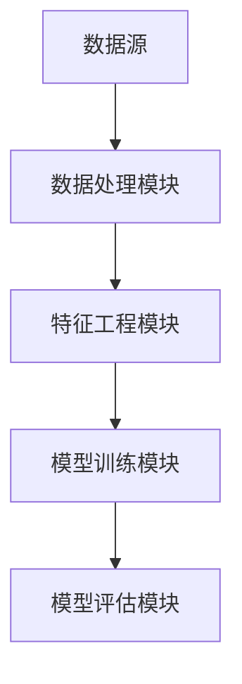
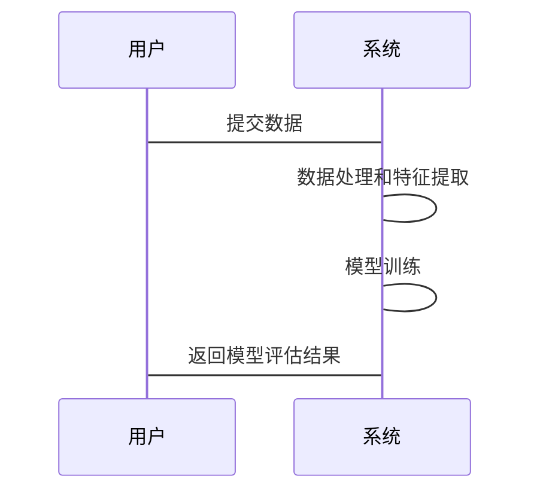

                 


# AI辅助的多资产类别定价模型校准

> **关键词**: AI, 多资产定价, 模型校准, 机器学习, 深度学习

> **摘要**: 本文探讨了如何利用人工智能技术辅助多资产类别定价模型的校准过程。通过结合机器学习和深度学习算法，分析多资产定价的复杂性，提出有效的校准方法，并通过实际案例展示其应用效果。文章从基础概念、算法原理到系统设计和项目实战，全面解析AI在多资产定价中的作用。

---

# 第一部分: AI辅助的多资产类别定价模型校准基础

---

## 第1章: AI与多资产类别定价概述

### 1.1 AI技术的基本概念

#### 1.1.1 人工智能的定义与特点
人工智能（Artificial Intelligence, AI）是指通过计算机模拟人类智能的技术，包括学习、推理、自我改进等功能。其特点包括数据驱动、算法复杂性和应用场景多样性。

#### 1.1.2 多资产类别定价的基本概念
多资产类别定价涉及股票、债券、外汇等多种资产的定价问题，每个资产类别具有独特的市场行为和风险特征。

#### 1.1.3 AI在多资产定价中的作用
AI能够处理海量数据，识别复杂模式，提高定价模型的准确性和效率。

---

### 1.2 定价模型校准的背景与挑战

#### 1.2.1 资产定价的基本原理
资产定价基于市场预期、风险偏好和经济指标等因素，传统方法依赖统计模型，但难以应对多资产的复杂性。

#### 1.2.2 校准定价模型的复杂性
校准模型需解决参数估计、模型选择和数据不足等问题，传统方法效率低下。

#### 1.2.3 AI技术如何解决校准难题
AI通过机器学习算法自动优化参数，提高校准效率和准确性。

---

### 1.3 多资产类别定价的复杂性

#### 1.3.1 不同资产类别的特点
股票、债券、外汇等资产具有不同的波动性和风险特性，需分别建模。

#### 1.3.2 市场波动性的影响
市场波动会导致资产价格剧烈变化，增加定价模型的复杂性。

#### 1.3.3 多资产定价模型的多样性
不同模型适用于不同资产类别，需综合考虑其优缺点。

---

### 1.4 本章小结
本章介绍了AI在多资产定价中的作用，分析了校准模型的挑战，并强调了AI技术的重要性。

---

## 第2章: 定价模型校准的核心概念

### 2.1 定价模型的基本原理

#### 2.1.1 定价模型的分类
定价模型包括单因素模型、多因素模型和非线性模型。

#### 2.1.2 校准模型的目标
通过最小化预测与实际价格差异，优化模型参数。

#### 2.1.3 模型的适用性与局限性
模型适用于特定场景，但需考虑数据质量和市场变化。

---

### 2.2 AI辅助校准的核心技术

#### 2.2.1 机器学习在模型校准中的应用
监督学习用于回归分析，无监督学习用于聚类分析。

#### 2.2.2 深度学习在复杂模型中的优势
深度学习能够捕捉复杂特征，提高模型准确性。

#### 2.2.3 AI辅助校准的流程与步骤
包括数据准备、模型训练、参数优化和结果验证。

---

### 2.3 多资产类别定价的数学模型

#### 2.3.1 线性回归模型
$$ y = \beta_0 + \beta_1x_1 + \beta_2x_2 + \ldots + \beta_nx_n + \epsilon $$

#### 2.3.2 时间序列模型
使用ARIMA模型预测资产价格。

#### 2.3.3 非线性定价模型
如随机森林和神经网络模型。

---

### 2.4 本章小结
本章详细介绍了定价模型的基本原理和AI辅助校准的技术，为后续分析奠定基础。

---

## 第3章: 机器学习在定价模型校准中的应用

### 3.1 机器学习的基本原理

#### 3.1.1 监督学习与非监督学习
监督学习用于分类和回归，非监督学习用于聚类和降维。

#### 3.1.2 算法选择与特征工程
特征工程包括数据清洗和特征提取，影响模型性能。

#### 3.1.3 模型评估与优化
通过交叉验证和超参数调优提升模型性能。

---

### 3.2 常见机器学习算法在定价中的应用

#### 3.2.1 线性回归
用于预测资产价格，公式如上。

#### 3.2.2 支持向量机
通过最大-margin分类实现资产分类。

#### 3.2.3 随机森林
用于特征重要性分析和模型解释。

---

### 3.3 基于机器学习的定价模型校准流程

#### 3.3.1 数据收集与预处理
包括数据清洗和特征标准化。

#### 3.3.2 模型训练与验证
通过训练集和验证集优化模型参数。

#### 3.3.3 模型评估与部署
评估模型性能并部署到实际应用中。

---

### 3.4 本章小结
本章详细讲解了机器学习在定价模型校准中的应用，展示了不同算法的优势。

---

# 第四部分: 项目实战与案例分析

---

## 第4章: 多资产定价模型的系统设计与实现

### 4.1 项目介绍
介绍多资产定价模型的开发背景和目标。

### 4.2 系统功能设计

#### 4.2.1 数据收集模块
收集股票、债券等资产的历史价格数据。

#### 4.2.2 特征工程模块
提取特征并进行数据预处理。

#### 4.2.3 模型训练模块
训练机器学习模型并优化参数。

#### 4.2.4 模型评估模块
评估模型性能并部署到生产环境。

---

### 4.3 系统架构设计

#### 4.3.1 系统架构图
使用Mermaid绘制系统架构图，展示各模块之间的关系。



---

### 4.4 系统接口设计

#### 4.4.1 数据接口
定义数据输入格式和接口调用方式。

#### 4.4.2 模型接口
定义模型调用接口和返回结果格式。

---

### 4.5 系统交互设计

#### 4.5.1 用户界面设计
展示模型训练进度和评估结果。

#### 4.5.2 系统流程图
使用Mermaid绘制系统交互流程图。



---

## 第5章: 项目实战与案例分析

### 5.1 环境安装
安装Python、TensorFlow和Scikit-learn等工具。

### 5.2 核心实现代码

#### 5.2.1 数据处理代码
```python
import pandas as pd

# 读取数据
data = pd.read_csv('assets.csv')

# 数据清洗
data.dropna(inplace=True)

# 标准化处理
from sklearn.preprocessing import StandardScaler
scaler = StandardScaler()
data_scaled = scaler.fit_transform(data)
```

#### 5.2.2 模型训练代码
```python
from sklearn.ensemble import RandomForestRegressor
from sklearn.metrics import mean_squared_error

# 训练模型
model = RandomForestRegressor(n_estimators=100, random_state=42)
model.fit(X_train, y_train)

# 模型评估
y_pred = model.predict(X_test)
print('均方误差:', mean_squared_error(y_test, y_pred))
```

---

### 5.3 实际案例分析

#### 5.3.1 股票定价
分析股票价格预测模型的效果。

#### 5.3.2 债券定价
评估债券定价模型的准确性。

#### 5.3.3 外汇定价
展示模型在外汇市场中的应用效果。

---

### 5.4 项目小结
总结项目经验，分析模型的优势和改进方向。

---

## 第6章: 总结与展望

### 6.1 本章总结
回顾全文，总结AI在多资产定价模型校准中的应用。

### 6.2 最佳实践与注意事项
强调数据质量、模型选择和调优的重要性。

### 6.3 未来研究方向
提出未来的研究重点，如更复杂的深度学习模型和多模态数据融合。

---

# 作者

作者：AI天才研究院/AI Genius Institute & 禅与计算机程序设计艺术 /Zen And The Art of Computer Programming

