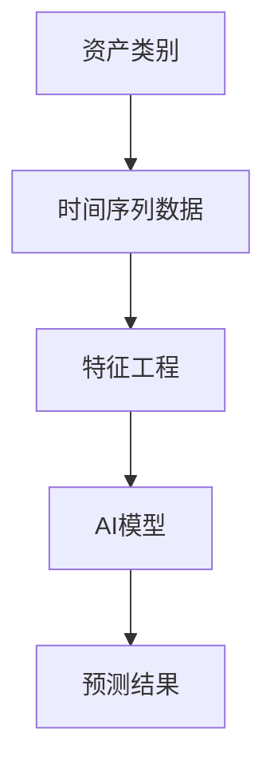
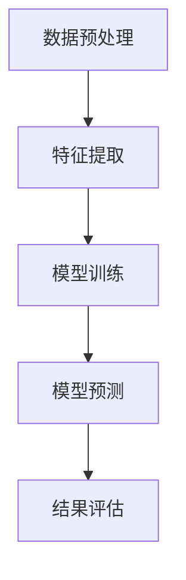
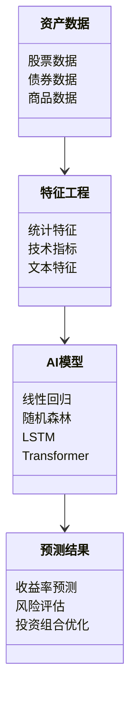
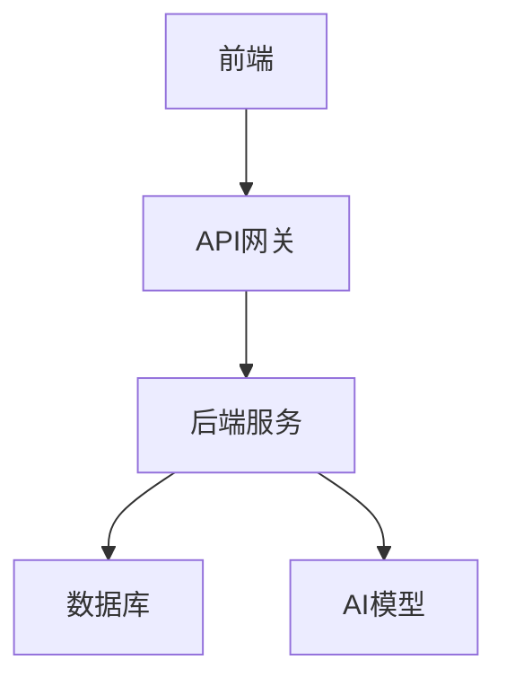
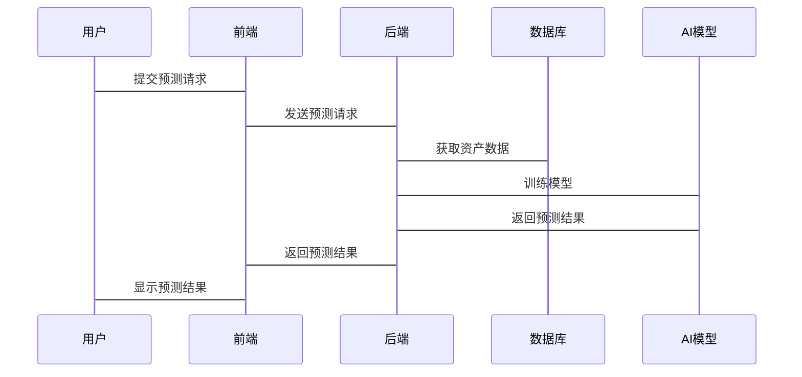

                 


# AI辅助的多资产类别收益率预测

> 关键词：AI，多资产类别，收益率预测，机器学习，深度学习，金融时间序列

> 摘要：本文探讨了AI技术在多资产类别收益率预测中的应用，分析了传统金融模型的局限性，并详细介绍了基于机器学习和深度学习的预测方法。通过实际案例分析，展示了如何利用AI技术构建高效、准确的多资产类别收益率预测系统，为金融从业者和数据科学家提供了理论依据和实践指导。

---

# 第1章: 背景介绍

## 1.1 问题背景

### 1.1.1 多资产类别收益率预测的定义
多资产类别收益率预测是指利用AI技术对股票、债券、基金、商品等多种资产类别的未来收益率进行预测。随着金融市场复杂性的增加，传统的金融模型难以捕捉非线性关系和复杂市场动态，AI技术的引入为解决这一问题提供了新的可能性。

### 1.1.2 传统金融模型的局限性
- **线性假设**：传统模型（如CAPM、APT）假设资产收益与市场收益呈线性关系，难以应对实际市场中的非线性波动。
- **数据维度**：传统模型通常依赖少量特征，难以充分利用大数据的优势。
- **黑天鹅事件**：传统模型在极端市场条件下表现不佳，难以应对突发事件。

### 1.1.3 AI技术在金融领域的应用现状
AI技术已在金融领域得到了广泛应用，尤其是在高频交易、风险评估和市场预测方面。然而，多资产类别收益率预测仍面临数据异质性高、模型泛化能力不足等挑战。

## 1.2 问题描述

### 1.2.1 多资产类别预测的核心挑战
- **数据异质性**：不同资产类别的数据特征差异显著，难以统一建模。
- **市场动态变化**：金融市场受宏观经济因素和突发事件影响，模型需要具备良好的适应性。
- **模型可解释性**：AI模型的黑箱特性使得解释预测结果变得困难。

### 1.2.2 数据特征与模型选择的关系
- **数据特征**：资产类别、时间序列、市场情绪等特征对模型选择有重要影响。
- **模型选择**：不同模型对数据特征的敏感性不同，需根据数据特点选择合适的模型。

### 1.2.3 收益率预测的边界与外延
- **边界**：模型预测的精度受数据质量和市场条件的限制。
- **外延**：收益率预测可扩展至风险评估、投资组合优化等领域。

## 1.3 问题解决

### 1.3.1 AI技术如何辅助收益率预测
- **特征工程**：利用AI技术提取多维特征，提高模型的预测能力。
- **模型优化**：通过深度学习模型捕捉复杂的市场动态。
- **实时更新**：利用在线学习方法应对市场变化。

### 1.3.2 多资产类别预测的解决方案框架
1. 数据收集与预处理
2. 特征工程与数据增强
3. 模型选择与训练
4. 模型评估与优化
5. 实际应用与结果解读

### 1.3.3 AI模型的优势与劣势对比

| 优势 | 劣势 |
|------|------|
| 高精度 | 黑箱问题 |
| 自适应性 | 计算成本高 |
| 大数据处理能力 | 过度拟合风险 |

---

# 第2章: 核心概念与联系

## 2.1 核心概念原理

### 2.1.1 AI模型在金融时间序列预测中的作用
AI模型能够捕捉时间序列中的非线性关系和复杂模式，提高预测精度。

### 2.1.2 多资产类别数据的特征提取方法
- **统计特征**：均值、方差、自相关系数等。
- **技术指标**：移动平均线、相对强弱指数等。
- **文本特征**：新闻情感分析。

### 2.1.3 模型可解释性与预测精度的平衡
- **可解释性**：线性模型（如线性回归）可解释性高，但精度有限。
- **预测精度**：深度学习模型精度高，但可解释性差。

## 2.2 核心概念对比表

### 2.2.1 不同资产类别的特征对比

| 资产类别 | 数据特征 | 时间频率 | 风险特征 |
|----------|----------|----------|----------|
| 股票     | 市盈率、市净率 | 日度 | 高 |
| 债券     | 到期收益率、信用评级 | 月度 | 中 |
| 商品     | 现货价格、库存水平 | 小时 | 高 |

### 2.2.2 各种AI模型的性能对比

| 模型类型 | 优势 | 劣势 | 适用场景 |
|----------|------|------|----------|
| 线性回归  | 简单、可解释 | 精度低 | 低维数据 |
| 随机森林  | 高精度、无过拟合 | 可解释性差 | 高维数据 |
| LSTM     | 时间依赖性好 | 训练成本高 | 时间序列 |

### 2.2.3 不同评价指标的适用场景对比

| 评价指标 | 适用场景 | 优势 | 劣势 |
|----------|----------|------|------|
| MAE      | 低波动市场 | 易解释 | 不区分方向 |
| RMSE     | 高波动市场 | 区分方向 | 不适合异常值 |

## 2.3 ER实体关系图



---

# 第3章: 算法原理讲解

## 3.1 常见算法介绍

### 3.1.1 线性回归模型
线性回归模型是最简单的回归模型，适用于线性关系的预测。

$$ y = \beta_0 + \beta_1 x_1 + \beta_2 x_2 + \ldots + \beta_n x_n $$

### 3.1.2 支持向量机
支持向量机适用于分类和回归问题，能够处理非线性关系。

### 3.1.3 随机森林
随机森林是一种基于决策树的集成学习方法，能够处理高维数据。

### 3.1.4 LSTM网络
LSTM网络适用于时间序列预测，能够捕捉长期依赖关系。

### 3.1.5 Transformer模型
Transformer模型通过自注意力机制，能够捕捉全局市场动态。

## 3.2 算法流程图



## 3.3 数学模型与公式

### 线性回归公式
$$ y = \beta_0 + \beta_1 x_1 + \beta_2 x_2 + \ldots + \beta_n x_n $$

### LSTM公式
$$ \text{ gating function: } g_t = \sigma(W_g x_t + U_g h_{t-1}) $$
$$ \text{遗忘门: } f_t = \sigma(W_f x_t + U_f h_{t-1}) $$
$$ \text{候选门: } h_t' = \tanh(W_h x_t + U_h h_{t-1}) $$
$$ \text{隐藏状态: } h_t = f_t \cdot h_{t-1} + g_t \cdot h_t' $$

---

# 第4章: 系统分析与架构设计

## 4.1 问题场景介绍
多资产类别收益率预测系统需要处理异质性数据，实时更新模型，并支持多种资产类别。

## 4.2 系统功能设计

### 4.2.1 领域模型



### 4.2.2 系统架构设计



### 4.2.3 系统接口设计
- **输入接口**：资产数据输入、模型参数配置。
- **输出接口**：预测结果输出、模型性能报告。

### 4.2.4 系统交互流程图



---

# 第5章: 项目实战

## 5.1 环境安装
```bash
pip install numpy pandas scikit-learn keras tensorflow
```

## 5.2 系统核心实现源代码

### 5.2.1 特征工程代码
```python
import pandas as pd
import numpy as np

def feature_engineering(data):
    # 统计特征
    data['mean_return'] = data['return'].rolling(20).mean()
    data['volatility'] = data['return'].rolling(20).std()
    # 技术指标
    data['moving_average'] = data['close'].rolling(10).mean()
    # 文本特征（示例）
    data['sentiment'] = data['news_sentiment'].apply(lambda x: 1 if x > 0 else 0)
    return data
```

### 5.2.2 模型实现代码
```python
from tensorflow.keras.models import Sequential
from tensorflow.keras.layers import LSTM, Dense, Dropout

def build_lstm_model(input_shape):
    model = Sequential()
    model.add(LSTM(64, input_shape=input_shape))
    model.add(Dropout(0.2))
    model.add(Dense(1))
    model.compile(loss='mean_squared_error', optimizer='adam')
    return model
```

### 5.2.3 训练与预测代码
```python
model = build_lstm_model((None, 1))
model.fit(X_train, y_train, epochs=10, batch_size=32)
y_pred = model.predict(X_test)
```

## 5.3 实际案例分析
以股票数据为例，利用LSTM模型进行收益率预测，对比实际收益率与预测收益率，分析模型的准确性。

---

# 第6章: 最佳实践

## 6.1 Tips
- **数据清洗**：确保数据的完整性和准确性。
- **模型调优**：通过网格搜索优化模型参数。
- **实时更新**：定期重新训练模型以应对市场变化。

## 6.2 小结
AI技术为多资产类别收益率预测提供了新的解决方案，但仍需注意模型的可解释性和泛化能力。

## 6.3 注意事项
- **数据隐私**：确保数据的安全性。
- **计算资源**：深度学习模型需要大量计算资源。
- **模型监控**：实时监控模型性能，及时调整。

## 6.4 拓展阅读
- 《机器学习实战》
- 《深度学习》
- 《金融时间序列分析》

---

作者：AI天才研究院/AI Genius Institute & 禅与计算机程序设计艺术 /Zen And The Art of Computer Programming

