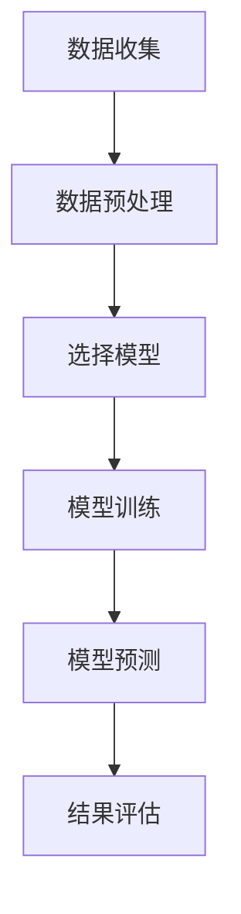
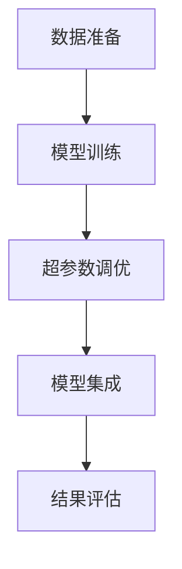
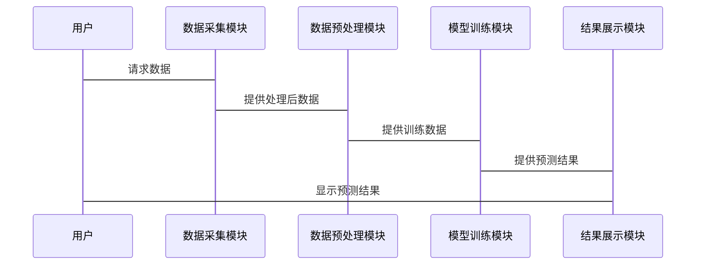

                 


# AI辅助的宏观经济指标预测

> 关键词：人工智能，宏观经济指标，时间序列分析，机器学习，预测模型

> 摘要：本文探讨如何利用人工智能技术辅助宏观经济指标的预测，涵盖从基础理论到实际应用的全过程。通过分析宏观经济指标的构成、特征，以及机器学习模型的应用，结合系统设计和项目实战，提供深度的技术解析。

---

## 目录

1. [背景介绍](#背景介绍)
2. [宏观经济指标的构成与特征](#宏观经济指标的构成与特征)
3. [机器学习模型基础](#机器学习模型基础)
4. [时间序列分析](#时间序列分析)
5. [模型优化与评估](#模型优化与评估)
6. [系统架构设计](#系统架构设计)
7. [项目实战](#项目实战)
8. [扩展阅读](#扩展阅读)

---

## 背景介绍

### 宏观经济指标的基本概念

宏观经济指标是反映经济运行状态的关键数据，主要包括GDP、CPI、失业率等。这些指标帮助我们理解经济趋势，预测未来走势。

### AI技术的发展与应用

人工智能在经济分析中的应用日益广泛，特别是在数据处理和预测方面。AI能够处理大量复杂数据，发现人类难以察觉的模式。

### 问题背景与目标

传统宏观经济预测依赖统计方法，但面临数据复杂性和预测准确性的挑战。AI技术的应用能够提高预测精度，帮助政策制定者做出更明智的决策。

---

## 宏观经济指标的构成与特征

### 主要宏观经济指标

1. **国内生产总值（GDP）**：衡量一个国家或地区的经济规模。
2. **消费者价格指数（CPI）**：衡量通货膨胀水平。
3. **失业率**：反映劳动力市场状况。
4. **利率与货币供应量**：影响经济活动的关键因素。

### 指标之间的关系

- **GDP与CPI**：高GDP可能伴随高CPI，但需考虑生产效率和成本因素。
- **失业率与货币政策**：低失业率可能促使央行加息，防止过热经济。
- **时间序列分析**：宏观经济指标通常具有周期性和季节性。

### 数据特征分析

- **周期性**：经济指标通常呈现周期性波动，如衰退和复苏阶段。
- **季节性**：某些指标如零售销售可能因季节性因素波动。
- **异常值**：突发事件（如疫情）可能导致数据异常，需特别处理。

---

## 机器学习模型基础

### 常用模型介绍

1. **线性回归**：适用于线性关系的预测。
2. **支持向量机（SVM）**：处理非线性关系，但需特征工程。
3. **随机森林**：适合高维数据，具有高精度。
4. **神经网络**：处理复杂模式，但需要大量数据。

### 时间序列模型

1. **ARIMA模型**：处理线性时间序列数据，适合平稳数据。
2. **VAR模型**：处理多变量时间序列，适用于分析指标之间的相互关系。
3. **LSTM网络**：适合处理长期依赖关系，预测精度高。

### 模型选择与评估

- **评估指标**：均方误差（MSE）、R平方值。
- **模型优缺点**：线性回归简单但精度低；神经网络精度高但复杂。

---

## 时间序列分析

### 时间序列预测的核心

时间序列分析是宏观经济预测的重要工具，常用模型包括ARIMA、VAR和LSTM。

### 算法流程图



### 实施步骤

1. 数据预处理：处理缺失值和异常值。
2. 模型选择：根据数据特征选择合适的模型。
3. 模型训练：使用训练数据进行拟合。
4. 预测与评估：预测未来指标并评估模型性能。

---

## 模型优化与评估

### 参数调优

- **超参数调优**：使用网格搜索或随机搜索优化模型性能。
- **交叉验证**：评估模型的泛化能力。

### 模型集成

- **模型集成**：通过投票或加权平均提高预测准确性。

### 实施流程



---

## 系统架构设计

### 系统功能设计

系统包括数据采集、预处理、模型训练、结果展示和接口设计。

### 系统架构图


### 系统交互流程



---

## 项目实战

### 环境配置

- **工具选择**：Python、TensorFlow、Pandas。
- **数据获取**：使用公开数据集，如FRED数据库。

### 核心代码实现

```python
import pandas as pd
import numpy as np
from sklearn.model_selection import train_test_split
from sklearn.ensemble import RandomForestRegressor
from sklearn.metrics import mean_squared_error

# 数据加载
data = pd.read_csv('macroeconomic_data.csv')

# 特征选择
features = ['GDP', 'CPI', 'unemployment']
target = 'GDP_next_quarter'

# 数据分割
X = data[features]
y = data[target]
X_train, X_test, y_train, y_test = train_test_split(X, y, test_size=0.2, random_state=42)

# 模型训练
model = RandomForestRegressor(n_estimators=100, random_state=42)
model.fit(X_train, y_train)

# 预测与评估
y_pred = model.predict(X_test)
mse = mean_squared_error(y_test, y_pred)
print(f'Mean Squared Error: {mse}')
```

### 代码解读

- **数据加载**：读取CSV文件中的数据。
- **特征选择**：选择影响目标变量的关键指标。
- **数据分割**：将数据分为训练集和测试集。
- **模型训练**：使用随机森林回归器进行训练。
- **预测与评估**：计算均方误差，评估模型性能。

### 结果分析

- **预测结果**：展示预测的GDP值与实际值的对比。
- **模型调优**：优化模型参数，提高预测精度。

---

## 扩展阅读

### 研究热点

- 结合NLP技术，分析文本数据对经济指标的影响。
- 利用深度学习模型处理复杂时间序列数据。

### 工具推荐

- **数据可视化**：Matplotlib、Seaborn。
- **机器学习库**：Scikit-learn、XGBoost。
- **深度学习框架**：TensorFlow、Keras。

### 小结

AI技术在宏观经济预测中的应用前景广阔，通过不断优化模型和算法，可以提高预测的准确性和实时性，为经济决策提供有力支持。

---

## 作者

作者：AI天才研究院/AI Genius Institute & 禅与计算机程序设计艺术 /Zen And The Art of Computer Programming

---

通过以上结构，文章详细讲解了AI辅助宏观经济指标预测的各个方面，从理论到实践，帮助读者系统地理解和应用相关技术。

