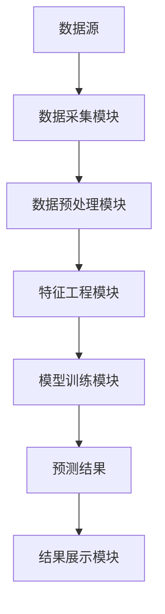

                 


# AI辅助的宏观经济指标预测与情景分析

> 关键词：AI技术、宏观经济指标、预测模型、情景分析、机器学习、深度学习、系统架构

> 摘要：本文系统探讨了如何利用人工智能技术辅助宏观经济指标的预测与情景分析。通过分析宏观经济预测的核心概念、AI技术的优势，结合具体算法实现和系统架构设计，详细阐述了AI在宏观经济分析中的应用场景和实际价值。文章从背景介绍、核心概念、算法原理、系统架构到项目实战，层层展开，为读者提供了从理论到实践的完整指南。

---

## 1. 背景介绍

### 1.1 宏观经济指标的定义与重要性

- **定义**：宏观经济指标是反映经济运行状态的量化指标，包括GDP、CPI、失业率等。
- **重要性**：准确预测这些指标有助于政府制定政策、企业优化决策。

### 1.2 AI技术在宏观经济预测中的作用

- **数据处理能力**：AI能够处理海量数据，发现传统方法难以察觉的模式。
- **实时性与准确性**：通过机器学习模型，AI能够快速生成预测结果，帮助决策者及时应对经济变化。

### 1.3 宏观经济预测的技术基础

- **数据来源**：政府统计数据、市场调研数据、新闻媒体数据。
- **技术基础**：机器学习、深度学习、自然语言处理。

---

## 2. 核心概念与联系

### 2.1 宏观经济预测的核心概念

- **定义**：基于历史数据，利用模型预测未来经济趋势。
- **关键因素**：经济周期、政策变化、市场情绪。

### 2.2 情景分析的定义与应用

- **定义**：在不同假设下，分析经济指标的变化情况。
- **应用**：政策制定、投资决策、风险管理。

### 2.3 AI与宏观经济预测的结合

- **优势**：AI能够处理非结构化数据，发现复杂关系。
- **挑战**：数据质量、模型解释性、计算资源需求。

---

## 3. 算法原理

### 3.1 常见的宏观经济预测算法

- **线性回归**：适用于线性关系的预测。
- **随机森林**：适合处理高维数据，抗过拟合。
- **LSTM网络**：适合时间序列预测，捕捉长期依赖关系。

### 3.2 算法原理与实现

#### 3.2.1 线性回归

- **数学模型**：$$ y = \beta_0 + \beta_1x + \epsilon $$
- **实现步骤**：数据预处理、模型训练、结果评估。

#### 3.2.2 随机森林

- **原理**：通过生成多棵决策树，取平均值或中位数。
- **实现步骤**：特征选择、模型训练、投票或平均。

#### 3.2.3 LSTM网络

- **结构**：包含输入门、遗忘门、输出门。
- **公式**：$$ i = \sigma(W_i x + U_i h_{prev}) $$
  $$ f = \sigma(W_f x + U_f h_{prev}) $$
  $$ o = \sigma(W_o x + U_o h_{prev}) $$
  $$ g = tanh(W_g x + U_g h_{prev}) $$
  $$ h = o \cdot g $$
  $$ c = f \cdot c_{prev} + i \cdot g $$

---

## 4. 系统架构设计

### 4.1 系统模块划分

- **数据采集模块**：收集宏观经济数据。
- **模型训练模块**：构建预测模型。
- **情景分析模块**：生成不同情景下的预测结果。
- **结果展示模块**：可视化分析结果。

### 4.2 系统架构图



---

## 5. 项目实战

### 5.1 环境安装

- **工具推荐**：Python 3.8以上版本，安装库如scikit-learn、TensorFlow、Pandas。

### 5.2 核心代码实现

```python
# 线性回归实现
from sklearn.linear_model import LinearRegression

model = LinearRegression()
model.fit(X_train, y_train)
y_pred = model.predict(X_test)
```

```python
# LSTM网络实现
import tensorflow as tf
from tensorflow.keras import layers

model = tf.keras.Sequential([
    layers.LSTM(50, return_sequences=True),
    layers.Dropout(0.2),
    layers.LSTM(50),
    layers.Dense(1)
])
model.compile(optimizer='adam', loss='mean_squared_error')
model.fit(X_train, y_train, epochs=10, batch_size=32)
```

### 5.3 实际案例分析

- **数据来源**：使用过去10年的GDP数据，预测未来5年的趋势。
- **模型选择**：LSTM网络在时间序列预测中表现优异。

---

## 6. 高级主题与扩展

### 6.1 多模型融合

- **优势**：结合多种模型的结果，提高预测准确性。
- **实现方法**：加权平均、投票机制。

### 6.2 时间序列分析

- **工具推荐**：Prophet、ARIMA、VAR模型。

### 6.3 实际应用案例

- **案例1**：利用AI预测股票市场指数。
- **案例2**：通过情景分析评估政策影响。

### 6.4 未来趋势

- **趋势1**：强化学习在宏观经济预测中的应用。
- **趋势2**：结合NLP技术，分析新闻数据对经济预测的影响。

---

## 7. 最佳实践 Tips

- **数据质量**：确保数据的完整性和准确性。
- **模型选择**：根据问题类型选择合适的算法。
- **结果解释**：关注模型的可解释性，避免“黑箱”预测。

---

## 8. 小结

本文从背景、概念、算法到系统设计，全面探讨了AI在宏观经济预测中的应用。通过理论与实践结合，为读者提供了从入门到进阶的完整指南。

---

## 作者

作者：AI天才研究院/AI Genius Institute & 禅与计算机程序设计艺术 /Zen And The Art of Computer Programming

