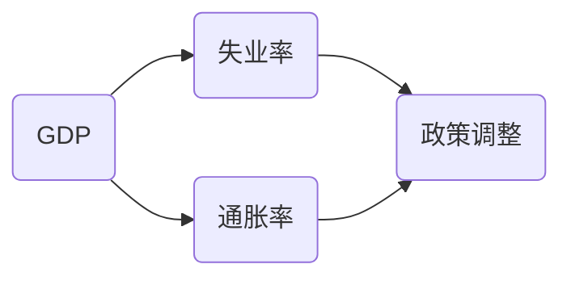

                 


# AI辅助的宏观经济指标预测模型

> **关键词**：宏观经济指标、AI预测模型、机器学习、深度学习、经济分析  
> **摘要**：本文探讨了AI技术在宏观经济指标预测中的应用，详细介绍了模型构建的核心概念、算法原理、系统架构设计以及实际项目案例。通过理论与实践结合，展示了如何利用AI技术提升宏观经济预测的准确性和效率。

---

## 第1章: 宏观经济指标预测的背景与意义

### 1.1 宏观经济指标的基本概念
#### 1.1.1 宏观经济指标的定义
宏观经济指标是衡量经济运行状态的关键数据，包括GDP、失业率、通胀率、PMI（采购经理指数）等。这些指标反映了经济的健康状况和未来趋势。

#### 1.1.2 宏观经济指标的分类与作用
- **总量指标**：如GDP、工业增加值，反映整体经济规模。
- **结构指标**：如就业结构、产业结构，反映经济结构特征。
- **价格指标**：如CPI、PPI，反映通货膨胀情况。

#### 1.1.3 宏观经济指标预测的重要性
准确预测宏观经济指标有助于政府制定货币政策、企业做出投资决策，以及个人规划财务。

### 1.2 AI技术在宏观经济预测中的应用
#### 1.2.1 AI技术的基本概念
人工智能（AI）通过机器学习、深度学习等技术，能够从大量数据中提取规律，预测未来趋势。

#### 1.2.2 AI在宏观经济分析中的优势
- **数据处理能力**：AI能够处理海量数据，发现传统方法难以察觉的模式。
- **实时性**：AI模型可以实时更新，提供及时的预测结果。
- **准确性**：通过复杂算法，AI能够提高预测的准确性。

#### 1.2.3 宏观经济预测的现状与挑战
- **数据质量**：宏观经济数据可能受到噪声干扰，影响预测准确性。
- **模型选择**：不同模型适用于不同场景，选择合适的模型是关键。
- **数据隐私**：宏观经济数据涉及国家安全，数据隐私问题需妥善处理。

### 1.3 宏观经济指标预测模型的背景与意义
#### 1.3.1 宏观经济预测的背景
随着全球经济一体化，各国经济相互影响，准确预测宏观经济指标变得尤为重要。

#### 1.3.2 AI辅助预测的必要性
传统经济模型依赖专家经验，而AI技术能够通过数据驱动的方式，提供更精准的预测。

#### 1.3.3 模型的应用前景与价值
AI辅助的宏观经济预测模型可以帮助政府和企业做出更科学的决策，优化资源配置，促进经济发展。

---

## 第2章: 宏观经济指标预测的核心概念

### 2.1 宏观经济指标预测模型的定义与特点
#### 2.1.1 模型的定义
宏观经济指标预测模型是利用AI技术，基于历史数据，预测未来经济指标的数值或趋势。

#### 2.1.2 模型的核心特点
- **数据驱动**：模型依赖大量数据进行训练。
- **动态调整**：能够根据最新数据实时更新预测结果。
- **多维度分析**：综合考虑多个经济指标及其相互关系。

#### 2.1.3 模型与传统预测方法的区别
传统方法依赖专家经验，而AI模型通过数据挖掘自动发现规律。

### 2.2 宏观经济指标预测的核心要素
#### 2.2.1 数据来源与特征
- **数据来源**：政府统计机构、国际组织（如IMF、世界银行）。
- **数据特征**：时间序列性、多维性、相关性。

#### 2.2.2 模型输入与输出
- **输入**：历史经济指标、社会经济数据。
- **输出**：预测的经济指标值及其置信区间。

#### 2.2.3 预测结果的评估标准
- **准确率**：预测值与实际值的接近程度。
- **误差范围**：预测值的波动范围。

### 2.3 宏观经济指标之间的关系
#### 2.3.1 主要宏观经济指标的相互影响
- **GDP与失业率**：GDP增长通常伴随着失业率下降。
- **通胀率与利率**：通胀率上升可能导致央行加息。

#### 2.3.2 指标间的因果关系与反馈机制
例如，利率上升可能导致投资减少，进而影响GDP增长。

#### 2.3.3 指标关系的网络图分析
使用网络图展示各指标之间的相互关系，例如：


### 2.4 宏观经济指标预测模型的构建要素
#### 2.4.1 数据预处理与特征工程
- **数据清洗**：处理缺失值、异常值。
- **特征提取**：从原始数据中提取有用特征。

#### 2.4.2 模型选择与优化
- **模型选择**：根据数据特征选择合适的算法。
- **参数调优**：通过交叉验证优化模型参数。

#### 2.4.3 模型评估与验证
- **评估指标**：均方误差（MSE）、平均绝对误差（MAE）、R²值。
- **验证方法**：交叉验证、留出法。

---

## 第3章: 宏观经济指标预测模型的算法原理

### 3.1 常见的宏观经济预测算法
#### 3.1.1 线性回归模型
线性回归通过建立线性关系，预测目标变量。

#### 3.1.2 时间序列分析模型
时间序列模型（如ARIMA）适合处理具有时间依赖性的数据。

#### 3.1.3 人工神经网络模型
神经网络能够捕捉复杂的非线性关系。

#### 3.1.4 支持向量机模型
SVM适合小样本数据的分类和回归任务。

#### 3.1.5 集成学习模型
集成学习通过组合多个模型提升预测准确率。

### 3.2 算法原理与实现
#### 3.2.1 线性回归模型的数学公式
$$ y = \beta_0 + \beta_1x_1 + \beta_2x_2 + ... + \beta_nx_n + \epsilon $$

#### 3.2.2 线性回归的损失函数
$$ L = \frac{1}{2m}\sum_{i=1}^{m}(y_i - \hat{y_i})^2 $$

#### 3.2.3 线性回归的实现代码
```python
import numpy as np
from sklearn.linear_model import LinearRegression

# 示例数据
X = np.array([[1, 2], [3, 4], [5, 6]])
y = np.array([3, 7, 11])

# 模型训练
model = LinearRegression()
model.fit(X, y)

# 预测
print(model.predict([[7, 8]]))  # 输出：[15.]
```

---

## 第4章: 宏观经济指标预测模型的系统架构设计

### 4.1 系统功能设计
- **数据采集模块**：从数据源获取宏观经济指标。
- **特征工程模块**：对数据进行预处理和特征提取。
- **模型训练模块**：选择合适的算法训练模型。
- **预测与评估模块**：生成预测结果并评估模型性能。

### 4.2 系统架构设计


---

## 第5章: 宏观经济指标预测模型的项目实战

### 5.1 项目介绍
本项目旨在构建一个基于AI的宏观经济指标预测系统，以GDP预测为例。

### 5.2 核心代码实现
```python
import pandas as pd
import numpy as np
from sklearn.model_selection import train_test_split
from sklearn.metrics import mean_squared_error
from sklearn.ensemble import RandomForestRegressor

# 加载数据
data = pd.read_csv('macroeconomic_data.csv')
X = data[[' unemployment_rate', 'inflation_rate']]
y = data['GDP_growth']

# 数据分割
X_train, X_test, y_train, y_test = train_test_split(X, y, test_size=0.2)

# 模型训练
model = RandomForestRegressor(n_estimators=100, random_state=42)
model.fit(X_train, y_train)

# 预测与评估
y_pred = model.predict(X_test)
print(f"均方误差: {mean_squared_error(y_test, y_pred)}")
```

### 5.3 实际案例分析
以某国的经济数据为例，预测下一季度的GDP增长率。

---

## 第6章: 总结与展望

### 6.1 最佳实践
- **数据质量**：确保数据准确性和完整性。
- **模型选择**：根据数据特征选择合适的算法。
- **持续优化**：定期更新模型，适应数据变化。

### 6.2 小结
本文详细介绍了AI辅助的宏观经济指标预测模型，从理论到实践，展示了如何利用AI技术提升预测的准确性和效率。

### 6.3 注意事项
- 避免过度拟合，防止模型泛化能力差。
- 注意数据隐私，确保合法合规。

### 6.4 拓展阅读
建议深入学习时间序列分析、深度学习在经济预测中的应用。

---

**作者**：AI天才研究院/AI Genius Institute & 禅与计算机程序设计艺术 /Zen And The Art of Computer Programming

