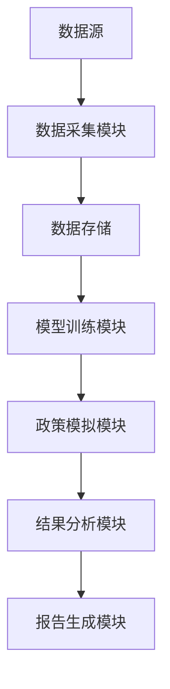
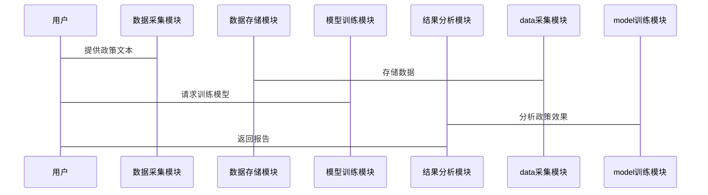

                 


# AI辅助的宏观经济政策效果评估

> 关键词：宏观经济政策，人工智能，机器学习，政策评估，因果推断

> 摘要：本文探讨了AI技术在宏观经济政策效果评估中的应用，通过分析宏观经济政策的基本概念、AI技术的优势及其在政策评估中的作用，详细讲解了AI辅助评估的算法原理、系统设计和项目实战。结合具体案例，展示了AI如何提升政策评估的准确性和效率，并提出了相应的最佳实践和未来研究方向。

---

## 第一部分：宏观经济政策效果评估的背景与挑战

### 第1章：宏观经济政策的基本概念

#### 1.1 宏观经济政策的定义与目标
- 宏观经济政策是政府为了实现经济增长、价格稳定、充分就业和国际收支平衡等目标而采取的政策措施。
- 主要工具包括货币政策（如利率调整、货币供应量）和财政政策（如政府支出、税收）。

#### 1.2 宏观经济政策的实施机制
- 政策通过影响市场供需、价格水平和预期来调节经济活动。
- 政策效果往往受到多因素的交互作用，具有复杂性和不确定性。

#### 1.3 宏观经济政策的挑战
- 数据的复杂性与不完整性：宏观经济数据受多种因素影响，难以准确建模。
- 模型的不确定性：传统模型假设可能与实际情况不符，导致预测偏差。
- 多目标权衡：政策目标之间的冲突需要在决策中进行权衡。

### 第2章：AI技术在宏观经济分析中的应用

#### 2.1 AI技术的基本概念与特点
- AI技术通过数据驱动的方法，利用机器学习、深度学习等算法处理复杂数据。
- 其优势在于能够处理非结构化数据，发现复杂模式，提高预测准确性。

#### 2.2 AI在宏观经济分析中的优势
- 数据处理能力：AI能够处理大量非结构化数据，提取有价值的信息。
- 预测准确性：通过复杂模型，AI可以更准确地预测经济趋势和政策效果。
- 实时分析：AI技术可以实时监控经济指标，及时调整政策。

#### 2.3 宏观经济政策效果评估的复杂性
- 政策效果的多维性：政策可能同时影响多个经济指标，效果难以直接衡量。
- 动态变化：经济系统具有动态性，政策效果可能随时间变化。
- 非线性关系：经济变量之间的关系可能是非线性的，传统模型难以捕捉。

---

## 第二部分：AI辅助宏观经济政策效果评估的核心概念与联系

### 第3章：宏观经济政策效果评估的原理

#### 3.1 宏观经济政策效果的定义与测量
- 宏观经济政策效果是指政策实施后对经济目标的影响程度。
- 通常通过GDP增长率、失业率、通货膨胀率等指标来衡量。

#### 3.2 宏观经济模型的基本结构
- 宏观经济模型通常包括消费、投资、政府支出和净出口四个部分。
- 模型假设：例如消费函数、投资函数等。

#### 3.3 政策效果的动态反馈机制
- 政策实施后，通过市场参与者的反应形成反馈，影响经济系统。
- 动态模型（如动态随机一般均衡模型，DSGE）能够更好地捕捉这些动态反馈。

### 第4章：AI辅助评估的核心概念

#### 4.1 机器学习在政策评估中的应用
- 使用回归分析预测政策效果：通过大量历史数据训练模型，预测新政策的可能效果。
- 文本挖掘分析政策文件：提取政策关键词，分析其潜在影响。

#### 4.2 深度学习与宏观经济预测
- 使用LSTM网络处理时间序列数据，捕捉经济趋势。
- 图神经网络（GNN）分析经济网络的结构，如企业间的关系。

#### 4.3 AI辅助政策模拟的基本原理
- 利用AI模型模拟政策实施后的经济变化，评估其效果。
- 结合因果推断方法，确保模拟结果的可靠性。

### 第5章：核心概念的联系与对比

#### 5.1 宏观经济模型与AI模型的对比分析
- 宏观经济模型：基于经济理论，假设明确，但可能忽视复杂性。
- AI模型：数据驱动，能够捕捉复杂模式，但缺乏可解释性。

#### 5.2 数据驱动与理论驱动的政策评估方法
- 数据驱动：基于AI模型，依赖大量数据，适用于复杂场景。
- 理论驱动：基于经济理论，适用于机制明确的场景。

#### 5.3 AI辅助评估的优劣势分析
- 优势：高准确性，适用于复杂场景。
- 劣势：缺乏可解释性，对数据依赖性强。

---

## 第三部分：AI辅助宏观经济政策效果评估的算法原理

### 第6章：机器学习算法基础

#### 6.1 线性回归模型
- 简单线性回归：$y = \beta_0 + \beta_1 x + \epsilon$
- 多元线性回归：$y = \beta_0 + \beta_1 x_1 + \beta_2 x_2 + \dots + \beta_n x_n + \epsilon$

#### 6.2 支持向量机（SVM）
- SVM用于分类和回归，通过构建超平面分割数据。
- 核函数：将数据映射到高维空间，解决非线性问题。

#### 6.3 时间序列分析
- ARIMA模型：用于预测未来的经济指标。
- 模型结构：$ARIMA(p, d, q)$，其中$p$为自回归阶数，$d$为差分阶数，$q$为移动平均阶数。

### 第7章：深度学习算法在宏观经济分析中的应用

#### 7.1 长短期记忆网络（LSTM）
- LSTM用于处理时间序列数据，捕捉长期依赖关系。
- 结构：包括输入门、遗忘门和输出门。

#### 7.2 卷积神经网络（CNN）
- 用于处理空间数据，如图像和文本。
- 在宏观经济分析中，用于处理文本数据，提取关键词。

#### 7.3 图神经网络（GNN）
- 用于分析经济网络的结构，如企业间的关系。
- 结构：节点表示、边表示和聚合函数。

### 第8章：政策效果评估的因果推断方法

#### 8.1 因果关系的基本概念
- 因果关系：变量之间的因果联系。
- 因果效应：政策实施对经济指标的影响。

#### 8.2 倒置回归与工具变量法
- 倒置回归：通过随机化试验估计因果效应。
- 工具变量法：使用工具变量缓解内生性问题。

#### 8.3 断点回归与倾向评分匹配
- 断点回归：根据政策临界点分组，估计政策效果。
- 倾向评分匹配：通过匹配相似样本，减少偏差。

---

## 第四部分：系统分析与架构设计方案

### 第9章：宏观经济政策效果评估系统的总体架构

#### 9.1 系统的模块划分
- 数据采集模块：收集宏观经济数据和政策文本。
- 模型构建模块：训练机器学习模型，进行政策模拟。
- 结果分析模块：评估政策效果，生成报告。

#### 9.2 系统功能设计
- 数据处理：清洗和预处理数据，提取特征。
- 模型训练：选择合适的算法，训练模型。
- 政策模拟：模拟政策实施效果，评估其影响。

### 第10章：系统架构设计

#### 10.1 系统架构图


#### 10.2 系统交互流程


---

## 第五部分：项目实战

### 第11章：项目实战与案例分析

#### 11.1 环境安装
- 安装Python、TensorFlow、Keras等工具。

#### 11.2 核心代码实现
```python
import numpy as np
import pandas as pd
from sklearn.linear_model import LinearRegression
from sklearn.metrics import mean_squared_error

# 数据准备
data = pd.DataFrame({
    'policy': np.random.rand(100),
    'outcome': np.random.rand(100)
})

# 模型训练
model = LinearRegression()
model.fit(data[['policy']], data['outcome'])

# 模型预测
predicted = model.predict(data[['policy']])
mse = mean_squared_error(data['outcome'], predicted)
print('均方误差:', mse)
```

#### 11.3 代码解读与分析
- 数据准备：生成模拟的政策和结果数据。
- 模型训练：使用线性回归模型训练数据。
- 模型预测：预测结果并计算均方误差，评估模型性能。

#### 11.4 实际案例分析
- 以某国实施的财政刺激政策为例，分析其对GDP的影响。
- 使用AI模型模拟政策效果，评估其准确性。

---

## 第六部分：总结与展望

### 第12章：最佳实践与小结

#### 12.1 最佳实践
- 数据质量：确保数据的准确性和完整性。
- 模型选择：根据具体问题选择合适的算法。
- 结果解释：结合经济理论解释模型结果。

#### 12.2 小结
- AI技术为宏观经济政策评估提供了新的工具和方法。
- 结合经济理论和数据驱动的方法，能够提高政策评估的准确性和效率。

### 第13章：注意事项与拓展阅读

#### 13.1 注意事项
- 模型的可解释性：确保结果的可解释性，避免黑箱操作。
- 数据隐私：保护敏感数据，遵守相关法律法规。

#### 13.2 拓展阅读
- 建议阅读相关领域的最新研究，如因果推断与机器学习的结合。
- 关注宏观经济政策评估的最新技术发展。

---

## 作者：AI天才研究院/AI Genius Institute & 禅与计算机程序设计艺术 /Zen And The Art of Computer Programming

---

这篇文章系统地介绍了AI辅助宏观经济政策效果评估的背景、核心概念、算法原理、系统设计和实际应用。通过具体的代码示例和案例分析，展示了AI技术在提升政策评估效率和准确性方面的重要作用。

