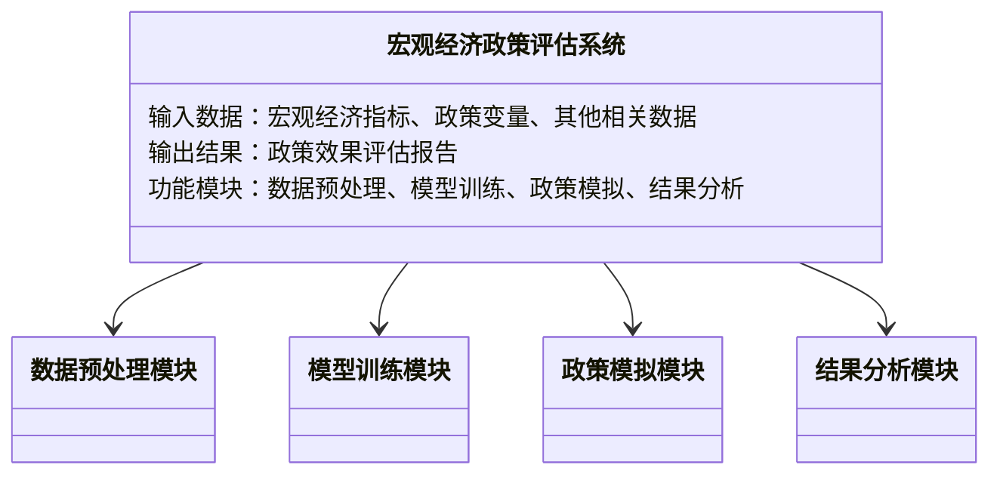
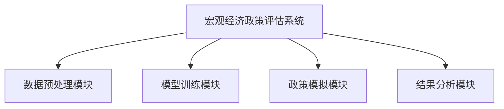
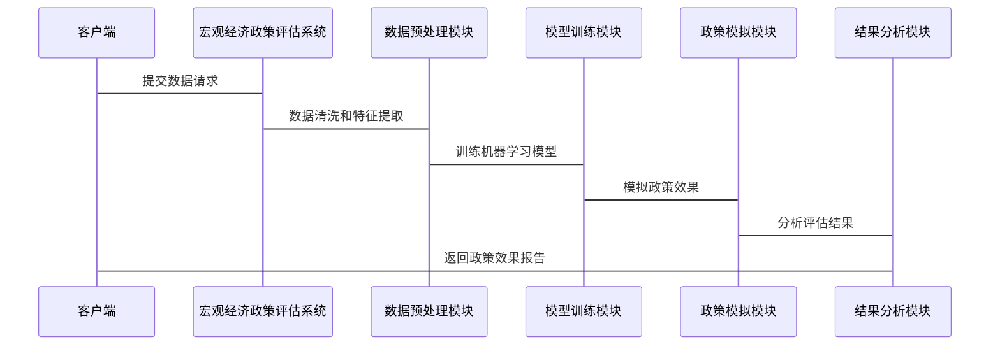

                 


# AI辅助的宏观经济政策效果量化评估

> 关键词：宏观经济政策，AI技术，量化评估，机器学习，政策效果，经济模型

> 摘要：本文探讨了如何利用人工智能技术辅助宏观经济政策效果的量化评估。通过分析宏观经济政策的基本概念、AI技术的核心原理以及它们之间的联系，本文详细阐述了基于机器学习的量化评估方法，构建了系统的架构设计，并通过具体案例展示了AI在宏观经济政策评估中的实际应用。文章还总结了最佳实践经验和未来研究方向，为政策制定者和研究人员提供了有价值的参考。

---

## 第一部分：宏观经济政策效果量化评估的背景与概念

### 第1章：宏观经济政策概述

#### 1.1 宏观经济的基本概念

##### 1.1.1 宏观经济的核心定义
宏观经济是指整个经济体系的总体运行情况，包括国内生产总值（GDP）、就业率、通货膨胀率等核心指标。宏观经济政策通过调节这些指标，实现经济增长、价格稳定、充分就业和国际收支平衡的目标。

##### 1.1.2 宏观经济的主要指标
- **GDP**：衡量一个国家或地区的经济总产出。
- **失业率**：反映劳动力市场的健康状况。
- **通胀率**：衡量价格水平的变化。
- **财政赤字**：政府支出超过收入的情况。
- **货币政策工具**：如利率、货币供应量等。

##### 1.1.3 宏观经济政策的类型
- **财政政策**：通过政府支出和税收调整经济活动。
- **货币政策**：通过央行控制货币供应量和利率来影响经济。
- **产业政策**：通过政府干预促进特定产业发展。
- **贸易政策**：通过关税和贸易协定影响国际贸易。

#### 1.2 宏观经济政策的作用与目标

##### 1.2.1 宏观经济政策的目标设定
- 维护价格稳定。
- 实现充分就业。
- 促进经济增长。
- 平衡国际收支。

##### 1.2.2 宏观经济政策的实施机制
- 政府通过调整财政支出和税收直接影响经济。
- 中央银行通过调节货币政策工具间接影响经济。

##### 1.2.3 宏观经济政策的效果评估
- 通过统计数据和模型模拟评估政策效果。
- 分析政策对经济增长、就业、通胀等指标的影响。

### 第2章：AI辅助的宏观经济政策评估必要性

#### 2.1 宏观经济政策评估的传统方法

##### 2.1.1 统计分析法
- 使用回归分析等统计方法评估政策效果。
- 优点：简单易行，适用于小规模数据。
- 缺点：难以捕捉复杂经济关系，结果可能存在偏差。

##### 2.1.2 模拟模型法
- 建立宏观经济模型（如DSGE模型）进行模拟。
- 优点：可以预测政策的长期影响。
- 缺点：模型复杂，参数敏感，计算成本高。

##### 2.1.3 专家判断法
- 依赖专家的经验和知识进行政策评估。
- 优点：结合实际情况，结果具有针对性。
- 缺点：主观性强，缺乏客观依据。

#### 2.2 传统方法的局限性

##### 2.2.1 数据量的限制
- 传统方法依赖少量统计数据，难以捕捉复杂经济现象。
- 无法处理海量数据，导致结果片面。

##### 2.2.2 模型的复杂性
- 高维数据和复杂关系使传统模型难以处理。
- 计算成本高，限制了大规模数据分析。

##### 2.2.3 评估结果的主观性
- 专家判断法依赖个人经验，结果可能存在主观偏差。
- 难以保证评估结果的客观性和准确性。

#### 2.3 AI技术在宏观经济政策评估中的优势

##### 2.3.1 数据处理能力
- AI能够处理海量数据，提取隐藏信息，发现复杂关系。
- 提供更全面的分析视角，提高评估结果的准确性。

##### 2.3.2 自动学习能力
- 机器学习算法能够自动优化模型参数，适应数据变化。
- 减少人为干预，提高评估结果的客观性。

##### 2.3.3 高效计算能力
- 并行计算和分布式处理显著提高计算效率。
- 能够快速处理大规模数据，缩短评估周期。

---

## 第二部分：AI辅助宏观经济政策效果量化评估的核心概念与联系

### 第3章：宏观经济政策效果量化评估的核心概念

#### 3.1 宏观经济政策效果的定义

##### 3.1.1 政策效果的多维度性
- 经济增长、就业、通胀等多方面影响。
- 需要综合评估政策的短期和长期效果。

##### 3.1.2 政策效果的可量化性
- 将政策效果转化为可测量的指标。
- 确保评估结果具有客观性和可比性。

##### 3.1.3 政策效果的动态性
- 政策效果随时间变化而变化。
- 需要动态调整评估模型和方法。

#### 3.2 宏观经济政策效果的评价指标

##### 3.2.1 经济增长指标
- GDP增长率：反映经济整体增长情况。
- 全要素生产率：衡量资源利用效率。

##### 3.2.2 就业指标
- 失业率：衡量劳动力市场状况。
- 就业结构：反映经济转型升级情况。

##### 3.2.3 通胀指标
- 消费者价格指数（CPI）：衡量通货膨胀水平。
- 核心通胀率：剔除能源和食品价格波动后的通胀指标。

#### 3.3 宏观经济政策效果的边界与外延

##### 3.3.1 政策效果的直接与间接影响
- 直接影响：政策直接影响的主要领域。
- 间接影响：政策通过其他渠道影响的领域。

##### 3.3.2 政策效果的短期与长期影响
- 短期效果：政策实施后的即时影响。
- 长期效果：政策对经济的持续影响。

##### 3.3.3 政策效果的区域与行业差异
- 区域差异：不同地区政策效果可能不同。
- 行业差异：不同行业对政策的敏感度和响应不同。

### 第4章：宏观经济政策与AI技术的核心概念

#### 4.1 宏观经济政策的核心要素

##### 4.1.1 政策目标
- 明确政策希望达到的具体目标。
- 例如，降低失业率或控制通胀。

##### 4.1.2 政策工具
- 财政政策工具：政府支出、税收等。
- 货币政策工具：利率、货币供应量等。

##### 4.1.3 政策实施主体
- 中央银行、财政部等政府机构。

#### 4.2 AI技术的核心要素

##### 4.2.1 数据
- 结构化数据：统计数据、经济指标等。
- 非结构化数据：文本、图像等。

##### 4.2.2 模型
- 机器学习模型：如线性回归、随机森林、神经网络等。
- 统计模型：如时间序列模型、因果推断模型。

##### 4.2.3 算法
- 监督学习：用于预测和分类。
- 无监督学习：用于聚类和异常检测。

#### 4.3 宏观经济政策与AI技术的联系

##### 4.3.1 数据驱动的政策分析
- 利用大数据技术分析经济现象，发现政策影响的规律。
- 通过数据挖掘技术提取政策效果的关键指标。

##### 4.3.2 智能化政策模拟
- 利用AI技术构建宏观经济模型，模拟政策效果。
- 通过机器学习优化模型参数，提高预测精度。

##### 4.3.3 自动化政策评估
- 利用自动化算法快速评估政策效果。
- 实时监控政策执行情况，动态调整评估模型。

---

## 第三部分：AI辅助宏观经济政策效果量化评估的算法原理

### 第5章：基于机器学习的宏观经济政策评估方法

#### 5.1 机器学习在宏观经济政策评估中的应用

##### 5.1.1 监督学习模型
- 线性回归：预测GDP增长率。
- 支持向量回归（SVR）：处理非线性关系。
- 神经网络：复杂经济关系建模。

##### 5.1.2 无监督学习模型
- 聚类分析：识别经济数据中的潜在模式。
- 主成分分析（PCA）：降低数据维度，提取关键指标。

##### 5.1.3 因果推断模型
- 引导回归（Instrumental Variables Regression）：识别因果关系。
- 邻近匹配法（Propensity Score Matching）：评估政策的因果效应。

#### 5.2 基于时间序列分析的政策效果评估

##### 5.2.1 ARIMA模型
- 用于预测时间序列数据，分析政策实施后的经济变化。
- 例如，预测政策实施后的GDP增长率变化。

##### 5.2.2 GARCH模型
- 用于分析金融市场的波动性，评估政策对金融稳定的影响。
- 例如，预测政策对股市波动的影响。

##### 5.2.3 变量的内生性问题
- 通过工具变量法解决变量的内生性问题，提高模型的准确性。

#### 5.3 基于自然实验的政策评估方法

##### 5.3.1 差分法（DID）
- 比较政策实施前后的变化，评估政策效果。
- 例如，评估税收减免政策对企业投资的影响。

##### 5.3.2 随机化检验
- 通过随机分配政策，评估政策对不同群体的影响。
- 例如，随机选择部分企业享受税收优惠，比较政策效果。

##### 5.3.3 逆概率加权法（IPW）
- 通过加权处理，平衡对照组和实验组的特征。
- 例如，评估政策对低收入群体的就业影响。

### 第6章：AI辅助宏观经济政策评估的数学模型与公式

#### 6.1 线性回归模型

##### 6.1.1 简单线性回归
$$ y = \beta_0 + \beta_1 x + \epsilon $$
- $y$：政策效果指标（如GDP增长率）。
- $x$：政策变量（如政府支出）。
- $\beta_0$、$\beta_1$：回归系数。
- $\epsilon$：误差项。

##### 6.1.2 多元线性回归
$$ y = \beta_0 + \beta_1 x_1 + \beta_2 x_2 + \ldots + \beta_k x_k + \epsilon $$
- $x_1, x_2, \ldots, x_k$：多个政策变量。

#### 6.2 机器学习模型

##### 6.2.1 支持向量回归（SVR）
- 使用核函数处理非线性关系，例如：
$$ y = f(x) $$
- $f(x)$ 由支持向量机构建，用于预测政策效果。

##### 6.2.2 神经网络模型
- 使用多层感知机（MLP）构建复杂经济关系的模型，例如：
$$ y = \sigma(w_2 a + b_2) $$
$$ a = \sigma(w_1 x + b_1) $$
- $\sigma$：激活函数（如ReLU或Sigmoid）。
- $w$：权重。
- $b$：偏置。

#### 6.3 因果推断模型

##### 6.3.1 引导回归
- 使用工具变量法解决内生性问题，例如：
$$ y = \beta_0 + \beta_1 x + \gamma z + \epsilon $$
- $z$：工具变量，与$x$相关，但仅通过$x$影响$y$。

##### 6.3.2 邻近匹配法
- 通过匹配样本，消除混淆变量的影响，例如：
$$ y = \beta_0 + \beta_1 x + \gamma D + \epsilon $$
- $D$：指示变量，标记是否接受政策。

---

## 第四部分：AI辅助宏观经济政策效果量化评估的系统分析与架构设计

### 第7章：系统分析与架构设计

#### 7.1 问题场景介绍

##### 7.1.1 宏观经济政策评估的挑战
- 数据复杂性高。
- 模型构建难度大。
- 结果解释性差。

##### 7.1.2 AI辅助政策评估的优势
- 处理大规模数据能力强。
- 自动学习能力强。
- 结果解释性好。

#### 7.2 系统功能设计

##### 7.2.1 领域模型设计


##### 7.2.2 系统架构设计


##### 7.2.3 系统接口设计
- 数据输入接口：接收宏观经济数据和政策变量。
- 模型接口：调用机器学习模型进行预测。
- 结果输出接口：生成政策效果评估报告。

#### 7.3 系统交互设计


---

## 第五部分：AI辅助宏观经济政策效果量化评估的项目实战

### 第8章：项目实战

#### 8.1 项目环境与工具安装

##### 8.1.1 环境配置
- 操作系统：Linux或Windows。
- 开发工具：Jupyter Notebook、VS Code。
- 数据库：MySQL或MongoDB。
- 机器学习库：scikit-learn、TensorFlow、PyTorch。

##### 8.1.2 安装Python库
```bash
pip install numpy pandas scikit-learn matplotlib
```

#### 8.2 系统核心实现

##### 8.2.1 数据预处理代码
```python
import pandas as pd
import numpy as np

# 加载数据
data = pd.read_csv('macro_policy.csv')

# 数据清洗
data.dropna(inplace=True)

# 特征提取
from sklearn.preprocessing import StandardScaler
scaler = StandardScaler()
X = scaler.fit_transform(data[['gdp_growth', 'unemployment_rate', 'inflation_rate']])
y = data['policy_impact']
```

##### 8.2.2 机器学习模型实现
```python
from sklearn.ensemble import RandomForestRegressor
from sklearn.metrics import mean_absolute_error

# 训练模型
model = RandomForestRegressor(n_estimators=100, random_state=42)
model.fit(X, y)

# 预测结果
y_pred = model.predict(X)

# 评估模型
print('Mean Absolute Error:', mean_absolute_error(y, y_pred))
```

#### 8.3 项目案例分析

##### 8.3.1 案例背景
- 评估某国实施的量化宽松政策对GDP增长率的影响。
- 数据包括政策实施前后的GDP增长率、失业率、通胀率等。

##### 8.3.2 数据分析与结果解读
- 训练模型预测政策实施后的GDP增长率。
- 比较实际数据与预测数据，评估政策效果。
- 通过特征重要性分析，确定哪些因素对政策效果影响最大。

#### 8.4 项目总结与经验分享

##### 8.4.1 项目总结
- 成功构建了AI辅助的宏观经济政策评估系统。
- 验证了机器学习在政策评估中的有效性。

##### 8.4.2 经验分享
- 数据质量是关键，需确保数据准确性和完整性。
- 模型选择需结合实际问题，选择合适的算法。
- 结果解释性需强，便于政策制定者理解和应用。

---

## 第六部分：AI辅助宏观经济政策效果量化评估的最佳实践与总结

### 第9章：最佳实践

#### 9.1 最佳实践 tips

##### 9.1.1 数据处理
- 清洗数据，处理缺失值和异常值。
- 进行特征工程，提取有意义的特征。

##### 9.1.2 模型选择
- 根据问题类型选择合适的算法。
- 进行交叉验证，防止过拟合。

##### 9.1.3 结果解释
- 提供直观的结果可视化，如图表和报告。
- 解释模型的预测结果，确保可解释性。

#### 9.2 项目小结

##### 9.2.1 项目成果
- 成功构建了AI辅助的宏观经济政策评估系统。
- 提供了量化政策效果的科学方法。

##### 9.2.2 经验与教训
- 数据质量和模型选择对结果影响重大。
- 需要结合领域知识优化模型。

#### 9.3 未来研究方向

##### 9.3.1 多模型集成
- 结合多种算法，提高评估结果的准确性。
- 使用集成学习方法优化预测效果。

##### 9.3.2 实时监控
- 建立实时监控系统，动态调整评估模型。
- 及时反馈政策执行效果，支持动态决策。

##### 9.3.3 可解释性增强
- 开发可解释的AI模型，提高政策制定者的信任度。
- 使用SHAP值等方法解释模型预测结果。

### 第10章：总结与展望

#### 10.1 总结
- AI技术为宏观经济政策效果量化评估提供了新的思路和方法。
- 基于机器学习的评估系统能够处理复杂数据，提高评估结果的准确性。

#### 10.2 展望
- 随着AI技术的不断发展，宏观经济政策评估将更加智能化和精准化。
- 未来的研究方向包括多模型集成、实时监控和可解释性增强。

---

## 作者

作者：AI天才研究院（AI Genius Institute）  
联系方式：[contact@ai-genius.org](mailto:contact@ai-genius.org)  
网址：[www.ai-genius.org](http://www.ai-genius.org)  

---

这篇文章详细探讨了AI辅助宏观经济政策效果量化评估的核心概念、算法原理和系统设计，并通过具体案例展示了AI技术在政策评估中的实际应用。希望本文能为政策制定者、研究人员和AI技术爱好者提供有价值的参考和启发。

--- 

**（完）**

