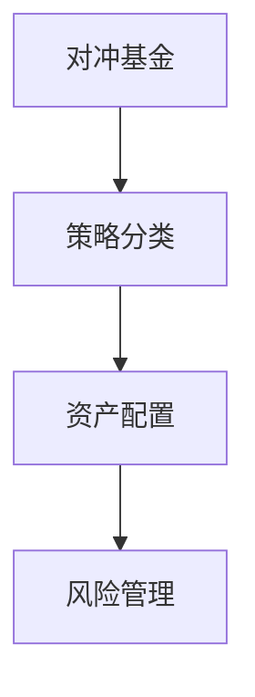

                 


# AI辅助的对冲基金策略分类与性能评估

> 关键词：对冲基金，AI辅助，策略分类，性能评估，机器学习，深度学习

> 摘要：本文系统地探讨了AI技术在对冲基金策略分类与性能评估中的应用，从理论基础到实际案例，详细分析了AI如何辅助对冲基金优化投资策略。文章首先介绍了对冲基金的基本概念与AI在金融领域的应用背景，然后深入阐述了AI辅助策略分类的核心概念与算法原理，最后通过实际项目案例展示了AI在对冲基金中的具体应用，并提出了性能评估的方法与优化建议。

---

# 第一部分: AI辅助的对冲基金策略分类与性能评估基础

## 第1章: 对冲基金与AI辅助投资概述

### 1.1 对冲基金的基本概念

对冲基金是一种通过投资证券等金融工具，利用市场波动进行套利和对冲风险的投资基金。其核心目标是通过多样化的投资策略在不同市场条件下实现稳定收益。对冲基金的策略类型包括：

1. **多空策略**：同时做多和做空市场，以对冲市场风险。
2. **配对交易**：利用相关资产的价格差异进行套利。
3. **统计套利**：通过统计模型寻找市场中的定价偏差。
4. **动量策略**：利用资产价格的动量效应进行投资。
5. **因子投资**：基于特定因子（如价值、动量、规模等）构建投资组合。

### 1.2 AI技术在金融领域的应用背景

AI技术在金融领域的应用已经非常广泛，尤其是在高频交易、风险管理、投资组合优化等领域。AI的核心优势在于其强大的数据处理能力和模式识别能力，能够帮助对冲基金：

1. **提高交易效率**：通过算法交易快速捕捉市场机会。
2. **降低交易成本**：自动化交易减少了人工干预，降低了交易成本。
3. **增强风险控制**：利用AI进行实时风险监控和预警。

### 1.3 对冲基金策略与AI技术的结合点

AI技术可以通过以下方式辅助对冲基金策略的分类与优化：

1. **数据驱动的策略分类**：利用机器学习算法对历史数据进行分析，识别不同策略的特征。
2. **实时市场监控**：通过自然语言处理（NLP）分析新闻和社交媒体，捕捉市场情绪变化。
3. **动态调整策略**：基于市场变化实时优化投资组合。

---

## 第2章: 对冲基金策略分类的核心概念与联系

### 2.1 对冲基金策略分类的背景与意义

对冲基金策略的分类是投资决策的基础，准确的分类能够帮助投资者更好地理解和优化投资策略。传统的策略分类方法主要依赖于经验丰富的投资经理，存在主观性强、效率低下的问题。而AI技术可以通过数据驱动的方式，实现对策略的自动化分类和优化。

### 2.2 AI辅助策略分类的核心概念

AI辅助策略分类的核心概念包括：

1. **数据驱动的分类方法**：基于历史数据和市场表现，利用机器学习算法对策略进行分类。
2. **基于模型的分类方法**：通过构建数学模型，分析策略的特征和表现。
3. **特征工程**：对数据进行特征提取和处理，以便更好地训练模型。

### 2.3 对冲基金策略分类的ER实体关系图



---

## 第3章: 基于机器学习的策略分类算法

### 3.1 机器学习在策略分类中的应用

机器学习在策略分类中的应用主要体现在以下几个方面：

1. **监督学习**：通过已知的标签数据训练分类器，识别不同策略的特征。
2. **无监督学习**：通过聚类算法将相似的策略自动分组。
3. **半监督学习**：结合少量标签数据和大量无标签数据进行分类。

### 3.2 基于决策树的分类算法

决策树是一种常用的分类算法，其优点是易于理解和解释。以下是决策树的实现步骤：

1. **特征选择**：选择对分类最重要的特征。
2. **数据分割**：根据特征将数据分成不同的子集。
3. **树的构建**：递归地构建决策树，直到满足停止条件。

### 3.3 基于支持向量机的分类算法

支持向量机（SVM）是一种强大的分类算法，尤其适用于高维数据。以下是SVM的数学模型：

$$ \text{目标函数: } \min_{w,b,\xi} \frac{1}{2}||w||^2 + C\sum_{i=1}^n \xi_i $$
$$ \text{约束条件: } y_i(w \cdot x_i + b) \geq 1 - \xi_i, \xi_i \geq 0 $$

### 3.4 基于神经网络的分类算法

神经网络是一种强大的非线性分类算法，尤其适用于复杂的数据模式。以下是神经网络的训练流程：

1. **网络构建**：定义网络的层数和神经元数量。
2. **损失函数计算**：计算实际输出与期望输出之间的损失。
3. **反向传播**：通过梯度下降优化网络参数。

---

## 第4章: 对冲基金策略分类的系统分析与架构设计

### 4.1 系统功能设计

系统的功能模块包括：

1. **数据采集**：从金融市场获取实时数据。
2. **特征提取**：对数据进行特征提取和处理。
3. **模型训练**：利用机器学习算法训练分类模型。
4. **策略分类**：根据模型输出结果对策略进行分类。
5. **风险控制**：根据分类结果优化投资组合。

### 4.2 系统架构设计


---

## 第5章: 项目实战

### 5.1 环境安装

需要安装的Python库包括：

1. **pandas**：用于数据处理。
2. **numpy**：用于数值计算。
3. **scikit-learn**：用于机器学习算法。
4. **xgboost**：用于梯度提升算法。

### 5.2 核心实现代码

以下是使用XGBoost进行策略分类的代码示例：

```python
import pandas as pd
import numpy as np
from sklearn.model_selection import train_test_split
from xgboost import XGBClassifier
from sklearn.metrics import accuracy_score

# 加载数据
data = pd.read_csv('strategy_data.csv')

# 分离特征与标签
X = data.drop('label', axis=1)
y = data['label']

# 划分训练集与测试集
X_train, X_test, y_train, y_test = train_test_split(X, y, test_size=0.2, random_state=42)

# 训练模型
model = XGBClassifier()
model.fit(X_train, y_train)

# 预测与评估
y_pred = model.predict(X_test)
print("Accuracy:", accuracy_score(y_test, y_pred))
```

### 5.3 实际案例分析

以某对冲基金的策略数据为例，假设我们有以下特征：

- **动量因子**
- **价值因子**
- **波动率因子**

通过训练XGBoost模型，我们可以对这些策略进行分类，并评估其准确性。

### 5.4 性能评估与优化

性能评估的指标包括：

1. **准确率**：分类的正确率。
2. **召回率**：分类的召回率。
3. **F1分数**：综合准确率和召回率的指标。

---

## 第6章: 性能评估与优化建议

### 6.1 性能评估方法

性能评估的方法包括：

1. **回测分析**：通过历史数据验证策略的有效性。
2. **风险调整后收益**：考虑风险因素后的收益评估。
3. **策略稳定性分析**：评估策略在不同市场条件下的表现。

### 6.2 优化建议

1. **模型优化**：通过超参数调优提高模型性能。
2. **特征优化**：选择对分类最重要的特征。
3. **实时监控**：动态调整策略以适应市场变化。

---

## 第7章: 结论与展望

### 7.1 本章小结

本文系统地探讨了AI技术在对冲基金策略分类与性能评估中的应用，通过理论分析与实际案例展示了AI技术的优势与潜力。

### 7.2 展望

未来，随着AI技术的不断发展，对冲基金的策略分类与性能评估将更加智能化和自动化，为投资者提供更高效、更精准的投资决策支持。

---

## 参考文献

（此处列出相关的学术论文、书籍和技术文档）

---

## 作者

作者：AI天才研究院/AI Genius Institute & 禅与计算机程序设计艺术 /Zen And The Art of Computer Programming

---

以上是《AI辅助的对冲基金策略分类与性能评估》的技术博客文章大纲和内容示例。文章内容根据实际需求可以进一步扩展和详细阐述。

