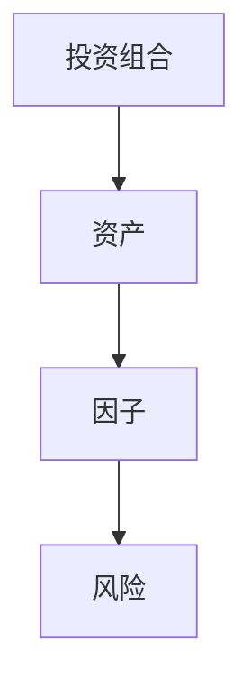
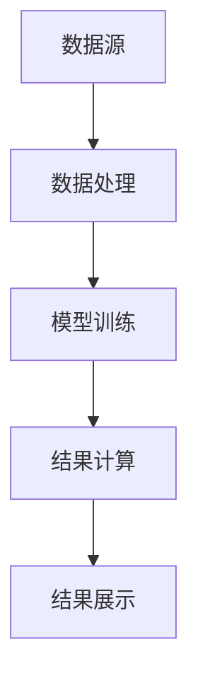

                 


---

# AI辅助的对冲基金绩效归因

> 关键词：对冲基金，绩效归因，人工智能，算法，数学模型，系统架构

> 摘要：本文探讨了AI在对冲基金绩效归因中的应用，详细分析了绩效归因的核心概念、算法原理、系统架构，并通过实际案例展示了AI如何提升对冲基金的绩效分析能力。

---

## 第一部分: 对冲基金与绩效归因概述

### 第1章: 对冲基金与绩效归因概述

#### 1.1 对冲基金的基本概念
对冲基金是一种通过利用市场波动和套利机会来实现正收益的投资工具。其核心策略包括多空头寸、对冲风险和杠杆操作。对冲基金的目标是在不同市场条件下保持稳定的收益。

##### 1.1.1 对冲基金的定义
对冲基金通过同时做多和做空资产，利用价格差异和市场波动来获利。其灵活性使其能够适应不同的市场环境。

##### 1.1.2 对冲基金的主要策略
- 股票市场中性策略：通过做多和做空股票来抵消市场风险。
- 固定收益套利：利用债券市场的定价错误进行套利。
- 事件驱动策略：利用公司并购、重组等事件带来的价格波动。

##### 1.1.3 对冲基金的市场规模与发展趋势
对冲基金行业在过去几十年中迅速发展，市场规模已超过1万亿美元。随着技术的进步，越来越多的对冲基金开始采用AI和大数据技术来提升投资决策的效率和准确性。

#### 1.2 绩效归因的定义与重要性
绩效归因是对冲基金投资结果分析的重要组成部分，用于确定投资组合收益的来源。

##### 1.2.1 绩效归因的基本概念
绩效归因是将投资组合的收益分解为各个因素或资产的具体贡献。这有助于理解收益的来源，并为未来的投资决策提供依据。

##### 1.2.2 绩效归因在对冲基金中的作用
- 评估投资策略的有效性。
- 识别风险来源，优化投资组合。
- 提供透明的收益解释，增强投资者信心。

##### 1.2.3 绩效归因的边界与外延
绩效归因的边界包括数据限制、模型假设和时间窗口。外延则涉及动态调整和多因子模型的应用。

#### 1.3 AI技术在对冲基金中的应用
AI技术在对冲基金中的应用主要集中在数据处理、信号生成和风险控制等方面。

##### 1.3.1 AI在金融领域的应用现状
AI在金融领域的应用包括算法交易、风险管理和客户画像构建。AI技术的引入显著提高了金融决策的效率和精度。

##### 1.3.2 AI在对冲基金绩效归因中的潜力
AI技术可以通过大数据分析和复杂模型，帮助识别传统方法难以发现的收益来源，提高绩效归因的准确性和全面性。

##### 1.3.3 本章小结
通过对冲基金的基本概念和AI技术的应用现状，本文为后续的绩效归因分析奠定了基础。

---

## 第二部分: 绩效归因的核心概念与模型

### 第2章: 绩效归因的核心概念与联系

#### 2.1 绩效归因的核心概念
绩效归因涉及多个关键概念，如投资组合收益、市场风险和特定风险。

##### 2.1.1 投资组合收益的构成
投资组合收益由资产回报、交易成本和管理费用等因素组成。通过分解这些因素，可以更清晰地理解收益的来源。

##### 2.1.2 市场风险与特定风险
市场风险是由于市场整体波动带来的风险，特定风险则是由于个别资产或行业波动带来的风险。绩效归因需要区分这两种风险的影响。

##### 2.1.3 绩效归因的主要方法
常见的绩效归因方法包括因子分解模型、投资组合归因法和风险调整后的绩效归因。每种方法都有其优缺点，适用于不同的场景。

#### 2.2 绩效归因的关键属性特征对比
不同绩效归因方法在属性特征上存在显著差异，了解这些差异有助于选择合适的方法。

##### 2.2.1 不同绩效归因方法的特征对比
| 方法名称         | 计算复杂度 | 数据需求 | 适用场景       |
|------------------|------------|-----------|----------------|
| 因子分解模型     | 中等       | 高         | 股票、债券等   |
| 投资组合归因法   | 较低       | 中         | 组合收益分解   |
| 风险调整后的归因 | 较高       | 高         | 风险控制       |

##### 2.2.2 方法选择的影响因素
数据质量、模型假设和计算能力是影响方法选择的关键因素。选择合适的方法需要综合考虑这些因素。

##### 2.2.3 属性特征对结果的影响
方法的选择直接影响归因结果的准确性和可解释性。例如，因子分解模型适合于多资产组合，而投资组合归因法则适用于单一资产组合。

#### 2.3 绩效归因的ER实体关系图
通过实体关系图可以清晰地展示绩效归因中的关键实体及其关系。

##### 2.3.1 实体关系图的构建
- **投资组合**：包括多个资产头寸。
- **资产**：可以是股票、债券或其他金融工具。
- **因子**：如市值、价值、动量等。
- **风险**：包括市场风险和特定风险。

##### 2.3.2 关键实体之间的关系
- 投资组合由多个资产组成。
- 资产的风险和收益通过因子影响投资组合的总体收益。
- 绩效归因通过分解这些关系，识别各个因素的贡献。

##### 2.3.3 图表展示（使用 Mermaid）


---

## 第三部分: 绩效归因的算法原理

### 第3章: 绩效归因的主要算法与实现

#### 3.1 常见的绩效归因算法
绩效归因涉及多种算法，如因子分解模型、投资组合归因法和风险调整后的绩效归因。

##### 3.1.1 因子分解模型
因子分解模型将投资组合的收益分解为多个因子的贡献。例如，使用Fama-French三因子模型分解收益。

##### 3.1.2 投资组合归因法
投资组合归因法将投资组合的收益分解为各个资产的贡献，考虑资产权重和收益的交互作用。

##### 3.1.3 风险调整后的绩效归因
风险调整后的绩效归因通过调整投资组合的风险敞口，识别超额收益的来源。

#### 3.2 算法原理的数学模型
数学模型是理解算法原理的关键。

##### 3.2.1 因子分解模型的数学表达
$$ R_p = \beta_1 R_{factor1} + \beta_2 R_{factor2} + \alpha $$

其中，$R_p$ 是投资组合的收益，$\beta_1$ 和 $\beta_2$ 是因子的权重，$\alpha$ 是超额收益。

##### 3.2.2 投资组合归因法的数学公式
$$ R_p = \sum_{i=1}^{n} w_i R_i $$

其中，$w_i$ 是资产i的权重，$R_i$ 是资产i的收益。

##### 3.2.3 风险调整后的绩效归因公式
$$ R_p = \sum_{i=1}^{n} w_i R_i - \sum_{i=1}^{n} w_i \sigma_i^2 $$

其中，$\sigma_i^2$ 是资产i的波动率。

#### 3.3 算法实现的代码示例
通过代码示例可以更好地理解算法的实现。

##### 3.3.1 因子分解模型的Python实现
```python
import numpy as np

def factor_model(returns, factors):
    beta = np.dot(np.linalg.inv(np.dot(factors.T, factors)), np.dot(factors.T, returns))
    alpha = returns - np.dot(beta, factors)
    return alpha, beta
```

##### 3.3.2 投资组合归因法的Python实现
```python
def portfolio_attribution(returns, weights):
    return np.sum(weights * returns)
```

##### 3.3.3 风险调整后的绩效归因代码示例
```python
def risk_adjusted_attribution(returns, weights, risks):
    return np.sum(weights * (returns - risks))
```

#### 3.4 绩效归因算法的实现细节
实现细节包括数据预处理、模型选择和结果验证。

##### 3.4.1 数据预处理
- 数据清洗：处理缺失值和异常值。
- 标准化：对数据进行标准化处理。

##### 3.4.2 模型选择
选择合适的模型需要考虑数据特征和业务需求。

##### 3.4.3 结果验证
通过回测和风险调整来验证模型的有效性。

---

## 第四部分: 系统架构与设计

### 第4章: 对冲基金绩效归因系统的架构设计

#### 4.1 系统功能设计
系统功能设计包括数据获取、特征工程、模型训练和结果分析。

##### 4.1.1 数据获取模块
数据获取模块负责从各种数据源获取金融数据。

##### 4.1.2 特征工程模块
特征工程模块对数据进行特征提取和转换。

##### 4.1.3 模型训练模块
模型训练模块使用机器学习算法进行模型训练。

##### 4.1.4 结果分析模块
结果分析模块对模型输出进行分析和可视化。

#### 4.2 系统架构设计
系统架构设计包括数据层、业务逻辑层和表现层。

##### 4.2.1 数据层
数据层包括数据源和数据存储。

##### 4.2.2 业务逻辑层
业务逻辑层包括数据处理、模型训练和结果计算。

##### 4.2.3 表现层
表现层负责用户交互和结果展示。

##### 4.2.4 系统架构图（使用 Mermaid）


#### 4.3 系统实现细节
系统实现细节包括模块之间的交互和数据流的设计。

##### 4.3.1 模块交互
数据处理模块接收数据源的数据，进行清洗和转换，然后传递给模型训练模块。

##### 4.3.2 数据流设计
数据从数据源流出，经过处理后流入模型训练模块，训练结果流出到结果计算模块，最终展示在表现层。

---

## 第五部分: 项目实战

### 第5章: 项目实战与案例分析

#### 5.1 项目背景介绍
项目背景包括数据来源和项目目标。

##### 5.1.1 数据来源
数据来源于某对冲基金的投资组合和市场数据。

##### 5.1.2 项目目标
项目旨在利用AI技术对投资组合进行绩效归因，识别收益来源和风险敞口。

#### 5.2 项目实施步骤
项目实施步骤包括数据准备、模型训练、结果分析和优化调整。

##### 5.2.1 数据准备
- 数据清洗：处理缺失值和异常值。
- 数据转换：对数据进行标准化处理。

##### 5.2.2 模型训练
- 选择合适的模型：如因子分解模型或投资组合归因法。
- 训练模型并验证其有效性。

##### 5.2.3 结果分析
- 分析模型输出，识别收益来源和风险因素。
- 可视化结果，便于理解和汇报。

##### 5.2.4 优化调整
- 根据分析结果调整模型参数。
- 重新训练模型，验证优化效果。

#### 5.3 项目核心代码实现
项目核心代码实现包括数据处理、模型训练和结果分析。

##### 5.3.1 数据处理代码
```python
import pandas as pd

def data_preprocessing(data):
    data = data.dropna()
    data = (data - data.mean()) / data.std()
    return data
```

##### 5.3.2 模型训练代码
```python
from sklearn.linear_model import LinearRegression

def train_model(data, target):
    model = LinearRegression()
    model.fit(data, target)
    return model
```

##### 5.3.3 结果分析代码
```python
def analyze_results(model, data, target):
    coefficients = model.coef_
    print("Coefficients:", coefficients)
```

#### 5.4 项目案例分析
项目案例分析包括实际数据的处理和模型的应用。

##### 5.4.1 数据处理与分析
对实际数据进行处理和分析，识别关键因素对收益的影响。

##### 5.4.2 模型应用与结果展示
应用模型对数据进行分析，并展示结果，包括因子贡献和风险敞口。

##### 5.4.3 案例分析小结
通过案例分析，验证模型的有效性，并总结经验教训。

---

## 第六部分: 最佳实践与总结

### 第6章: 最佳实践与总结

#### 6.1 最佳实践 tips
最佳实践包括数据质量管理、模型选择和结果解释。

##### 6.1.1 数据质量管理
- 确保数据的完整性和准确性。
- 定期更新数据，保持数据的及时性。

##### 6.1.2 模型选择与优化
- 根据具体需求选择合适的模型。
- 定期优化模型，适应市场变化。

##### 6.1.3 结果解释与可视化
- 通过可视化工具展示结果，便于理解和汇报。
- 结果解释需要结合业务背景，避免过于技术化。

#### 6.2 小结
本文详细探讨了AI在对冲基金绩效归因中的应用，从核心概念到算法实现，再到系统设计和项目实战，为读者提供了全面的指导。

#### 6.3 注意事项
- 数据隐私和安全问题需要高度重视。
- 模型的可解释性是实际应用中的重要考量。
- 需要结合实际情况调整模型参数，避免过度拟合。

#### 6.4 拓展阅读
- 《机器学习在金融中的应用》
- 《对冲基金策略与风险管理》
- 《Python在金融数据分析中的应用》

---

## 作者信息

作者：AI天才研究院/AI Genius Institute & 禅与计算机程序设计艺术 /Zen And The Art of Computer Programming

---

以上是《AI辅助的对冲基金绩效归因》的部分内容，涵盖了从基础概念到算法实现再到系统设计的全过程，结合实际案例进行详细分析。

