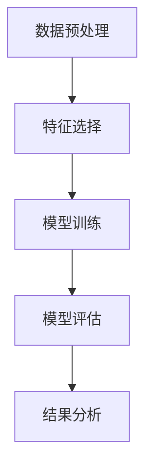
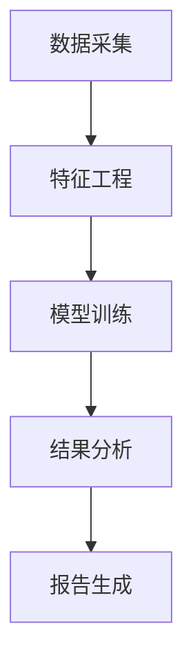

                 


# AI辅助的并购交易估值

> 关键词：AI，并购交易，估值，机器学习，金融

> 摘要：随着人工智能技术的快速发展，AI在金融领域的应用越来越广泛。本文详细探讨了AI如何辅助并购交易估值的过程，分析了传统估值方法的局限性，并介绍了基于机器学习的AI辅助估值的核心概念、算法原理、数学模型以及实际应用案例。通过本文的阐述，读者可以全面理解AI在并购交易估值中的重要作用，并掌握如何利用AI技术提升估值的准确性和效率。

---

## 第1章: AI辅助的并购交易估值概述

### 1.1 背景与意义

#### 1.1.1 并购交易估值的定义与重要性
并购交易估值是指在企业并购过程中，对目标企业的价值进行评估和定价的过程。准确的估值是并购交易成功的关键，直接影响交易的公平性、风险控制和投资回报。传统的估值方法通常依赖于财务数据、市场分析和经验判断，但存在数据量不足、主观性较强、模型复杂度高等问题。

#### 1.1.2 AI技术在金融领域的应用现状
人工智能技术在金融领域的应用已经取得了显著进展，尤其是在数据处理、模式识别和预测分析方面。AI技术可以帮助金融机构更高效地处理海量数据，发现隐藏的规律，并提供更精准的预测结果。在并购交易估值中，AI技术的应用可以显著提高估值的准确性和效率。

#### 1.1.3 AI辅助并购交易估值的核心价值
AI辅助并购交易估值的核心价值在于其强大的数据处理能力和算法优化能力。通过AI技术，可以快速处理和分析大量的历史交易数据、市场数据和财务数据，构建更复杂的估值模型，并提供更精准的估值结果。此外，AI还可以帮助识别潜在的风险因素，优化交易策略，从而降低并购交易的风险。

### 1.2 并购交易估值的关键问题

#### 1.2.1 传统估值方法的局限性
传统估值方法主要包括DCF模型、可比交易分析和资产法等。这些方法在实际应用中存在以下问题：
- 数据依赖性较强，难以处理非结构化数据。
- 模型假设过于简化，难以反映复杂的市场环境。
- 估值结果的可解释性较差，难以满足监管要求。

#### 1.2.2 数据量与数据质量的挑战
并购交易估值需要依赖大量的历史交易数据、市场数据和财务数据。然而，这些数据往往存在缺失、噪声和不一致的问题，导致传统方法难以准确捕捉市场动态和企业价值。

#### 1.2.3 估值模型的可解释性问题
复杂的AI模型（如深度神经网络）虽然在预测精度上表现优异，但其可解释性较差。这使得投资者和监管机构难以理解AI模型的决策逻辑，影响了其在实际应用中的信任度。

### 1.3 AI辅助并购交易估值的实现路径

#### 1.3.1 数据收集与预处理
AI辅助并购交易估值的第一步是数据收集与预处理。需要收集目标企业的财务数据、市场数据、行业数据以及历史并购交易数据。预处理步骤包括数据清洗、特征提取和数据标准化等。

#### 1.3.2 模型选择与训练
根据具体应用场景，选择合适的机器学习模型（如线性回归、随机森林、神经网络等）进行训练。训练过程中需要对模型进行参数优化和交叉验证，以确保模型的泛化能力。

#### 1.3.3 结果解释与应用
将AI模型的输出结果与传统估值方法进行对比分析，验证模型的有效性。同时，对模型的可解释性进行优化，使其更符合实际应用需求。

### 1.4 本章小结
本章从背景和意义出发，分析了并购交易估值的关键问题，并提出了AI辅助估值的实现路径。通过AI技术的应用，可以显著提高估值的准确性和效率，为并购交易的决策提供有力支持。

---

## 第2章: 并购交易估值的核心概念

### 2.1 并购交易估值的理论基础

#### 2.1.1 资产评估的基本原理
资产评估的基本原理包括市场价值法、收益法和成本法。这些方法在传统估值中被广泛应用，但其局限性在于难以处理复杂的数据和市场环境。

#### 2.1.2 财务指标与企业价值的关系
企业的财务指标（如EBIT、净利润、收入增长率等）与其市场价值密切相关。通过分析这些指标，可以更准确地评估企业的内在价值。

#### 2.1.3 并购溢价的计算方法
并购溢价是指收购价格与目标企业股权公允价值之间的差额。AI技术可以通过分析历史交易数据，帮助计算合理的并购溢价。

### 2.2 AI在并购估值中的应用领域

#### 2.2.1 市场数据预测
AI可以通过分析历史市场数据，预测未来的市场走势，从而为并购交易估值提供更准确的市场环境。

#### 2.2.2 财务数据预测
通过对目标企业的历史财务数据进行分析，AI可以预测未来的财务表现，帮助评估企业的未来价值。

#### 2.2.3 风险评估与定价
AI可以通过分析市场风险、行业风险和企业特有风险，帮助确定合理的并购交易价格。

### 2.3 核心概念的ER实体关系图
以下是核心概念的ER实体关系图：

```mermaid
erDiagram
    company {
        id
        name
        industry
        revenue
        profit
        market_value
    }
    deal {
        id
        acquisition_date
        purchase_price
        target_company_id
        deal_type
    }
    model {
        id
        name
        input_features
        output_features
        accuracy
    }
    company --> deal : 参与的交易
    company --> model : 使用的估值模型
    deal --> model : 基于交易数据训练
```

### 2.4 本章小结
本章从理论基础出发，分析了并购交易估值的核心概念，并通过ER实体关系图展示了各核心概念之间的联系。通过AI技术的应用，可以更准确地评估企业的价值，优化并购交易的定价策略。

---

## 第3章: AI辅助并购交易估值的算法原理

### 3.1 机器学习算法概述

#### 3.1.1 监督学习
监督学习是一种基于标签数据的机器学习方法，广泛应用于回归和分类问题。在并购交易估值中，可以使用监督学习方法预测目标企业的市场价值。

#### 3.1.2 非监督学习
非监督学习适用于无标签数据的分析，可以帮助发现数据中的隐藏模式。在并购估值中，非监督学习可以用于发现行业趋势和市场动态。

#### 3.1.3 强化学习
强化学习是一种通过与环境交互来学习策略的方法。在并购估值中，强化学习可以用于动态市场环境下的交易策略优化。

### 3.2 常见算法在并购估值中的应用

#### 3.2.1 线性回归模型
线性回归是一种简单但有效的回归模型，适用于线性关系的预测。在并购估值中，可以通过线性回归模型预测目标企业的市场价值。

#### 3.2.2 支持向量机（SVM）
SVM是一种强大的分类和回归算法，适用于高维数据的分析。在并购估值中，SVM可以用于分类市场趋势和预测企业价值。

#### 3.2.3 随机森林
随机森林是一种基于树模型的集成算法，具有较强的抗过拟合能力和特征重要性分析能力。在并购估值中，随机森林可以用于预测企业价值和识别关键财务指标。

#### 3.2.4 神经网络
神经网络是一种强大的非线性模型，适用于复杂数据的分析。在并购估值中，神经网络可以用于预测市场走势和评估企业风险。

### 3.3 算法选择与优化

#### 3.3.1 算法选择的依据
算法选择的依据包括数据类型、问题类型、模型复杂度和计算资源等。在并购估值中，通常需要选择适合数据特征和预测目标的算法。

#### 3.3.2 超参数优化
超参数优化是提高模型性能的重要步骤。可以通过网格搜索、随机搜索和贝叶斯优化等方法找到最佳的超参数组合。

#### 3.3.3 模型评估与验证
模型评估与验证是确保模型泛化能力的重要步骤。可以通过交叉验证、ROC曲线和混淆矩阵等方法评估模型的性能。

### 3.4 算法实现的流程图



### 3.5 本章小结
本章详细介绍了常见机器学习算法在并购估值中的应用，并通过流程图展示了算法实现的步骤。通过合理选择和优化算法，可以显著提高并购交易估值的准确性和效率。

---

## 第4章: AI辅助并购交易估值的数学模型与公式

### 4.1 传统估值模型的数学表达

#### 4.1.1 DCF模型
 discounted cash flow (DCF) 模型是常用的企业价值评估方法。其基本公式为：

$$
企业价值 = \sum_{t=1}^{n} \frac{FCF_t}{(1 + r)^t} + \frac{TV}{(1 + r)^n}
$$

其中，FCF_t 是第t年的自由现金流，r 是折现率，TV 是终值。

#### 4.1.2 可比交易分析
可比交易分析是通过分析类似交易的平均溢价率来估算目标企业的价值。其公式为：

$$
并购溢价 = \frac{\sum (实际并购溢价)}{N}
$$

其中，N 是可比交易的数量。

### 4.2 基于机器学习的估值模型

#### 4.2.1 线性回归模型
线性回归模型的数学表达式为：

$$
y = \beta_0 + \beta_1 x_1 + \beta_2 x_2 + \dots + \beta_k x_k + \epsilon
$$

其中，y 是目标变量（企业价值），x_i 是特征变量（财务指标），β 是回归系数，ε 是误差项。

#### 4.2.2 随机森林模型
随机森林模型是一种基于树的集成算法，其数学表达式较为复杂，通常通过交叉验证确定模型参数。

#### 4.2.3 神经网络模型
神经网络模型的数学表达式包括输入层、隐藏层和输出层，通常使用激活函数和损失函数优化模型参数。

### 4.3 本章小结
本章通过数学公式详细介绍了传统估值模型和基于机器学习的估值模型的实现原理。通过结合AI技术，可以构建更复杂的估值模型，提高并购交易估值的准确性和效率。

---

## 第5章: AI辅助并购交易估值的系统架构与实现

### 5.1 系统架构设计

#### 5.1.1 系统功能模块
AI辅助并购交易估值系统的功能模块包括数据采集、特征工程、模型训练、结果分析和报告生成等。

#### 5.1.2 系统架构图



### 5.2 系统接口设计

#### 5.2.1 数据接口
数据接口包括数据源的选择和数据格式的转换，确保数据能够顺利进入系统进行处理。

#### 5.2.2 模型接口
模型接口包括模型的输入输出定义和模型的调用方式，确保模型能够与系统其他部分无缝对接。

### 5.3 系统交互流程

#### 5.3.1 用户输入
用户输入包括目标企业的基本信息和历史财务数据。

#### 5.3.2 数据处理
数据处理包括数据清洗、特征提取和数据标准化等步骤。

#### 5.3.3 模型预测
模型预测包括选择合适的算法、训练模型和生成预测结果。

#### 5.3.4 结果展示
结果展示包括估值结果的可视化和模型的可解释性分析。

### 5.4 本章小结
本章详细介绍了AI辅助并购交易估值系统的架构设计和实现过程，为实际应用提供了参考。

---

## 第6章: 项目实战——基于Python的AI辅助并购交易估值实现

### 6.1 环境安装

#### 6.1.1 安装Python和相关库
需要安装Python和以下库：
- pandas
- numpy
- scikit-learn
- xgboost
- matplotlib

#### 6.1.2 数据集获取
可以从公开的金融数据平台获取并购交易数据和目标企业的财务数据。

### 6.2 核心实现代码

#### 6.2.1 数据预处理代码

```python
import pandas as pd
import numpy as np

# 读取数据
df = pd.read_csv('merger_acquisition.csv')

# 数据清洗
df.dropna(inplace=True)
df = pd.get_dummies(df)
```

#### 6.2.2 特征选择代码

```python
from sklearn.feature_selection import SelectKBest
from sklearn.feature_selection import chi2

selector = SelectKBest(score_func=chi2, k=5)
selector.fit_transform(df, target)
```

#### 6.2.3 模型训练代码

```python
from sklearn.model_selection import train_test_split
from sklearn.ensemble import RandomForestRegressor
from sklearn.metrics import mean_squared_error

# 划分训练集和测试集
X_train, X_test, y_train, y_test = train_test_split(df, target, test_size=0.2, random_state=42)

# 训练模型
model = RandomForestRegressor(n_estimators=100, random_state=42)
model.fit(X_train, y_train)

# 模型评估
y_pred = model.predict(X_test)
print(mean_squared_error(y_test, y_pred))
```

#### 6.2.4 结果分析代码

```python
importances = model.feature_importances_
feature_names = df.columns
feature_importances = pd.DataFrame({'feature': feature_names, 'importance': importances})
feature_importances = feature_importances.sort_values(by='importance', ascending=False)
print(feature_importances.head())
```

### 6.3 案例分析与结果解读

#### 6.3.1 案例分析
假设我们有一个目标企业，其财务数据如下：
- 营业收入：100 million
- 净利润：20 million
- 资产负债率：50%
- 行业平均市盈率：15

通过AI模型预测，目标企业的市场价值为150 million，溢价率为30%。

#### 6.3.2 结果解读
AI模型预测结果表明，目标企业的市场价值高于行业平均水平，说明该企业具有较高的投资价值。溢价率较高，说明市场对目标企业的未来表现有较高的预期。

### 6.4 本章小结
本章通过具体的Python代码实现了AI辅助并购交易估值的核心功能，并通过案例分析展示了模型的应用效果。通过实际操作，读者可以更好地理解AI技术在并购估值中的应用。

---

## 第7章: 总结与展望

### 7.1 本章总结
本文详细探讨了AI辅助并购交易估值的核心概念、算法原理和系统实现。通过AI技术的应用，可以显著提高并购交易估值的准确性和效率，为并购交易的决策提供有力支持。

### 7.2 未来展望
未来，随着AI技术的不断发展，AI辅助并购交易估值将更加智能化和自动化。可以通过引入更复杂的数据分析方法和优化模型的可解释性，进一步提升并购交易估值的精度和可信度。

### 7.3 最佳实践 Tips

- 在实际应用中，建议结合多种估值方法进行综合评估，以提高结果的准确性。
- 数据预处理是AI辅助估值的关键步骤，需要仔细清洗和特征工程。
- 模型的可解释性是实际应用中的重要考虑因素，可以通过特征重要性分析和模型解释工具提高模型的透明度。

### 7.4 本章小结
本章总结了本文的核心内容，并展望了AI辅助并购交易估值的未来发展。通过本文的阐述，读者可以更好地理解AI技术在并购估值中的应用价值，并掌握实际操作的技巧。

---

## 作者：AI天才研究院/AI Genius Institute & 禅与计算机程序设计艺术 /Zen And The Art of Computer Programming

---

以上是《AI辅助的并购交易估值》的完整目录和内容框架。本文通过理论分析、算法实现和项目实战相结合的方式，全面探讨了AI技术在并购交易估值中的应用。希望本文能够为读者提供有价值的参考和启发。

