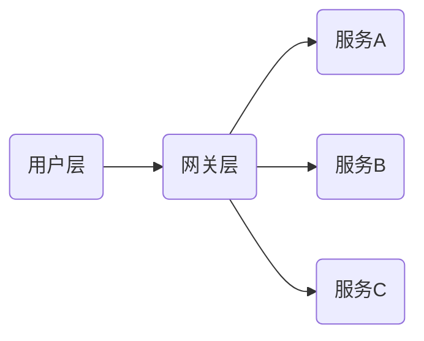

                 


# AI辅助的并购交易分析

> 关键词：AI，并购交易，数据分析，机器学习，自然语言处理

> 摘要：本文详细探讨了AI技术在并购交易分析中的应用，从背景介绍、核心概念、算法原理、系统架构到项目实战，全面解析了如何利用AI技术提升并购交易的分析效率和准确性。文章结合实际案例，深入分析了AI在并购交易中的优势和挑战，并给出了具体的实现方案和最佳实践。

---

## 第1章: 背景介绍

### 1.1 并购交易的基本概念

#### 1.1.1 并购的定义与分类
并购（Mergers and Acquisitions, M&A）是指一家企业与其他企业合并或收购其资产、股权等行为。并购可以分为两类：
- **合并（Merger）**：两家或多家企业合并为一家新公司。
- **收购（Acquisition）**：一家企业收购另一家企业的全部或部分资产。

并购交易的核心目标是通过整合资源、优化资产配置、提升市场竞争力，实现企业价值的最大化。

#### 1.1.2 并购交易的核心问题
在并购交易中，买方和卖方都需要解决以下核心问题：
- **价值评估**：如何准确评估目标企业的市场价值？
- **风险识别**：如何识别交易中的潜在风险？
- **决策优化**：如何制定最优的交易策略？

#### 1.1.3 并购交易的流程与阶段
并购交易通常包括以下几个阶段：
1. **战略规划**：确定并购目标和战略方向。
2. **尽职调查**：对目标企业进行全面的财务、法律和业务评估。
3. **估值与谈判**：确定交易价格和条款。
4. **整合规划**：制定整合方案，确保并购后的企业高效运作。

### 1.2 AI在并购交易中的应用背景

#### 1.2.1 并购交易中的数据与信息处理
并购交易涉及大量非结构化数据（如文本文件、财务报表）和结构化数据（如财务指标、市场数据）。传统的数据分析方法效率低下，难以快速提取关键信息。

#### 1.2.2 AI技术在金融领域的应用现状
AI技术在金融领域的应用已经取得了显著进展，尤其是在数据处理、风险评估和预测分析方面。并购交易作为金融领域的重要组成部分，也在逐步引入AI技术。

#### 1.2.3 并购交易分析的痛点与挑战
传统并购交易分析面临以下痛点：
- 数据量大，分析效率低。
- 信息分散，难以快速提取关键信息。
- 风险识别不全面，可能导致决策失误。

---

## 第2章: 核心概念与联系

### 2.1 AI辅助并购交易的核心原理

#### 2.1.1 数据驱动的分析方法
AI通过数据驱动的方法，利用机器学习和自然语言处理技术，从大量数据中提取有价值的信息，帮助决策者制定更优策略。

#### 2.1.2 智能算法的应用场景
AI算法在并购交易中的应用场景包括：
- **文本分析**：从目标企业的财报、法律文件中提取关键信息。
- **预测分析**：预测并购后的协同效应和潜在风险。
- **模式识别**：识别市场趋势和企业行为模式。

#### 2.1.3 知识图谱与语义分析
知识图谱可以帮助构建企业之间的关系网络，语义分析则可以理解文本中的深层含义，进一步提升分析的准确性。

### 2.2 核心概念对比分析

#### 2.2.1 传统并购分析 vs AI辅助分析
| **维度**       | **传统并购分析**                  | **AI辅助分析**                  |
|----------------|-----------------------------------|-----------------------------------|
| 数据处理效率   | 低                                | 高                                |
| 信息提取能力   | 依赖人工经验                      | 自动化提取                        |
| 分析范围       | 有限                             | 全面                             |

#### 2.2.2 数据特征 vs 智能特征
| **特征类型**    | **数据特征**                     | **智能特征**                     |
|----------------|----------------------------------|----------------------------------|
| 表现形式       | 结构化数据                        | 非结构化数据                    |
| 分析能力       | 简单统计                        | 深度学习                        |

#### 2.2.3 人工决策 vs AI决策
| **决策方式**    | **人工决策**                     | **AI决策**                       |
|----------------|----------------------------------|----------------------------------|
| 决策速度       | 较慢                             | 较快                             |
| 决策准确性     | 受经验限制                       | 数据驱动，准确性高               |

### 2.3 实体关系图与流程图

#### 2.3.1 并购交易的ER实体关系图
```mermaid
erDiagram
    actor 投资者
    actor 中介机构
    actor 目标企业
    actor 买方企业
    actor 监管机构
    database 交易数据
    database 企业信息
    database 市场数据
    用例1: 战略规划
    用例2: 尽职调查
    用例3: 估值与谈判
    用例4: 整合规划
```

#### 2.3.2 AI辅助并购的流程图
```mermaid
graph TD
    A[开始] -> B[数据采集]
    B -> C[数据预处理]
    C -> D[特征提取]
    D -> E[模型训练]
    E -> F[预测与分析]
    F -> G[决策支持]
    G -> H[结束]
```

---

## 第3章: 算法原理讲解

### 3.1 基于机器学习的并购预测模型

#### 3.1.1 数据预处理与特征提取
- 数据清洗：去除缺失值和异常值。
- 特征提取：从财务数据中提取关键指标（如ROE、净利润率）。

#### 3.1.2 模型训练与优化
- 使用线性回归模型进行初步预测。
- 通过交叉验证优化模型参数。

#### 3.1.3 模型评估与部署
- 使用ROC-AUC指标评估模型性能。
- 部署模型到生产环境，实时预测并购风险。

### 3.2 基于自然语言处理的文本分析

#### 3.2.1 文本数据的获取与清洗
- 从目标企业的财报中获取文本数据。
- 使用分词工具（如jieba）进行文本清洗。

#### 3.2.2 模型训练与语义分析
- 使用BERT模型进行文本编码。
- 通过注意力机制捕捉文本中的关键信息。

#### 3.2.3 实例分析与效果评估
- 对目标企业的财报进行语义分析，提取财务风险信息。
- 使用准确率和召回率评估模型性能。

---

### 3.2.2 模型训练与语义分析的代码实现

```python
import pandas as pd
from sklearn.feature_extraction.text import TfidfVectorizer
from sklearn.naive_bayes import MultinomialNB
from sklearn.metrics import accuracy_score

# 数据加载
df = pd.read_csv('corporate_reports.csv')

# 文本预处理
vectorizer = TfidfVectorizer(max_features=500)
X = vectorizer.fit_transform(df['report_text'])
y = df['risk_label']

# 模型训练
model = MultinomialNB()
model.fit(X, y)

# 模型预测
test_X = vectorizer.transform(['公司财务状况良好，未来盈利可期'])
test_y = model.predict(test_X)

# 结果评估
print(accuracy_score(y_true=y, y_pred=test_y))
```

---

## 第4章: 数学模型与公式

### 4.1 机器学习模型的数学基础

#### 4.1.1 线性回归模型
$$ y = \beta_0 + \beta_1x + \epsilon $$

#### 4.1.2 支持向量机模型
$$ \text{目标函数} = \min_{\beta,b,\xi} \left( \frac{1}{2}\|\beta\|^2 + C\sum_{i=1}^n \xi_i \right) $$
$$ \text{约束条件} = y_i (\beta \cdot x_i + b) \geq 1 - \xi_i, \xi_i \geq 0 $$

#### 4.1.3 神经网络模型
$$ a^{(l+1)} = \sigma(w^{(l)}a^{(l)} + b^{(l)}) $$

### 4.2 深度学习模型的数学公式

#### 4.2.1 RNN模型公式
$$ s_t = \tanh(W_{s}a_{t-1} + U_{s}x_t) $$
$$ o_t = W_{o}s_t $$

#### 4.2.2 CNN模型公式
$$ \text{卷积层} = \max\left( \sum_{k} w_k x_{i+k} \right) $$

#### 4.2.3 Transformer模型公式
$$ \text{自注意力机制} = \text{softmax}\left( \frac{QK^T}{\sqrt{d_k}} \right)V $$

---

## 第5章: 系统分析与架构设计

### 5.1 问题场景介绍

#### 5.1.1 并购交易分析的典型场景
- 投资者需要快速评估目标企业的价值。
- 中介机构需要自动化处理大量文档。

#### 5.1.2 AI辅助的系统目标
- 提供实时的市场数据分析。
- 支持智能化的决策制定。

### 5.2 系统功能设计

#### 5.2.1 数据采集模块
- 从公开数据源（如 Bloomberg、Reuters）获取企业数据。
- 支持多种数据格式（如 CSV、JSON）。

#### 5.2.2 数据分析模块
- 提供多维度的数据可视化。
- 支持定制化的分析报告。

#### 5.2.3 智能决策模块
- 提供并购预测和风险评估。
- 支持多场景的决策模拟。

### 5.3 系统架构设计

#### 5.3.1 分层架构设计


#### 5.3.2 微服务架构设计


---

## 第6章: 项目实战

### 6.1 环境安装与配置

#### 6.1.1 Python环境安装
```bash
python -m pip install --upgrade pip
pip install jupyterlab scikit-learn tensorflow transformers
```

#### 6.1.2 数据集准备
- 下载企业财报数据集。
- 数据清洗和预处理。

### 6.2 系统核心实现源代码

#### 6.2.1 文本分析代码
```python
from transformers import pipeline

# 初始化文本分类管道
classifier = pipeline("text-classification", model="nlpaueb/microsoft-backed")

# 分析目标企业文本
result = classifier("公司财务状况良好，未来盈利可期")
print(result)
```

#### 6.2.2 模型训练代码
```python
import torch
import torch.nn as nn
import torch.optim as optim

# 定义简单神经网络
class SimpleNet(nn.Module):
    def __init__(self, input_size, output_size):
        super(SimpleNet, self).__init__()
        self.fc = nn.Linear(input_size, output_size)
    
    def forward(self, x):
        return self.fc(x)

# 初始化模型和优化器
model = SimpleNet(10, 1)
optimizer = optim.SGD(model.parameters(), lr=0.01)
criterion = nn.MSELoss()

# 训练模型
for epoch in range(100):
    outputs = model(inputs)
    loss = criterion(outputs, labels)
    optimizer.zero_grad()
    loss.backward()
    optimizer.step()
```

---

## 第7章: 最佳实践、小结、注意事项与拓展阅读

### 7.1 最佳实践
- 数据预处理是关键，确保数据的准确性和完整性。
- 在实际应用中，结合业务知识优化模型。

### 7.2 小结
本文详细探讨了AI技术在并购交易分析中的应用，从理论到实践，全面解析了如何利用AI技术提升并购交易的效率和准确性。

### 7.3 注意事项
- 数据隐私和安全问题需要高度重视。
- 模型的可解释性是实际应用中的重要考量。

### 7.4 拓展阅读
- 《Python机器学习》
- 《深度学习入门：基于Python》
- 《自然语言处理实战》

---

作者：AI天才研究院/AI Genius Institute & 禅与计算机程序设计艺术 /Zen And The Art of Computer Programming

