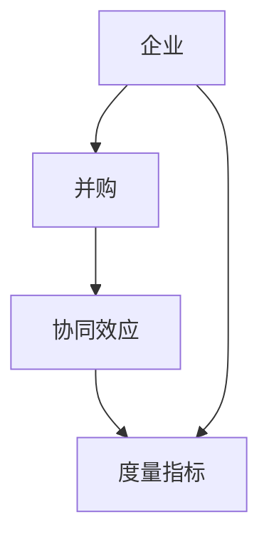
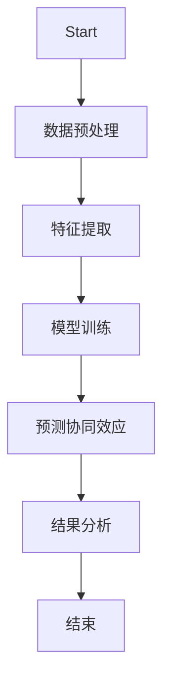
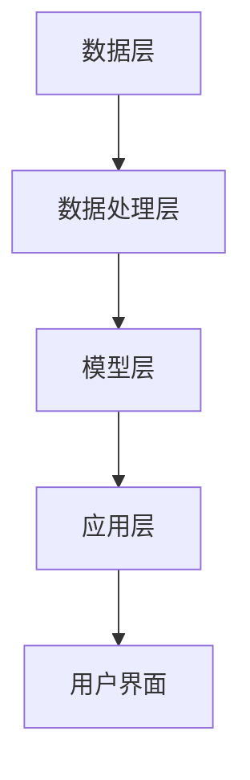
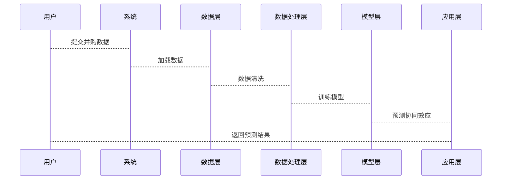

                 


# AI辅助的并购协同效应分析

> 关键词：AI，并购，协同效应，数据分析，机器学习，企业战略

> 摘要：本文深入探讨了AI技术在并购协同效应分析中的应用，从理论基础到实际案例，详细分析了AI如何帮助企业在并购过程中识别和最大化协同效应，提升企业价值。通过结合数学模型、算法流程图和实际代码实现，本文为读者提供了一套完整的AI辅助并购协同效应分析的方法论。

---

## 第一部分：背景与概念

### 第1章：背景与概念

#### 1.1 并购协同效应的背景

##### 1.1.1 并购的基本概念
并购（Mergers and Acquisitions，简称M&A）是指一家企业与其他企业合并或收购其资产或股权，以实现业务扩展或战略重组。并购的核心目标在于通过资源整合、优势互补，实现企业价值的最大化。

##### 1.1.2 协同效应的定义与分类
协同效应（Synergy）是指在并购后，企业通过资源整合所产生的额外价值。常见的协同效应类型包括：

- **成本协同效应**：通过资源共享、流程优化降低运营成本。
- **收入协同效应**：通过市场扩展、产品互补提升收入。
- **管理协同效应**：通过管理经验共享提升管理水平。
- **技术创新协同效应**：通过技术整合提升创新能力。

##### 1.1.3 AI在并购中的作用
AI技术通过数据分析、模式识别和预测建模，帮助企业更准确地识别和评估协同效应，从而提高并购决策的科学性和成功率。

#### 1.2 问题背景与描述

##### 1.2.1 并购中的协同效应识别问题
传统的协同效应分析依赖人工经验，存在主观性强、效率低、精度不足的问题。具体表现为：

- 数据来源复杂，难以整合。
- 协同效应的度量缺乏统一标准。
- 动态变化的市场环境使得协同效应难以预测。

##### 1.2.2 协同效应的度量与预测难点
- 数据异构性：并购涉及的财务、市场、技术等数据来源多样，整合难度大。
- 非线性关系：协同效应的影响因素复杂，存在非线性关系，传统线性模型难以捕捉。
- 动态变化：市场环境的变化使得协同效应难以稳定预测。

##### 1.2.3 AI技术如何解决这些问题
- 数据处理能力：AI技术能够处理海量异构数据，通过特征提取和数据清洗，提高数据质量。
- 非线性建模：利用深度学习等技术，捕捉复杂的数据关系，提高预测精度。
- 动态预测：通过时间序列分析和实时数据更新，动态预测协同效应。

#### 1.3 协同效应的边界与外延

##### 1.3.1 协同效应的边界条件
- 企业战略目标：协同效应的实现需要与企业战略一致。
- 文化与组织整合：企业文化和组织结构的差异可能影响协同效应的实现。
- 市场环境：宏观经济环境和行业竞争状况影响协同效应的实现。

##### 1.3.2 协同效应的外延领域
- 产业链协同：并购不仅限于企业内部，还可以扩展到产业链上下游。
- 全球化协同：跨国并购需要考虑不同国家的政策、法规和文化差异。

##### 1.3.3 AI在边界分析中的应用
AI技术可以通过自然语言处理（NLP）分析企业文化和战略目标，利用图像识别技术分析组织结构，结合地理位置数据评估市场环境。

#### 1.4 概念结构与核心要素

##### 1.4.1 协同效应的核心要素
- 财务数据：收入、成本、利润等。
- 市场数据：市场份额、竞争对手分析。
- 技术数据：专利、技术优势。
- 组织数据：员工结构、管理能力。

##### 1.4.2 AI技术的辅助作用
- 数据整合：AI技术能够将异构数据整合，形成统一的数据源。
- 智能预测：利用机器学习模型预测协同效应的实现程度。
- 实时监控：通过实时数据分析，监控协同效应的实现情况。

##### 1.4.3 协同效应的度量模型
协同效应的度量模型需要综合考虑财务、市场和技术等多个维度，AI技术可以通过多维数据建模，提高度量的准确性。

---

### 第2章：核心概念与联系

#### 2.1 协同效应的原理

##### 2.1.1 协同效应的产生机制
协同效应的产生依赖于企业内部的资源整合和外部市场的有效利用。AI技术通过数据驱动的方式，优化资源整合和市场利用效率。

##### 2.1.2 AI在协同效应分析中的作用
AI技术能够通过数据挖掘、机器学习和自然语言处理等技术，帮助企业在并购过程中识别和评估协同效应。

##### 2.1.3 协同效应的度量方法
- 定量分析：通过财务指标计算协同效应的经济价值。
- 定性分析：通过市场分析和竞争分析评估协同效应的实现可能性。

#### 2.2 核心概念对比表

| 协同效应类型 | 定义 | 数据来源 | AI技术应用 |
|--------------|------|----------|------------|
| 成本协同效应 | 通过资源共享降低运营成本 | 财务数据、运营数据 | 数据清洗、成本预测模型 |
| 收入协同效应 | 通过市场扩展提升收入 | 市场数据、销售数据 | 市场预测、收入预测模型 |
| 管理协同效应 | 通过管理经验共享提升管理水平 | 组织数据、管理数据 | 组织结构分析、管理能力评估 |
| 技术协同效应 | 通过技术整合提升创新能力 | 技术数据、专利数据 | 技术分析、创新能力评估 |

#### 2.3 ER实体关系图



---

### 第3章：算法原理

#### 3.1 协同效应预测模型

##### 3.1.1 模型概述
协同效应预测模型是一个基于机器学习的回归模型，用于预测并购后的协同效应价值。模型输入包括并购前后的财务数据、市场数据和技术数据，输出是协同效应的预测值。

##### 3.1.2 模型输入与输出
- 输入：并购前后的收入、成本、利润等财务数据，市场份额、竞争对手等市场数据，专利数量、技术优势等技术数据。
- 输出：协同效应的预测值，通常以货币单位表示。

##### 3.1.3 模型训练流程
1. 数据预处理：清洗数据，处理缺失值，标准化数据。
2. 特征提取：从原始数据中提取关键特征，如收入增长率、成本降低率等。
3. 模型训练：使用机器学习算法（如随机森林、神经网络）训练模型。
4. 模型验证：通过交叉验证评估模型的准确性。
5. 模型优化：调整模型参数，提高预测精度。

#### 3.2 算法流程图



#### 3.3 Python实现

##### 3.3.1 数据加载与处理
```python
import pandas as pd
import numpy as np

# 加载数据
data = pd.read_csv('并购数据.csv')

# 数据清洗
data = data.dropna()
data = data.drop_duplicates()

# 数据标准化
from sklearn.preprocessing import StandardScaler

scaler = StandardScaler()
data_scaled = scaler.fit_transform(data)
```

##### 3.3.2 特征提取与模型训练
```python
from sklearn.ensemble import RandomForestRegressor
from sklearn.metrics import mean_squared_error

# 特征提取
X = data_scaled[:, :-1]
y = data_scaled[:, -1]

# 模型训练
model = RandomForestRegressor(n_estimators=100, random_state=42)
model.fit(X, y)

# 模型预测
y_pred = model.predict(X)
print('预测结果:', y_pred)
print('均方误差:', mean_squared_error(y, y_pred))
```

#### 3.4 数学模型和公式

##### 3.4.1 协同效应的度量公式
$$ 协同效应指数 = \frac{协同价值}{总价值} $$

##### 3.4.2 协同效应的预测公式
$$ y = w_1x_1 + w_2x_2 + \cdots + w_nx_n + b $$

其中，\( w_i \) 是特征 \( x_i \) 的权重，\( b \) 是偏置项。

##### 3.4.3 机器学习模型的损失函数
$$ \text{损失函数} = \frac{1}{N}\sum_{i=1}^{N}(y_i - \hat{y}_i)^2 $$

---

## 第四部分：系统分析与架构设计

### 第4章：系统分析与架构设计

#### 4.1 系统架构图



#### 4.2 系统接口设计

##### 4.2.1 数据输入接口
- 输入：并购数据，包括财务数据、市场数据和技术数据。
- 输出：数据预处理后的数据集。

##### 4.2.2 模型调用接口
- 输入：预处理后的数据。
- 输出：协同效应预测结果。

#### 4.3 系统交互序列图



---

## 第五部分：项目实战

### 第5章：项目实战

#### 5.1 环境安装

##### 5.1.1 安装Python库
```bash
pip install pandas numpy scikit-learn mermaid
```

#### 5.2 系统实现

##### 5.2.1 核心代码实现
```python
import pandas as pd
from sklearn.ensemble import RandomForestRegressor
from sklearn.metrics import mean_squared_error

# 加载数据
data = pd.read_csv('并购数据.csv')

# 数据清洗
data = data.dropna()
data = data.drop_duplicates()

# 数据标准化
from sklearn.preprocessing import StandardScaler

scaler = StandardScaler()
data_scaled = scaler.fit_transform(data)

# 特征提取
X = data_scaled[:, :-1]
y = data_scaled[:, -1]

# 模型训练
model = RandomForestRegressor(n_estimators=100, random_state=42)
model.fit(X, y)

# 模型预测
y_pred = model.predict(X)
print('预测结果:', y_pred)
print('均方误差:', mean_squared_error(y, y_pred))
```

#### 5.3 案例分析

##### 5.3.1 案例背景
某企业计划并购另一家公司，希望通过AI技术分析协同效应。

##### 5.3.2 数据分析
- 并购前企业收入：10亿元
- 并购后企业收入：15亿元
- 预测协同效应：5亿元

##### 5.3.3 案例小结
通过AI技术分析，预测并购后的协同效应为5亿元，为企业决策提供了科学依据。

---

## 第六部分：总结与展望

### 6.1 最佳实践

#### 6.1.1 数据质量
确保数据的准确性和完整性，数据清洗是关键。

#### 6.1.2 模型选择
根据具体场景选择合适的模型，避免盲目追求复杂模型。

#### 6.1.3 持续优化
定期更新模型，适应市场变化。

### 6.2 小结
本文通过理论分析和实际案例，展示了AI技术在并购协同效应分析中的应用。通过数据驱动的方法，企业可以更准确地识别和评估协同效应，提高并购决策的成功率。

### 6.3 注意事项

#### 6.3.1 数据隐私
并购数据涉及企业机密，需注意数据隐私和安全。

#### 6.3.2 模型泛化能力
模型的泛化能力影响预测的准确性，需通过交叉验证评估模型性能。

#### 6.3.3 实际应用中的挑战
协同效应的实现受到多种因素影响，实际应用中需综合考虑企业战略、组织文化和市场环境。

### 6.4 拓展阅读

#### 6.4.1 推荐书籍
- 《企业并购与协同效应》
- 《人工智能在金融领域的应用》

#### 6.4.2 推荐论文
- 《AI驱动的并购协同效应预测模型研究》
- 《基于机器学习的并购决策优化》

---

## 结束语

AI技术正在深刻改变并购协同效应的分析方式。通过本文的分析，我们看到AI技术在数据处理、模型预测和系统设计中的重要作用。未来，随着技术的不断发展，AI将在并购协同效应分析中发挥更大的作用，为企业创造更大的价值。

---

作者：AI天才研究院/AI Genius Institute & 禅与计算机程序设计艺术 /Zen And The Art of Computer Programming

