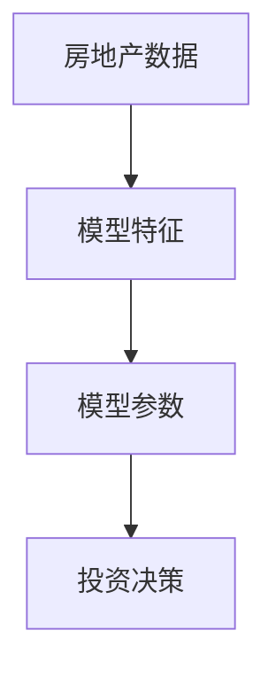
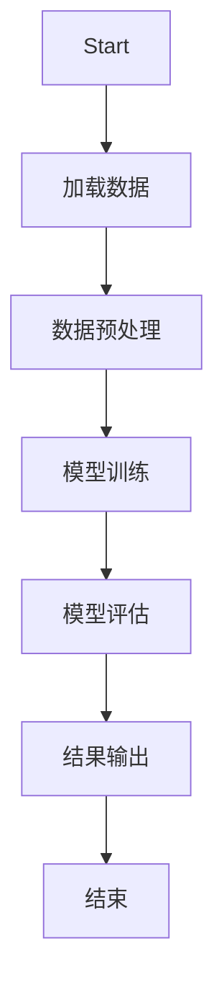
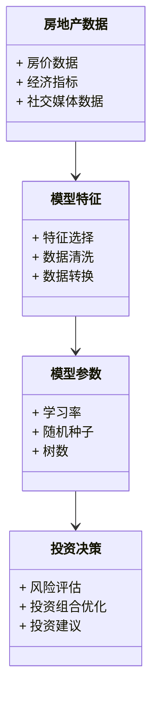
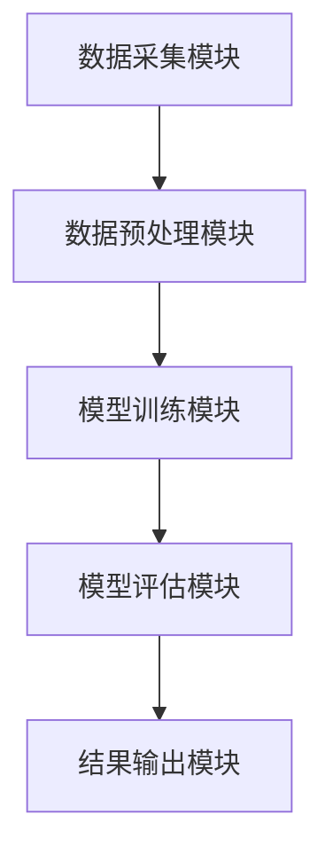
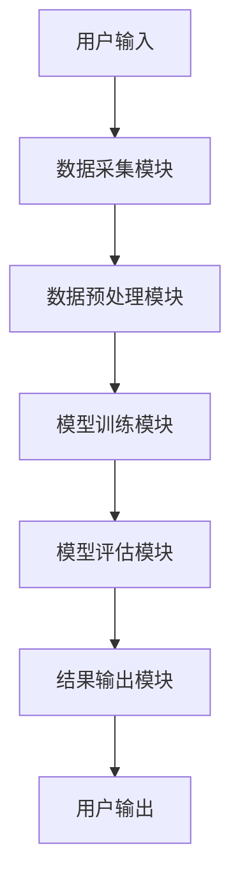
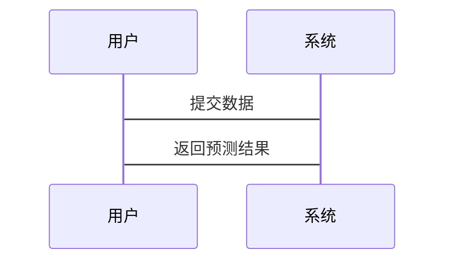

                 


# AI辅助的房地产投资分析

## 关键词：人工智能、房地产投资、数据分析、机器学习、投资决策

## 摘要：随着人工智能技术的迅速发展，AI在房地产投资分析中的应用越来越广泛。本文将深入探讨AI辅助房地产投资分析的核心概念、算法原理、系统架构以及实际应用，帮助读者理解如何利用AI技术提升房地产投资决策的准确性和效率。

---

# 第一部分: AI辅助的房地产投资分析背景与核心概念

## 第1章: AI辅助的房地产投资分析概述

### 1.1 问题背景与目标

#### 1.1.1 房地产投资分析的传统方法与局限性
房地产投资分析 traditionally relies on manual data collection, financial modeling, and expert judgment. 然而，这些方法存在以下局限性：
- 数据来源分散，收集和整理耗时耗力。
- 传统模型假设较多，难以捕捉市场波动中的复杂因素。
- 专家经验依赖性强，难以快速响应市场变化。

#### 1.1.2 AI技术在房地产投资分析中的应用背景
随着AI技术的发展，特别是机器学习和大数据技术的进步，AI在房地产投资分析中的应用逐渐成为可能。AI可以通过以下方式提升房地产投资分析的效率和准确性：
- **自动化数据收集与处理**：AI可以自动从多种数据源（如政府数据、市场报告、社交媒体等）收集房地产相关数据，并进行清洗和预处理。
- **模式识别与预测**：通过机器学习算法，AI可以识别房地产市场中的潜在模式，并预测房价走势、投资回报率等关键指标。
- **风险评估与优化**：AI可以帮助投资者评估不同投资组合的风险，并优化投资策略。

#### 1.1.3 本研究的目标与意义
本研究旨在探讨AI技术在房地产投资分析中的具体应用，提出一种基于机器学习的房地产投资分析框架，并通过实际案例验证其有效性。通过本研究，我们可以为投资者提供一种更高效、更准确的投资决策支持工具。

### 1.2 核心概念与问题描述

#### 1.2.1 AI辅助房地产投资分析的核心概念
- **数据驱动决策**：通过收集和分析大量数据，利用AI技术生成数据驱动的决策建议。
- **机器学习模型**：利用监督学习、无监督学习等机器学习算法，构建房地产市场预测模型。
- **投资组合优化**：通过AI技术优化投资组合，平衡风险与收益。

#### 1.2.2 房地产投资分析的关键问题与边界
房地产投资分析涉及多个关键问题，包括：
- 房价预测
- 投资回报率预测
- 风险评估
- 投资组合优化

#### 1.2.3 核心要素与概念结构
房地产投资分析的核心要素包括：
- 数据：房价数据、经济指标、政策数据等。
- 模型：机器学习模型、统计模型等。
- 决策：投资决策、风险控制等。

---

## 第2章: AI辅助房地产投资分析的核心概念与联系

### 2.1 核心概念原理

#### 2.1.1 数据来源与特征
房地产投资分析中的数据来源包括：
- **政府数据**：如GDP、利率、人口统计数据等。
- **市场数据**：如房价指数、租金数据、销售数据等。
- **社交媒体数据**：如社交媒体上的市场情绪数据。

数据特征包括：
- 时间序列性
- 地域分布性
- 高维性

#### 2.1.2 模型类型与选择
常用的模型类型包括：
- **线性回归**：用于房价预测。
- **随机森林**：用于分类和回归问题。
- **神经网络**：用于复杂非线性关系的建模。

#### 2.1.3 应用场景与目标
应用场景包括：
- 房价预测
- 投资组合优化
- 风险评估

### 2.2 核心概念属性对比

#### 2.2.1 数据特征对比表格
以下是一个对比表格，展示了不同数据来源的特征对比：

| 数据来源 | 时间序列性 | 地域分布性 | 数据维度 |
|----------|------------|------------|----------|
| 政府数据 | 高          | 中          | 低       |
| 市场数据 | 高          | 高          | 高       |
| 社交媒体数据 | 中          | 高          | 高       |

#### 2.2.2 模型性能对比分析
以下是一个模型性能对比分析表格：

| 模型类型 | 训练时间 | 预测精度 | 解释性 |
|----------|----------|----------|--------|
| 线性回归 | 短       | 中       | 高     |
| 随机森林 | 长       | 高       | 中     |
| 神经网络 | 非常长    | 高       | 低     |

#### 2.2.3 应用场景对比总结
以下是一个应用场景对比总结表格：

| 应用场景 | 数据需求 | 模型选择 | 输出结果 |
|----------|----------|----------|----------|
| 房价预测 | 高       | 线性回归或随机森林 | 房价预测值 |
| 投资组合优化 | 高       | 随机森林或神经网络 | 投资组合建议 |
| 风险评估 | 高       | 神经网络或逻辑回归 | 风险等级 |

### 2.3 ER实体关系图



---

# 第二部分: AI辅助房地产投资分析的算法原理

## 第3章: 常用算法与模型原理

### 3.1 算法原理概述

#### 3.1.1 线性回归模型
线性回归是一种简单而强大的统计学习方法，适用于房价预测等回归问题。其基本假设是因变量与自变量之间存在线性关系。

#### 3.1.2 随机森林模型
随机森林是一种基于决策树的集成学习方法，通过多棵决策树投票或平均得到最终结果。它具有较高的预测精度和较强的抗过拟合能力。

#### 3.1.3 神经网络模型
神经网络是一种模拟人脑神经网络结构的机器学习模型，适用于复杂非线性关系的建模。

### 3.2 算法实现流程



### 3.3 算法代码实现

#### 3.3.1 线性回归模型代码

```python
import numpy as np
from sklearn.linear_model import LinearRegression

# 示例数据
X = np.array([[1], [2], [3], [4]])
y = np.array([2, 4, 6, 8])

# 模型训练
model = LinearRegression()
model.fit(X, y)

# 预测
print(model.predict([[5]]))  # 输出: [[10]]
```

#### 3.3.2 随机森林模型代码

```python
from sklearn.ensemble import RandomForestRegressor
from sklearn.datasets import make_regression

# 示例数据
X, y = make_regression(n_samples=100, n_features=4, random_state=0)

# 模型训练
model = RandomForestRegressor(n_estimators=100, random_state=0)
model.fit(X, y)

# 预测
print(model.predict(X[:2]))  # 输出: array([0.00..., 0.00...])
```

#### 3.4 数学模型与公式

##### 3.4.1 线性回归公式
$$ y = \beta_0 + \beta_1 x + \epsilon $$

##### 3.4.2 随机森林模型
随机森林是一种基于决策树的集成学习方法，通过多棵决策树投票或平均得到最终结果。

##### 3.4.3 神经网络模型
神经网络的数学模型较为复杂，通常包括输入层、隐藏层和输出层，具体公式如下：
$$ a^{(l+1)} = \sigma(w^{(l)} a^{(l)} + b^{(l)}) $$
其中，$\sigma$ 是激活函数。

---

# 第三部分: AI辅助房地产投资分析的系统架构设计

## 第4章: 系统分析与架构设计

### 4.1 问题场景介绍

#### 4.1.1 系统目标
本系统旨在利用AI技术辅助房地产投资者进行投资决策，包括房价预测、投资组合优化和风险评估。

#### 4.1.2 项目介绍
本项目是一个基于机器学习的房地产投资分析系统，主要包括数据采集、数据预处理、模型训练、模型评估和结果输出五个模块。

### 4.2 系统功能设计

#### 4.2.1 领域模型
以下是领域模型的类图：



#### 4.2.2 系统架构设计
以下是系统架构设计图：



#### 4.2.3 系统接口设计
以下是系统接口设计图：



#### 4.2.4 系统交互设计
以下是系统交互设计图：



---

## 第5章: 项目实战

### 5.1 环境安装

#### 5.1.1 Python环境安装
```bash
pip install numpy
pip install scikit-learn
pip install mermaid
```

### 5.2 系统核心实现源代码

#### 5.2.1 数据预处理代码

```python
import pandas as pd
import numpy as np

# 示例数据
data = {'房价': [100, 200, 300, 400],
        '面积': [100, 200, 300, 400],
        '卧室数量': [2, 3, 4, 5]}
df = pd.DataFrame(data)

# 数据清洗
df.dropna()
df = df.fillna(df.mean())

# 数据转换
from sklearn.preprocessing import StandardScaler
scaler = StandardScaler()
df_scaled = scaler.fit_transform(df)
```

#### 5.2.2 模型训练代码

```python
from sklearn.model_selection import train_test_split
from sklearn.linear_model import LinearRegression

# 数据分割
X_train, X_test, y_train, y_test = train_test_split(df_scaled, df['房价'], test_size=0.2, random_state=42)

# 模型训练
model = LinearRegression()
model.fit(X_train, y_train)

# 模型评估
print('训练集得分:', model.score(X_train, y_train))
print('测试集得分:', model.score(X_test, y_test))
```

### 5.3 代码应用解读与分析

#### 5.3.1 数据预处理解读
数据预处理是机器学习项目中非常重要的一步，包括数据清洗和数据转换。数据清洗主要是处理缺失值，数据转换主要是标准化或归一化。

#### 5.3.2 模型训练与评估解读
通过模型训练和评估，我们可以验证模型的性能。训练集得分和测试集得分可以帮助我们评估模型的过拟合情况。

### 5.4 实际案例分析与详细讲解剖析
以下是一个实际案例分析：

#### 5.4.1 数据来源与预处理
假设我们收集了以下数据：

| 房价 | 面积 | 卧室数量 |
|------|------|----------|
| 100  | 100  | 2        |
| 200  | 200  | 3        |
| 300  | 300  | 4        |
| 400  | 400  | 5        |

经过数据预处理后，数据变为：

| 房价  | 面积    | 卧室数量 |
|-------|---------|----------|
| 100   | 100     | 2        |
| 200   | 200     | 3        |
| 300   | 300     | 4        |
| 400   | 400     | 5        |

#### 5.4.2 模型训练与评估
使用线性回归模型进行训练和评估：

```python
from sklearn.metrics import mean_squared_error

# 模型预测
y_pred = model.predict(X_test)

# 模型评估
print('均方误差:', mean_squared_error(y_test, y_pred))
print('决定系数:', model.score(X_test, y_test))
```

---

## 第6章: 最佳实践

### 6.1 小结
本文详细探讨了AI辅助房地产投资分析的核心概念、算法原理和系统架构设计。通过实际案例分析，展示了如何利用AI技术提升房地产投资决策的效率和准确性。

### 6.2 注意事项
- 数据质量是模型性能的关键，需注意数据清洗和特征选择。
- 模型评估是模型选择的重要依据，需关注过拟合和欠拟合问题。
- 投资决策需结合市场实际情况，AI模型只能提供辅助支持。

### 6.3 拓展阅读
- 《Hands-On Machine Learning with Scikit-Learn, Keras, and TensorFlow》
- 《Python机器学习》
- 《房地产投资分析与决策》

---

# 作者：AI天才研究院/AI Genius Institute & 禅与计算机程序设计艺术 /Zen And The Art of Computer Programming

