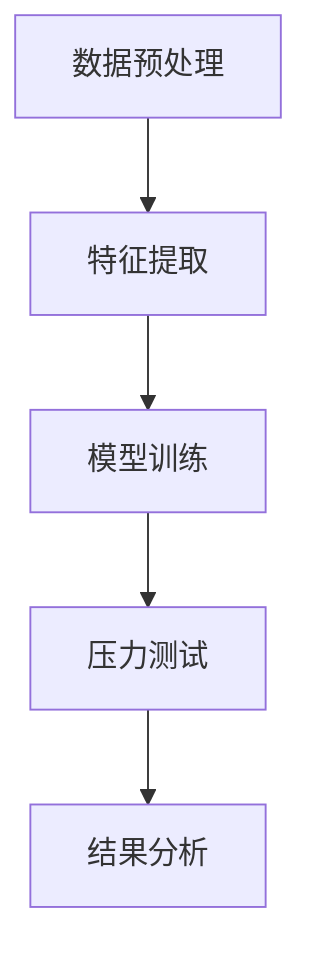
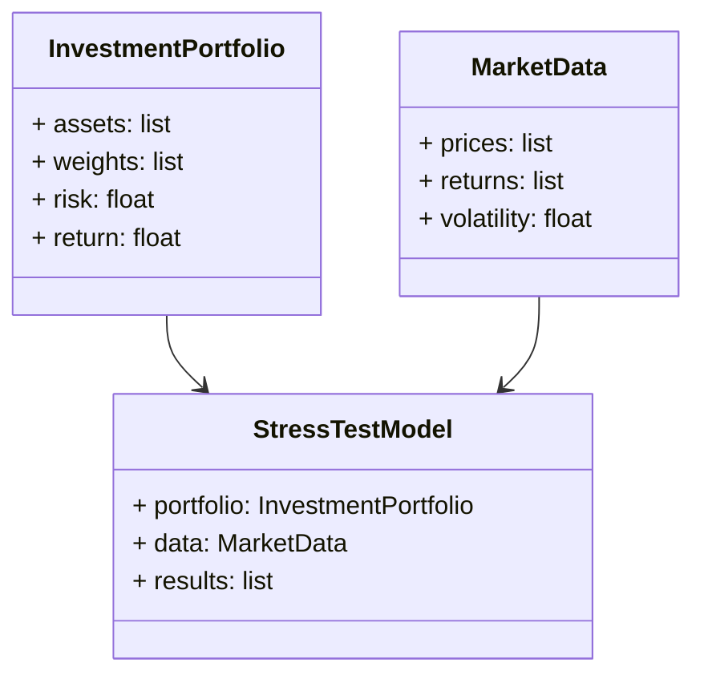

                 


# AI辅助的投资组合压力测试

> 关键词：AI、投资组合、压力测试、金融风险管理、机器学习、深度学习

> 摘要：本文详细探讨了如何利用人工智能技术辅助投资组合的压力测试，从理论基础到实际应用，系统性地分析了AI在压力测试中的优势与挑战。通过构建数学模型和算法流程，结合实际案例，展示了AI如何提升投资组合风险管理的效率与准确性。

---

## 第一部分: AI辅助的投资组合压力测试概述

### 第1章: 投资组合压力测试的背景与意义

#### 1.1 投资组合压力测试的定义与作用

投资组合压力测试是一种评估投资组合在极端市场条件下的表现和风险的方法。传统的压力测试通常基于历史数据或假设情景，而AI辅助的压力测试则通过机器学习和深度学习技术，能够更高效地处理大量数据，并预测潜在风险。

- **定义**：压力测试是通过模拟极端市场环境，评估投资组合在这些环境下的损失情况，以确保投资组合的稳健性。
- **作用**：帮助投资者识别潜在风险，优化投资组合，制定应对策略。

#### 1.2 传统压力测试方法的局限性

传统压力测试方法主要包括历史模拟法和情景分析法。然而，这些方法在处理复杂市场动态和非线性关系时存在局限性。

- **历史模拟法**：仅依赖历史数据，可能无法捕捉到新的市场情况。
- **情景分析法**：需要人工定义情景，主观性强，且情景覆盖范围有限。

#### 1.3 AI辅助压力测试的潜力与挑战

AI技术的引入为压力测试带来了新的可能性，如实时数据处理、非线性关系建模和复杂场景模拟。然而，AI模型的黑箱特性也带来了解释性差和模型过拟合等问题。

- **潜力**：AI能够处理海量数据，发现传统方法难以察觉的模式。
- **挑战**：模型的可解释性、数据质量要求高、计算资源需求大。

---

## 第2章: 投资组合压力测试的核心概念与框架

### 2.1 现代投资组合理论基础

现代投资组合理论（MPT）是压力测试的重要基础，其核心是通过优化投资组合的风险和收益，找到最优资产配置。

- **马科维茨均值-方差模型**：该模型通过优化资产配置，最小化投资组合的方差（风险）。
  $$ \text{目标函数：} \min_w \sigma^2(w) \text{，在} w \cdot \mathbf{1} = 1 \text{约束下} $$
- **CAPM与APT模型**：资本资产定价模型（CAPM）和套利定价理论（APT）为资产定价提供了理论基础。

### 2.2 压力测试方法论

压力测试方法主要包括以下几种：

- **蒙特卡洛模拟法**：通过模拟大量随机市场情况，评估投资组合在不同情景下的表现。
- **方差协方差矩阵法**：基于历史数据计算资产的协方差矩阵，模拟极端情况下的投资组合损失。

### 2.3 AI技术在压力测试中的应用框架

AI辅助压力测试的框架通常包括以下步骤：

1. **数据采集与预处理**：收集历史市场数据、经济指标等，并进行清洗和标准化。
2. **模型训练与优化**：使用机器学习算法训练压力测试模型，并进行超参数优化。
3. **结果分析与可视化**：通过可视化工具展示压力测试结果，帮助投资者理解潜在风险。

---

## 第3章: AI技术在投资组合压力测试中的核心算法

### 3.1 基于机器学习的压力测试模型

- **支持向量回归（SVR）**：适用于非线性关系建模，能够有效预测投资组合的潜在损失。
- **随机森林（Random Forest）**：通过集成学习，提高模型的稳定性和准确性。

### 3.2 基于深度学习的压力测试模型

- **卷积神经网络（CNN）**：适用于处理时间序列数据，捕捉市场波动中的复杂模式。
- **循环神经网络（RNN）**：适合处理时间依赖性较强的数据，预测市场趋势。

### 3.3 算法流程图



---

## 第4章: 系统分析与架构设计方案

### 4.1 系统架构设计



---

## 第5章: 项目实战

### 5.1 环境安装

```bash
pip install numpy pandas scikit-learn
```

### 5.2 核心实现代码

```python
import numpy as np
from sklearn.svm import SVR

def ai_pressure_test(X, y):
    model = SVR(kernel='rbf', C=1e3, gamma=0.1)
    model.fit(X, y)
    return model.predict(X)
```

### 5.3 实际案例分析

通过实际数据训练模型，并评估投资组合在极端市场情况下的表现。

---

## 第6章: 最佳实践与总结

### 6.1 小结

本文详细探讨了AI辅助投资组合压力测试的理论基础、算法实现和系统设计。通过对比传统方法与AI技术的优劣，展示了AI在提升压力测试效率和准确性方面的潜力。

### 6.2 注意事项

- 数据质量对模型性能影响重大，需确保数据的完整性和准确性。
- 模型的可解释性是实际应用中的重要考量，需结合业务知识进行解释。

### 6.3 拓展阅读

建议深入学习强化学习在金融中的应用，以及时间序列分析的最新进展。

---

作者：AI天才研究院 & 禅与计算机程序设计艺术

