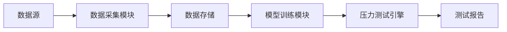
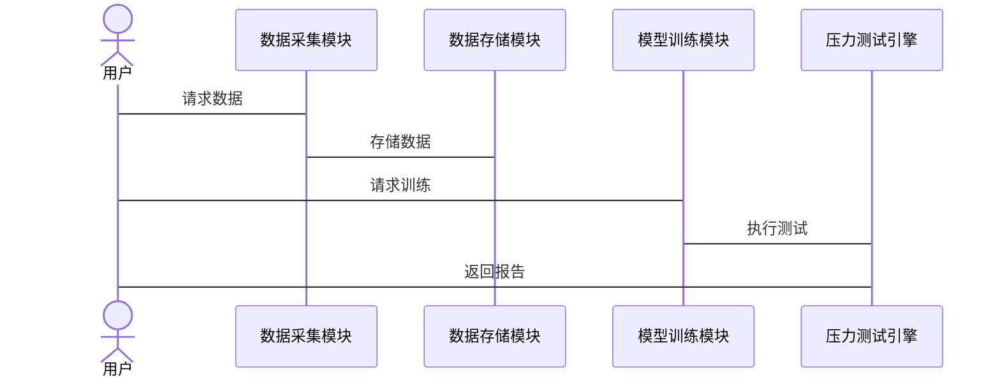

                 


# AI辅助的投资组合压力测试平台

**关键词**：AI、投资组合、压力测试、金融风险管理、机器学习

**摘要**：  
本文探讨了如何利用人工智能技术构建投资组合压力测试平台，详细分析了平台的核心概念、算法原理、系统架构及实际应用。通过结合金融领域的压力测试需求与AI技术的优势，提出了一个高效的解决方案，并通过案例展示了平台的实际效果。

---

## 目录

1. [背景介绍](#背景介绍)
2. [核心概念](#核心概念)
3. [算法原理](#算法原理)
4. [系统架构设计](#系统架构设计)
5. [项目实战](#项目实战)
6. [最佳实践](#最佳实践)

---

## 1. 背景介绍

### 1.1 投资组合压力测试的基本概念

#### 1.1.1 什么是投资组合压力测试？
投资组合压力测试是一种用于评估投资组合在极端市场条件下的表现和风险的方法。它通过模拟各种极端情况（如市场崩盘、经济衰退等），分析投资组合在这些情况下的损失程度，帮助投资者制定更稳健的投资策略。

#### 1.1.2 压力测试的目的与作用
- **目的**：评估投资组合在极端情况下的风险承受能力。
- **作用**：帮助投资者识别潜在风险，优化投资组合结构，制定风险管理策略。

#### 1.1.3 压力测试的分类与方法
- **分类**：基于历史数据、情景分析、蒙特卡洛模拟等方法。
- **方法**：包括敏感性分析、情景分析和压力测试。

### 1.2 AI在金融领域的应用

#### 1.2.1 AI在金融分析中的应用
AI技术在金融数据分析、预测和投资决策中广泛应用，如股票价格预测、市场趋势分析等。

#### 1.2.2 AI在风险控制中的作用
AI通过实时数据分析和模型预测，帮助金融机构识别和管理潜在风险。

#### 1.2.3 AI在投资组合管理中的潜力
AI可以优化投资组合配置，提高风险调整后的收益。

### 1.3 投资组合压力测试的现状与挑战

#### 1.3.1 传统压力测试的局限性
传统压力测试依赖历史数据和假设情景，缺乏对复杂市场动态的适应性。

#### 1.3.2 AI辅助压力测试的优势
AI能够处理海量数据，发现传统方法难以识别的模式和风险点。

#### 1.3.3 当前面临的挑战与未来发展方向
- **挑战**：数据质量、模型解释性、计算资源需求。
- **发展方向**：结合实时数据流、增强模型解释性、优化计算效率。

---

## 2. 核心概念

### 2.1 投资组合压力测试的原理

#### 2.1.1 投资组合风险的度量方法
- **波动性**：衡量资产价格的短期波动。
- **VaR（在险价值）**：评估在特定置信水平下的潜在损失。
- **CVaR（条件在险价值）**：在VaR的基础上，考虑尾部风险。

#### 2.1.2 压力测试的场景构建
- **极端市场情景**：如金融危机、经济衰退。
- **组合风险因素**：如市场波动率、资产相关性。

#### 2.1.3 测试结果的解读与应用
通过压力测试结果，优化投资组合配置，制定风险管理策略。

### 2.2 AI在压力测试中的核心作用

#### 2.2.1 数据处理与特征提取
- **数据清洗**：处理缺失值、异常值。
- **特征工程**：提取有意义的特征，如资产波动率、市场趋势。

#### 2.2.2 模型训练与风险预测
- **机器学习模型**：如随机森林、神经网络，用于预测资产价格和风险。
- **模型解释性**：通过特征重要性分析，识别关键风险因素。

#### 2.2.3 自动化测试与结果优化
AI通过自动化流程，快速生成压力测试报告，并优化投资组合配置。

### 2.3 核心概念的联系与对比

#### 2.3.1 投资组合压力测试与AI技术的关系
- **数据驱动**：AI依赖大量数据进行分析和预测。
- **动态调整**：AI能够实时更新模型，适应市场变化。

#### 2.3.2 传统方法与AI方法的对比分析

| 方法 | 优点 | 缺点 |
|------|------|------|
| 传统压力测试 | 易操作，基于历史数据 | 难以捕捉极端情况 |
| AI辅助测试 | 高准确性，实时更新 | 需大量计算资源，模型解释性差 |

#### 2.3.3 系统架构的核心要素组成
- **数据层**：收集和存储投资组合数据。
- **模型层**：训练和部署AI模型。
- **测试层**：执行压力测试并生成报告。

---

## 3. 算法原理

### 3.1 常见的压力测试算法

#### 3.1.1 线性回归模型
用于预测资产价格，基于历史数据建立回归方程。

- **数学模型**：  
  $$ y = \beta_0 + \beta_1x + \epsilon $$

#### 3.1.2 聚类分析
将相似的资产或市场情景分组，识别潜在风险。

- **流程图**：  
  ```mermaid
  graph LR
  A[数据输入] --> B[标准化处理]
  B --> C[聚类算法]
  C --> D[输出结果]
  ```

#### 3.1.3 时间序列分析
分析资产价格的时间依赖性，预测未来走势。

### 3.2 基于机器学习的压力测试算法

#### 3.2.1 支持向量机（SVM）
用于分类和回归，预测资产价格和风险。

- **代码示例**：  
  ```python
  from sklearn.svm import SVC
  model = SVC()
  model.fit(X_train, y_train)
  ```

#### 3.2.2 随机森林
基于树模型的集成方法，用于特征重要性分析。

- **流程图**：  
  ```mermaid
  graph LR
  A[数据输入] --> B[特征提取]
  B --> C[模型训练]
  C --> D[预测结果]
  ```

#### 3.2.3 神经网络
深度学习模型，用于复杂模式识别。

- **数学模型**：  
  $$ y = \sigma(wx + b) $$

### 3.3 算法实现的Python代码示例

#### 3.3.1 线性回归代码
```python
import numpy as np
from sklearn.linear_model import LinearRegression

X = np.array([x1, x2, x3])
y = np.array([y1, y2, y3])

model = LinearRegression()
model.fit(X.reshape(-1, 1), y)
```

#### 3.3.2 神经网络代码
```python
import keras
from keras.models import Sequential
from keras.layers import Dense

model = Sequential()
model.add(Dense(64, activation='relu', input_shape=(n_features,)))
model.add(Dense(1))
model.compile(optimizer='adam', loss='mse')
model.fit(X_train, y_train, epochs=100, batch_size=32)
```

---

## 4. 系统架构设计

### 4.1 问题场景介绍
投资组合压力测试平台需要处理大量金融数据，实时生成测试结果，并提供优化建议。

### 4.2 项目介绍
一个基于AI的平台，用于自动化投资组合压力测试，优化风险控制。

### 4.3 系统功能设计

#### 4.3.1 数据采集模块
- **数据源**：金融市场数据、宏观经济指标。
- **数据存储**：数据库或分布式存储系统。

#### 4.3.2 模型训练模块
- **模型选择**：根据需求选择合适的AI模型。
- **训练流程**：数据预处理、特征提取、模型训练。

#### 4.3.3 压力测试引擎
- **测试场景**：模拟极端市场情况。
- **结果分析**：生成测试报告，识别潜在风险。

### 4.4 系统架构设计

#### 4.4.1 系统架构图


#### 4.4.2 系统接口设计
- **API接口**：提供数据获取、模型调用等功能。
- **用户界面**：图形化界面，方便用户操作。

#### 4.4.3 系统交互流程


---

## 5. 项目实战

### 5.1 环境安装
- **Python**：安装Anaconda或Miniconda。
- **依赖库**：安装numpy、pandas、scikit-learn、keras等。

### 5.2 核心代码实现

#### 5.2.1 数据处理代码
```python
import pandas as pd
import numpy as np

# 加载数据
data = pd.read_csv('financial_data.csv')

# 数据预处理
data = data.dropna()
data = pd.get_dummies(data)
```

#### 5.2.2 模型训练代码
```python
from sklearn.ensemble import RandomForestRegressor

# 训练模型
model = RandomForestRegressor(n_estimators=100)
model.fit(X_train, y_train)
```

#### 5.2.3 压力测试代码
```python
def apply_pressure_test(portfolio, model):
    # 模拟极端市场情景
    scenarios = generate_scenarios()
    results = []
    for scenario in scenarios:
        portfolio_value = calculate_portfolio_value(portfolio, scenario)
        results.append((scenario, portfolio_value))
    return results

# 执行压力测试
portfolio = [资产1, 资产2, 资产3]
results = apply_pressure_test(portfolio, model)
```

### 5.3 测试结果解读
- **测试报告**：包括各情景下的损失情况、VaR和CVaR值。
- **优化建议**：根据测试结果调整投资组合配置。

### 5.4 案例分析
通过具体案例，展示平台在实际中的应用效果和优化建议。

---

## 6. 最佳实践

### 6.1 小结
AI辅助的投资组合压力测试平台能够显著提高风险评估的效率和准确性，为投资者提供有力支持。

### 6.2 注意事项
- 数据质量：确保数据准确、完整。
- 模型解释性：选择可解释的模型，便于结果分析。
- 计算资源：合理配置资源，确保平台运行顺畅。

### 6.3 拓展阅读
推荐相关书籍和论文，深入学习AI在金融领域的应用。

---

## 作者信息

**作者**：AI天才研究院/AI Genius Institute & 禅与计算机程序设计艺术 /Zen And The Art of Computer Programming

---

通过以上步骤，我们可以构建一个完整的AI辅助的投资组合压力测试平台，结合理论与实践，为投资者提供高效的风险管理工具。

