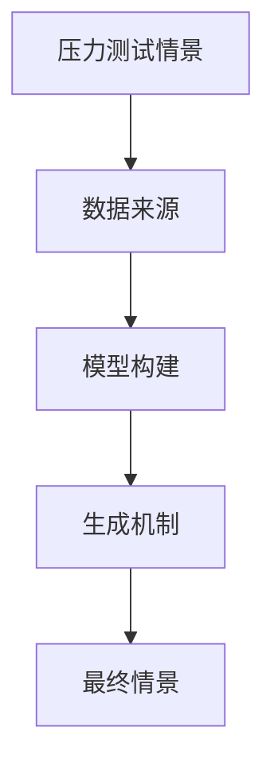
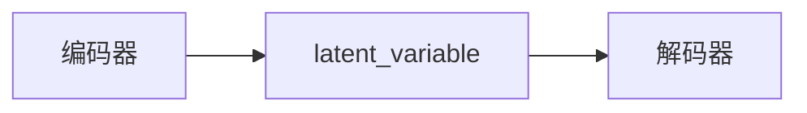
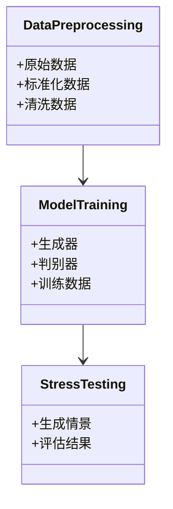
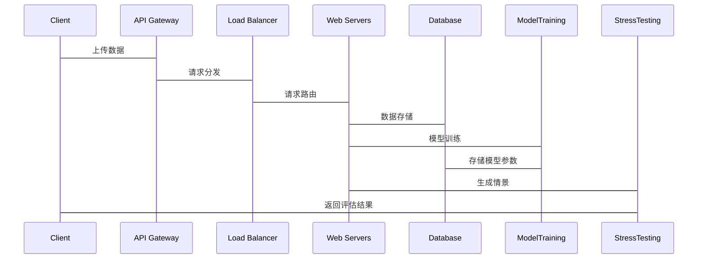

                 


# AI辅助的投资组合压力测试情景生成

**关键词**：AI，投资组合，压力测试，情景生成，金融风险管理，生成对抗网络（GAN），变分自编码器（VAE）

**摘要**：本文探讨如何利用AI技术生成投资组合压力测试情景。通过分析传统方法的局限性，介绍AI的优势，并详细讲解生成对抗网络和变分自编码器的算法原理。结合系统架构设计和项目实战，展示AI在金融风险管理中的应用，为投资组合压力测试提供新思路。

---

# 第一部分: 背景介绍

## 第1章: 投资组合压力测试概述

### 1.1 压力测试的基本概念

#### 1.1.1 什么是压力测试
压力测试是一种评估投资组合在极端市场条件下的表现的方法，帮助投资者了解潜在风险。

#### 1.1.2 投资组合压力测试的目的
- 评估极端市场条件下的损失。
- 验证投资组合的风险管理策略。
- 确保投资组合在极端情况下的稳定性。

#### 1.1.3 压力测试的常见应用场景
- 金融机构的风险管理。
- 投资组合优化。
- 投资决策支持。

### 1.2 投资组合管理的重要性

#### 1.2.1 投资组合管理的基本原理
通过分散投资降低风险，优化资产配置以实现收益目标。

#### 1.2.2 压力测试在投资组合管理中的作用
- 识别潜在风险。
- 评估风险管理措施的有效性。
- 支持投资决策。

#### 1.2.3 压力测试的常见方法
- 历史情景法：基于历史数据模拟极端情况。
- 情景分析法：假设极端情况，分析其影响。
- 模拟情景法：利用蒙特卡洛模拟生成情景。

### 1.3 AI在金融领域的应用

#### 1.3.1 AI在金融领域的核心应用领域
- 股票预测。
- 风险管理。
- 投资组合优化。

#### 1.3.2 AI在投资组合管理中的优势
- 数据驱动：利用大量数据发现潜在模式。
- 自动学习：自动优化投资组合。
- 高效计算：快速处理大量数据。

#### 1.3.3 AI在压力测试中的潜力
- 自动生成多样化的情景。
- 快速评估多种极端情况。
- 提高压力测试的准确性和效率。

## 第2章: 压力测试情景生成的传统方法

### 2.1 压力测试情景的传统生成方法

#### 2.1.1 历史情景法
基于历史市场数据生成情景，适用于有类似历史数据的情况。

#### 2.1.2 情景分析法
假设极端市场情况，分析其对投资组合的影响。

#### 2.1.3 模拟情景法
利用统计模型生成随机情景，模拟极端市场条件。

### 2.2 传统方法的优缺点分析

#### 2.2.1 传统方法的优点
- 简单易懂。
- 易于实施。

#### 2.2.2 传统方法的局限性
- 依赖历史数据，可能无法捕捉新的极端情况。
- 生成的情景有限，可能不够多样化。

#### 2.2.3 传统方法的适用场景
- 数据充足且稳定的情况。
- 需要简单快速评估的情况。

## 第3章: AI辅助压力测试的必要性

### 3.1 传统压力测试方法的不足

#### 3.1.1 数据依赖性问题
传统方法严重依赖历史数据，可能无法捕捉新的极端情况。

#### 3.1.2 情景生成的局限性
生成的情景有限，可能无法涵盖所有极端情况。

#### 3.1.3 计算复杂性问题
处理大量数据和复杂模型时，计算资源需求高。

### 3.2 AI在压力测试情景生成中的优势

#### 3.2.1 数据驱动的优势
AI能够从大量数据中发现潜在模式，生成更多样化的情景。

#### 3.2.2 自动学习的优势
AI能够自动优化模型，提高情景生成的准确性和效率。

#### 3.2.3 高效计算的优势
AI能够快速处理大量数据，生成多种极端情景。

### 3.3 压力测试情景生成的边界与外延

#### 3.3.1 压力测试的边界条件
- 数据质量：数据必须足够准确和全面。
- 模型假设：模型必须合理且准确。
- 计算资源：需要足够的计算能力支持。

#### 3.3.2 压力测试的外延
- 结合其他风险管理工具，如VaR和CVaR。
- 应用于更广泛的金融领域，如信用风险和市场风险。

---

# 第二部分: 核心概念与联系

## 第4章: 压力测试情景生成的核心概念

### 4.1 核心概念术语说明

| 概念 | 定义 | 示例 |
|------|------|------|
| 压力测试情景 | 一组极端市场条件下的资产价格变化 | 市场 crash 情景 |
| 数据来源 | 用于训练模型的数据 | 历史市场数据 |
| 模型构建 | 构建生成情景的算法 | GAN、VAE |
| 生成机制 | 生成情景的具体方法 | 前馈神经网络 |

### 4.2 核心概念之间的关系



### 4.3 核心概念的属性特征对比

| 特性 | 传统方法 | AI方法 |
|------|----------|--------|
| 数据需求 | 依赖历史数据 | 依赖大数据 |
| 计算效率 | 较低 | 较高 |
| 情景多样性 | 有限 | 丰富 |

### 4.4 核心概念的ER实体关系图

```mermaid
erd
    inv:investor
    inv --> owns:investment_portfolio
    investment_portfolio --> has:asset_class
    investment_portfolio --> subject:stress_test_scenario
    stress_test_scenario --> uses:market_data
    stress_test_scenario --> uses:model
```

---

# 第三部分: 算法原理讲解

## 第5章: 生成对抗网络（GAN）原理

### 5.1 GAN的基本原理

```mermaid
graph LR
    Generator[生成器] --> Discriminator[判别器]
    Discriminator --> "真实数据与生成数据对比"
```

### 5.2 GAN的数学模型

- 生成器的目标函数：
  $$ \min_G \mathbb{E}_{z \sim p_z} [\log D(G(z))] $$
- 判别器的目标函数：
  $$ \min_D \mathbb{E}_{x \sim p_data} [\log(1 - D(x))] + \mathbb{E}_{z \sim p_z} [\log D(G(z))] $$

### 5.3 GAN的实现步骤

1. 初始化生成器和判别器的参数。
2. 训练判别器以区分真实数据和生成数据。
3. 训练生成器以生成更逼真的数据。
4. 重复训练直到模型收敛。

### 5.4 GAN在压力测试中的应用

- 生成极端市场条件下的资产价格变化。
- 生成多样化的压力测试情景。

## 第6章: 变分自编码器（VAE）原理

### 6.1 VAE的基本原理



### 6.2 VAE的数学模型

- 编码器的目标函数：
  $$ \min_{\phi} \mathbb{E}_{x}[ \mathbb{KL}(q_\phi(x|z) || p(z))] $$
- 解码器的目标函数：
  $$ \min_{\theta} \mathbb{E}_{x}[ \mathbb{KL}(p_\theta(x|z) || q(x))] $$

### 6.3 VAE的实现步骤

1. 初始化编码器和解码器的参数。
2. 训练编码器以生成潜在变量。
3. 训练解码器以重建输入数据。
4. 重复训练直到模型收敛。

### 6.4 VAE在压力测试中的应用

- 生成多样化的市场情景。
- 生成连续的资产价格变化。

---

# 第四部分: 系统分析与架构设计

## 第7章: 问题场景介绍

### 7.1 项目介绍

- 项目目标：利用AI生成投资组合压力测试情景。
- 项目范围：涵盖数据处理、模型训练和压力测试模块。
- 项目约束：数据隐私和计算资源限制。

## 第8章: 系统功能设计

### 8.1 系统功能模块

| 模块 | 功能描述 |
|------|----------|
| 数据预处理 | 清洗和标准化数据 |
| 模型训练 | 训练生成器和判别器 |
| 压力测试 | 生成并评估压力测试情景 |

### 8.2 领域模型设计



### 8.3 系统架构设计


### 8.4 系统接口设计

- API接口：提供RESTful API，用于数据上传、模型训练和压力测试。
- 接口文档：详细说明每个接口的功能和使用方法。

### 8.5 系统交互流程



---

# 第五部分: 项目实战

## 第9章: 环境安装

### 9.1 安装必要的库

```bash
pip install tensorflow keras numpy pandas scikit-learn matplotlib
```

## 第10章: 系统核心实现

### 10.1 生成器实现

```python
import tensorflow as tf
from tensorflow import keras

def build_generator(input_dim, output_dim):
    model = keras.Sequential()
    model.add(keras.layers.Dense(256, activation='relu', input_dim=input_dim))
    model.add(keras.layers.Dense(output_dim, activation='sigmoid'))
    return model
```

### 10.2 判别器实现

```python
def build_discriminator(input_dim):
    model = keras.Sequential()
    model.add(keras.layers.Dense(256, activation='relu', input_dim=input_dim))
    model.add(keras.layers.Dense(1, activation='sigmoid'))
    return model
```

### 10.3 训练过程

```python
def train_gan(generator, discriminator, input_dim, epochs=100):
    generator.compile(optimizer='adam', loss='binary_crossentropy')
    discriminator.compile(optimizer='adam', loss='binary_crossentropy')
    for epoch in range(epochs):
        # 生成假数据
        noise = np.random.randn(input_dim)
        generated = generator.predict(noise)
        # 训练判别器
        d_loss = discriminator.train_on_batch(generated, np.zeros((len(generated), 1)))
        # 训练生成器
        noise = np.random.randn(input_dim)
        fake_labels = np.ones((len(noise), 1))
        g_loss = generator.train_on_batch(noise, fake_labels)
    return g_loss, d_loss
```

## 第11章: 实际案例分析

### 11.1 数据准备

```python
import pandas as pd
data = pd.read_csv('market_data.csv')
```

### 11.2 模型训练

```python
input_dim = data.shape[1]
generator = build_generator(input_dim)
discriminator = build_discriminator(input_dim)
train_gan(generator, discriminator, input_dim)
```

### 11.3 压力测试

```python
noise = np.random.randn(input_dim)
scenario = generator.predict(noise)
```

## 第12章: 项目小结

### 12.1 项目总结

- 成功利用AI生成压力测试情景。
- 提高了压力测试的效率和准确性。

### 12.2 项目成果

- 开发了一个AI辅助的压力测试系统。
- 生成了多样化的压力测试情景。

---

# 第六部分: 总结与展望

## 第13章: 总结

### 13.1 核心观点总结

- AI在压力测试情景生成中具有巨大潜力。
- GAN和VAE是有效的生成模型。

### 13.2 最佳实践

- 数据清洗和预处理是关键步骤。
- 模型选择和调优影响生成效果。

## 第14章: 展望

### 14.1 未来发展方向

- 更先进的生成模型：如扩散模型和Transformer架构。
- 多模态压力测试：结合市场数据和新闻情绪。

### 14.2 挑战与机遇

- 挑战：数据隐私和模型解释性。
- 机遇：AI技术的持续进步。

---

# 作者

**作者**：AI天才研究院/AI Genius Institute  
**联系**：[禅与计算机程序设计艺术](https://github.com/Zen-Art-Of-Programming)

