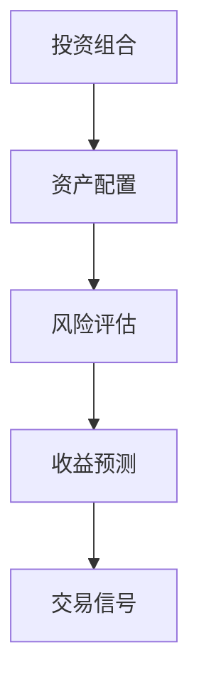
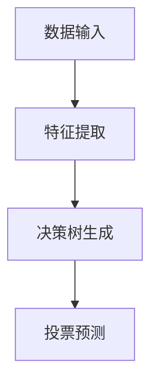
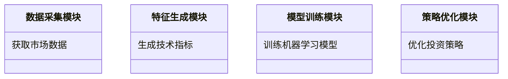

                 


# AI辅助的投资组合回测平台

> 关键词：AI辅助，投资组合，回测，机器学习，量化交易

> 摘要：本文探讨了如何利用人工智能技术构建投资组合回测平台，详细介绍其核心概念、算法原理、系统架构及实现案例，旨在为金融从业者和数据科学家提供实践指导。

---

## 第一部分：AI辅助的投资组合回测平台概述

### 第1章：投资组合回测的基础概念

#### 1.1 投资组合回测的基本概念

投资组合回测是通过历史数据模拟投资策略的表现，评估其在不同市场条件下的收益与风险。AI在其中扮演关键角色，通过机器学习模型优化投资决策，提升回测效率。

#### 1.2 AI在投资组合回测中的应用前景

AI技术能够处理海量数据，发现复杂模式，帮助投资者制定更科学的策略。随着深度学习和强化学习的进步，AI在回测中的应用将更加广泛和精准。

---

## 第二部分：AI在投资组合回测中的核心概念与联系

### 第2章：AI辅助回测的核心概念

#### 2.1 投资组合优化的数学模型

现代投资组合理论（MPT）通过优化风险与收益的平衡，寻找最优资产配置。公式：$$ \text{目标函数} = \min \sum_{i=1}^{n} w_i^2 \sigma_i^2 $$

#### 2.2 AI在回测中的应用原理

AI通过分析市场数据，识别潜在的盈利模式，帮助优化投资策略。例如，使用随机森林进行分类，预测股票涨跌。

#### 2.3 核心概念的实体关系图



---

## 第三部分：AI辅助投资组合回测的算法原理

### 第3章：常用AI算法及其在回测中的应用

#### 3.1 机器学习算法

**随机森林模型**



数学公式：$$ y = \sum_{i=1}^{n} w_i h(x) $$

#### 3.2 神经网络与深度学习

**卷积神经网络（CNN）**

应用于金融图像识别，提取隐藏特征。公式：$$ y = \sigma(W x + b) $$

#### 3.3 强化学习算法

**策略网络**

通过策略网络直接输出交易决策。公式：$$ \pi(a|s) = \text{softmax}(W s + b) $$

---

## 第四部分：系统分析与架构设计

### 第4章：AI辅助投资组合回测系统的架构设计

#### 4.1 系统模块划分



---

## 第五部分：项目实战

### 第5章：AI辅助投资组合回测系统的实现

#### 5.1 环境安装

安装Python、TensorFlow和Pandas等库，配置回测环境。

#### 5.2 核心代码实现

```python
import pandas as pd
import numpy as np
from sklearn.ensemble import RandomForestClassifier

# 加载数据
data = pd.read_csv('market_data.csv')

# 特征工程
X = data[['open', 'high', 'low', 'close']]
y = data['label']

# 训练模型
model = RandomForestClassifier()
model.fit(X, y)

# 预测结果
predictions = model.predict(X)
```

#### 5.3 实际案例分析

以股票数据为例，训练随机森林模型，预测未来走势，评估策略表现。

---

## 第六部分：优化与扩展

### 第6章：系统优化与扩展

#### 6.1 性能优化

通过分布式计算和增量学习提升系统效率。

#### 6.2 功能扩展

增加实时数据处理和多策略优化模块。

---

## 总结与展望

本文详细探讨了AI辅助投资组合回测的各个方面，从理论到实践，为读者提供了全面的指导。未来，随着AI技术的进步，投资组合回测将更加智能化和高效。

---

**作者：AI天才研究院 & 禅与计算机程序设计艺术**

