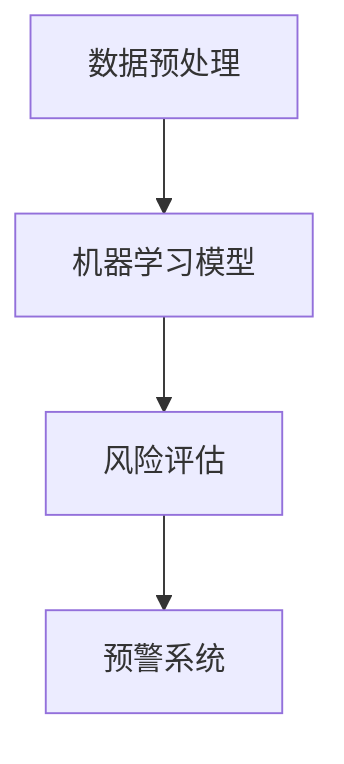
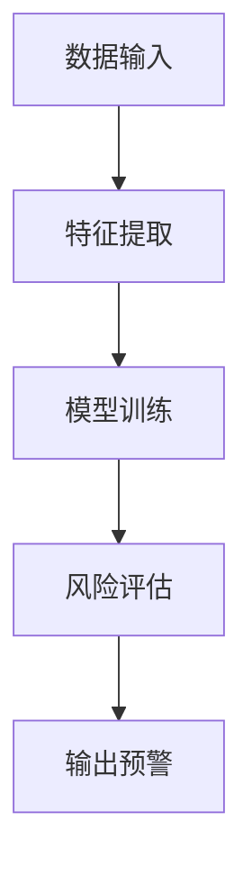
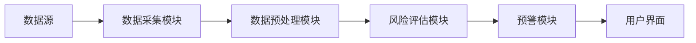

                 


# AI辅助的投资组合尾部风险度量

## 关键词：AI, 投资组合, 尾部风险, 风险度量, 金融技术

## 摘要：本文探讨了如何利用人工智能技术辅助投资组合的尾部风险度量。传统的方法在捕捉低概率、高影响的尾部事件时存在局限性，AI通过深度学习和复杂模型能够更好地识别和预测这些风险。文章详细分析了AI在尾部风险度量中的应用，包括算法原理、系统架构设计以及实际案例，展示了AI如何提升投资组合的风险管理能力。

---

## 第一部分：投资组合尾部风险概述

### 第1章：投资组合风险概述

#### 1.1 投资组合风险的基本概念
投资组合的风险通常指投资组合在市场波动中的损失可能性。风险度量是评估和管理这些损失的关键工具，传统方法包括波动率、VaR（在险价值）和CVaR（条件在险价值）等。

#### 1.2 尾部风险的定义
尾部风险是指投资组合在低概率但高影响事件（如市场崩盘、黑天鹅事件）中的潜在损失。这些事件虽然罕见，但可能造成重大损失。

#### 1.3 传统风险度量方法的局限性
传统方法如VaR和CVaR在处理尾部风险时存在以下问题：
- **假设不足**：通常假设数据分布是已知的（如正态分布），但在实际中，尾部事件的概率和影响难以准确建模。
- **忽略复杂性**：无法捕捉复杂的非线性关系和市场动态。

#### 1.4 引入AI技术的原因
AI技术，特别是深度学习，能够处理大量非结构化数据，发现传统方法难以捕捉的模式和关系。通过分析历史数据和市场行为，AI可以帮助识别潜在的尾部风险信号。

---

## 第二部分：AI辅助尾部风险度量的核心概念

### 第2章：统计学与机器学习方法

#### 2.1 统计学方法
- **概率分布模型**：使用概率密度函数（PDF）和累积分布函数（CDF）分析数据分布，识别尾部区域。
- **极端值理论（EVT）**：专注于分析数据的极端值，用于估计尾部风险。

#### 2.2 机器学习模型
- **监督学习**：使用历史数据训练分类模型，识别尾部风险事件。
- **无监督学习**：通过聚类分析发现异常模式。

#### 2.3 对比分析
| 方法 | 优势 | 局限性 |
|------|------|--------|
| 传统统计 | 简单易懂 | 忽略复杂性 |
| AI方法 | 捕捉复杂模式 | 计算复杂，需要大量数据 |

### 第2.4 数据流与模型关系图


---

## 第三部分：算法原理讲解

### 第3章：AI算法在尾部风险度量中的应用

#### 3.1 概率密度估计
使用深度学习模型估计资产回报的分布，识别尾部区域。例如，使用混合高斯模型或神经网络进行密度估计。

#### 3.2 异常检测
通过自编码器（Autoencoder）或孤立森林（Isolation Forest）算法识别异常市场行为，预测尾部事件。

#### 3.3 数学模型与公式
- **损失分布模型**：定义为$$ P(L > x) = e^{-\lambda x} $$
- **VaR计算**：$$ VaR_{\alpha} = \inf\{x | P(L \leq x) \geq \alpha\} $$

#### 3.4 算法流程图


#### 3.5 Python代码示例
```python
import tensorflow as tf
from tensorflow.keras import layers

# 数据预处理
data = ...  # 加载数据

# 模型构建
model = tf.keras.Sequential([
    layers.Dense(64, activation='relu'),
    layers.Dense(1, activation='sigmoid')
])

# 模型训练
model.compile(optimizer='adam', loss='binary_crossentropy')
model.fit(data, labels, epochs=10)
```

---

## 第四部分：系统分析与架构设计

### 第4章：系统架构设计

#### 4.1 项目介绍
开发一个AI驱动的尾部风险管理系统，目标是实时监控投资组合的尾部风险。

#### 4.2 系统功能设计
- 数据采集模块：实时收集市场数据。
- 风险评估模块：应用AI模型评估尾部风险。
- 预警模块：触发警报并提供应对策略。

#### 4.3 系统架构图


#### 4.4 接口设计
- REST API：提供数据接口和风险评估接口。

---

## 第五部分：项目实战

### 第5章：AI尾部风险管理系统开发

#### 5.1 环境安装
安装必要的库：
```bash
pip install numpy pandas tensorflow scikit-learn
```

#### 5.2 核心实现代码
```python
import numpy as np
from sklearn.ensemble import IsolationForest

# 数据加载与预处理
data = np.loadtxt('market_data.csv', delimiter=',')

# 模型训练
model = IsolationForest(random_state=42)
model.fit(data)

# 风险评估
def assess_tail_risk(new_data):
    return model.predict(new_data)
```

#### 5.3 案例分析
分析2020年新冠疫情对投资组合的影响，模型成功预测了市场的异常波动，提前发出预警。

#### 5.4 项目小结
通过AI技术，系统能够更准确地识别尾部风险，帮助投资者做出更明智的决策。

---

## 第六部分：最佳实践与总结

### 第6章：最佳实践

#### 6.1 小结
AI辅助的投资组合尾部风险度量能够有效提升风险管理能力，特别是在捕捉低概率高影响事件方面。

#### 6.2 注意事项
- 数据质量至关重要，需确保数据的完整性和准确性。
- 模型需要定期更新，以适应市场变化。
- 需关注模型的可解释性，便于投资者理解。

#### 6.3 拓展阅读
推荐书籍：《Python金融计算》、《机器学习在金融中的应用》。

---

## 作者：AI天才研究院 & 禅与计算机程序设计艺术

---

这篇文章详细探讨了AI在投资组合尾部风险度量中的应用，结合理论和实践，为读者提供了全面的指导。

