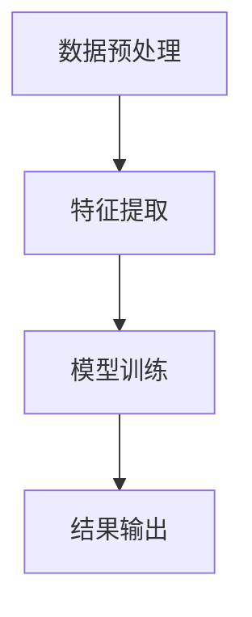
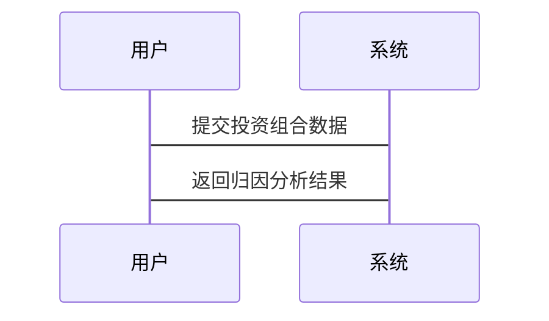

                 


# AI辅助的投资组合归因分析

> 关键词：投资组合归因分析，人工智能，机器学习，算法，系统架构

> 摘要：本文探讨了AI技术在投资组合归因分析中的应用，从背景、核心概念、算法原理到系统架构和项目实战，详细分析了如何利用AI技术提升投资组合归因分析的效率和准确性。

---

## 第1章: 投资组合归因分析概述

### 1.1 什么是投资组合归因分析
投资组合归因分析是投资学中的一个核心领域，主要用于分析投资组合的收益来源。通过归因分析，投资者可以了解投资组合的表现是由哪些因素驱动的，例如市场趋势、选股策略、行业配置等。归因分析的目标是将投资组合的收益分解为各个因素的贡献，从而为投资决策提供支持。

#### 1.1.1 归因分析的定义
归因分析是一种将投资组合的收益分解为不同因素贡献的方法。它可以帮助投资者理解投资组合的表现是由哪些因素驱动的，从而优化投资策略。

#### 1.1.2 归因分析的核心目标
归因分析的核心目标是分解投资组合的收益，识别出各个因素（如市场、行业、个股等）对收益的贡献。通过归因分析，投资者可以更好地理解投资组合的表现，并根据分析结果进行优化。

#### 1.1.3 归因分析的边界与外延
归因分析的边界在于其分析的范围和时间跨度。外延则包括从传统的归因方法到基于AI的归因方法的发展。

### 1.2 AI技术在投资组合归因分析中的应用前景
AI技术的引入为投资组合归因分析带来了新的可能性。通过机器学习算法，可以更高效地处理大量数据，发现传统方法难以识别的模式和关系。

#### 1.2.1 AI技术如何提升归因分析效率
AI技术可以通过自动化数据处理、模式识别和预测模型，显著提升归因分析的效率。例如，使用神经网络分析历史数据，可以发现复杂的投资组合表现模式。

#### 1.2.2 基于AI的归因分析的优势
基于AI的归因分析具有以下优势：高效率、高准确性、能够处理复杂的数据关系。

#### 1.2.3 未来发展趋势与研究方向
未来的归因分析将更加依赖于AI技术，尤其是深度学习和自然语言处理技术，以应对更复杂的投资环境。

### 1.3 本章小结
本章介绍了投资组合归因分析的基本概念和AI技术在其中的应用前景。归因分析的目标是分解投资组合的收益，而AI技术的引入显著提升了分析效率和准确性。

---

## 第2章: 投资组合归因分析的核心概念与联系

### 2.1 投资组合归因分析的核心概念
归因分析的核心概念包括投资组合、收益分解、因素分析等。

#### 2.1.1 投资组合
投资组合是投资者持有的多种资产的集合，用于分散风险和优化收益。

#### 2.1.2 收益分解
收益分解是将投资组合的总体收益分解为各个因素贡献的过程。

#### 2.1.3 因素分析
因素分析是归因分析的核心，用于识别影响投资组合收益的关键因素。

### 2.2 AI技术与投资组合归因分析的结合
AI技术与归因分析的结合主要体现在数据处理、模式识别和预测模型构建等方面。

#### 2.2.1 数据处理
AI技术可以通过机器学习算法处理大量非结构化数据，提取有用的信息。

#### 2.2.2 模式识别
AI技术能够识别传统方法难以发现的复杂模式，提升归因分析的深度。

#### 2.2.3 预测模型
基于AI的预测模型可以更准确地预测投资组合的表现，并优化投资策略。

### 2.3 核心概念关系图
以下是核心概念的关系图：


---

## 第3章: 投资组合归因分析的算法原理

### 3.1 常见的归因分析算法
归因分析常用的算法包括多元回归分析、因子分解模型和时间序列分析。

#### 3.1.1 多元回归分析
多元回归分析是一种统计学方法，用于分析多个自变量对因变量的影响。

#### 3.1.2 因子分解模型
因子分解模型是一种将数据分解为几个潜在因子的方法，常用于降维和特征提取。

#### 3.1.3 时间序列分析
时间序列分析用于分析随时间变化的数据，识别趋势和周期性。

### 3.2 基于AI的归因分析算法
基于AI的归因分析算法主要包括神经网络、集成学习和聚类分析。

#### 3.2.1 神经网络
神经网络是一种深度学习模型，能够自动提取数据中的特征。

#### 3.2.2 集成学习
集成学习通过组合多个模型的结果，提高预测的准确性和稳定性。

#### 3.2.3 聚类分析
聚类分析用于将数据分成若干组，识别相似的模式。

### 3.3 算法原理的数学模型与公式
以下是常见的归因分析算法的数学模型：

#### 3.3.1 多元回归模型
$$ y = \beta_0 + \beta_1x_1 + \beta_2x_2 + \cdots + \beta_nx_n + \epsilon $$

#### 3.3.2 因子分解模型
$$ X = U \Sigma V^T $$

### 3.4 算法实现的mermaid流程图
以下是归因分析算法的流程图：



---

## 第4章: 投资组合归因分析系统的架构设计

### 4.1 系统功能设计
归因分析系统的功能设计包括数据采集、数据处理、模型计算和结果展示。

#### 4.1.1 数据采集模块
数据采集模块负责收集投资组合的相关数据，包括资产价格、市场指数等。

#### 4.1.2 数据处理模块
数据处理模块对采集到的数据进行清洗、转换和特征提取。

#### 4.1.3 模型计算模块
模型计算模块使用机器学习算法进行归因分析，计算各因素的贡献。

#### 4.1.4 结果展示模块
结果展示模块以可视化的方式呈现归因分析的结果，帮助投资者理解。

### 4.2 系统架构设计
以下是归因分析系统的架构图：


### 4.3 系统接口设计
系统接口设计包括数据输入接口、模型调用接口和结果输出接口。

#### 4.3.1 数据输入接口
数据输入接口用于接收投资组合的相关数据。

#### 4.3.2 模型调用接口
模型调用接口用于调用归因分析模型进行计算。

#### 4.3.3 结果输出接口
结果输出接口用于将归因分析结果返回给用户。

### 4.4 系统交互序列图
以下是系统交互的序列图：



---

## 第5章: 项目实战——基于Python的投资组合归因分析工具

### 5.1 环境安装
以下是项目所需的环境和安装步骤：

#### 5.1.1 安装Python
安装Python 3.x版本。

#### 5.1.2 安装依赖库
安装以下依赖库：
- pandas
- numpy
- scikit-learn
- matplotlib

#### 5.1.3 环境配置
配置Jupyter Notebook或其他IDE进行开发。

### 5.2 核心实现
以下是归因分析工具的核心代码实现：

```python
import pandas as pd
import numpy as np
from sklearn.linear_model import LinearRegression

# 数据预处理
def preprocess_data(data):
    # 假设data是包含投资组合数据的DataFrame
    # 数据清洗和转换代码
    return processed_data

# 归因分析模型
def factor Attribution(data, factors):
    model = LinearRegression()
    model.fit(factors, data)
    return model.coef_

# 结果展示
def visualize_results(results):
    # 使用matplotlib绘制结果图
    pass
```

### 5.3 代码应用解读与分析
以下是代码的详细解读：

#### 5.3.1 数据预处理
数据预处理是归因分析的第一步，包括数据清洗、转换和特征提取。

#### 5.3.2 模型计算
使用线性回归模型计算各因素的贡献系数。

#### 5.3.3 结果展示
通过可视化工具将归因分析结果以图表形式展示。

### 5.4 实际案例分析
以下是实际案例分析：

#### 5.4.1 数据获取
从数据源获取投资组合数据。

#### 5.4.2 数据预处理
对数据进行清洗和转换。

#### 5.4.3 模型计算
使用线性回归模型计算各因素的贡献。

#### 5.4.4 结果展示
绘制各因素贡献的柱状图，直观展示各因素对投资组合收益的贡献。

### 5.5 项目小结
本项目通过Python实现了一个简单但功能强大的归因分析工具，展示了AI技术在投资组合归因分析中的应用潜力。

---

## 第6章: 总结与展望

### 6.1 本章总结
本文详细介绍了AI技术在投资组合归因分析中的应用，从背景、核心概念、算法原理到系统架构和项目实战，全面分析了AI技术在归因分析中的重要性。

### 6.2 最佳实践 tips
- 数据预处理是归因分析的关键，确保数据的准确性和完整性。
- 选择合适的算法和模型，根据数据特征和分析目标进行调整。
- 结果展示是归因分析的重要环节，可视化工具可以帮助更好地理解分析结果。

### 6.3 未来研究方向
- 结合自然语言处理技术，分析非结构化数据对投资组合的影响。
- 研究更复杂的时间序列模型，提升归因分析的准确性。

### 6.4 小结
AI技术的引入显著提升了投资组合归因分析的效率和准确性，未来将有更多基于AI的创新方法应用于归因分析。

---

## 作者：AI天才研究院/AI Genius Institute & 禅与计算机程序设计艺术 /Zen And The Art of Computer Programming

