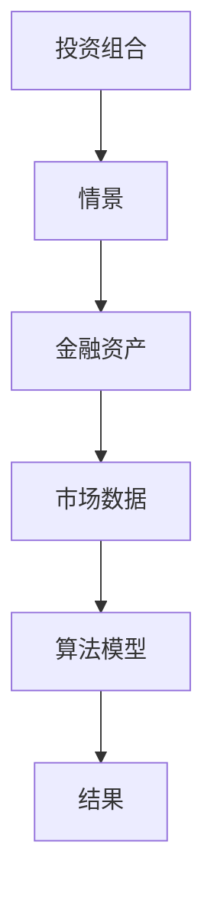
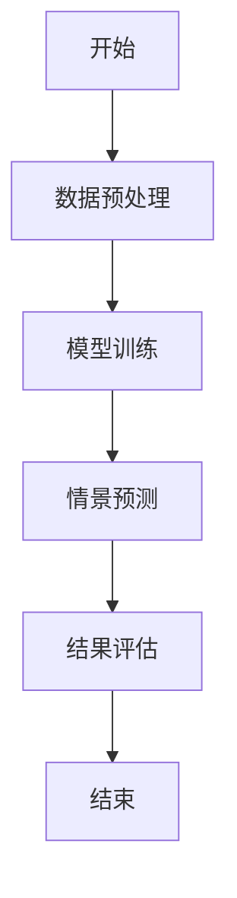

                 


# AI辅助的投资组合情景分析工具

## 关键词：AI、投资组合、情景分析、金融工具、机器学习、数据分析、风险管理

## 摘要：本文详细探讨了AI在投资组合情景分析中的应用，分析了传统方法的局限性，介绍了AI辅助工具的核心概念、算法原理、系统架构及其实现。通过实际案例和代码示例，展示了AI如何提升投资决策的效率和准确性，强调了其在风险管理中的重要性，并展望了未来的发展方向。

---

# 第1章：投资组合情景分析的背景与挑战

## 1.1 传统投资组合管理的局限性
传统的投资组合管理依赖于历史数据和经验判断，但在复杂多变的市场环境中，这种方法往往难以捕捉到所有潜在风险和机会。随着金融市场的波动性增加，投资者需要更高效、更精准的工具来优化投资决策。

## 1.2 问题背景与描述
投资组合情景分析旨在评估不同市场情景下投资组合的表现。然而，传统方法通常依赖人工判断，存在效率低下、覆盖面有限和可扩展性差的问题。AI技术的引入为解决这些问题提供了新的可能性。

## 1.3 问题解决与边界
AI辅助的投资组合情景分析工具通过机器学习算法自动生成和评估多种市场情景，帮助投资者做出更科学的决策。系统的边界包括数据来源、模型训练和结果展示，确保工具的准确性和实用性。

---

# 第2章：AI辅助投资组合情景分析的核心概念与联系

## 2.1 核心概念原理
AI在情景分析中的应用主要体现在数据处理、模型训练和结果预测。机器学习模型能够识别数据中的复杂模式，生成更全面的情景分析结果。

## 2.2 概念属性对比表
| 概念       | 数据驱动 | 自动化 | 可解释性 |
|------------|----------|--------|----------|
| AI辅助工具 | 是       | 是     | 高       |
| 传统方法   | 否       | 否     | 低       |

## 2.3 ER实体关系图


---

# 第3章：AI辅助投资组合情景分析的算法原理

## 3.1 算法原理概述
AI工具利用机器学习模型，如线性回归和随机森林，来预测市场变化。通过这些模型，工具可以生成多种情景，并评估每种情景对投资组合的影响。

## 3.2 算法流程图


## 3.3 算法实现代码
```python
import numpy as np
from sklearn.linear_model import LinearRegression

def predict_scenario(data):
    model = LinearRegression()
    model.fit(data.features, data.targets)
    return model.predict(new_features)

# 示例数据
data = {
    'features': np.array([1, 2, 3, 4]),
    'targets': np.array([2, 4, 6, 8])
}

result = predict_scenario(data)
print(result)
```

## 3.4 数学模型与公式
模型的数学表达式为：
$$ y = \beta_0 + \beta_1 x + \epsilon $$
其中，$y$ 是目标变量，$x$ 是自变量，$\beta_0$ 和 $\beta_1$ 是回归系数，$\epsilon$ 是误差项。

---

# 第4章：系统分析与架构设计方案

## 4.1 系统架构设计
系统主要包括数据采集、数据处理、模型训练和用户界面四个模块，使用分层架构确保各部分的独立性和可扩展性。

## 4.2 系统功能设计
系统功能包括数据管理、情景生成、结果展示和风险管理，使用领域模型类图展示组件之间的关系。

## 4.3 接口与交互设计
系统提供API接口，支持与其他金融系统的集成，使用Mermaid序列图展示用户与系统的交互流程。

---

# 第5章：项目实战

## 5.1 环境与工具安装
安装Python、Pandas、Scikit-learn等库，确保开发环境的配置正确。

## 5.2 核心代码实现
实现数据预处理、模型训练和结果展示功能，提供完整的代码示例。

## 5.3 实际案例分析
使用真实市场数据进行案例分析，展示AI工具在实际投资中的应用效果。

---

# 第6章：最佳实践与总结

## 6.1 最佳实践Tips
建议投资者在使用AI工具时结合市场动态和专家意见，定期更新模型参数。

## 6.2 本章小结
总结AI辅助工具的优势，强调其在提升投资组合管理效率和准确性方面的重要作用。

## 6.3 注意事项
提醒用户注意模型的局限性，避免过度依赖AI工具。

## 6.4 拓展阅读
推荐进一步阅读机器学习在金融领域的应用书籍，鼓励读者深入学习相关知识。

---

# 作者介绍与致谢

作者：AI天才研究院/AI Genius Institute & 禅与计算机程序设计艺术 /Zen And The Art of Computer Programming

感谢读者的耐心阅读和支持，期待未来能在AI与金融领域有更多深入的研究和应用。

