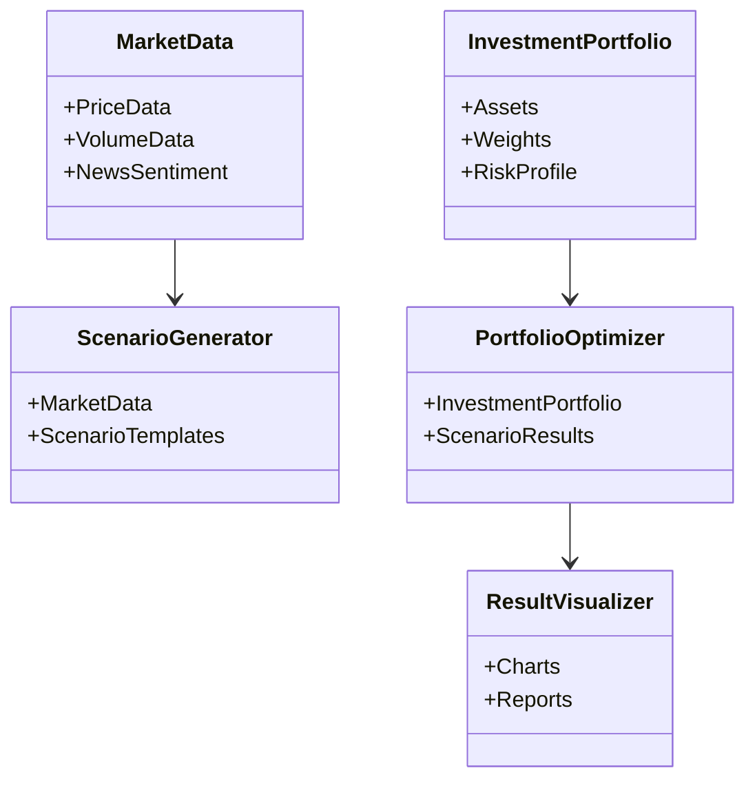

                 


# AI辅助的投资组合情景分析平台

## 关键词：AI, 投资组合, 情景分析, 金融, 算法, 系统架构

## 摘要：本文探讨了AI在投资组合情景分析中的应用，从背景、核心概念、算法原理、系统架构到项目实战，详细介绍了如何利用AI技术构建高效的投资组合情景分析平台。通过分析不同的AI算法和系统架构设计，本文提供了从理论到实践的全面指导，帮助读者理解如何利用AI技术优化投资组合管理。

---

# 第一部分: 投资组合情景分析的背景与挑战

## 第1章: 传统投资组合管理的局限性

### 1.1 投资组合管理的核心概念
投资组合管理是金融领域的重要组成部分，涉及如何将资金分配到不同的资产类别以实现特定的财务目标。传统的方法依赖于历史数据分析和经验判断，但在复杂多变的市场环境中，这种方法往往显得力不从心。

### 1.2 传统投资组合管理的痛点
- 数据量庞大且复杂：金融市场数据包括价格、成交量、新闻情绪等多种因素，传统方法难以处理如此复杂的非结构化数据。
- 市场波动性高：传统模型难以捕捉市场的短期波动和突发事件的影响。
- 人工判断的主观性：投资决策依赖于个人经验和判断，容易受到情绪影响。

### 1.3 AI技术如何解决投资组合管理的挑战
AI技术通过机器学习算法，能够处理海量数据，发现数据中的隐含规律，并实时调整投资策略。AI还可以通过情景分析模拟不同市场条件下的投资组合表现，帮助投资者做出更科学的决策。

---

## 第2章: AI在金融领域的应用现状

### 2.1 AI在金融领域的典型应用
AI在金融领域的应用包括股票预测、风险管理、交易自动化、客户画像和智能投顾等。投资组合管理是其中的重要组成部分，AI技术可以显著提升其效率和准确性。

### 2.2 AI在投资组合管理中的优势
- 数据处理能力：AI可以处理结构化和非结构化数据，发现传统方法难以察觉的模式。
- 实时性：AI算法可以实时更新投资组合，适应市场的快速变化。
- 个性化：基于客户的特定需求和风险偏好，AI可以定制化投资组合。

### 2.3 当前AI投资组合管理的局限性
- 数据质量：AI模型的效果高度依赖数据质量，噪声数据会影响预测准确性。
- 黑箱问题：许多AI算法是“黑箱”模型，难以解释其决策逻辑。
- 市场适应性：AI模型在极端市场条件下可能表现不佳，需要不断优化和调整。

---

# 第二部分: AI辅助投资组合情景分析的核心概念

## 第3章: 投资组合情景分析的定义与目标

### 3.1 投资组合情景分析的定义
投资组合情景分析是通过模拟不同市场条件下的投资组合表现，评估其在各种情况下的风险和收益。这种分析方法可以帮助投资者制定更稳健的投资策略。

### 3.2 投资组合情景分析的核心目标
- 评估投资组合在不同市场环境下的表现。
- 优化投资组合以应对潜在风险。
- 提供数据支持的决策依据。

### 3.3 情景分析的关键要素
- 情景生成：通过历史数据、假设情景或蒙特卡洛模拟生成不同的市场情景。
- 情景评估：评估投资组合在不同情景下的表现，包括收益、波动性和风险。
- 情景优化：调整投资组合以应对不同情景，寻找最优配置。

---

## 第4章: AI在投资组合情景分析中的核心作用

### 4.1 数据驱动的分析方法
AI通过机器学习模型分析海量数据，提取关键特征，生成情景分析所需的输入数据。

### 4.2 智能预测与优化算法
AI算法（如强化学习）可以优化投资组合配置，使其在不同情景下表现最优。

### 4.3 情景生成与模拟
AI可以通过生成对抗网络（GAN）或其他生成模型，模拟不同市场条件下的情景，帮助投资者进行压力测试和风险评估。

---

# 第三部分: 投资组合情景分析的算法原理

## 第5章: 基于聚类的场景识别算法

### 5.1 聚类算法的基本原理
聚类算法通过将相似的数据点分组，识别市场中的不同状态或趋势。例如，K-means算法可以将市场数据分为几类，每类代表一种市场状态。

### 5.2 在投资组合情景分析中的应用
聚类算法可以帮助识别市场周期，如牛市、熊市和震荡市，从而为投资组合配置提供参考。

### 5.3 算法实现的步骤与流程
1. 数据预处理：清洗和标准化数据。
2. 选择聚类算法：如K-means或DBSCAN。
3. 聚类结果分析：根据聚类结果识别市场状态。
4. 投资组合优化：根据识别的市场状态调整投资组合配置。

---

## 第6章: 基于回归的场景预测算法

### 6.1 回归算法的基本原理
回归算法通过建立变量之间的关系模型，预测未来市场走势。例如，线性回归可以预测资产价格的变化趋势。

### 6.2 在投资组合情景分析中的应用
回归算法可以预测不同资产在不同情景下的表现，帮助投资者制定情景下的投资策略。

### 6.3 算法实现的步骤与流程
1. 数据准备：收集相关资产的历史数据。
2. 模型训练：训练回归模型。
3. 情景预测：基于模型预测不同情景下的资产表现。
4. 投资组合优化：根据预测结果调整投资组合配置。

---

## 第7章: 基于强化学习的投资组合优化算法

### 7.1 强化学习的基本原理
强化学习通过智能体与环境的交互，学习最优策略。在投资组合管理中，智能体可以根据市场反馈调整投资组合配置。

### 7.2 在投资组合情景分析中的应用
强化学习可以实时优化投资组合，使其在不同市场环境下表现最优。

### 7.3 算法实现的步骤与流程
1. 环境定义：定义市场环境和投资组合状态。
2. 智能体设计：设计智能体的行动策略。
3. 环境与智能体交互：智能体根据市场反馈调整策略。
4. 投资组合优化：根据优化结果调整投资组合配置。

---

# 第四部分: 投资组合情景分析的系统架构设计

## 第8章: 系统功能模块划分

### 8.1 数据采集模块
负责收集市场数据，包括价格、成交量、新闻情绪等。

### 8.2 数据处理模块
对数据进行清洗、转换和标准化处理，为后续分析提供高质量数据。

### 8.3 情景生成模块
根据历史数据或假设情景生成不同市场条件下的情景。

### 8.4 投资组合优化模块
基于生成的情景，优化投资组合配置。

### 8.5 结果展示模块
将分析结果以可视化形式展示，帮助用户理解和决策。

---

## 第9章: 系统架构设计

### 9.1 领域模型类图
使用Mermaid绘制领域模型类图，展示系统中的主要实体及其关系。



### 9.2 系统架构图
使用Mermaid绘制系统架构图，展示系统的主要模块及其交互关系。


---

## 第10章: 系统接口设计

### 10.1 系统接口设计
定义系统的主要接口，例如数据输入接口、情景生成接口和优化结果输出接口。

### 10.2 系统交互序列图
使用Mermaid绘制系统交互序列图，展示系统各模块之间的协作过程。

```mermaid
sequenceDiagram
    用户 -> 数据采集模块: 提供数据源
    数据采集模块 -> 数据处理模块: 传递处理后的数据
    数据处理模块 -> 情景生成模块: 提供标准化数据
    情景生成模块 -> 投资组合优化模块: 生成情景并传递给优化模块
    投资组合优化模块 -> 结果展示模块: 输出优化结果
    用户 <- 结果展示模块: 显示分析结果
```

---

# 第五部分: 项目实战

## 第11章: 环境安装与核心代码实现

### 11.1 环境安装
安装必要的Python库，例如Pandas、NumPy、Scikit-learn、TensorFlow和Plotly。

### 11.2 核心代码实现
实现投资组合情景分析的核心算法，例如聚类、回归和强化学习。

### 11.3 代码应用解读与分析
详细解读代码的功能和实现逻辑，帮助读者理解如何将AI算法应用于投资组合管理。

---

## 第12章: 实际案例分析与详细讲解

### 12.1 案例分析
通过实际案例展示AI辅助投资组合情景分析的应用效果。

### 12.2 案例分析解读
详细解读案例分析的过程，包括数据处理、情景生成、投资组合优化和结果展示。

### 12.3 项目小结
总结项目的主要成果和经验教训，为读者提供参考。

---

# 第六部分: 总结与展望

## 第13章: AI辅助投资组合情景分析的优势与注意事项

### 13.1 AI技术的优势
- 数据处理能力强
- 模型灵活性高
- 可实时优化

### 13.2 使用AI技术的注意事项
- 数据质量影响模型效果
- 模型解释性问题
- 市场适应性问题

---

## 第14章: 未来展望与扩展阅读

### 14.1 未来展望
AI技术在投资组合管理中的应用将更加广泛和深入，例如结合区块链技术实现智能投顾。

### 14.2 扩展阅读
推荐阅读相关书籍和论文，进一步学习AI在金融领域的应用。

---

## 作者：AI天才研究院/AI Genius Institute & 禅与计算机程序设计艺术 /Zen And The Art of Computer Programming

---

### 总结
通过本文的详细讲解，读者可以全面了解AI辅助投资组合情景分析的核心概念、算法原理和系统架构设计。从理论到实践，从背景到案例，本文为读者提供了丰富的知识和实用的指导。

