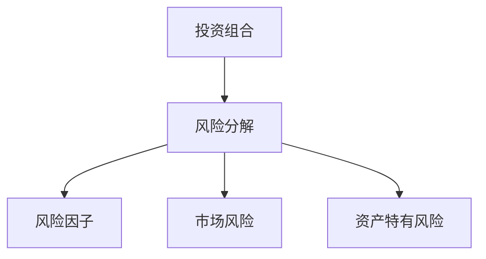
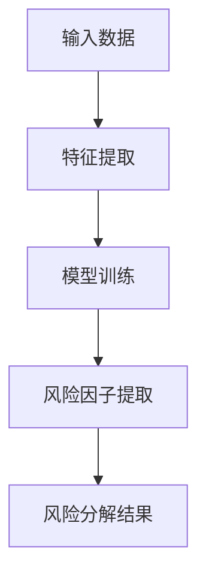
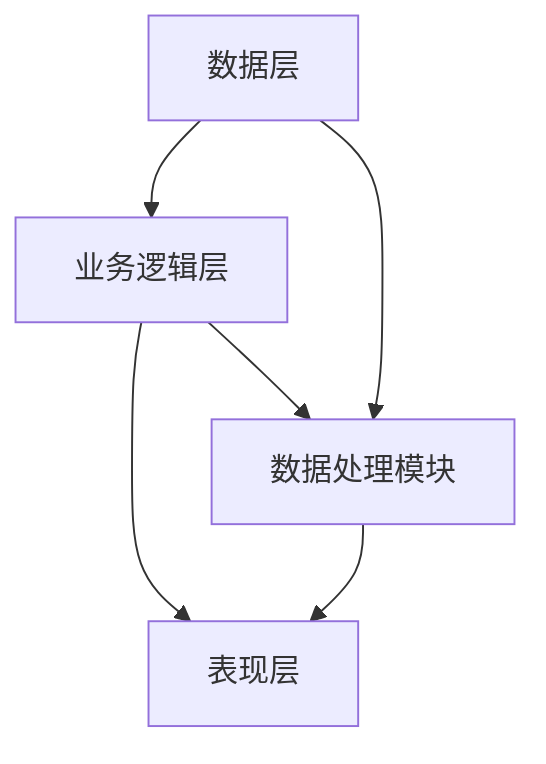

                 


# AI辅助的投资组合风险分解

> 关键词：投资组合风险分解、人工智能、风险管理、投资组合优化、量化金融、系统架构设计

> 摘要：本文将详细介绍如何利用人工智能技术辅助投资组合的风险分解。通过结合现代投资组合理论、机器学习和深度学习算法，我们探讨如何有效地识别和分解投资组合中的各种风险因素。文章从背景介绍、核心概念、算法原理、系统设计到项目实战，全面解析AI在投资组合风险分解中的应用，并结合实际案例进行深入分析，最后总结出最佳实践和未来研究方向。

---

# 第1章: 投资组合风险分解的背景与挑战

## 1.1 投资组合风险分解的基本概念

### 1.1.1 投资组合风险的定义
投资组合风险是指在一定时间跨度内，投资组合的收益可能偏离预期收益的可能性。风险分解的目标是将总体风险分解为多个可识别的组成部分，以便更好地理解和管理这些风险。

### 1.1.2 风险分解的必要性
- **风险识别**：通过分解风险，可以明确哪些风险因素对投资组合的影响最大。
- **风险量化**：量化每个风险因素的影响程度，为投资决策提供数据支持。
- **风险管理**：通过分解风险，可以采取针对性措施，降低高风险因素的影响。

### 1.1.3 AI在风险分解中的作用
人工智能技术，特别是机器学习和深度学习，能够处理海量数据，并提取复杂模式，从而在风险分解中发挥重要作用。

## 1.2 AI辅助投资组合风险分解的背景

### 1.2.1 传统投资组合管理的局限性
- **计算复杂性**：传统方法依赖于复杂的数学模型，计算量大且难以扩展。
- **多资产类别管理**：传统方法难以同时处理多种资产类别和市场条件下的风险分解。
- **数据依赖性**：传统方法对历史数据的依赖性强，难以应对新兴市场和极端情况。

### 1.2.2 AI技术在金融领域的应用现状
- **机器学习**：广泛应用于股票预测、风险评估等领域。
- **深度学习**：在处理非结构化数据和复杂模式识别方面表现出色。
- **自然语言处理**：用于分析财务报告和新闻，辅助投资决策。

### 1.2.3 风险分解的创新方向
- **实时风险监控**：利用AI技术实现对投资组合风险的实时分解和监控。
- **动态调整策略**：根据市场变化快速调整投资组合的风险分解策略。
- **跨市场、跨资产分析**：利用AI技术进行多市场、多资产的风险分解。

## 1.3 本书的核心目标与结构

### 1.3.1 本书的核心目标
- 探讨如何利用AI技术实现投资组合风险的高效分解。
- 提供基于AI的风险分解方法，帮助投资者更好地管理风险。

### 1.3.2 本书的主要内容
- 第1章：介绍投资组合风险分解的背景与挑战。
- 第2章：讲解投资组合风险分解的核心概念与联系。
- 第3章：详细阐述基于AI的风险分解算法。
- 第4章：分析投资组合风险分解的系统设计。
- 第5章：通过实际案例展示项目实战。
- 第6章：总结最佳实践和未来研究方向。

### 1.3.3 本书的结构安排
- 采用模块化结构，每章内容独立且相互关联。
- 理论与实践结合，既有算法原理的深入分析，又有实际案例的详细解读。

## 1.4 本章小结
本章通过介绍投资组合风险分解的基本概念、AI在其中的作用以及本书的核心目标和结构，为后续章节奠定了基础。接下来，我们将深入探讨投资组合风险分解的核心概念与联系。

---

# 第2章: 投资组合风险分解的核心概念与联系

## 2.1 投资组合风险分解的原理

### 2.1.1 风险分解的基本原理
投资组合风险分解的核心是将总体风险分解为多个风险因子的线性组合，每个因子代表特定的市场风险或资产特有风险。

### 2.1.2 投资组合风险的来源
- **市场风险**：整个市场波动带来的风险。
- **资产特有风险**：特定资产或行业带来的风险。
- **流动性风险**：资产难以快速变现带来的风险。

### 2.1.3 风险分解的目标
通过分解风险，投资者可以更好地理解投资组合的波动性来源，并采取相应的风险管理策略。

## 2.2 AI在风险分解中的核心概念

### 2.2.1 机器学习在风险预测中的应用
- **监督学习**：用于预测资产收益和风险。
- **无监督学习**：用于发现数据中的潜在风险因子。

### 2.2.2 深度学习在风险分解中的优势
- **非线性建模**：深度学习能够捕捉复杂的非线性关系。
- **特征提取**：自动提取有用的特征，减少特征工程的工作量。

### 2.2.3 风险分解的算法选择
- **主成分分析（PCA）**：用于降维和提取主要风险因子。
- **因子分析**：用于识别潜在的风险因子。

## 2.3 核心概念的关系与对比

### 2.3.1 风险分解与投资组合优化的关系
- 风险分解为投资组合优化提供了必要的输入，优化过程需要根据风险分解结果调整资产配置。

### 2.3.2 AI算法与传统统计方法的对比
- **AI算法**：能够处理复杂的数据模式，但可能需要更多的数据和计算资源。
- **传统统计方法**：计算简单，但对复杂模式的捕捉能力有限。

### 2.3.3 风险分解的实体关系图



---

# 第3章: 投资组合风险分解的算法原理

## 3.1 基于AI的风险分解算法

### 3.1.1 现代投资组合理论（MPT）的回顾
MPT是投资组合优化的基础，其核心是通过优化资产配置降低风险。

### 3.1.2 基于机器学习的风险分解模型
- **线性回归**：用于预测资产收益和风险。
- **支持向量机（SVM）**：用于分类和回归分析。

### 3.1.3 深度学习在风险分解中的应用
- **神经网络**：用于捕捉复杂的非线性关系。
- **卷积神经网络（CNN）**：用于处理图像和时间序列数据。

## 3.2 算法原理的数学模型

### 3.2.1 投资组合风险的数学表达
$$ \text{风险} = \sqrt{\mathbf{w}^T \mathbf{C} \mathbf{w}} $$
其中，$\mathbf{w}$是权重向量，$\mathbf{C}$是协方差矩阵。

### 3.2.2 基于AI的风险分解模型公式
$$ R_i = \beta_0 + \beta_1 X_1 + \beta_2 X_2 + \ldots + \beta_n X_n + \epsilon $$
其中，$R_i$是资产收益，$X_j$是风险因子，$\epsilon$是误差项。

## 3.3 算法流程图



---

# 第4章: 投资组合风险分解的系统分析与架构设计

## 4.1 问题场景介绍

### 4.1.1 投资组合风险分解的场景描述
- **数据获取**：获取多资产类别的历史数据和实时数据。
- **风险分解**：对投资组合进行风险分解，识别主要风险因子。
- **结果展示**：将分解结果以可视化形式展示给投资者。

### 4.1.2 系统的目标与范围
- 目标：实现投资组合风险的自动化分解和可视化。
- 范围：支持多种资产类别和市场数据。

## 4.2 系统功能设计

### 4.2.1 风险分解模块的功能设计
- 数据预处理：清洗和标准化数据。
- 模型训练：训练机器学习模型进行风险分解。
- 风险因子提取：提取主要风险因子。

### 4.2.2 数据处理模块的功能设计
- 数据获取：从数据库或API获取数据。
- 数据转换：将数据转换为模型可接受的格式。
- 数据存储：存储处理后的数据。

### 4.2.3 结果展示模块的功能设计
- 可视化展示：以图表形式展示风险分解结果。
- 报告生成：生成风险分解报告。

## 4.3 系统架构设计

### 4.3.1 系统架构的分层设计
- 数据层：负责数据的存储和访问。
- 业务逻辑层：负责风险分解的核心逻辑。
- 表现层：负责用户交互和结果展示。

### 4.3.2 模块之间的关系



---

# 第5章: 项目实战

## 5.1 环境安装

### 5.1.1 安装Python
- 使用Anaconda安装Python 3.8及以上版本。

### 5.1.2 安装相关库
- `numpy`：用于数值计算。
- `pandas`：用于数据处理。
- `scikit-learn`：用于机器学习模型。
- `plotly`：用于数据可视化。

## 5.2 核心代码实现

### 5.2.1 数据预处理
```python
import pandas as pd
import numpy as np

# 读取数据
data = pd.read_csv('portfolio_data.csv')

# 数据清洗
data = data.dropna()
```

### 5.2.2 模型训练
```python
from sklearn.linear_model import LinearRegression
from sklearn.metrics import mean_squared_error

# 训练模型
model = LinearRegression()
model.fit(X_train, y_train)

# 模型评估
y_pred = model.predict(X_test)
print(mean_squared_error(y_test, y_pred))
```

### 5.2.3 可视化展示
```python
import plotly.express as px

# 绘制风险分解图
fig = px.scatter(x=predictions, y=true_values, trendline='lowess')
fig.show()
```

## 5.3 实际案例分析

### 5.3.1 数据来源与处理
- 数据来源：某投资组合的历史收益率数据。
- 数据处理：清洗、标准化和分组。

### 5.3.2 分解结果分析
- 主要风险因子：市场波动率、行业风险、流动性风险。
- 每个因子对总体风险的贡献度。

## 5.4 项目小结
通过实际案例分析，我们可以看到AI技术在投资组合风险分解中的巨大潜力。模型能够准确识别主要风险因子，并为投资决策提供有力支持。

---

# 第6章: 最佳实践与未来展望

## 6.1 小结
- 本文详细介绍了AI辅助投资组合风险分解的核心概念、算法原理和系统设计。
- 通过实际案例分析，验证了AI技术在风险分解中的有效性。

## 6.2 注意事项
- 数据质量对模型性能影响重大，需确保数据的准确性和完整性。
- 模型的可解释性是投资者关注的重点，需在模型设计中予以考虑。

## 6.3 拓展阅读
- 推荐阅读《Python机器学习实战》和《深度学习》等书籍，深入了解机器学习和深度学习的核心技术。

---

# 作者信息

作者：AI天才研究院/AI Genius Institute & 禅与计算机程序设计艺术/Zen And The Art of Computer Programming

