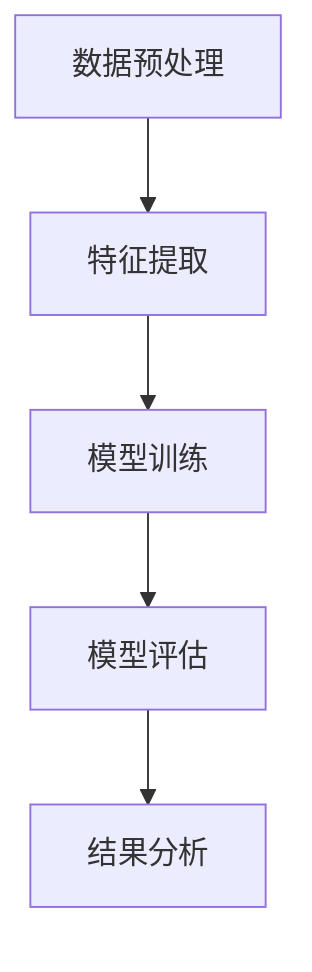
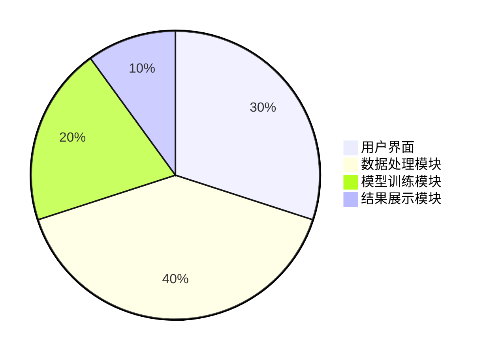
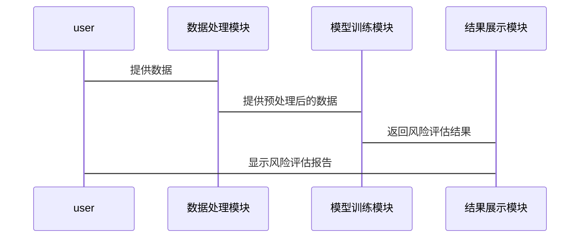

                 


```markdown
# AI辅助的投资风险评估

## 关键词：投资风险评估，人工智能，机器学习，自然语言处理，金融数据分析

## 摘要：本文详细探讨了人工智能技术在投资风险评估中的应用，从基本概念、核心算法到系统设计，全面分析了AI如何提升投资风险评估的效率和准确性。文章结合实际案例，深入讲解了机器学习、自然语言处理等技术在金融领域的应用，为读者提供了从理论到实践的完整指南。

---

## 第1章：投资风险评估概述

### 1.1 投资风险评估的基本概念

#### 1.1.1 投资风险的定义与分类
投资风险是指在投资过程中，由于各种不确定因素导致投资收益偏离预期值的可能性。常见的投资风险包括市场风险、流动性风险、信用风险和操作风险。市场风险是指市场波动导致资产价格下跌的风险；流动性风险是指资产难以快速变现的风险；信用风险是指债务人违约的风险；操作风险是指由于人为错误或系统故障导致的损失风险。

#### 1.1.2 投资风险评估的重要性
投资风险评估是投资者在决策过程中不可或缺的一部分。通过评估风险，投资者可以更好地理解潜在的损失，从而制定更合理的投资策略。此外，准确的风险评估还能帮助投资者在市场波动中做出更明智的决策，降低投资损失的可能性。

#### 1.1.3 投资风险评估的边界与外延
投资风险评估的边界包括明确的投资目标、可量化的数据和有限的时间范围。外延则涉及宏观经济指标、行业数据、公司财务报表和市场新闻等多方面信息。

---

### 1.2 AI技术在投资领域的应用背景

#### 1.2.1 AI技术的基本概念
人工智能（AI）是指计算机系统能够执行人类智能任务，如视觉识别、语音识别、决策判断等。机器学习（ML）是AI的重要组成部分，通过数据训练模型，使其能够从数据中学习并做出预测或分类。

#### 1.2.2 AI在金融领域的应用现状
AI在金融领域的应用日益广泛。例如，量化交易中使用算法进行高频交易；信用评估中利用机器学习模型预测客户违约风险；市场预测中使用自然语言处理分析新闻和社交媒体情绪。

#### 1.2.3 AI辅助投资风险评估的必要性
传统投资风险评估方法依赖于人工分析和统计模型，存在效率低、覆盖面有限的问题。AI技术的应用能够提高分析效率，捕捉更多数据中的潜在风险信号，从而提供更准确的风险评估结果。

---

### 1.3 小结
本章介绍了投资风险评估的基本概念和AI技术在投资领域的应用背景，为后续内容奠定了基础。

---

## 第2章：AI辅助投资风险评估的核心概念

### 2.1 投资风险评估的关键要素

#### 2.1.1 数据来源与特征
投资风险评估的数据来源包括市场数据（如股票价格、指数）、财务数据（如公司利润表、资产负债表）、新闻数据（如市场评论、公司公告）和宏观经济数据（如GDP、利率）。

#### 2.1.2 风险因子分析
风险因子是指影响投资组合风险的关键因素，如市场因子、行业因子、公司因子等。通过分析这些因子，可以更好地理解投资风险的来源和影响。

#### 2.1.3 风险评估模型
风险评估模型是将输入数据转化为风险评估结果的核心工具。常用的模型包括线性回归模型、随机森林模型和XGBoost模型等。

---

### 2.2 AI技术在投资风险评估中的作用

#### 2.2.1 机器学习在风险预测中的应用
机器学习模型能够从大量数据中学习复杂的模式，从而预测投资风险。例如，使用随机森林模型预测股票违约风险。

#### 2.2.2 自然语言处理在文本数据中的应用
自然语言处理（NLP）技术可以分析市场新闻和社交媒体情绪，提取潜在的风险信号。例如，通过情感分析模型预测市场情绪对股票价格的影响。

#### 2.2.3 数据挖掘在风险识别中的作用
数据挖掘技术能够从海量数据中发现隐藏的模式和关联，帮助识别潜在的投资风险。例如，使用聚类分析识别具有相似风险特征的公司。

---

### 2.3 投资风险评估的ER实体关系图

```mermaid
er
    entity(投资风险评估) {
        id: string
        risk_factors: string
        assessment_model: string
        data_sources: string
    }
```

---

### 2.4 本章小结
本章详细阐述了投资风险评估的核心概念和AI技术在其中的作用，为后续算法和系统设计提供了理论基础。

---

## 第3章：AI辅助投资风险评估的算法原理

### 3.1 特征工程

#### 3.1.1 数据预处理
数据预处理包括数据清洗（去除缺失值、异常值）和数据标准化（归一化处理）。

#### 3.1.2 特征选择
特征选择是通过统计方法或模型筛选出对风险评估最重要的特征，如使用相关系数或特征重要性评分。

#### 3.1.3 特征提取
特征提取是指从原始数据中提取更有意义的特征，如使用主成分分析（PCA）降维。

---

### 3.2 模型选择与调优

#### 3.2.1 常见的机器学习模型
常用的机器学习模型包括线性回归、随机森林和梯度提升树（如XGBoost）。

#### 3.2.2 模型调优方法
模型调优包括参数优化（如网格搜索）和交叉验证评估模型性能。

#### 3.2.3 模型评估指标
常用的评估指标包括准确率、召回率、F1值和ROC曲线。

---

### 3.3 投资风险评估的算法流程图



---

### 3.4 本章小结
本章详细介绍了AI辅助投资风险评估的算法原理，包括特征工程和模型选择与调优的步骤。

---

## 第4章：数学模型与公式

### 4.1 线性回归模型

#### 4.1.1 线性回归的数学表达式
$$ y = \beta_0 + \beta_1x + \epsilon $$

其中，$y$ 是目标变量，$\beta_0$ 是截距，$\beta_1$ 是回归系数，$x$ 是自变量，$\epsilon$ 是误差项。

---

### 4.2 随机森林模型

#### 4.2.1 随机森林的数学原理
随机森林是一种基于决策树的集成学习方法，通过投票机制进行预测。

---

### 4.3 XGBoost模型

#### 4.3.1 XGBoost的损失函数
$$ L = \sum_{i=1}^{n} (y_i - \hat{y}_i)^2 $$

其中，$y_i$ 是实际值，$\hat{y}_i$ 是预测值。

---

### 4.4 案例分析：使用线性回归模型预测股票风险

#### 4.4.1 数据准备
假设我们有一个包含股票价格、成交量和市场指数的数据集。

#### 4.4.2 模型训练
使用线性回归模型对股票价格进行预测。

#### 4.4.3 模型评估
评估模型的准确率和拟合优度。

---

### 4.5 本章小结
本章介绍了几种常用的数学模型及其在投资风险评估中的应用。

---

## 第5章：系统分析与架构设计

### 5.1 投资风险评估系统的功能设计

#### 5.1.1 系统架构设计



---

### 5.2 系统交互设计



---

### 5.3 本章小结
本章详细描述了投资风险评估系统的架构设计和交互流程。

---

## 第6章：项目实战

### 6.1 环境配置

#### 6.1.1 安装Python和相关库
```bash
pip install numpy pandas scikit-learn xgboost
```

---

### 6.2 核心代码实现

#### 6.2.1 数据预处理
```python
import pandas as pd
import numpy as np

# 读取数据
data = pd.read_csv('risk_assessment.csv')

# 删除缺失值
data = data.dropna()

# 标准化处理
from sklearn.preprocessing import StandardScaler

scaler = StandardScaler()
scaled_data = scaler.fit_transform(data)
```

#### 6.2.2 模型训练
```python
from sklearn.ensemble import RandomForestClassifier
from sklearn.metrics import accuracy_score

model = RandomForestClassifier()
model.fit(scaled_data, target)
```

---

### 6.3 案例分析

#### 6.3.1 应用案例
使用随机森林模型对某公司的股票风险进行评估，预测其违约概率。

---

### 6.4 本章小结
本章通过实际案例展示了AI辅助投资风险评估系统的实现过程。

---

## 第7章：总结与展望

### 7.1 总结
本文详细探讨了AI技术在投资风险评估中的应用，从理论到实践，全面分析了AI如何提升投资风险评估的效率和准确性。

### 7.2 展望
未来，随着深度学习技术的发展，AI在投资风险评估中的应用将更加广泛和深入。例如，使用图神经网络进行复杂关联分析，或结合强化学习进行动态风险控制。

---

## 作者：AI天才研究院/AI Genius Institute & 禅与计算机程序设计艺术 /Zen And The Art of Computer Programming
```

